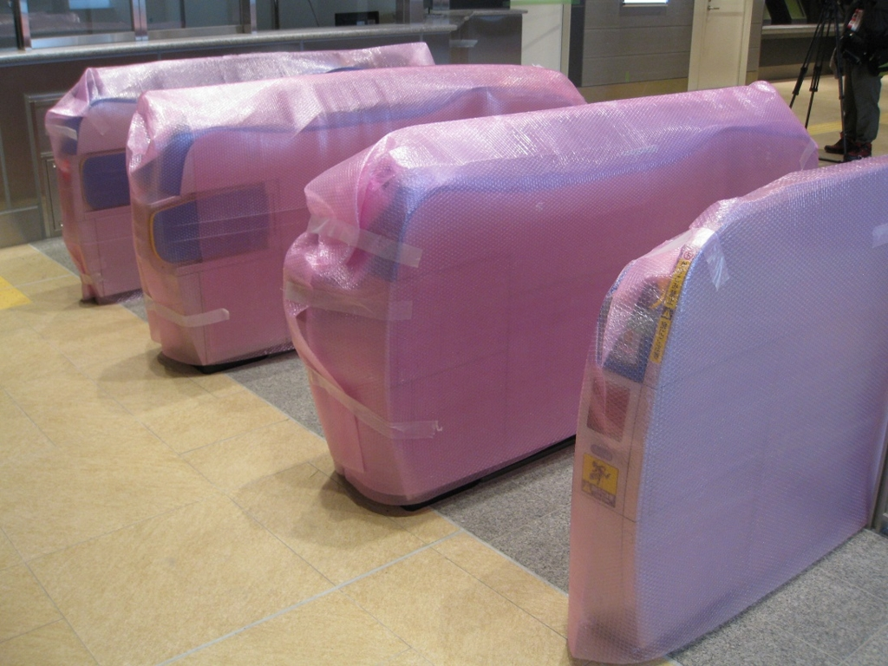
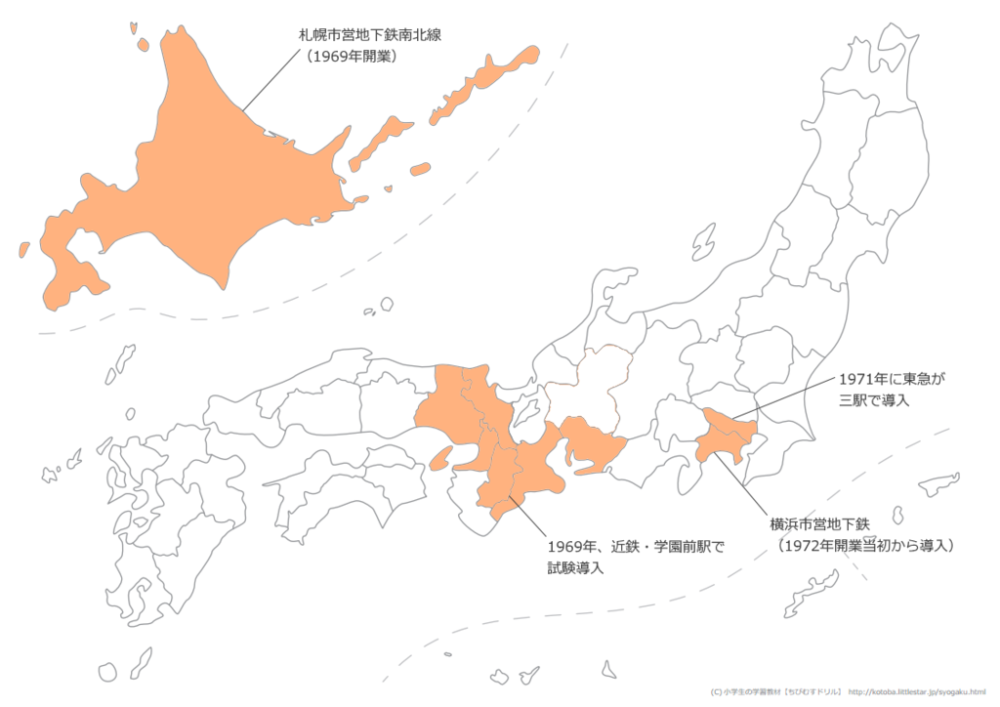
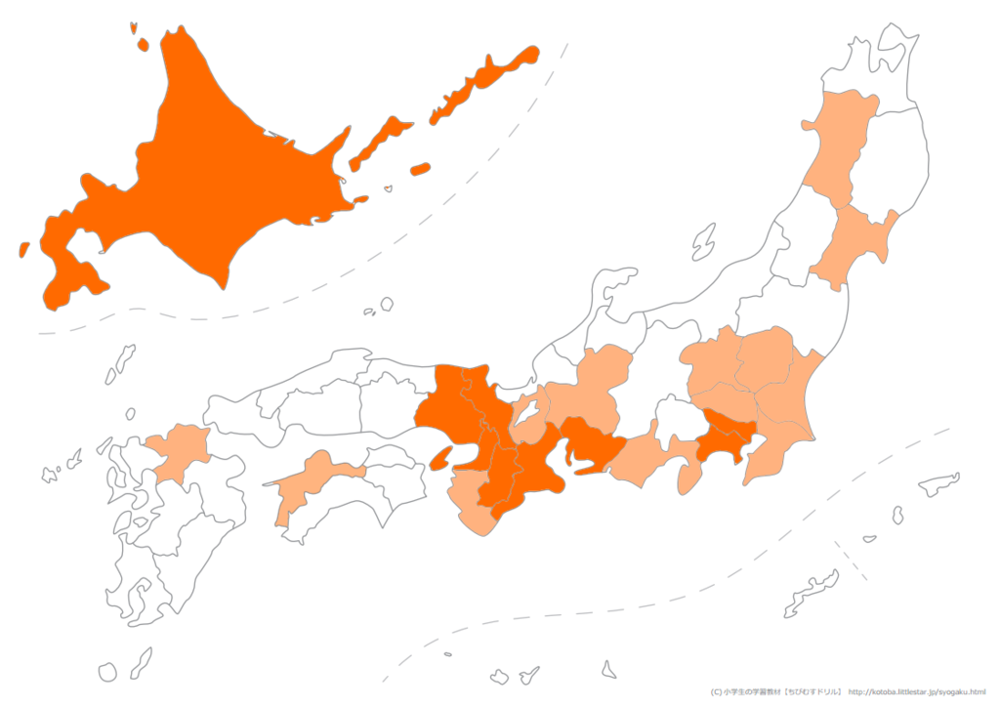
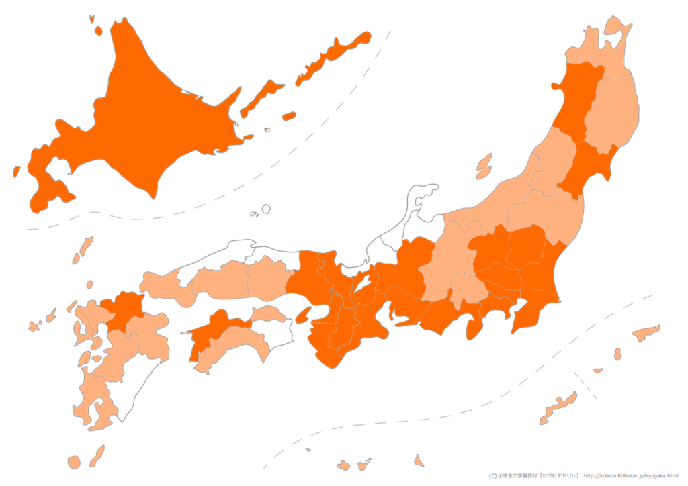
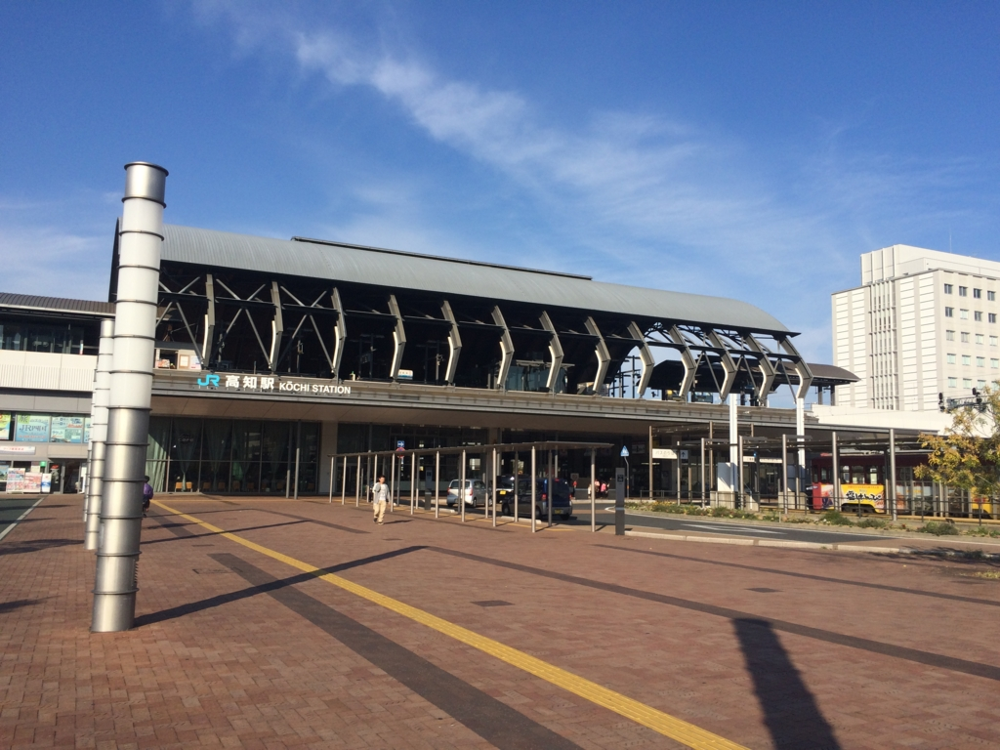
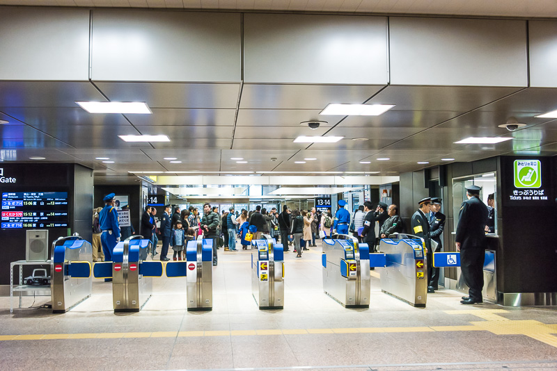
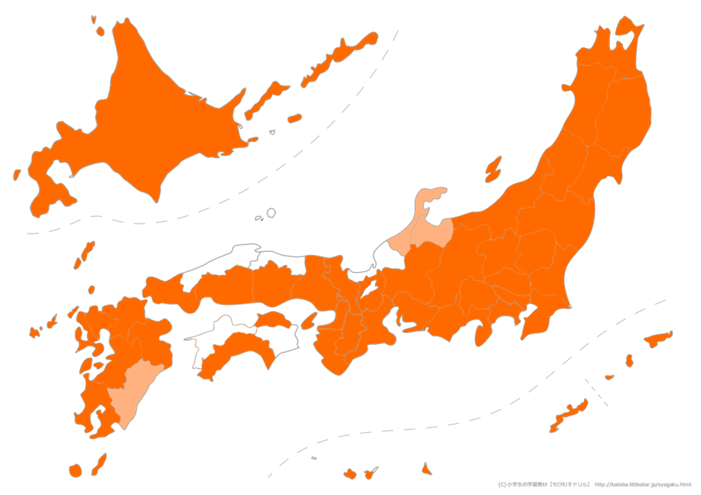

そもそも自動改札機にはいろんな種類がある。

<ul>
<li>ターンスタイル：遊園地にあるような回転腕木を回すタイプ。競艇場にもあった気がする</li>
<li>光学読み取り式：バーコードを読むタイプ。1966年に近鉄・大阪阿部野橋駅などで試験導入（不採用）。1967年、阪急・北千里駅で本格導入された。</li>
<li>磁気読み取り式：現在の主流。1969年に近鉄・学園前駅で試験導入。同年12月に開業した札幌市営地下鉄南北線では、当初から全駅に設置された。</li>
</ul>
ここではとくに断りのない限り「磁気読み取り式」のみを取り扱う。

<h3>1970年～80年代 関西の私鉄や、地下鉄を中心に自動改札機が導入</h3>

（北総線の色を塗り忘れた気がする。あと、富山電鉄では定期券専用の自動改札機が一時期あったらしい。その他もろもろ、取りこぼしは多そう）

近鉄などでの試験導入を経て、関西地区では京阪、阪急などの主要駅で1970年代初頭より本格的導入が始まる。また、札幌市営地下鉄南北線（1969年開業）、横浜市営地下鉄（1972年開業）、北総開発鉄道（1979開業）では開発当初から全国に導入されていた。

一方、私鉄より国鉄（JR）の勢力が強い首都圏での導入は遅れる。自動改札機の導入でクビを切られることを危惧した組合が反対したからだそうな。結局、国鉄分割民営化（1987年）まで行われなかった。私鉄では東急が1971年に試験導入したが、関西ほどの普及は見られなかったようだ。

―― 幼少期から近鉄民だったから当たり前に思っていたけど、関西の私鉄は新しい技術の導入に積極的だったんだなぁ（なお、現在は資金的に厳しい模様）。そういえばテレホンカードみたいなプリペイド式の“スルッとKANSAI”なんてのもあったっけ（近鉄はパールカード、阪急はラガーカードというものがあった気がする）。

<h3>1990年代 国鉄分割民営化により JR で自動改札機が普及</h3>

（アップロードしてから気付いたけど、ことでんってどうだったっけ。まぁ、塗りは結構適当です。ごめんなさい）

1987年の国鉄分割民営化により養成ギプスから解放された JR が本気を出すことにより、日本各地で自動改札機の導入が進む。

<h4>1998年 愛媛県に自動改札機が導入（四国初上陸）</h4>

<blockquote cite="http://www.geocities.co.jp/SilkRoad-Forest/4537/iyo.htm">

近年では、平成１０年に自動改札が松山市駅に導入されたため、自動券売機が全駅に設置された。また、平成１３年には坊ちゃん列車が復元されて市内線で運行を開始した。

<cite><a href="http://www.geocities.co.jp/SilkRoad-Forest/4537/iyo.htm">http://www.geocities.co.jp/SilkRoad-Forest/4537/iyo.htm</a></cite>
</blockquote>

2015年に撤去されるまで、17年活躍する（合掌

<h3>2000年代 自動改札機の普及がひとまず完了</h3>

九州地区では2002年、東北・中国地方では2005年ごろから自動改札機が本格上陸。日の当たる県にはだいたい行きわたった感じ。

<h4>2008年 高知県に自動改札機が導入（JR四国では初）</h4>

 

<blockquote cite="https://ja.wikipedia.org/wiki/%E9%AB%98%E7%9F%A5%E9%A7%85">

現駅舎は3代目で、2008年（平成20年）2月26日に完成した。内藤廣設計の新駅舎ホームは、地元の杉材で作られたアーチ状の大屋根となっている。愛称は「くじらドーム」、大きさは、線路と平行する東西方面に60.9m、南北に38.5m、高さ23.3mで、杉のみではメンテナンス上問題があるため、外部にチタン亜鉛合金を使用している[2]。駅舎では、南国の明るく開放的なイメージを表現するために内部を白色で統一している。駅の利用客の動線上に市の観光案内所を設置し、逆に喫煙所は故意に動線から外す配置となっている。

JR四国では初となる自動改札機と指定席券売機が導入された。

<cite><a href="https://ja.wikipedia.org/wiki/%E9%AB%98%E7%9F%A5%E9%A7%85">&#x9AD8;&#x77E5;&#x99C5; - Wikipedia</a></cite>
</blockquote>

JR 四国への導入は遅れに遅れ、2008年。高知駅を皮切りに、6月には香川県（高松駅）にも導入されたようだ。なお、徳島県・愛媛県は忘れられている模様。

<h3>2015年 北陸新幹線開通に伴い、未開の地・北陸にも自動改札機の導入が相次ぐ</h3>

福井県を除く北陸三県に自動改札機が導入される（<a href="http://travel.watch.impress.co.jp/docs/news/20150416_697806.html">&#x5317;&#x9678;&#x65B0;&#x5E79;&#x7DDA;&#x958B;&#x696D;&#x3067;&#x30EA;&#x30CB;&#x30E5;&#x30FC;&#x30A2;&#x30EB;&#x3057;&#x305F;&#x300C;&#x91D1;&#x6CA2;&#x99C5;&#x300D;&#x306B;&#x884C;&#x3063;&#x3066;&#x307F;&#x305F; - &#x30C8;&#x30E9;&#x30D9;&#x30EB; Watch Watch</a>）。また、宮崎県にも SUGOCA 導入の余波で自動改札機が設置（+3）。

一方、愛媛県からは2014年に自動改札機が撤去される（-1）。

<iframe src="https://hatenablog-parts.com/embed?url=https%3A%2F%2Fblog.daruyanagi.jp%2Fentry%2F2015%2F12%2F10%2F165933" title="ウチの県には自動改札機がない……否！　捨て去ったのだ！！ - だるろぐ" class="embed-card embed-blogcard" scrolling="no" frameborder="0" style="display: block; width: 100%; height: 190px; max-width: 500px; margin: 10px 0px;"></iframe> 

<h3>2015年末の時点で、自動改札機が設置されていない県は5県</h3>

 

<ul>
<li>福井県：北陸新幹線がくるので、そのうち設置されそう</li>
<li>島根県：JR 西日本・米子支社には自動改札機がないらしい</li>
<li>鳥取県：人口減の方が心配</li>
<li>徳島県：まずは電車を走らせるところから始めたい</li>
<li>愛媛県：国体があるので JR 松山駅を改築予定。自動改札機が復活するか、注目が集まる</li>
</ul>

<h3>まとめ</h3>

忘れてる都道府県があったらごめん。

<ul>
<li>北海道（札幌駅）：1998年（平成10年）12月8日</li>
<li>青森県（青森駅）：2006年（平成18年）3月9日</li>
<li>岩手県（盛岡駅）：不明。仙台駅と前後して設置されたものと思われる</li>
<li>秋田県（秋田駅）：1999年（平成11年）1月19日、新幹線改札口に自動改札機を導入。</li>
<li>宮城県（仙台駅）：2002年（平成14年）12月8日、JR駅に自動改札を導入。地下鉄（1987年開業）のころにはあったかも。</li>
<li>山形県（山形駅）：2005年（平成17年）3月25日、在来線に自動改札機を導入</li>
<li>福島県（福島駅）：2004年（平成16年）4月1日、福島県内初の在来線自動改札機を導入</li>
<li>栃木県（宇都宮駅）：1994年（平成6年）2月、在来線改札に自動改札機を導入</li>
<li>群馬県（前橋駅）：不明。</li>
<li>茨城県（水戸駅）：不明。</li>
<li>埼玉県（大宮駅）：不明。</li>
<li>東京都（東京駅）：不明。</li>
<li>千葉県（千葉駅）：不明。</li>
<li>神奈川県（横浜駅）：不明。</li>
<li>山梨県（甲府駅）：2004年（平成16年）10月16日、自動改札機を9台8通路導入、Suicaの利用が可能となる。</li>
<li>長野県（長野駅）：2005年（平成17年）3月16日、在来線中央改札口に自動改札機を導入</li>
<li>新潟県（新潟駅）：2004年（平成16年）11月27日、自動改札機の運用を開始</li>
<li>富山県（富山駅）：富山電鉄が1971年に定期券専用自動改札機使用開始（1981年、廃止）。2012年よりICカード用自動改札。2015年、新幹線開通により自動改札設置</li>
<li>石川県（金沢駅）：2015年（平成27年）3月14日、北陸新幹線の延伸開業に伴い自動改札設置。</li>
<li>福井県（福井駅）：なし</li>
<li>静岡県（静岡駅）：1992年（平成4年）12月12日、在来線改札口に自動改札機を導入。（<b>1997年12月13日、新幹線初の自動改札機を導入</b>）</li>
<li>愛知県（名古屋駅）：1992年（平成4年）6月27日、在来線中央改札口に自動改札機を導入（新幹線改札口は1998年11月12日）</li>
<li>岐阜県（岐阜駅）：不明。</li>
<li>三重県（津駅）：不明。JR はショボいからよくわからんが、近鉄の駅には古くからあった模様。</li>
<li>奈良県（奈良駅）：不明。近鉄には古くからあった模様。</li>
<li>和歌山県（和歌山駅）：不明。南海の駅があるし、自動改札機ぐらいあるやろ。</li>
<li>滋賀県（大津駅）：不明。そういえば大津駅って行ったことない。</li>
<li>京都府（京都駅）：1998年（平成10年）11月4日、新幹線改札口に自動改札機を導入。</li>
<li>大阪府（大阪駅）：1997年（平成9年）、自動改札機が設置</li>
<li>兵庫県（神戸駅）：不明。都会だから大丈夫。</li>
<li>岡山県（岡山駅）：2005年（平成17年）2月24日、新幹線改札口に自動改札機設置（在来線は2007年）</li>
<li>広島県（広島駅）：2005年（平成17年）2月27日、広島駅新幹線改札口に自動改札機を導入。</li>
<li>山口県（山口駅）：不明。新山口駅（こっちがメインらしい）は2005年（平成17年）2月20日、山陽新幹線改札口に自動改札機設置</li>
<li>島根県（松江駅）：2014年にスタバが上陸。</li>
<li>鳥取県（鳥取駅）：今年になってセブンイレブンができる</li>
<li>香川県（高松駅）：2008年（平成20年）</li>
<li>徳島県（徳島駅）：すだちが有名らしい</li>
<li>愛媛県（松山駅）：伊予鉄松山市駅にはかつて自動改札機があった。JR 駅は来年あたり改築予定</li>
<li>高知県（高知駅）：2008年（平成20年）</li>
<li>福岡県（博多駅）：1999年（平成11年）12月4日、JR九州が自動改札機を導入。</li>
<li>大分県（大分駅）：不明。別府駅には2010年（平成21年）にできたらしい</li>
<li>佐賀県（佐賀駅）：鳥栖駅ともに不明。あることはあるらしい。</li>
<li>長崎県（長崎駅）：2002年（平成14年）10月、JR九州が長崎県内の駅で初となる自動改札機を導入。</li>
<li>熊本県（熊本駅）：2002年（平成14年）11月2日、1階改札口に自動改札機を5台設置。熊本県内初</li>
<li>宮崎県（宮崎駅）：2015年（平成27年）11月7日、自動改札機を導入</li>
<li>鹿児島県（鹿児島中央駅）：2002年（平成14年）12月7日、JRの駅に自動改札機設置</li>
<li>沖縄県（沖縄都市モノレール線）：2001年（平成13年）12月4日 、開業。おそらくそのときからあるものと思われる。</li>
</ul>

