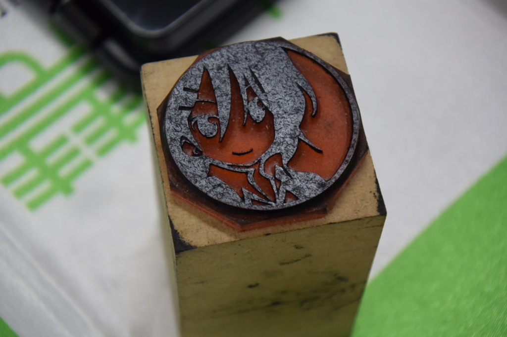
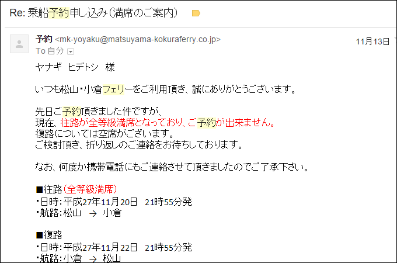
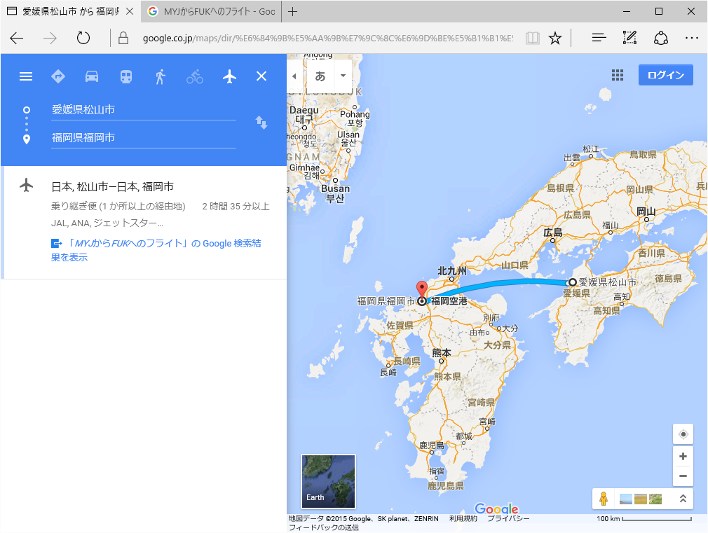
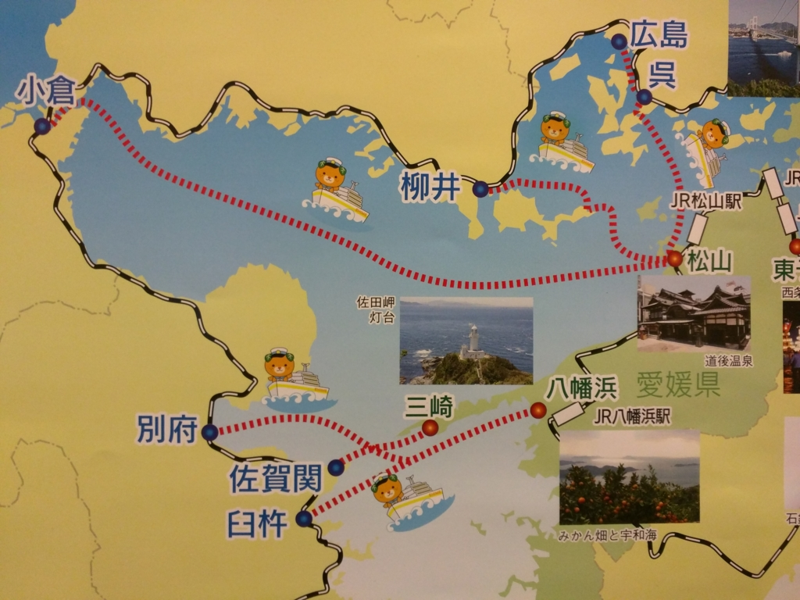
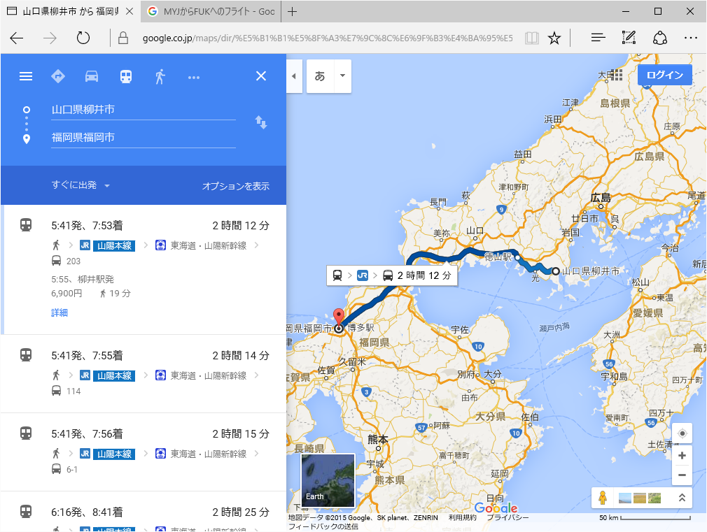
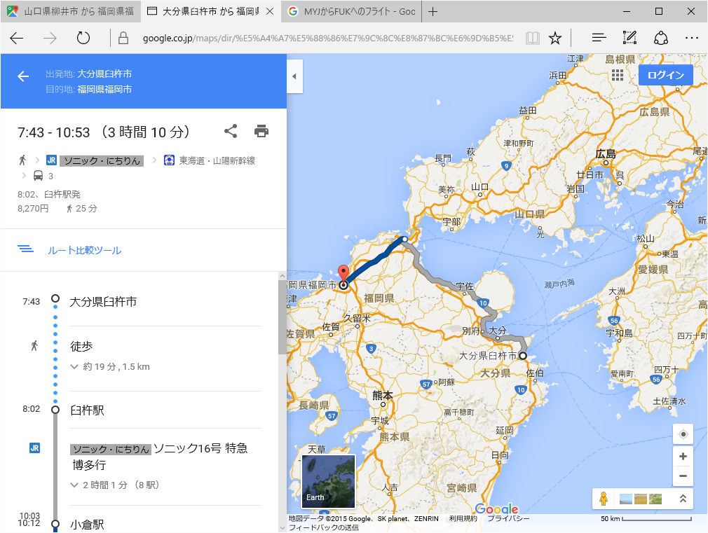

「修羅イバー」の異名を持つ はまもつ（@airish9）氏 の尽力でプロ生＠福岡が緊急開催されたので、11月の終わり辺りに出撃してきた。

<iframe src="https://hatenablog-parts.com/embed?url=http%3A%2F%2Fpronama.azurewebsites.net%2F2015%2F11%2F09%2Fpronama-37-at-fukuoka%2F" title="11/21 緊急開催！　プログラミング生放送勉強会 第37回＠福岡" class="embed-card embed-webcard" scrolling="no" frameborder="0" style="display: block; width: 100%; height: 155px; max-width: 500px; margin: 10px 0px;"></iframe>

愛媛から福岡へは、フェリーが断然安くて便利。小倉発着なので博多までは電車になるが、新幹線で一駅なので楽ちん――と思いきや。

ｱｯ━━━━(ﾟ∀ﾟ)━━━━!!

ついでに宿もとれない。修羅イバーから与えられし試練、厳しすぎる。宿はとりあえずキャンセル待ちを狙うことにして、代わりのルートを検討せねばならぬ。

<h3>ルートの検討</h3>

<h4>その一：空路</h4>

一番手っ取り早いけど、旅割りが効かないので普通運賃（25,800円）×2≒5万円 を払う必要がある。

（フェリーの二等寝台（7,710円）＋新幹線（2,110円））×2≒2万円 と比べると割高感が否めない。最悪、行きだけ飛行機というのはアリか（あとから考えると、それが最適解だった）。

<h4>その二：鉄道＋海路</h4>

リーズナブルに行きたいならば、瀬戸内の回路を活用しない手はあるまい。松山からの場合、クルマの利用を考えないと、

<ul>
<li>松山観光港 → 呉・広島 → 博多</li>
<li>三津港 → 柳井 → 博多</li>
<li>松山駅 → 八幡浜 → 臼杵・別府 → 博多</li>
</ul>
の4パターンが選べる。広島ルート（接続さえ良ければ、呉で電車に乗ったほうが楽そうだが）は少し遠回りなので除外するとして、下の2ルートは割と現実的な気もする。

<h5>柳井ルート</h5>

海の国道なので、夜でも運航しているのがメリット。三津港の居酒屋で飲んだあと、夜の便に乗るというのもオツかも。

<iframe src="https://hatenablog-parts.com/embed?url=https%3A%2F%2Fblog.daruyanagi.jp%2Fentry%2F2014%2F08%2F30%2F221903" title="戦艦陸奥のお墓参り行ってきた - だるろぐ" class="embed-card embed-blogcard" scrolling="no" frameborder="0" style="display: block; width: 100%; height: 190px; max-width: 500px; margin: 10px 0px;"></iframe>

この航路は途中の伊保田までだが乗ったことがある。

<i>フェリー（3,600円、2.5時間）＋在来線・新幹線（10,450円、2.5時間）＝14,000円。</i>

新幹線へは徳山駅で乗り換えるようだ。

<h5>八幡浜 → 臼杵・別府ルート</h5>

大分を回るルート。臼杵行きの深夜便に乗ると、朝まで船内休憩できる。JR九州の特急ソニックに乗れるのも面白そう（在来線特急では日本で2番目に速い。ちなみに一位は大阪と北陸を結ぶサンダーバード）。

<i>八幡浜までの運賃（2,780円、1.5時間）＋フェリー（二等：2,310円、2.5時間）＋臼杵からの運賃（8,270円、3.5時間）＝14,000円。</i>

柳井ルートよりは気持ち安めだけど、乗り換えが多い点、駅と港の間を歩く点を考えればかなり分が悪い。

<h4>ルートその三：鉄道＋バス</h4>

バスを利用すれば

<ul>
<li>松山駅 →（しまなみ海道） → 尾道駅・福山駅 → 博多</li>
</ul>
というルートもある。今回はなんとなく見送ったが（基本的にバスが好きではない）、これも有力だったかもしれない。

<i>福山までのバス（3時間、3,900円）＋新幹線（2.5時間、10,670円）＝15,000円。</i>

一日4本とバスの本数に限りがあるので注意したいかも。あと、あんまりないと思うけど交通事情によっては遅れがあるかも。時間が読めないのは少し不安かな。

<a href="http://www.chugokubus.jp/01highwaybus/01highwaybus10.html">http://www.chugokubus.jp/01highwaybus/01highwaybus10.html</a> 

<h4>ルートその四：高速バス</h4>

嫌いなので割愛。

<h3>結論</h3>

まとめるとこんな感じか。

<table>
<tr>
<td>ルート</td>
<td>運賃</td>
<td>所要時間</td>
<td>ポイント</td>
</tr>
<tr>
<td>飛行機</td>
<td>2.5万円</td>
<td>1時間</td>
<td>旅割りが効くなら文句なくコレだけど、直前だとキツい</td>
</tr>
<tr>
<td>小倉フェリー</td>
<td>1万円</td>
<td>夜出て朝着</td>
<td>楽ちんだけど予約できなかった</td>
</tr>
<tr>
<td>防予フェリー（柳井ルート）</td>
<td>1.4万円</td>
<td>最短で6時間</td>
<td>夜中でも船が出ている</td>
</tr>
<tr>
<td>豊予フェリー（臼杵ルート）</td>
<td>1.4万円</td>
<td>おそらく9時間弱</td>
<td>深夜便だと船内休憩あり</td>
</tr>
<tr>
<td>キララエキスプレス（しまなみ海道）</td>
<td>1.5万円</td>
<td>最短で6時間</td>
<td>バスがネックだが、新幹線との接続よし</td>
</tr>
<tr>
<td>高速バス</td>
<td>-</td>
<td>-</td>
<td>探せばあるんだろうが、あんまり好きじゃないので選択肢に入れない</td>
</tr>
</table>
小倉フェリーが一番よいが、片道だけなら飛行機も悪くない。1万余分に払うことになるが、何しろ楽だ。次点で防予フェリーとキララエキスプレスだが、これは趣味で選べばよさそうだ。自分だったら船だけど、乗り換えの少ないキララエキスプレスも魅力ではある。

――で。

そこまで考えてなんだけど、結局、一番しんどそうな臼杵ルートを選択した。理由は<i>やってみたかった</i>から。人類の探求心は留まるところを知らんね。実際どうだったかは、また今度。

