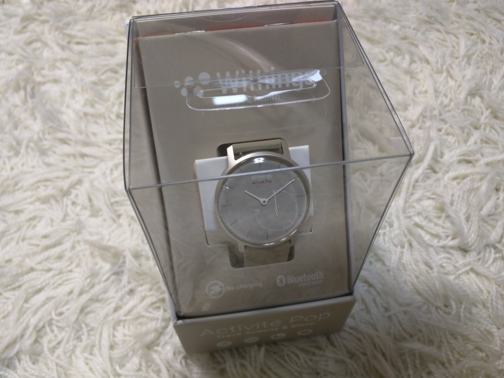
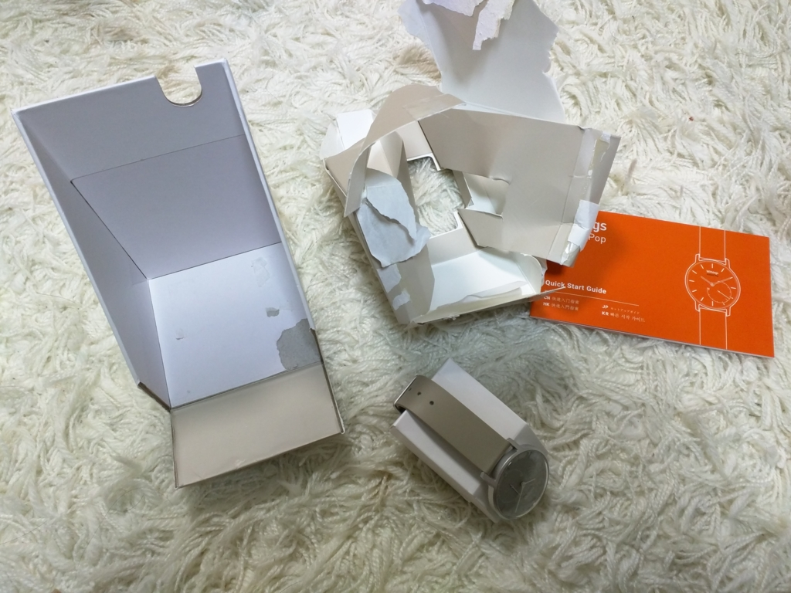
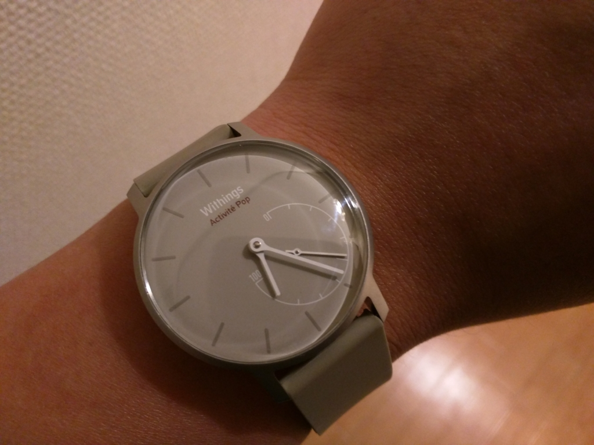
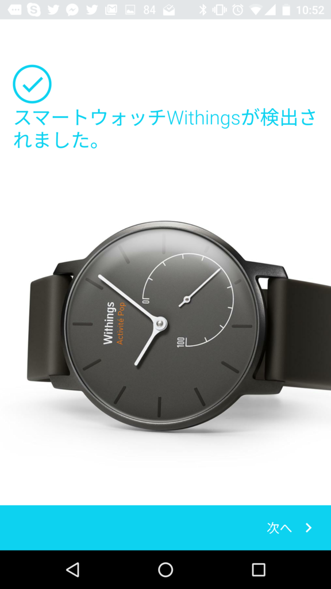
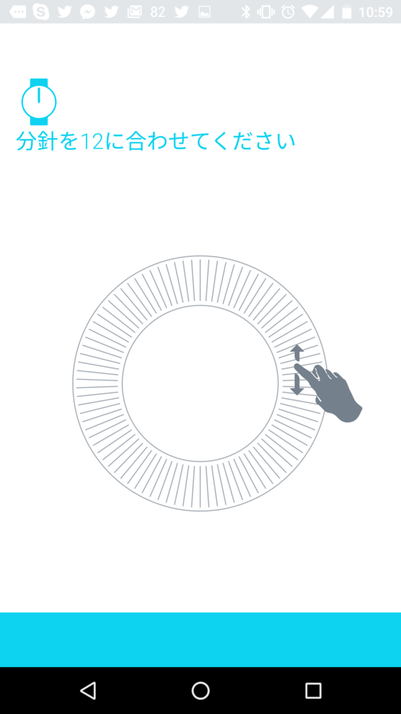
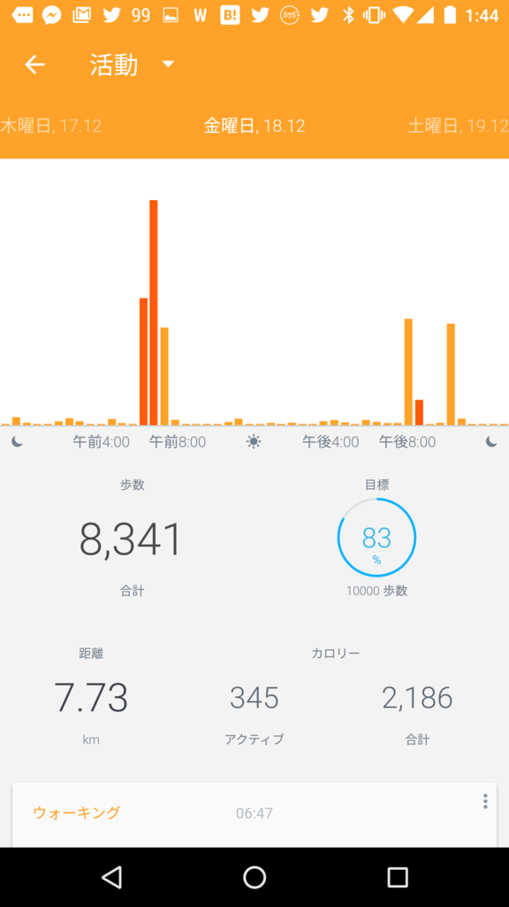
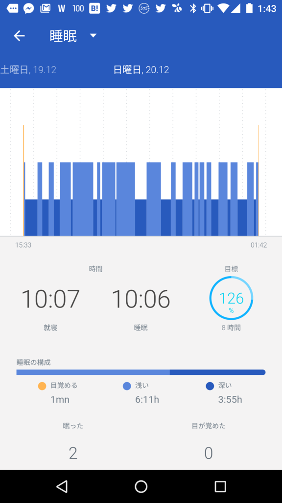

<iframe src="https://hatenablog-parts.com/embed?url=https%3A%2F%2Fblog.daruyanagi.jp%2Fentry%2F2015%2F11%2F10%2F162146" title="物欲駆動でランニングを始める。 - だるろぐ" class="embed-card embed-blogcard" scrolling="no" frameborder="0" style="display: block; width: 100%; height: 190px; max-width: 500px; margin: 10px 0px;"></iframe>

この前、いろいろ買いこんでランニングを志したことを書きましたが。すまん、あれから2回しか走りに行かなかった。

<ul>
<li>だって、雨降ったし～</li>
<li>最近超早寝早起き（夜8時就寝、夜中目覚める）で朝ヒマなんだけど、朝走ったら昼眠くなるかもだし～</li>
<li>そんなこんなしてるうちに福岡行く用事とか、岡山行く用事があってぇ～</li>
</ul>
――ｺﾞﾒﾝﾅｻｲｺﾞﾒﾝﾅｻｲｺﾞﾒﾝﾅｻｲ！！

これではほんまにダメ人間になると思ったので、さらに物欲駆動を推し進めることにした。

それがこれだ！

<a href="http://www.amazon.co.jp/exec/obidos/ASIN/B010UV1M6O/bestylesnet-22/">Withings スマートウォッチ Activité Pop Shark Grey【日本正規代理店品】</a>
<ul><li>出版社/メーカー: Withings</li><li>発売日: 2015/07/30</li><li>メディア: エレクトロニクス</li><li><a href="http://d.hatena.ne.jp/asin/B010UV1M6O/bestylesnet-22" target="_blank">この商品を含むブログを見る</a></li></ul>

こういうカテゴリーの製品を何というのかよく知らんのやけど……Apple Watch みたいなスマートウォッチほど高機能じゃないけど、そこそこスマートなヘルス時計だ。

<ul>
<li><b>健康関連機能</b>：万歩計、睡眠の計測（足りない機能はスマホアプリで補う感じ）</li>
<li><b>目覚まし機能</b>：ぶるぶる震える。時間はスマホでセットできるけど、1つだけ。時計をダブルタップすると針がウィーンって動いて、目覚ましがセットされた時間を示す</li>
<li><b>省電力</b>：Apple Watch は1日もたずに死ぬらしいが、これは機能削ったおかげか、ボタン電池で半年以上もつ</li>
<li><b>防水</b>：プールで泳ぐぐらいなら大丈夫そう</li>
</ul>
お値段は2万円ほど。自分は Amazon のタイムセールで1.2万円で買った。今見たらまたタイムセールやってたので、買うなら今かもね。

封を開けていきなり困ったのだが、箱の開け方がわからん。めんどくさいので、破壊した。こういう箱の開け方をしたのは、Windows Vista 以来かもしれん。

さっそくつけてみたけど、デザインはシンプルで大変よろしい。右下の盤は、万歩計やな。たとえばアプリで目標1万歩って入力しとくと、ここに達成率が表示される。なるほとど。

正直、チープな印象は否めず、上位の Pop じゃない方（たぶん5万か6万ぐらい）がちょっとほしくなったが、オシャレでつけるものではなし。あくまでも運動するときにつけるものだから、壊れても諦められる値段っていうのはとても大事だと思う。

 

設定はアプリから行う（iOS/Android）。最初に針合わせを行うのだけど、スマホの画面をなぞると、時計の針がビミョーンと動くのが楽しい。思わずグリグリ回して遊んでしまった。

 

アプリはこんな感じ。ちなみに、初日の歩数は<b>250歩</b>だった。うちの部屋は他人から見れば一見乱雑で汚いかもしれんが、これはなるべくカラダを動かさずに、より多くのものに手が届くように設計された結果だ。しかし、その効率性がアダとなり、たった1日250歩で暮らせるという運動不足を誘発する空間の形成を招いたのだ……。

――事を成すに当たっては、まず状況を把握せよ。

Withings Activite Pop はそれを思い出させてくれた。さすがにもうちょっと動かないと、そのうち足がヘソまげて動かなくなるだろう。1日10時間も寝てる場合じゃなかった。

おかげで最近は多少、外に出るようになった。どうやら、自分はただ走るだけのランニングは嫌いなようだ。なので、あれを観に行こう、通ったことがない道を歩いてみようって感じで、毎日ちょっとした目標を立てて頑張ってる（写真は徒歩15分ぐらいのところにある護国神社）。近所を歩きつくしたらどうするかは、またそのときになってから決めようと思う。

