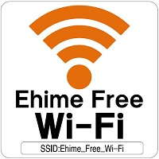
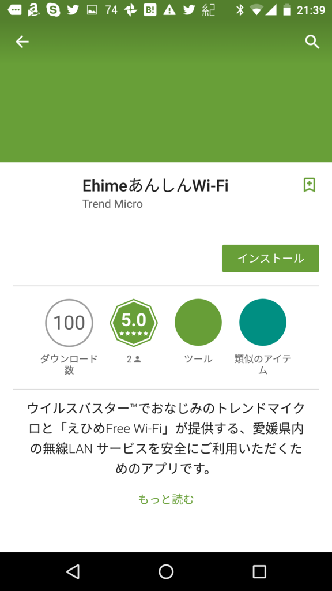
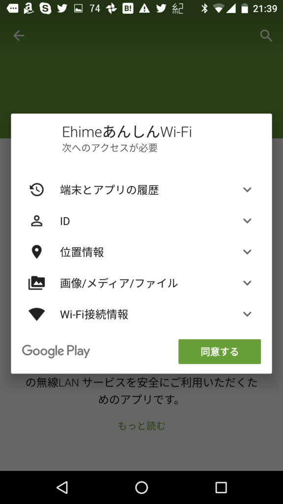
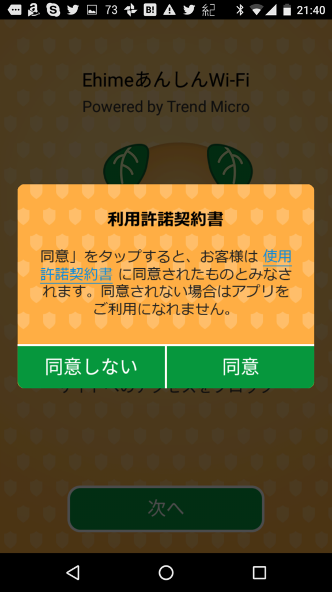
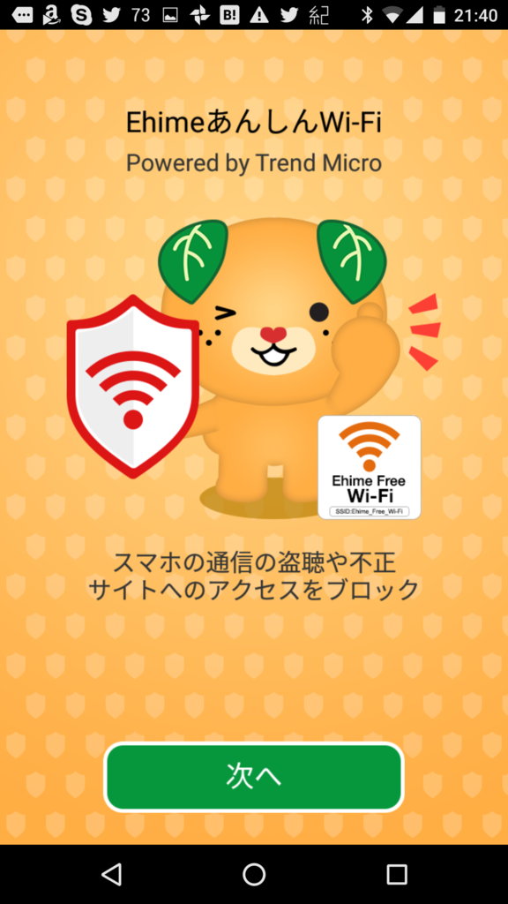
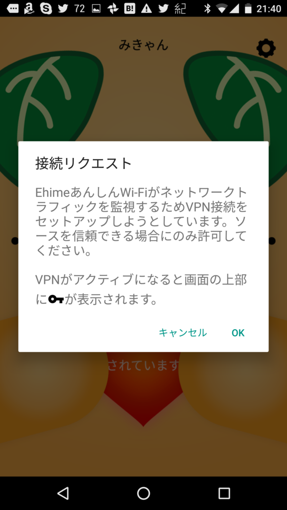
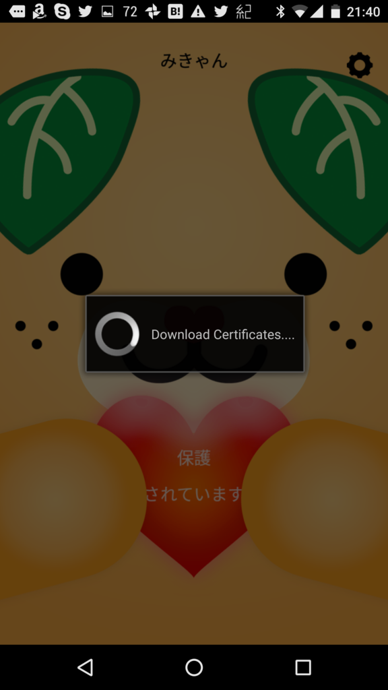
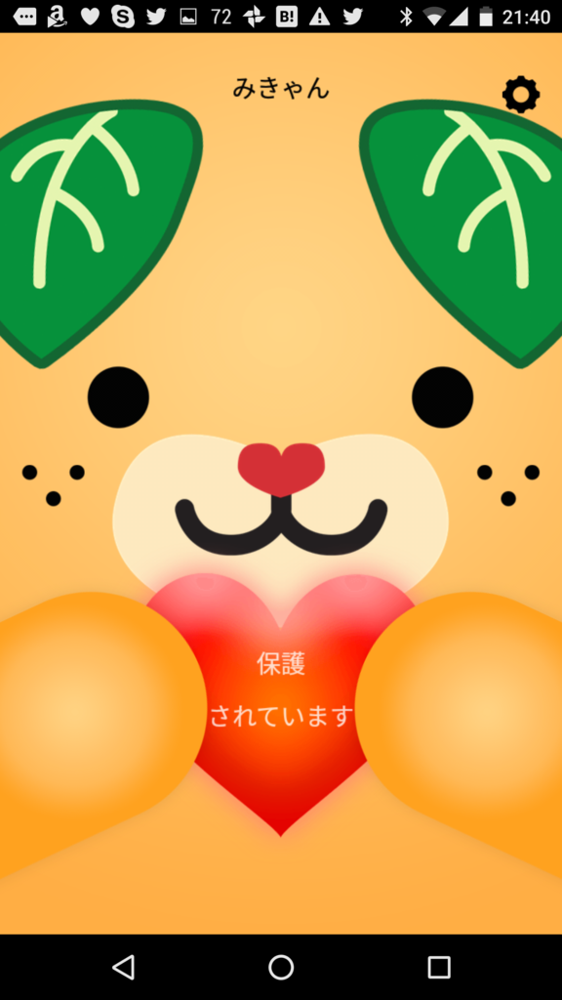
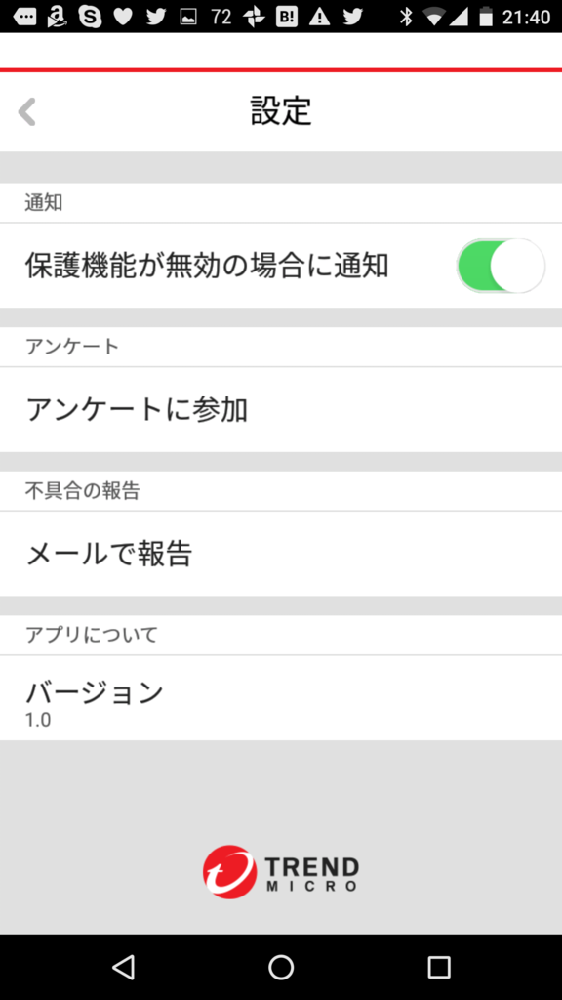
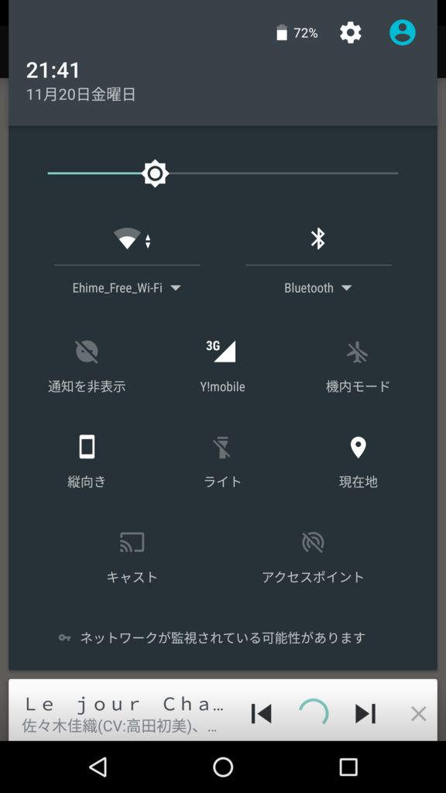

この記事は「<a href="http://www.adventar.org/calendars/1176">&#x611B;&#x5A9B;&#x30FB;&#x677E;&#x5C71;&#x306B;&#x3064;&#x3044;&#x3066;&#x306E;&#x5F92;&#x7136; Advent Calendar 2015 - Adventar</a>」の22日目の記事です。前日の記事は、ねこみみ隊長の「<a href="http://nekomimi-taicho.com/archives/25004/">&#x30B3;&#x30F3;&#x30D1;&#x30AF;&#x30C8;&#x30B7;&#x30C6;&#x30A3;&#x677E;&#x5C71;&#x3092;&#x5730;&#x56F3;&#x3067;&#x307F;&#x3066;&#x3001;&#x57CE;&#x5C71;&#x306B;&#x601D;&#x3044;&#x3092;&#x99B3;&#x305B;&#x308B;&#x3002; &ndash; &#x611B;&#x5A9B;&#x30FB;&#x677E;&#x5C71;&#x306B;&#x3064;&#x3044;&#x3066;&#x306E;&#x5F92;&#x7136; Advent Calendar 2015 21&#x65E5;&#x3081;&#x3002; &ndash; &#x306D;&#x3053;&#x307F;&#x307F;&#x968A;&#x9577;&#x3089;&#x3057;&#x3044;&#x3002;</a>」でした。次の日の記事の担当は <a href="http://www.adventar.org/users/9689">brightflavor - Adventar</a> さんです (｀･ω･´)ゞ

 

<blockquote cite="https://www.pref.ehime.jp/h12600/wifi/osirase260806.html">

民間通信事業者等、愛媛大学、総務省、県内全市町及び県で組織する「愛媛県公衆無線LAN推進協議会」では、地元住民の方々や国内通信キャリアとの契約がない外国人観光客など、誰でも無料で利用できる公衆無線LANの普及を推進しています。

<cite><a href="https://www.pref.ehime.jp/h12600/wifi/osirase260806.html">&#x611B;&#x5A9B;&#x770C;&#x5E81;&#xFF0F;&#x300C;&#x3048;&#x3072;&#x3081;Free Wi-Fi&#x30D7;&#x30ED;&#x30B8;&#x30A7;&#x30AF;&#x30C8;&#x300D;&#x306B;&#x3064;&#x3044;&#x3066;</a></cite>
</blockquote>

ボクのように、月初め早々にデータ通信量を使い切り、泣きながら低速回線を使っているような人間にありがたいのが、この“えひめFree Wi-Fi”です。

<iframe src="http://nakaji.hatenablog.com/embed/2014/12/17/090000" title="@daruyanagi に先を越されたけど「えひめFreeWi-Fi」のサイトを立てた - なか日記" class="embed-card embed-blogcard" scrolling="no" frameborder="0" style="display: block; width: 100%; height: 190px; max-width: 500px; margin: 10px 0px;"></iframe>

松山市内でしか使ったことがないのですが、たしか伊予鉄（ちんちん電車）の中でも使えるんですよね。たまに繋がりにくいだの、不便だのという話も聞きますが、ないよりはある方が絶対いい。もし愛媛に旅行に来られたら、ぜひ“えひめFree Wi-Fi”のことを思い出し、活用していただければと思います。

――さて、この“えひめFree Wi-Fi”ですが。

基本的にパスワード不要で簡単に使えるのですが（初回利用時に Web サイトで規約に同意？　するみたいなステップは必要）、逆に言えばパスワードで守られていない（通信が暗号化されていない）ということでもあります。たとえるなら、ネットの世界をパンツ一枚で歩いているようなもので、いろんな意味で非常に危ない人です。

そんなわけで“えひめFree Wi-Fi”には実はこんなアプリが用意されています。

<iframe src="//hatenablog-parts.com/embed?url=http%3A%2F%2Fwww.trendmicro.co.jp%2Fjp%2Fabout-us%2Fpress-releases%2Farticles%2F20151112005507.html" title="フリーWi-Fi向けセキュリティサービス「あんしんフリーWi-Fi™」を提供開始 | トレンドマイクロ" class="embed-card embed-webcard" scrolling="no" frameborder="0" style="display: block; width: 100%; height: 155px; max-width: 500px; margin: 10px 0px;"></iframe>

その名も「あんしんフリーWi-Fi」。iOS/Android 対応です。VPN を利用しているみたいですね。

<a href="https://itunes.apple.com/us/app/ehime-secure-wifi/id1042252325?mt=8&uo=4&at=10lc7c" rel="nofollow" target="_blank">Ehime Secure WiFi</a>
<ul><li class="itunes-embed-artist">Trend Micro Incorporated</li><li class="itunes-embed-genre">Utilities</li><li class="itunes-embed-price">Free</li><li class="itunes-embed-badge"></li></ul>

今回は Android 版を試してみました（トレンドマイクロのリリースページからダウンロードできます。ストアから検索してもオッケー）。

　　　　　　　　

使う上でとくに難しい操作はありません。インストールして起動するだけで、愛媛県が総力を挙げたにもかかわらず“ゆるキャラグランプリ”で2位に終わったマスコット“みきゃん”が通信を保護してくれます。

「ネットワークが監視されている可能性があります」という表示がでますが、たぶん問題ない。細かいことを言い出したら「そもそもトレンドマイクロが信頼できるのか」っていう話もあるのですが、そういうのを言い出したらキリがないですしね。有名どころだし、そこは信頼しましょう！

なお、このアプリは実証試験中という位置付けで、2016年3月31日まで提供されるようです。パスワードもかかってないフリー WiFi を使うのはナーなんて思っている方は、ぜひ利用されてみてはいかがでしょうか。

終わり。

