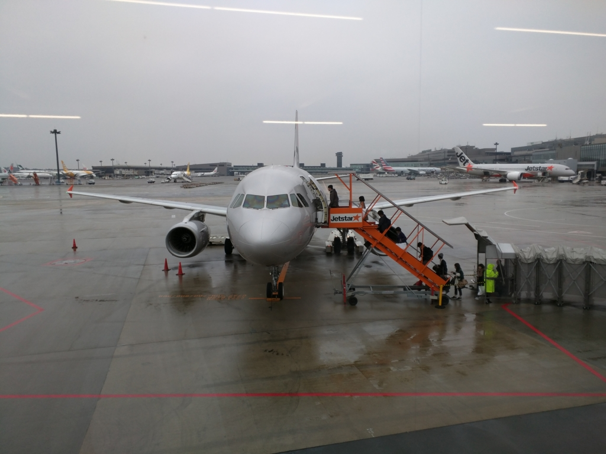

今日のお昼、松山に帰ってきました。今年のお正月は、東京の実家でのんびり。とはいえ、なかなかのハードスケジュールでした。

<ul>
<li>年末：名張でお墓参り、奈良の友達んちでお泊り、大阪で高校の同窓会</li>
<li>年始：東京へ移動。親戚と顔合わせ。4日からはノーパソ2台開いて、ちょっとお仕事。姪っ子＆甥っ子とおままごと。古い友人と映画を観に。しばやん宅で ARIA 鑑賞など</li>
</ul>
去年は弟二人が結婚し、二人とも家を出てしまったので、母ちゃんが一人で寂しくしていないかと心配して長居したのですが<a href="#f-4615570a" name="fn-4615570a" title="正月は飛行機代が高いからそれを外す意味もある">*1</a>、なんだかんだで忙しく、家でゆっくりする暇がなかった感じ。ましてや、ブログ書く時間なんて！<a href="#f-2f248d86" name="fn-2f248d86" title="その割に睡眠時間は一日10時間とっていた模様">*2</a>　結局二週間以上もブログを放置してしまいました。

今年は……マシンガン形式で更新していこうかなと。去年はちょっと大作になり気味で、更新が億劫になってしまうことがありました。そうした記事って、長い割に中身があんまりなくて、自分が後から読んでも面白くない。たとえば、本の感想一つとっても、全部読んでからブログを書こうとすると、いろいろ細かいことを書くのが面倒になり、サラっとした内容になってしまう。別に書評書いて飯食ってるわけでなし、もっと自由に書いていいはずなのにね。スマホの「はてなブログ」アプリでちょちょいと書くぐらいでもおっけーな心づもりで、もっと気軽に取り組もうかなーと思います。

<a href="#fn-4615570a" name="f-4615570a" class="footnote-number">*1</a>:正月は飛行機代が高いからそれを外す意味もある

<a href="#fn-2f248d86" name="f-2f248d86" class="footnote-number">*2</a>:その割に睡眠時間は一日10時間とっていた模様

