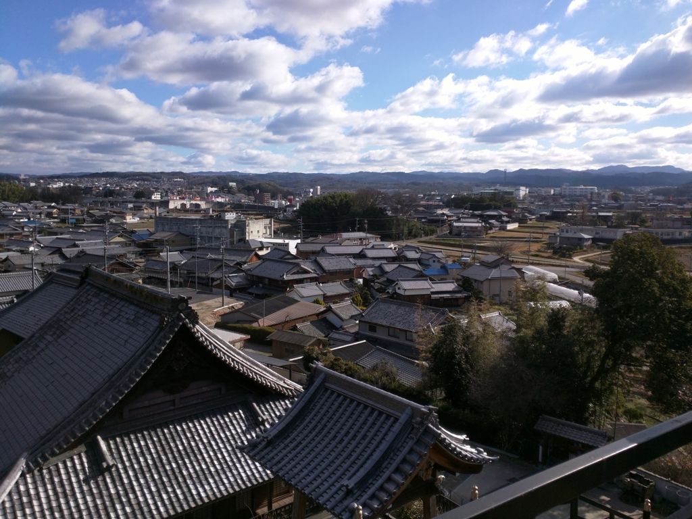
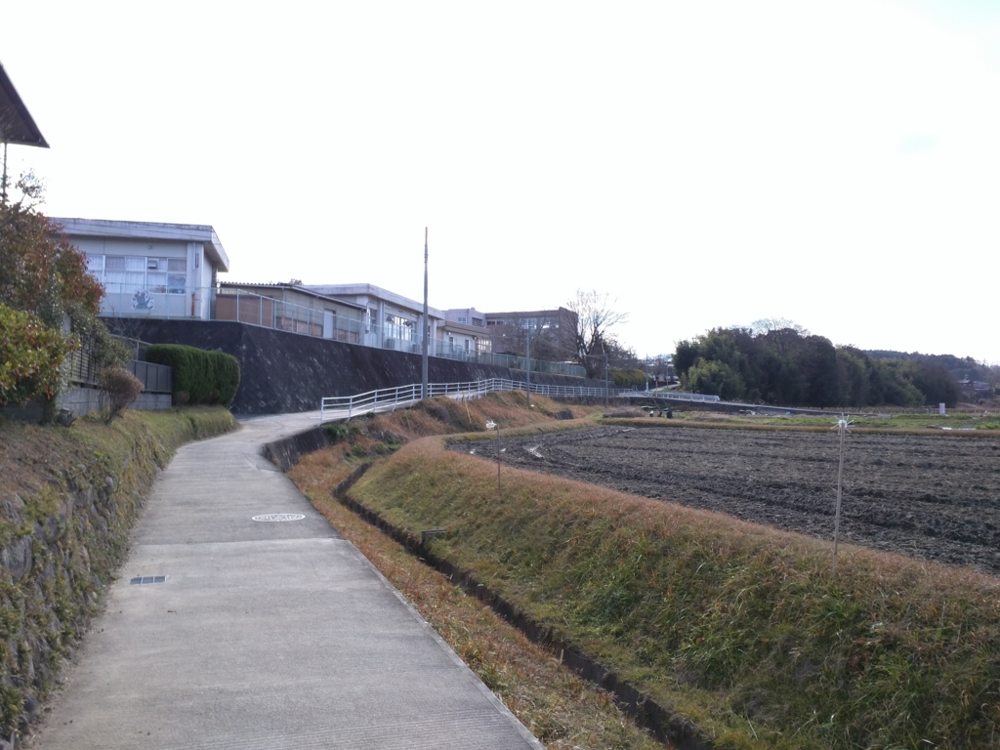
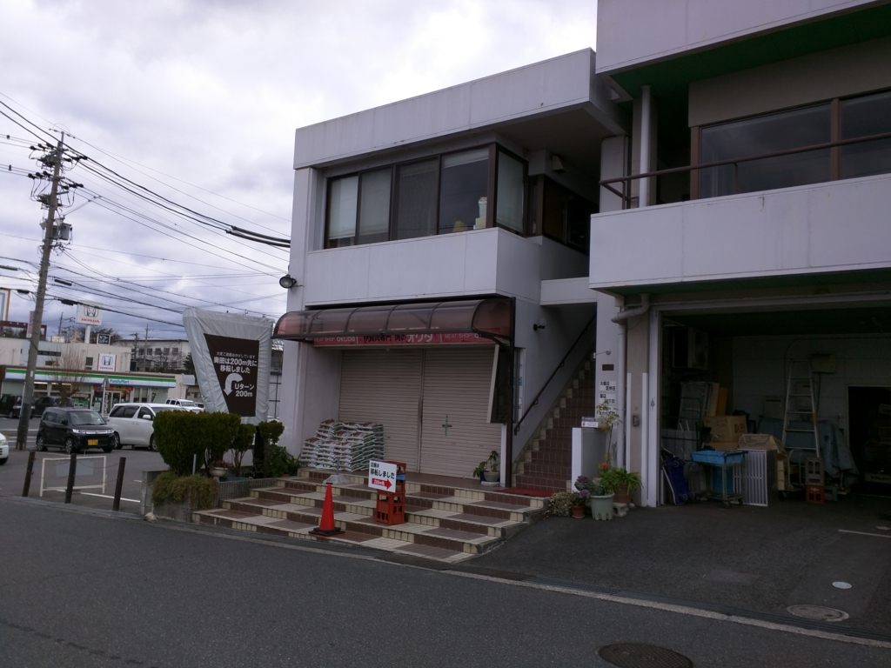
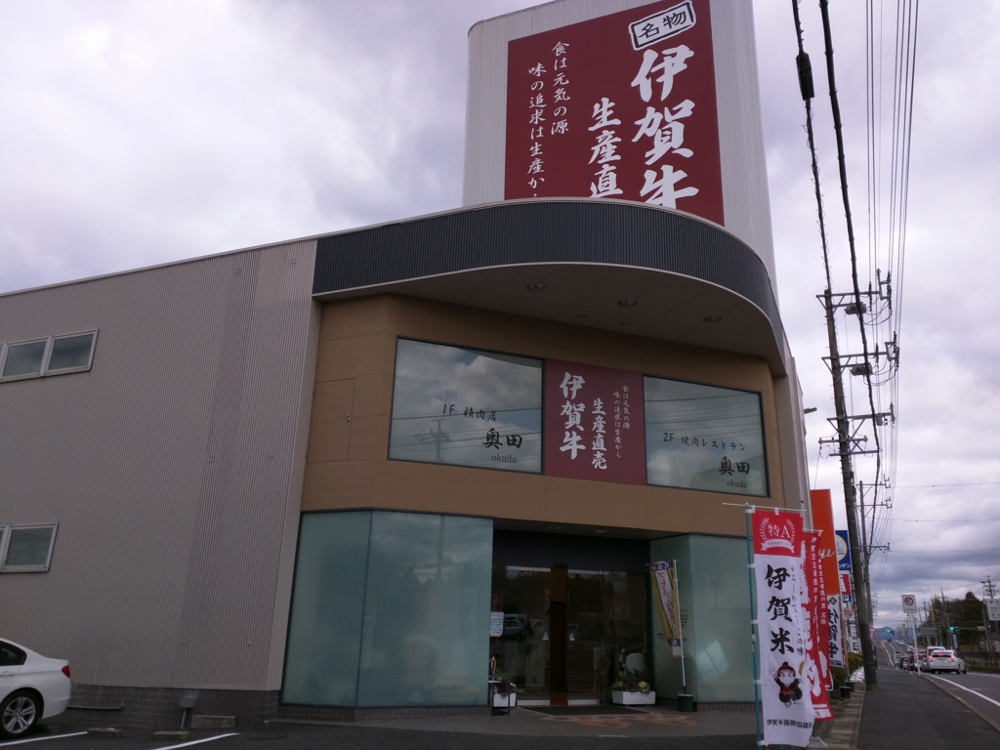
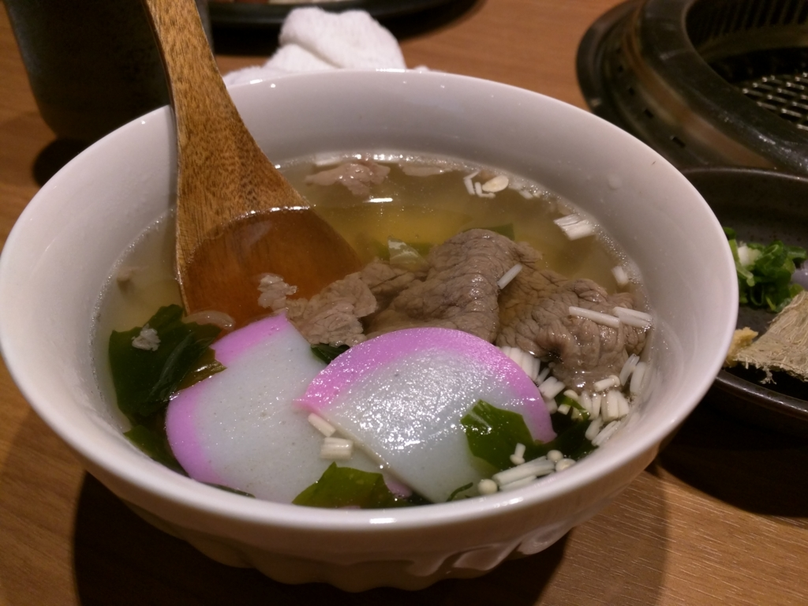

前回、墓参りしたのは去年の4月だったか。そのときはバイクだったが、今回はおかんも一緒に行きたいというので、大阪で待ち合わせて近鉄特急で名張へ向かう。

<iframe src="https://hatenablog-parts.com/embed?url=https%3A%2F%2Fblog.daruyanagi.jp%2Fentry%2F2015%2F04%2F16%2F053928" title="バイク＆艦これ：名張から天理、戦艦大和所縁の神社「大和神社」に行ってきた - だるろぐ" class="embed-card embed-blogcard" scrolling="no" frameborder="0" style="display: block; width: 100%; height: 190px; max-width: 500px; margin: 10px 0px;"></iframe>

大阪でいろいろ回ったので、名張についたときはもう遅かった。駅前の居酒屋でちょっと飲んで、安宿に泊まり、次の朝にお寺へのぼった。長い間ほったらかしで大変申し訳ないが、まぁ、じいちゃんばあちゃんも「たまにくるだけマシ」と思ってると思うのでキニシナイ。

帰りに、今回のもう一つの目的である「伊賀肉の奥田」へ向かう。1階がお肉屋さん、2階が焼肉屋になっているので、友達へのお歳暮（？）を買いつつ、焼肉ランチをキメようという算段だ。

このお店は名張市役所（鴻之台）の近くにあるので、お寺のある蔵持町・里からは歩いて行った。相変わらず田舎だが、田んぼは少し小さくなり、代わりに道がよくなったようだ。2年ちょっと通った小学校の校庭では、サッカー少年団の子どもたちだろうか、元気にサッカーをしていた。

小一時間歩いただろうか。久しぶりなのでちょっと迷ったが、無事、お店のあるはずの場所へ到着……したのだが、遠目で見た感じ、開いてないっぽい。ちゃんとホームページで開いていることを確認してきたのだが。

近くによってみると、店舗移転を知らせる小さな看板が立っている。その案内を頼りに、新しい店を探すと――

デカくなっててビビった。もう20年以上、小さな方の店舗に親しんできたので、正直、度肝を抜かれた。かつてはテキトーに「スキヤキのお肉、贈答用に○○円ぐらいで包んでもらえませんかー」みたいな感じでカウンターで注文していたが、店が広くなっているので勝手がわからぬ。とりあえずメシ食って落ち着こうを思い、2階の焼肉屋へ上がる。――広くてキレい。ぶっちゃけ前の焼肉屋はフツーな感じだったけれど、こっちも格段にグレードアップしてる。

牛刺しセットでビールをやりながらランチセットが来るのを待ったが、この刺身がまたウマい。

いつのまにか名張名物になってた「牛汁」も頼んでみたが、こっちはワカメスープに牛肉が浮いている感じ。まぁ、これはこれでありか。

<iframe src="https://hatenablog-parts.com/embed?url=http%3A%2F%2Fwww.okuda-igaushi.com%2F" title="伊賀肉（伊賀牛）の奥田" class="embed-card embed-webcard" scrolling="no" frameborder="0" style="display: block; width: 100%; height: 155px; max-width: 500px; margin: 10px 0px;"></iframe>

かつて大阪のベッドタウンとして人口が増えていた名張も、最近は若干衰退気味だそうで。個人的にちょっと心配したりしていたのだけど、頑張っているとことは頑張っているんだなー、とちょっとうれしくなった。

帰りは、これまた新しくできたらしい“名張の湯”で汗を流し、名張駅でおかんとお別れした。

<iframe src="https://hatenablog-parts.com/embed?url=http%3A%2F%2Fwww.nabarinoyu.com%2F" title="三重県で人気の日帰り温泉は癒しの里名張の湯" class="embed-card embed-webcard" scrolling="no" frameborder="0" style="display: block; width: 100%; height: 155px; max-width: 500px; margin: 10px 0px;"></iframe>

