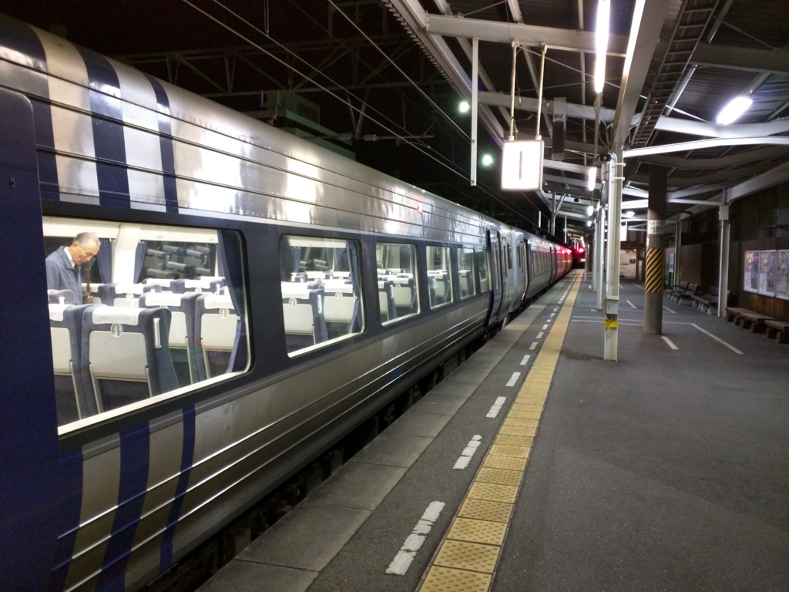
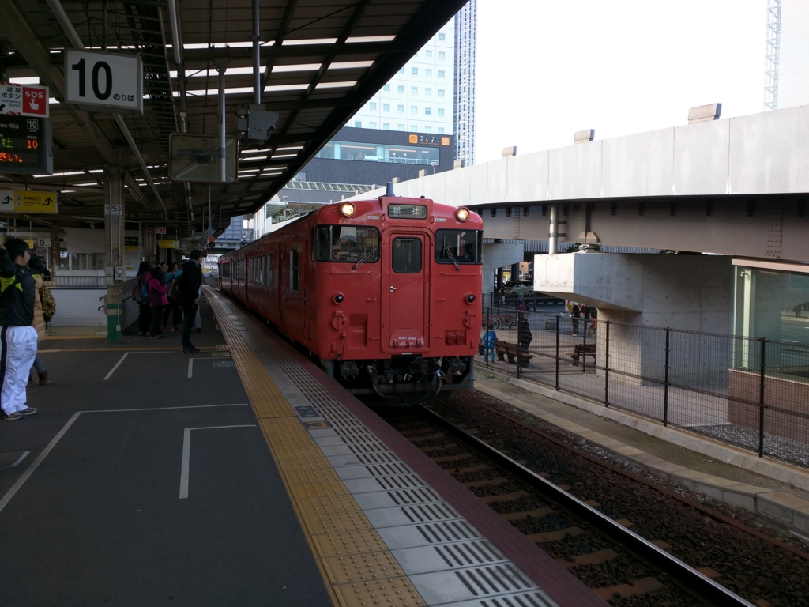
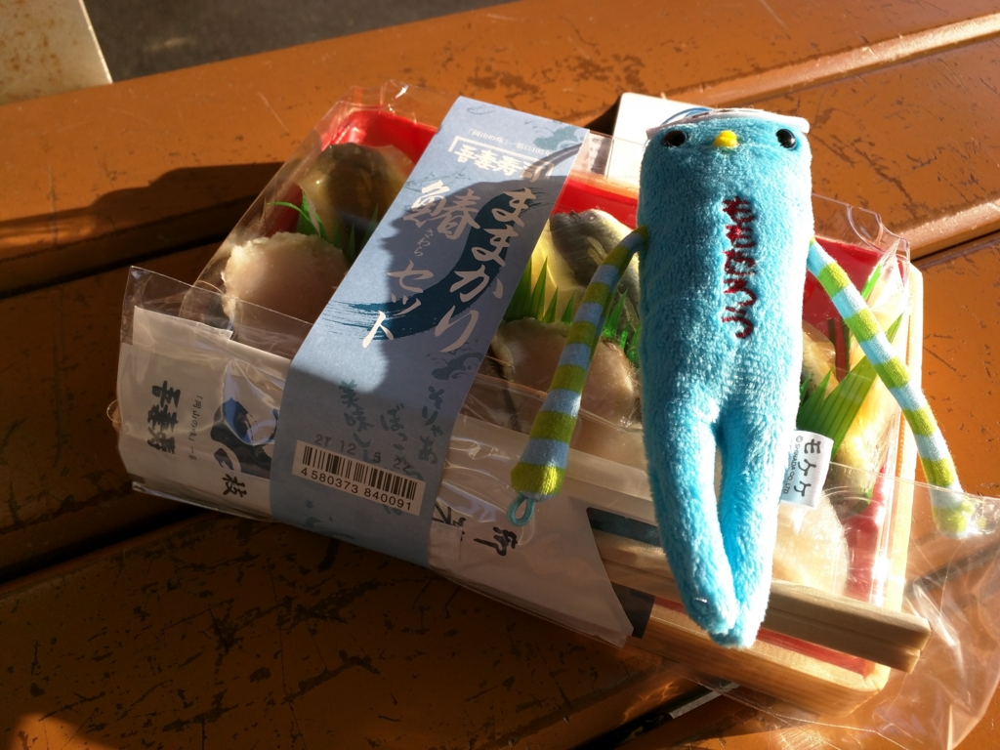
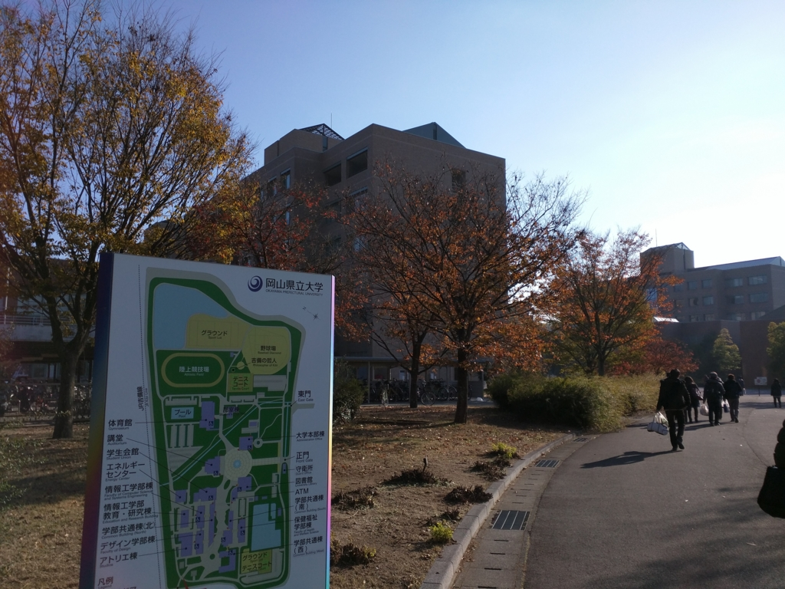
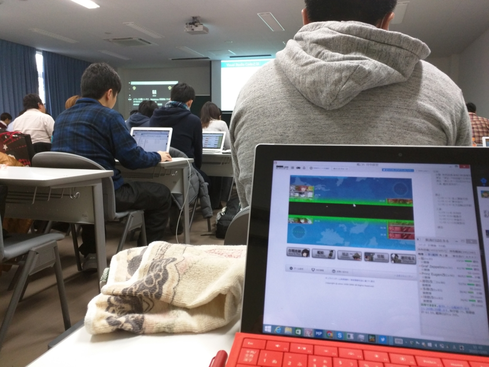
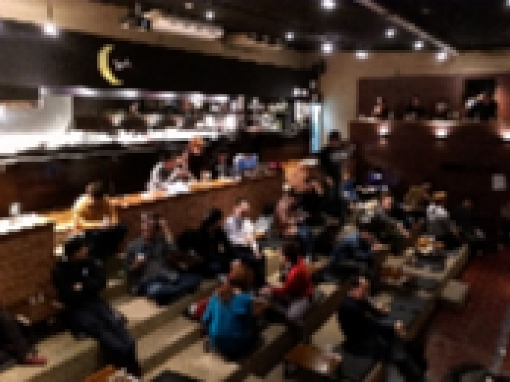
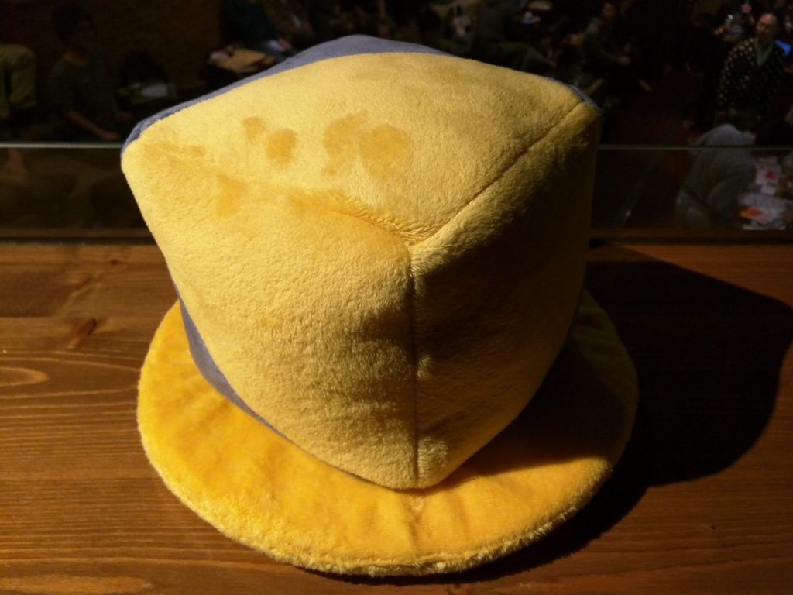

<iframe src="//hatenablog-parts.com/embed?url=https%3A%2F%2Fgbdaitokai.doorkeeper.jp%2Fevents%2F31149" title="合同勉強会 in 大都会岡山 -2015 Winter-" class="embed-card embed-webcard" scrolling="no" frameborder="0" style="display: block; width: 100%; height: 155px; max-width: 500px; margin: 10px 0px;"></iframe>

<blockquote>

合同勉強会in大都会岡山は、岡山県近辺のIT勉強会コミュニティによる、合同勉強会です。

</blockquote>

12月5日、はるばる愛媛・松山から「合同勉強会in大都会岡山」へ参加してきました。大きな部屋の隅に陣取り、ひっそりと LT に耳を傾けるスタイル。

当日の模様は――

<iframe src="//hatenablog-parts.com/embed?url=http%3A%2F%2Ftogetter.com%2Fli%2F908723" title="合同勉強会 in 大都会岡山 -2015 Winter- &amp; 忘年会議2015 まとめ #gbdaitokai #忘年会議" class="embed-card embed-webcard" scrolling="no" frameborder="0" style="display: block; width: 100%; height: 155px; max-width: 500px; margin: 10px 0px;"></iframe>

togetter が詳しいらしいのでそっちに譲ることにします（ちょっとメモしたけどめんどくさくなった。やっぱりブログは熱いうちに書かねばね）。内容は Git の話とか、アジャイルの話が多かったかな？　ぶっちゃけ自分にはあまり関係のない話なのだけど、たまにはこういうのに参加して、みんなの興味の方向性を知るのはいいかなって思う。

それにしても、会場（岡山<b>県立</b>大学）が遠いのには参った。開場の 10:00 に間に合うためには、始発の「しおかぜ」に乗らないと間に合わない。もちろん伊予鉄なんか走ってないので、泣きながら JR 松山駅まで歩いて行く。

 

岡山駅で総社方面に乗り換え。さすが大都会、汽車（ディーゼル車）だぜ……。

会場にはごはんがなさそうなので、お昼ご飯も岡山駅で調達。ままかりと鰆のお寿司を買ったけれど、これが割とおいしくて気に入った。ちなみに、一緒に写っている謎の人形は「もけけ」というらしい。なぜか気に入ったので買ってしまったが、その土地土地にご当地の「もけけ」がいるらしいので、今度集めてみようと思う。

9:30 ごろ、会場の岡山<b>県立</b>大学に到着。キャンパスで遭難したけれど、無事、時間までに会場にたどり着けた。正直、頑張ったと思う。

あとは会場では提督業に勤しみつつ、LT を拝聴。

<h4>忘年会議2015</h4>

<iframe src="//hatenablog-parts.com/embed?url=https%3A%2F%2Fbonenkaigi.doorkeeper.jp%2Fevents%2F27273" title="忘年会議2015" class="embed-card embed-webcard" scrolling="no" frameborder="0" style="display: block; width: 100%; height: 155px; max-width: 500px; margin: 10px 0px;"></iframe>

<blockquote>

忘年会議は、瀬戸内地方のIT技術に興味ある方が一同に会する 毎年恒例の名物的なイベントです。初めての方も大歓迎ですの で、是非とも参加ください。

</blockquote>

そのあとは忘年会にも参加。

場所は「Ryoutei 座・スタジアム」というところだったのだけど、なんかスクリーンを中心に闘技場のような作りになっていてスゴい。バックはバイキング形式の食事が並んでいて、飲み放題食い放題。こういう施設があるのはさすが大都会だと思う。

プレゼントの抽選会ではなんと一番を引いたのだけど、ほしいものがありすぎて逆に選べなくなり、なぜか ECube のクッションをもらってしまった。何気に気に入ってるけど。

<h4>感想</h4>

<ul>
<li>てらださん（<a href="https://twitter.com/yoshioterada">https://twitter.com/yoshioterada</a>）の愛されっぷりは異常。</li>
<li>初めてなのでおとなしくしてたけど、みんなパワーあるなー</li>
<li>おとなしくしすぎて途中飽きたけど、さすがにこのメンツを前にやる LT ネタなんか持ってなかった</li>
<li>松山でやるときにはちょっとお手伝いしないとな</li>
</ul>

<h4>関連するかもリンク</h4>

<ul>
<li><a href="http://delightmode.com/daitokai-okayama-bonenkaigi-2015.html">&#x5927;&#x90FD;&#x4F1A;&#x30A2;&#x30EF;&#x30FC;&#x30C9;2015&#x3092;&#x53D7;&#x8CDE;&#xFF01;&#x5CA1;&#x5C71;&#x30FB;&#x702C;&#x6238;&#x5185;&#x5468;&#x8FBA;&#x306E;IT&#x7CFB;&#x30B3;&#x30DF;&#x30E5;&#x30CB;&#x30C6;&#x30A3;&#x304C;&#x96C6;&#x3046; #&#x5FD8;&#x5E74;&#x4F1A;&#x8B70; &#x306B;&#x53C2;&#x52A0;&#x3057;&#x3066;&#x304D;&#x307E;&#x3057;&#x305F; | DelightMode&#xFF08;&#x30C7;&#x30A3;&#x30E9;&#x30A4;&#x30C8;&#x30E2;&#x30FC;&#x30C9;&#xFF09;</a></li>
<li><a href="http://www.inet88.co.jp/engineer-blog/okayamait2015">&#x5927;&#x90FD;&#x4F1A;&#x5CA1;&#x5C71;&#x306E;IT&#x52C9;&#x5F37;&#x4F1A;&#x30B3;&#x30DF;&#x30E5;&#x30CB;&#x30C6;&#x30A3;&#x4E00;&#x89A7;(2015&#x5E74;&#x7248;) | &#x682A;&#x5F0F;&#x4F1A;&#x793E;&#x30A2;&#x30A4;&#x30CD;&#x30C3;&#x30C8;</a></li>
<li><a href="http://blog.keisukeinoue.net/archives/1046900075.html">&#x5408;&#x540C;&#x52C9;&#x5F37;&#x4F1A;&#x30FB;&#x5FD8;&#x5E74;&#x4F1A;&#x8B70; in &#x5927;&#x90FD;&#x4F1A;&#x5CA1;&#x5C71;&#x306B;&#x884C;&#x3063;&#x3066;&#x304D;&#x305F;&#x3002;#gbdaitokai : &#x3068;&#x3042;&#x308B;&#x3048;&#x3093;&#x3058;&#x306B;&#x3042;&#x5FD7;&#x671B;&#x306E;&#x5927;&#x5B66;&#x751F;</a></li>
</ul>

