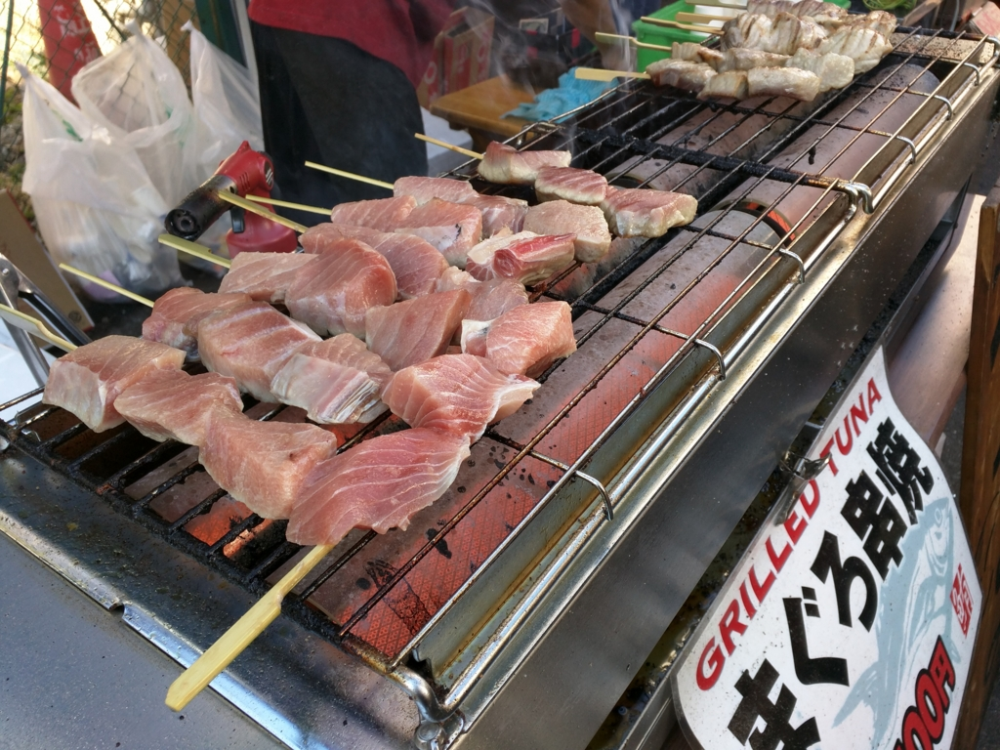
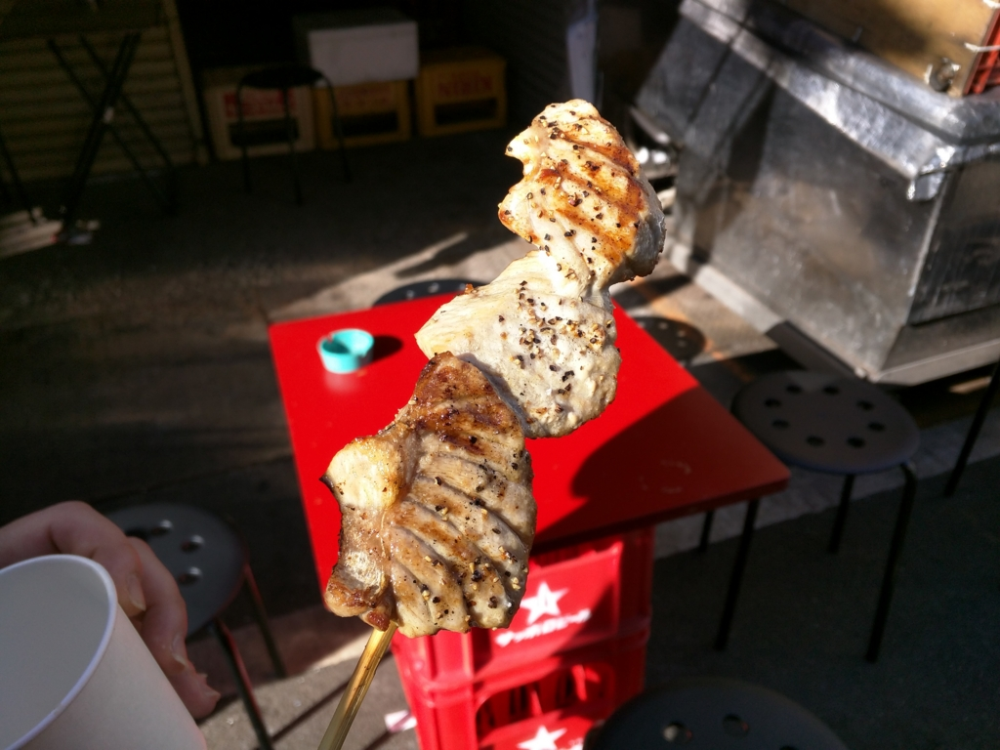
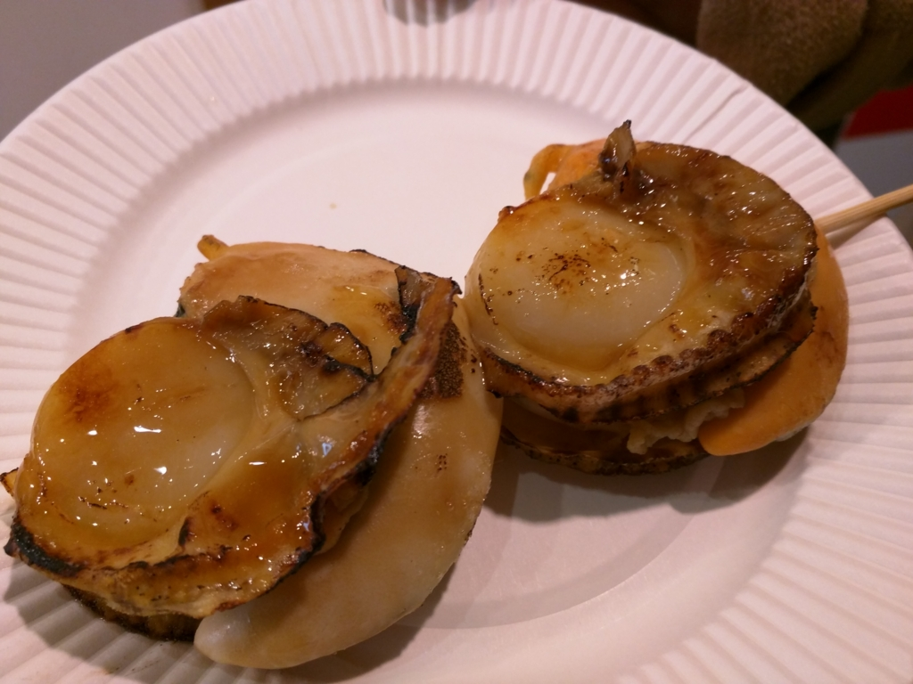
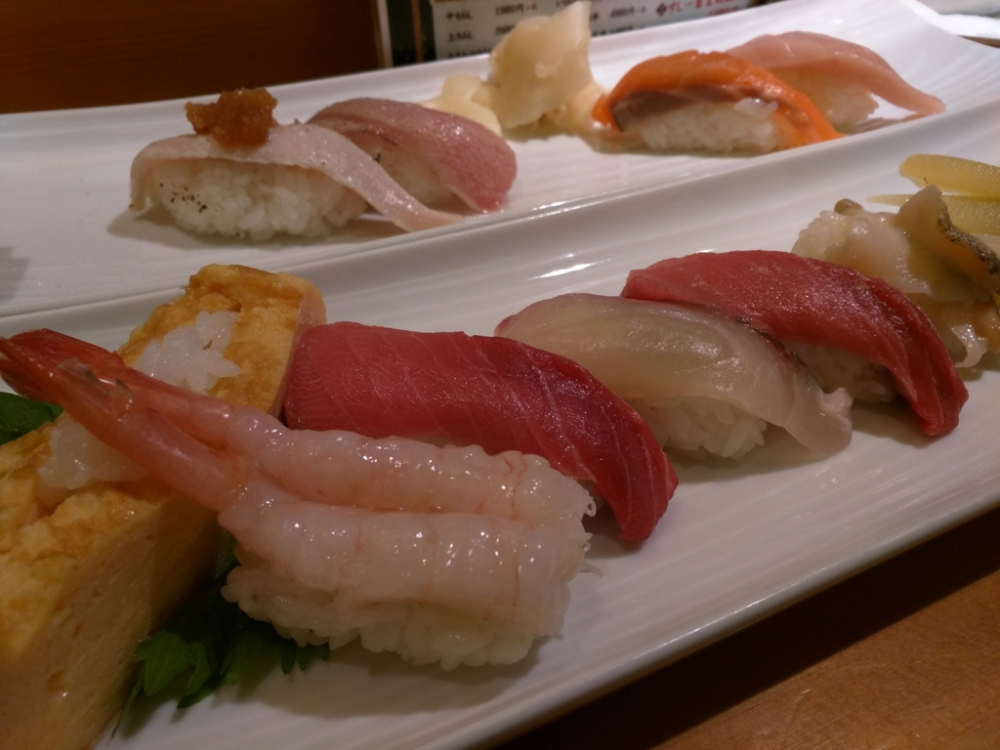

築地は今年で豊洲へ移転だそうで。正月1日のお昼にふらっと立ち寄ってみた（もっとも、場外は当分そのままは残るみたいだけど）。

場内市場は閉まっていたが、そこそこの人出。人混みは嫌いなので、むしろこれぐらいでいいかもしれない。マグロの串焼きうまー

でも、ホタテの方が気に入った。噛むとじゅわっと旨味が噴出してくる感じ。うまー

最後にテキトーなお寿司屋さんに入って、お寿司を食べまくった。食べ過ぎて、歩くのが億劫。早くお寿司が止まって見える年収を突破して、タクシーで家まで帰れる身分になりたいものだね。

