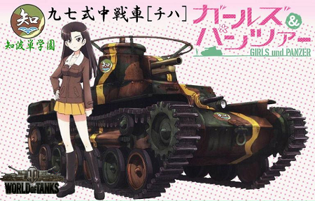
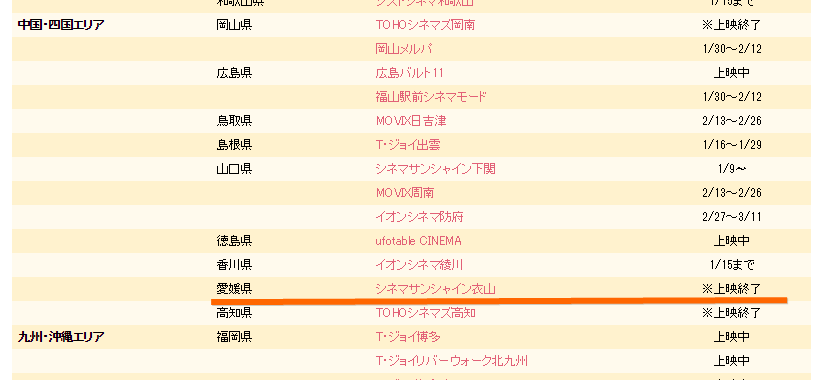

12月30日、高校の同窓会に参加するため、大阪・梅田へ進出。ついでに映画館で『ガールズ＆パンツァー 劇場版』をみた。<i>「ガルパンはいいぞ！」</i>なにがいいのかって？　考えるな、感じろ。

とくに<i>「知波単学園はいいぞ！」</i>九七式中戦車はこの世界観にサイコーにマッチしていると思う。走ってるだけでかわいい。

もう一回見に行ってもいいと思ったが、残念ながら愛媛県では上映が終わってた。なむさん。

<iframe src="https://hatenablog-parts.com/embed?url=https%3A%2F%2Fblog.daruyanagi.jp%2Fentry%2F2013%2F08%2F18%2F211848" title="大洗はマジで『ガルパン』一色だった…… - だるろぐ" class="embed-card embed-blogcard" scrolling="no" frameborder="0" style="display: block; width: 100%; height: 190px; max-width: 500px; margin: 10px 0px;"></iframe>

