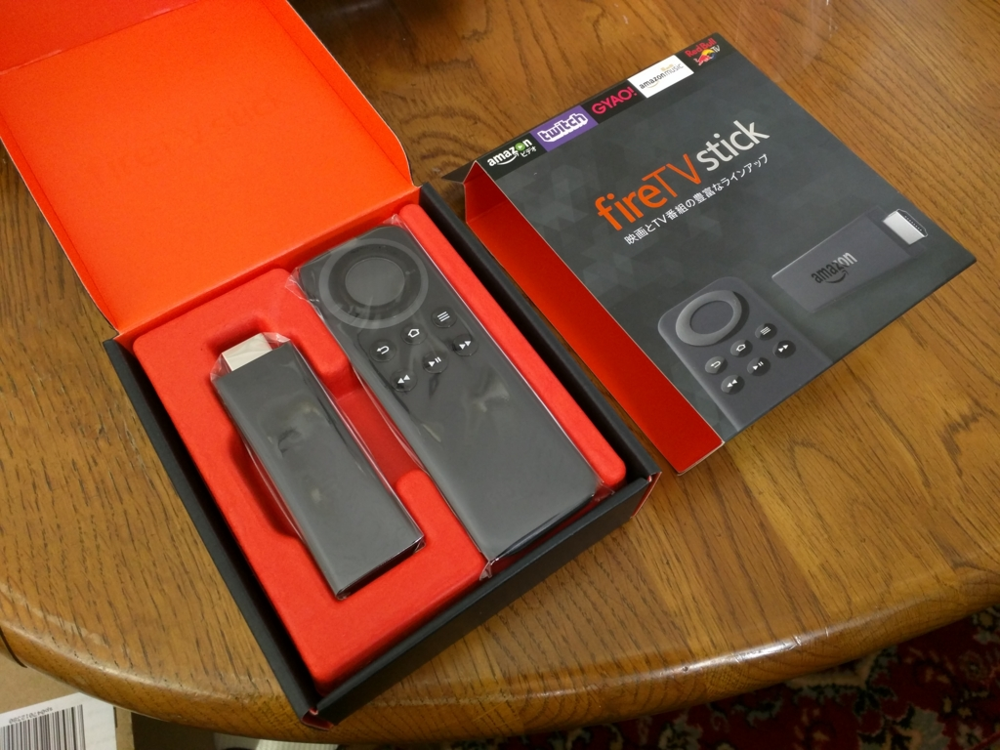
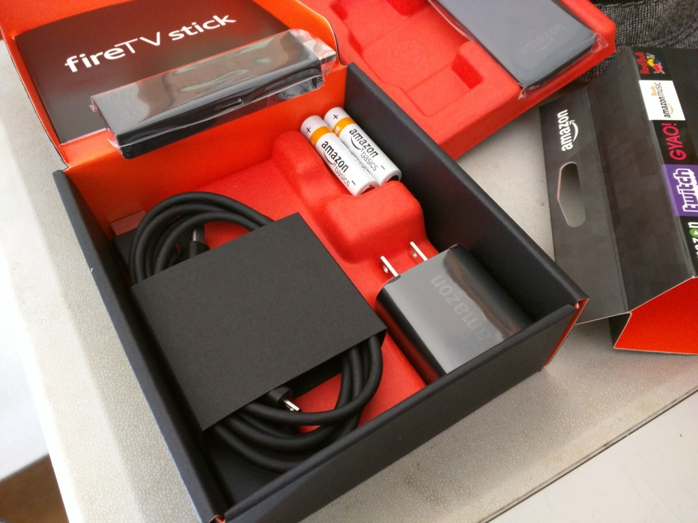
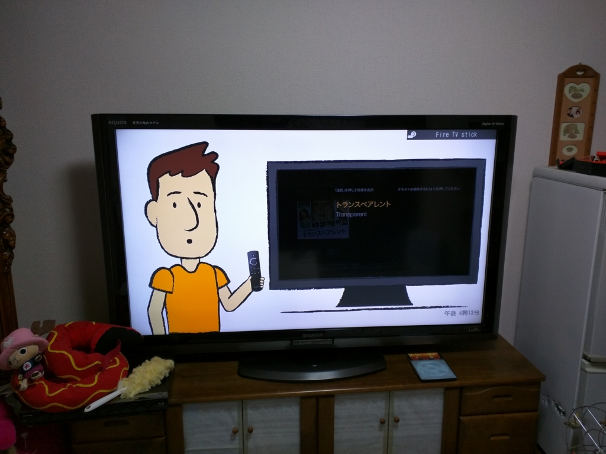

おかんの誕生日プレゼント代わりに「Fire TV Stick」を買ってあげた。ぶっちゃけ、自分がちょっと触ってみたかったというのが本当のところだけど、これがなかなか好評。買ってよかった。

「Fire TV Stick」っていうのは要するに、

<ul>
<li>Android 搭載のスティック型パソコン（？）</li>
<li>TV の HDMI 端子にさして USB ケーブルで給電してやるだけで動作</li>
<li>Wi-Fi につないであげると、Amazon プライムビデオ（プライム会員になる必要がある）を TV で観られる</li>
<li>スマホみたいにアプリがある。YouTube とか Hulu、ニコ動なんかのアプリを追加インストールしてやると、そっちの動画もみられる</li>
</ul>
みたいな感じ。Miracast（<a href="https://blog.daruyanagi.jp/entry/2015/07/24/012852">Microsoft Wireless Display Adapter &#x3092;&#x885D;&#x52D5;&#x8CB7;&#x3044;&#x3057;&#x3066;&#x307F;&#x305F; - &#x3060;&#x308B;&#x308D;&#x3050;</a>）に似てるけど、それをネット動画に特化した感じかな？

付属品は本体、給電用のアダプターと USB ケーブル、リモコン、リモコンの電池。機械的なセットアップは簡単だと思う。万が一スティック本体が干渉した時のための HDMI ケーブルもついていた記憶があるが、実家の TV では使わなかった。

面倒だったのはリモコンでの Wi-Fi の設定。パスワードをプチプチ打つのが超めんどかったけれど、それさえ済ましてしまえば快適。チュートリアルもついてて、うちのおかんでもすぐに操作できるようになった。しかもとても気に入ったようで、僕が実家に滞在している間だけでも5、6本は一緒に映画を観た。たまにはそういうのもいい。

ただ、やっぱり文字を打つのは苦手で、音声入力付きのリモコンを買ってあげてもよかったなと思う。どこまで使えるのかわからんが……。

<a href="http://www.amazon.co.jp/exec/obidos/ASIN/B00ZVNYLS8/bestylesnet-22/">Fire TV Stick(2015年発売モデル)</a>
<ul><li>出版社/メーカー: Amazon</li><li>発売日: 2015/10/28</li><li>メディア: エレクトロニクス</li><li><a href="http://d.hatena.ne.jp/asin/B00ZVNYLS8/bestylesnet-22" target="_blank">この商品を含むブログ (37件) を見る</a></li></ul>

