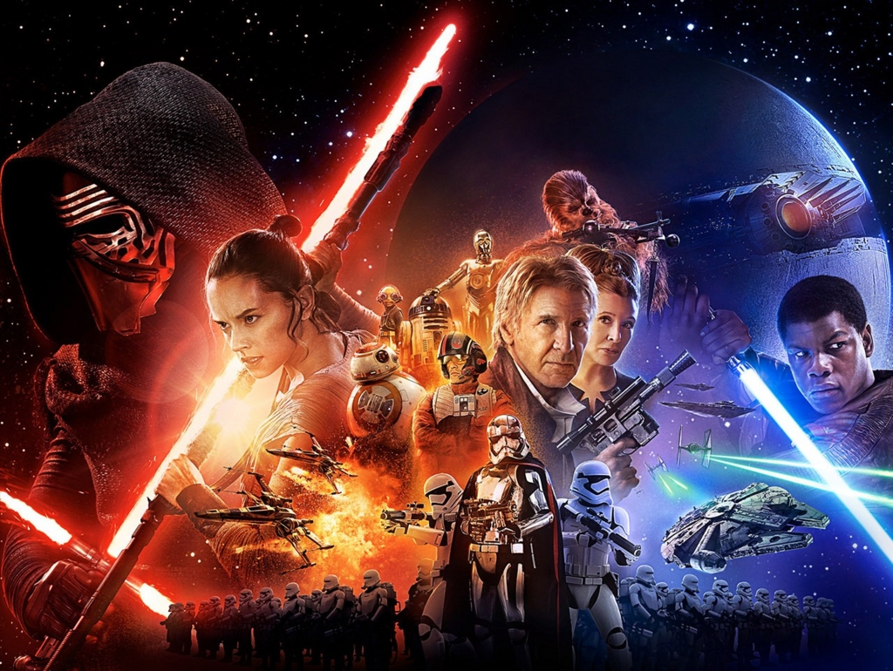

東京・有楽町で友達と観てきた。実はスターウォーズってちゃんと観たことがなくて、

<ul>
<li>なんかジェダイとかいう人がビームサーベルで戦う</li>
<li>宇宙人とかロボット（金ぴかの奴と、いかにもロボットな奴）が出てくる</li>
<li>ダースベイダーが悪者。息が苦しいっぽくて、いつも ｺﾌｰｺﾌｰ って言ってるけど詳細は謎</li>
<li>帝国兵さん（@superriver）みたいな人がダースベイダーの部下で、わらわら出てくる</li>
</ul>
ぐらいなイメージしかもっていなかった。『スター・ウォーズ エピソード1/ファントム・メナス』の頃の熱狂は少し記憶にあるが、生憎そのときは大学受験に失敗して浪人中だったので、あまり観に行く気になれなかった。代わりにデ・ニーロの『RONIN』を観に行ったのは今でも覚えている。

そんなわけでちょっとぐらい予習をしておかないといけないと思ったが、どこから手を付けていいのかもわからん。

<blockquote class="twitter-tweet" data-lang="ja">
<a href="https://twitter.com/daruyanagi?ref_src=twsrc%5Etfw">@daruyanagi</a> Episode 4 (A New Hope)を見ておくのがお勧めです。セリフを覚えるまで見ておけばより一層楽しめますよ
&mdash; 帝国兵 (@superriver) <a href="https://twitter.com/superriver/status/685244929283473408?ref_src=twsrc%5Etfw">2016年1月7日</a></blockquote>

幸い、帝国兵さんが親切に教えてくれたので、まずは Amazon ビデオでエピソード 4 を購入。

<a href="http://www.amazon.co.jp/exec/obidos/ASIN/B00VLAVCIM/bestylesnet-22/">スター・ウォーズ エピソード4／新たなる希望 (字幕版)</a>
<ul><li>発売日: 2015/06/01</li><li>メディア: Prime Video</li><li><a href="http://d.hatena.ne.jp/asin/B00VLAVCIM/bestylesnet-22" target="_blank">この商品を含むブログを見る</a></li></ul>

これがわしの生まれる前（1977）の映画なのか……熱狂するのはわかる気がする。初代ガンダムを今の子が見たら、こんな感じなんだろうか。内容は、『ゲド戦記』のスペースオペラ風味な感じやな（←いろいろ間違ってる）。割と面白かったので、エピソード 5 と 6 も買ってみた。

<a href="http://www.amazon.co.jp/exec/obidos/ASIN/B00VM66Y88/bestylesnet-22/">スター・ウォーズ　エピソード5／帝国の逆襲(吹替版)</a>
<ul><li>発売日: 2015/06/01</li><li>メディア: Prime Video</li><li><a href="http://d.hatena.ne.jp/asin/B00VM66Y88/bestylesnet-22" target="_blank">この商品を含むブログを見る</a></li></ul>

<a href="http://www.amazon.co.jp/exec/obidos/ASIN/B014KNHPEG/bestylesnet-22/">スター・ウォーズ　エピソード6／ジェダイの帰還(字幕版)</a>
<ul><li>発売日: 2015/04/07</li><li>メディア: Prime Video</li><li><a href="http://d.hatena.ne.jp/asin/B014KNHPEG/bestylesnet-22" target="_blank">この商品を含むブログを見る</a></li></ul>

こいつは Fire TV Stick で、おかんとデカい TV で観た。

<iframe src="https://hatenablog-parts.com/embed?url=https%3A%2F%2Fblog.daruyanagi.jp%2Fentry%2F2016%2F01%2F18%2F064413" title="実家に「Fire TV Stick」をプレゼントしたらわりと喜ばれた件について - だるろぐ" class="embed-card embed-blogcard" scrolling="no" frameborder="0" style="display: block; width: 100%; height: 190px; max-width: 500px; margin: 10px 0px;"></iframe>

おかんは盛んに「なつかしい、なつかしい」と言っていたけれど、まぁ、確かにその世代かもしれん（18歳差）。

エピソード 5 だけ間違って吹き替え版を買ってしまったのが痛恨のミス。でも、これで時間が許す限りの予習ができたので、万全の態勢でエピソード 7 に臨むことができた。

<blockquote class="twitter-tweet" data-lang="ja">
スターウォーズの456をみたけど、ルークが怒髪有頂天になりそうになるたびに、皇帝やベイダー卿が「いいぞ」「そのまま暗黒面に落ちろ」って言い出して。わざわざルークに我にかえるようにしてたところに、ヌクモリティを感じた。あいつら、きっとそんなに悪い奴らじゃない
&mdash; だるやなぎ に天使が舞い降りた！ (@daruyanagi) <a href="https://twitter.com/daruyanagi/status/685721073246015488?ref_src=twsrc%5Etfw">2016年1月9日</a></blockquote>

――で、感想は……。

エピソード 4 と似たような話になっているのは、昔からのファンへのサービスかな？　みんな喜びそうだ。映像は昔のものとは比べ物にならない。かなりの迫力で、別にスターウォーズのブランドがなくてもそこそこ流行ったんじゃないかと思う。あと、主人公のお姉ちゃんはたいへんよろしかった。

なにより、来た人がスターウォーズを楽しんでそうなのがよかった。グッズ売り場では女の子が英語でセリフをやり取りしながら（予習してたおかげで、この子らがどのシーンをやっているのか分かった！）、キャッキャしてた。おっちゃんももう少し詳しければその輪に入れたのだが（ｺﾌｰ

<iframe src="https://hatenablog-parts.com/embed?url=http%3A%2F%2Fstarwars.disney.co.jp%2Fhome.html" title="スター・ウォーズ｜STAR WARS｜" class="embed-card embed-webcard" scrolling="no" frameborder="0" style="display: block; width: 100%; height: 155px; max-width: 500px; margin: 10px 0px;"></iframe>

なんか続きもあるっぽい終わり方だったので、次回も観に行こうと思う。

<h3>おまけ</h3>

<blockquote class="twitter-tweet" data-lang="ja">
Amazon でデジタル版のスターウォーズを2500円で買ったあと、その値段でエピソードが3つぐらい入ったディスク版が買えることを知った。映画館で見るより高いことといい、いろいろ理不尽な感じあるけど、まぁ、いいや（震え声
&mdash; だるやなぎ に天使が舞い降りた！ (@daruyanagi) <a href="https://twitter.com/daruyanagi/status/685821844566376448?ref_src=twsrc%5Etfw">2016年1月9日</a></blockquote>

クラウドにある方が便利やからええねん……（号泣

