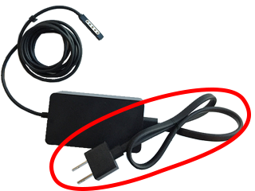
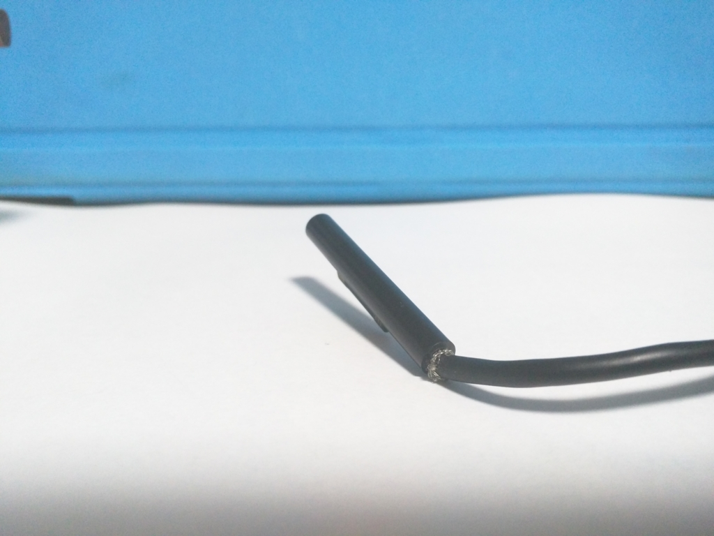

 

<blockquote cite="http://blogs.technet.com/b/microsoft_surface/archive/2016/01/21/surface-pro-ac.aspx">

本日、マイクロソフトは、さまざまな政府規制機関との協力のもと、Microsoft Surface Pro、Microsoft Surface Pro 2、および一部の Microsoft Surface Pro 3 (「対象 Surface Pro 3」) に同梱された AC 電源コードの自主交換プログラムを発表しました。上記の AC 電源コードは、長期間にわたり、大きく折り曲げることを繰り返したり、きつく巻いた状態にしたりすると、破損する可能性があります。破損した AC 電源コードの使用を継続すると、過熱、発火、あるいは感電のおそれがあります。

現在までに、深刻な被害が発生したとの報告は寄せられておりませんが、少数のお客様より該当の報告があったため、対象となるすべてのお客様のAC電源コードを無償で交換します。お客様の安全はマイクロソフトの最優先事項です。

<cite><a href="http://blogs.technet.com/b/microsoft_surface/archive/2016/01/21/surface-pro-ac.aspx">Surface Pro &#x7528; AC &#x96FB;&#x6E90;&#x30B3;&#x30FC;&#x30C9; &#x81EA;&#x4E3B;&#x4EA4;&#x63DB;&#x30D7;&#x30ED;&#x30B0;&#x30E9;&#x30E0;&#x306B;&#x3064;&#x3044;&#x3066; - Surface Japan Blog - Site Home - TechNet Blogs</a></cite>
</blockquote>

首のところの被膜が破けてきた俺の Surface Pro 3 の電源コードもタダで替えてもらえるんだと思っていたら、箇所が微妙に違ってて涙目（そっちのほうかよ！！）。

しかし、そうなるとコードの交換なんて、メンドーなだけだなぁ。まぁ、家が燃えるのは困るから、いずれ交換を申し込もうとは思うけど。

