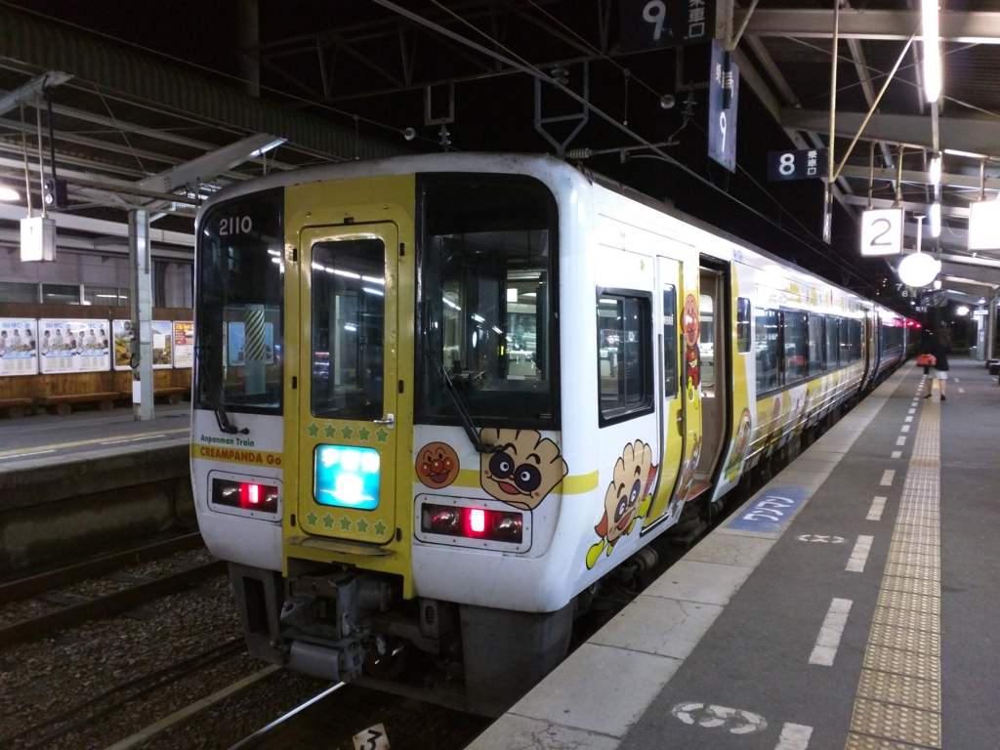
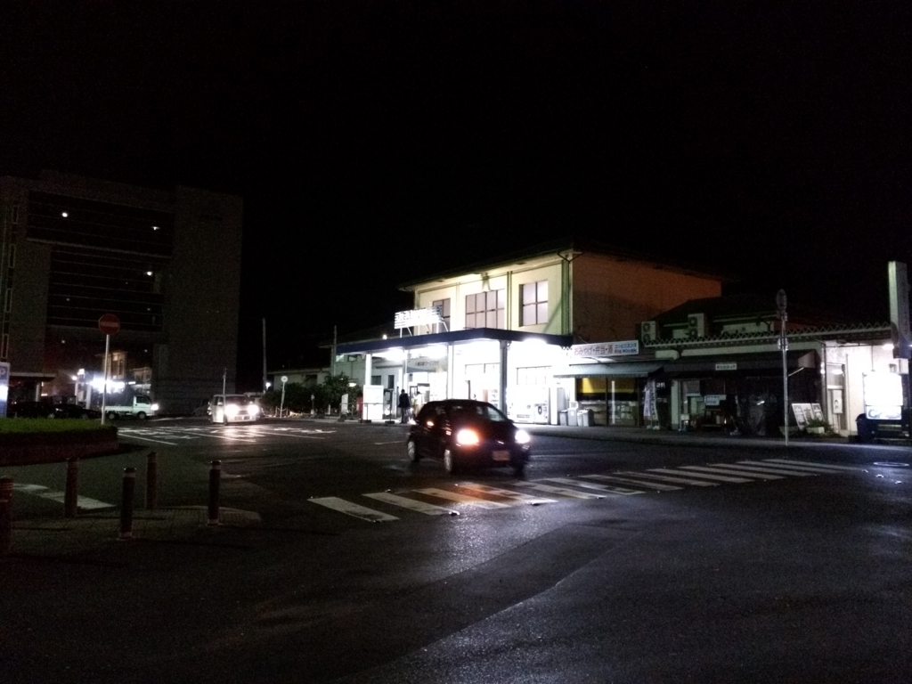
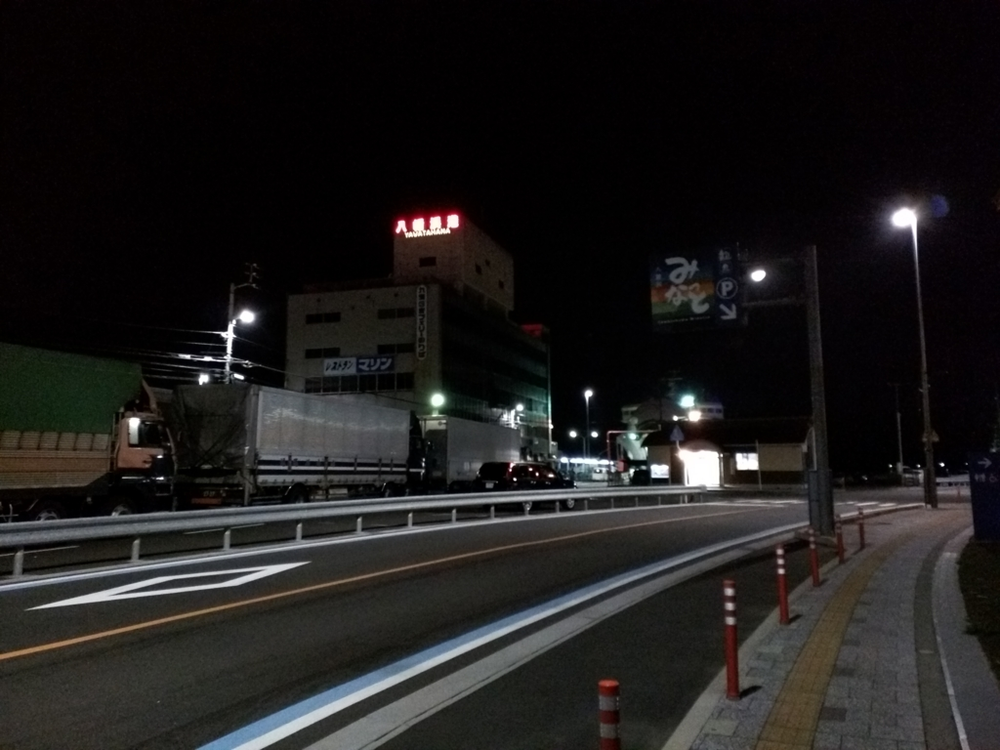
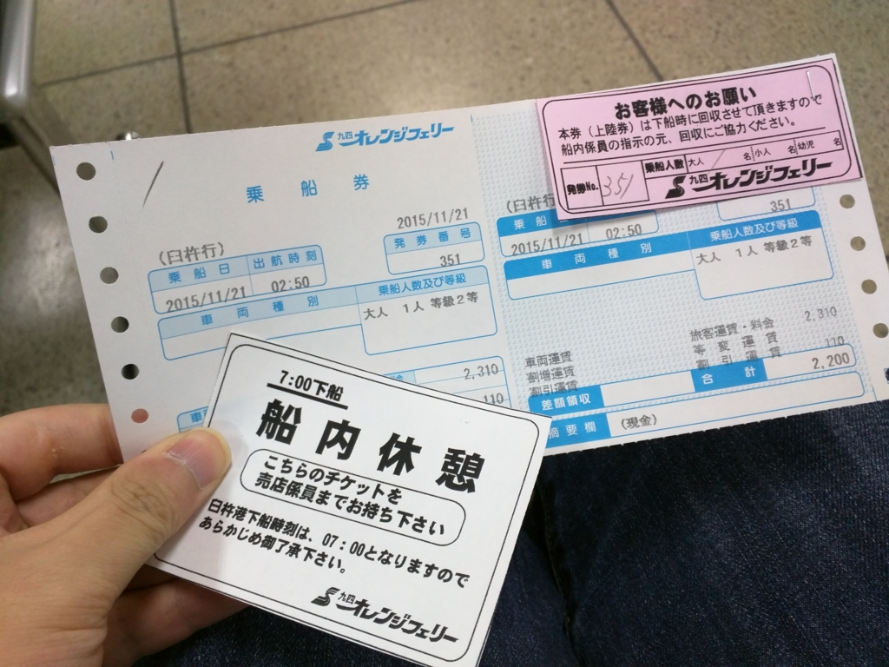
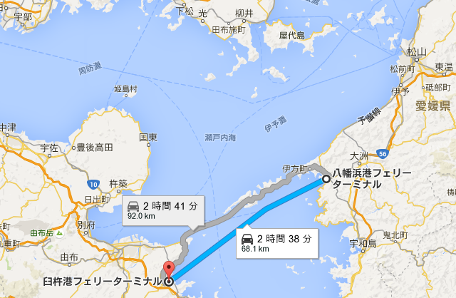
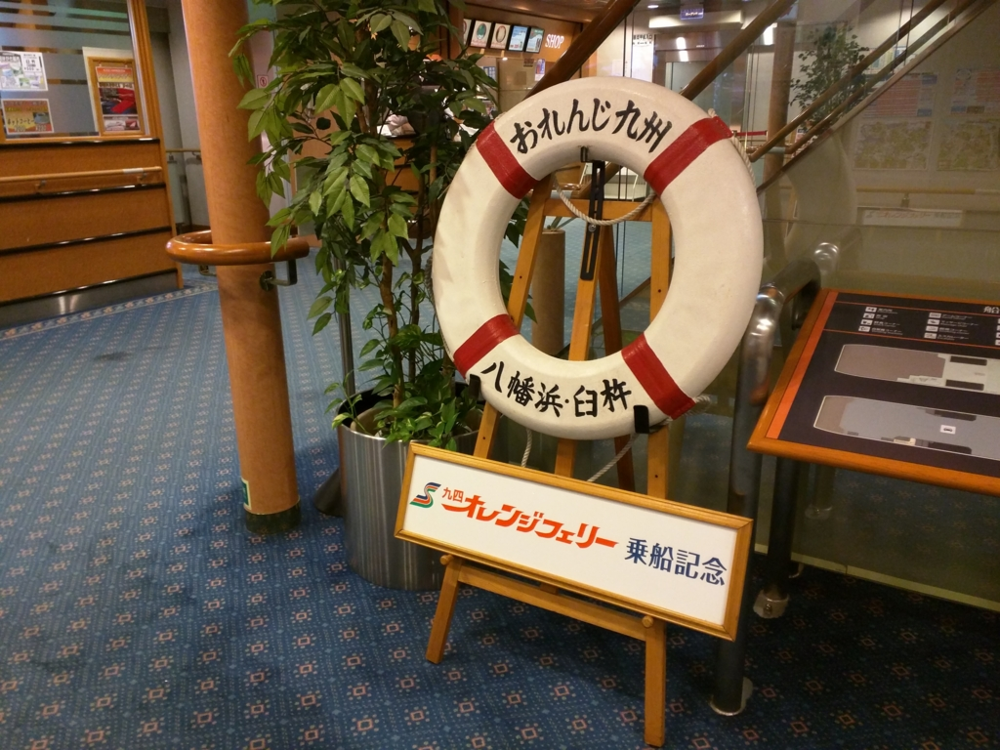
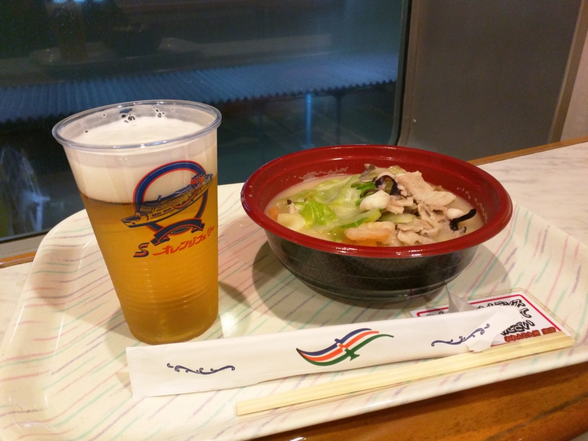

だいぶ前に書いた前回の続き。なぜか大分経由で、愛媛・松山から福岡・博多まで。

<iframe src="https://hatenablog-parts.com/embed?url=https%3A%2F%2Fblog.daruyanagi.jp%2Fentry%2F2015%2F12%2F16%2F051543" title="福岡その一：愛媛・松山から福岡までのルート選定。飛行機から謎ルートまで - だるろぐ" class="embed-card embed-blogcard" scrolling="no" frameborder="0" style="display: block; width: 100%; height: 190px; max-width: 500px; margin: 10px 0px;"></iframe>

まずは、最終の<s>アンパンマン列車</s>特急宇和海で八幡浜まで。スーツケースを引いた女の子連れがいる。僕と同じく、船で九州へ渡るのだろうか。

11時半ごろだったか、八幡浜駅に到着。念のためスマホで目覚ましをかけておいたのだけど、汽動車の振動でそれどころではなかった。駅を出ると、あたりは真っ暗。

<iframe src="https://hatenablog-parts.com/embed?url=https%3A%2F%2Fblog.daruyanagi.jp%2Fentry%2F2015%2F12%2F09%2F000000" title="バイクで愛媛の先っぽまで行ってきたった。 - だるろぐ" class="embed-card embed-blogcard" scrolling="no" frameborder="0" style="display: block; width: 100%; height: 190px; max-width: 500px; margin: 10px 0px;"></iframe>

港までのバスはもうないようだ。タクシーに乗ってもいいのだけど、急ぐ旅ではないので、港まで 2km 弱歩いた。この前バイクで八幡浜にきたので、この街の地理はだいたい把握している。

日が替わるころだったか、とくに迷うことなく港にたどり着いた。

この港からは、

<ul>
<li>臼杵港: 宇和島運輸、九四オレンジフェリー</li>
<li>別府港: 宇和島運輸</li>
</ul>
までの船が出ている。

臼杵・別府までは2時間半ほどになるのかな？　九四オレンジフェリーの 2:50 発に乗れば、7:00 ぐらいまで船内休憩ができるというのを聞いていたので、それをチョイス。乗船まではかなり時間があるので、Surface 3 でお仕事を一つ済ませた。さすがにおなかが空いたが、売店などは開いていない。途中にあったコンビニで何かを買ってくればよかったと後悔する。

2:30 頃だったか。ようやく乗船。バイクツーリングの人が多い。僕もいつか九州を走ってみたいものだ（ただ、群れて走るのはそんなに好きじゃなかったりするんだけど）。

さっそく寝床を確保して、（二等なので雑魚寝だ！　もちろん、ブルジョワのための上級クラスもあり）、船内を探検する。とはいえ、船の大きさは本四フェリーより一回り小さいようで、それほど見所はない。船内はインターネット完備だが、案内所で Wi-Fi のパスワードをお願いする形式なので少し面倒。どうせ寝るつもりなので、今回は頼まなかった。

おなかが空いたので、船内のレストランでちゃんぽんを注文（八幡浜の名物はちゃんぽんらしい）。味は――正直、まずい。麺は堅いし、ビールは臭い。ちゃんとサーバー洗ってんのかな。でも、船旅というのは不思議なもので、そういうものも許せてしまう。二度と食べようとは思わんが。

船ではまったく寝られなかった。せっかく寝床を確保したのだけど、のんびりちゃんぽんを食ってるあいだにバイク乗りの集団がやってきて、居住スペースがかなり奪われてしまったのだ。身を縮めて目を閉じるが、船の振動が気になって眠れない。若いころはどこでも寝られたのに、歳をくうと寝られなくなるらしい。結局、途中で船内休憩を切り上げて（5:00 に出損なうと、6:30 頃まで出られなくなるので注意だけど）、歩いて駅へ向かった。

――続く。

<h3>おまけ</h3>

<blockquote cite="http://www.sankei.com/west/news/160119/wst1601190059-n1.html">

　１９日午後０時４５分すぎ、愛媛県八幡浜市の八幡浜港から大分県臼杵市の臼杵港に向けて出港したフェリー「おれんじ四国」が、強風で付近の岸壁まで約１００メートル押し流された。乗客２３人、乗務員１０人にけがはない。

　宇和島海上保安部などによると、同船は午後０時４５分に出港した直後で、後進中だった。同５５分ごろ、港付近にいた男性が「旅客船の事故のようだ」と海上保安部に通報した。

<cite><a href="http://www.sankei.com/west/news/160119/wst1601190059-n1.html">&#x30A8;&#x30E9;&#x30FC;&#x30DA;&#x30FC;&#x30B8; - &#x7523;&#x7D4C;&#x30CB;&#x30E5;&#x30FC;&#x30B9;</a></cite>
</blockquote>

大丈夫かなー。ご安全に！

