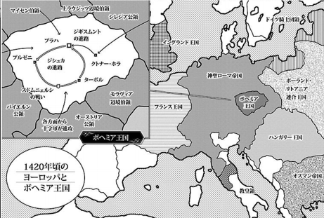
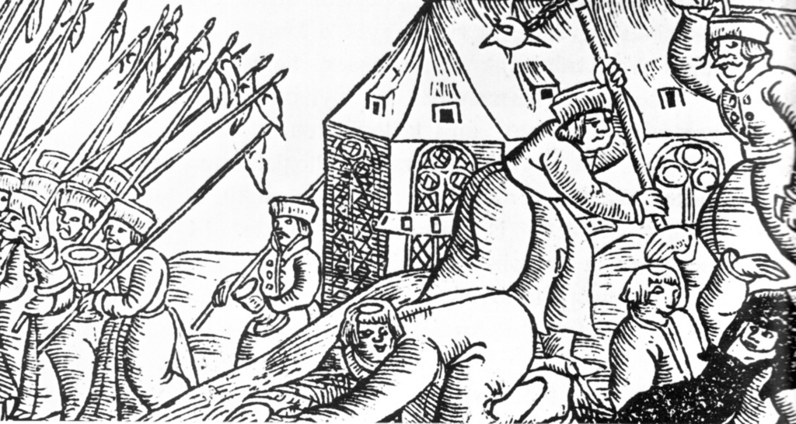
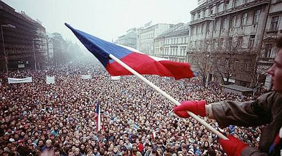
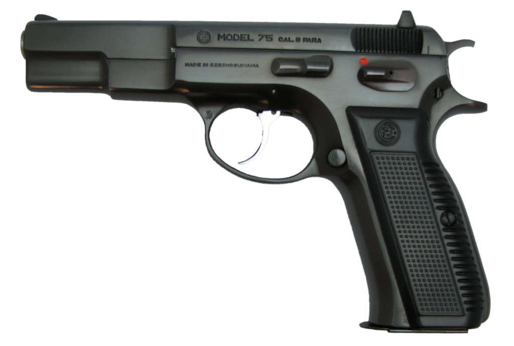
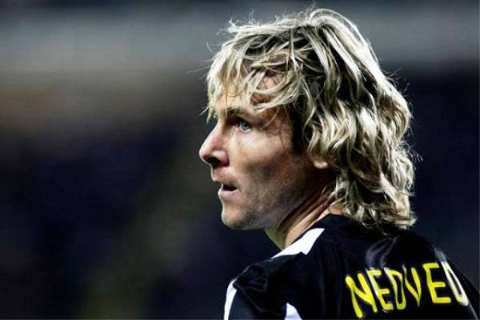
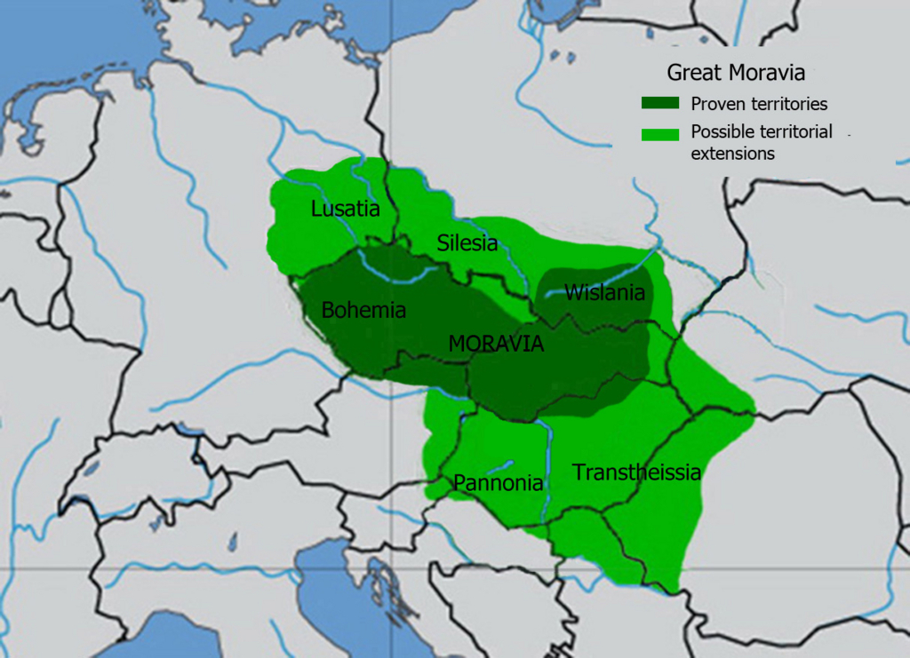
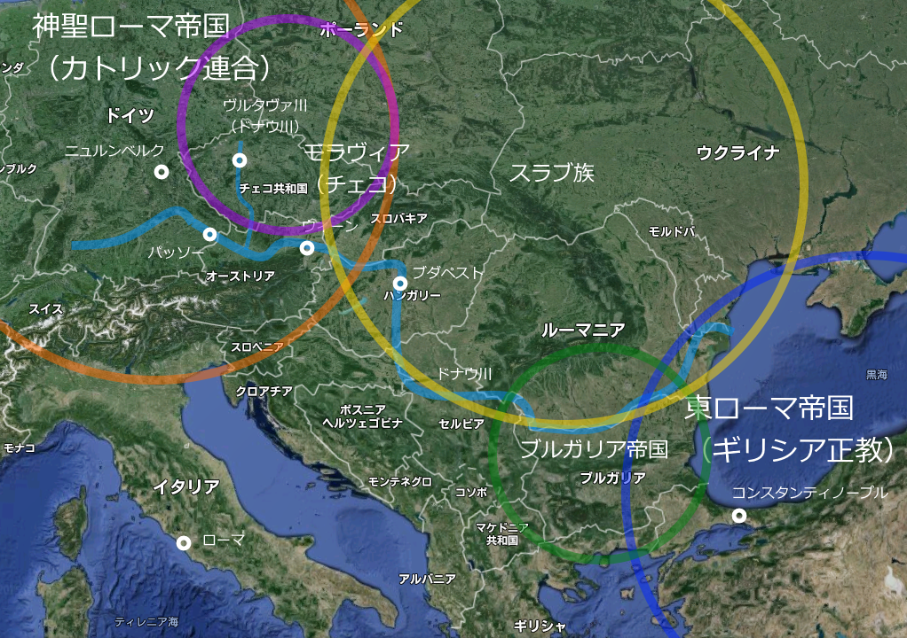
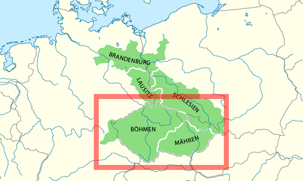
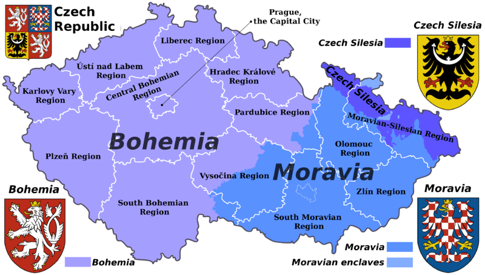

『乙女戦争　ディーヴチー・ヴァールカ』というマンガをこの前読んだのですが、そう言えば「チェコの歴史ってあんまり知らんなぁ」と思い、手に取ってみました（電子書籍だから触れないんですけどね！）。

<iframe src="https://hatenablog-parts.com/embed?url=https%3A%2F%2Fblog.daruyanagi.jp%2Fentry%2F2016%2F01%2F16%2F231016" title="『乙女戦争　ディーヴチー・ヴァールカ』 - だるろぐ" class="embed-card embed-blogcard" scrolling="no" frameborder="0" style="display: block; width: 100%; height: 190px; max-width: 500px; margin: 10px 0px;"></iframe>

ちなみに、この本を読むまでの僕のチェコのイメージは、首都のプラハを除くと……

まずは世界史で習った<b>「フス戦争」</b>。ルターの先駆けっていうぐらいの知識しかありませんが。

次に、チェコとスロバキアがバイバイした<b>「ビロード革命」</b>。ベルリンの壁崩壊ほどのインパクトはなかったけれど、天安門事件と並び何となく覚えている現代史の大事件でした。

そして、プロ御用達の名作拳銃「CZ75」。これ以外にもチェコ製の武器ってなかなかの傑作ぞろいで、侮れない工業国というイメージ。

あと忘れてはいけないのは、パベル・ネドベド！　ポボルスキーなんかもチェコの名選手ですね。

――と、まぁ、これぐらいしか知らん。あとは、古くはボヘミアと呼ばれてたこととか？　そのぐらい貧弱なイメージしかありませんでした。森？　高原？　古城？　ナニソレオイシイノ？

<h3>チェコってなに？</h3>

本書を読んで改めて思ったのは、「○○人ってなに？」っていうのいはホントはスゴくムズかしいということです。外国と海で隔てられた日本だとあんまり意識することはないですが（だいたい同じ言葉をしゃべり、同じ顔をしています。マイノリティがいないっていうわけじゃないですが）、本来、「自分たちは誰？」というのはもっとあやふやなのですね。

チェコのルーツは、7世紀ごろに成立した<b>「大モラヴィア王国」</b>です。モラヴィアでの目下の課題は、どの宗教を受け入れるかでした。どの神様を信じるかという話ですが、ちょっと前の現代史で言えば<i>「北大西洋条約機構とワルシャワ条約機構、どっちに入る？　それとも自主独立？」</i>という話に近い感じがします。どの宗教を受け入れるかで、どの陣営に入るかが決まるんですね。チョイスを間違えると国家滅亡という、割りと大事な選択です。

当時、ヨーロッパで大きな勢力は、神聖ローマ帝国（ゲルマン人）と東ローマ帝国（ギリシア人）でした。あと、ブルガリア帝国（トルコ系遊牧民＋南スラブ人）というのもなかなか大きな勢力でした。チェコの人々はスラブ人ですが、スラブ人はまだ彼らだけで結束して帝国を築くという段階ではありません。とりあえず、神聖ローマ帝国≒カトリック教会の勢力に身を寄せましたが、（なぜか）断られてしまいます。そこで、東ローマ帝国≒ギリシア正教へ使者を送って、キリスト教の偉い人――キュリロスとメトディオスの兄弟――を派遣してもらいキリスト教を教えてもらいました。キリスト教はラテン語やギリシア語で儀式を行うのが決まりですが、彼らは土地の言葉でキリストの教えを伝えました。

これが、チェコ人の礎となります。

もし、彼らがローマから司教を呼び、ラテン語でキリスト教を教えられていれば、神聖ローマ帝国（ドイツ）の色にすっかり染まってしまったかもしれません。そうすれば、チェコという国はなかったでしょう。

その後、チェコはカトリック陣営≒神聖ローマ帝国の一員となります。当初はパッソー司教の管理下でしたが、プラハに独自の司教座を獲得し、のちには皇帝をも輩出。ボヘミアの中心地プラハは帝国の首都を経験します。こうしてすっかりドイツの一員となったかにみえたチェコですが、ミサをスラブ語（とラテン語）で行うという伝統を堅持した点で、ドイツとチェコの間には一本の線が引かれることになります。もっとも、近代になって民族意識が呼び覚まされるまでは半ば忘れ去られていたようですが。

そしてもう一つ、チェコをドイツと区別した大きな歴史的事件があります。それがフス戦争です。

当時のプラハは、帝国ではじめての大学が設立され、ヨーロッパでもっとも“リベラル”な神学を奉じていました。その先鋒が、ヤン・フスです。彼は異端の罪で火刑に処されてしまいますが、彼の死後、宗教的自由を求めてボヘミアの民衆が蜂起。ポーランドなどのスラブ諸国と連帯して、ドイツの旧教勢力との全面戦争に発展します。

これらの経験が近代になって国民国家が建設される際に思い起こされ、近代的な視点によって再解釈された“物語”となり、チェコ人とは何かを定義する際の根拠となっていきます。

一方、国土の面では、チェコ（ボヘミア）王国、モラヴィア、シレジアなどで構成されていた“王冠連合（ボヘミア王冠領）”が根拠となります。これはカール4世の遺訓を守り、ボヘミアの王冠へ忠誠を誓う諸邦からなるゆるい連合体です。王冠に忠誠を誓うだなんてちょっとピンときませんが、日本人が象徴としての天皇を中心になんとなくまとまっているというのよりは断然わかりやすいかもしれません。この“王冠領”はハプスブルグ帝国の時代に実質的な意味を失いますが、これまたチェコ共和国が成立する際に思い起こされ、「どこまでがチェコの国土であるべき？」という問いに答える根拠になりました（歴史的事情でだいぶ削られてはいましたが）。

（ボヘミア王冠領。カレル4世が基礎を固め、「おまえら、俺の家（ルクセンブルク家）が絶えても仲良くすんだぞ」と言い残した。なお、そのままハプスブルグ家のオーストリアに組み込まれていく模様。オーストリア・ハプスブルグ帝国≒オーストリア＋ハンガリー王冠領＋ボヘミア王冠領なんだね）

（チェコ共和国＝ボヘミア王冠領（の一部）＝ボヘミア王領＋モラヴィア＋シレジア（シュレジエン）の欠片。オーストリアを女帝マリア・テレジアが継承する際、プロイセンが「シレジアをくれたら女の継承を認めたるわｗｗｗ」と因縁をつけ、オーストリア継承戦争が勃発。そのせいでだいぶ領域が減ってしまった）

ちなみに、スロバキアは同じスラブ人でも、ながくハンガリー帝国領だった人々＆領域です。チェコ人もスロバキア人もオーストリア・ハンガリー帝国から独立しましたし、言葉もほとんど東京言葉と大阪弁レベルの違いしかないみたいで、最初は「俺たち一緒でいいよね？」という感じだったようですが、あとになって「やっぱり東京と大阪は相いれないところあるよな？（殴り合うほどじゃないけどさ！）」みたいな感じになったようです（適当。

<a href="http://www.amazon.co.jp/exec/obidos/ASIN/B00LMB0NVW/bestylesnet-22/">物語 チェコの歴史　森と高原と古城の国 (中公新書)</a>
<ul><li>作者: 薩摩秀登</li><li>出版社/メーカー: 中央公論新社</li><li>発売日: 2014/07/11</li><li>メディア: Kindle版</li><li><a href="http://d.hatena.ne.jp/asin/B00LMB0NVW/bestylesnet-22" target="_blank">この商品を含むブログを見る</a></li></ul>

肝心の本の内容について書くのをすっかり忘れていましたが、要するにそんなチェコの歴史が、魅力的な人物たち――キュリロスとメトディオスの兄弟、カレル４世、ヤン・フスなどなど――の事績を中心に魅力的に描かれています。聖女アネシュカ、プラハの出版業者イジー・メラントリフ、モーツァルトを愛したプラハの人たち、プラハ万博をめぐるチェコ人とドイツ人のごたごたも興味深かったですねぇ。

この新書はシリーズものになっていて、他の国の歴史バージョンもあるみたいですが、この本と同じく面白いのであれば、ぜひ読んでみたいなーと思いました。

