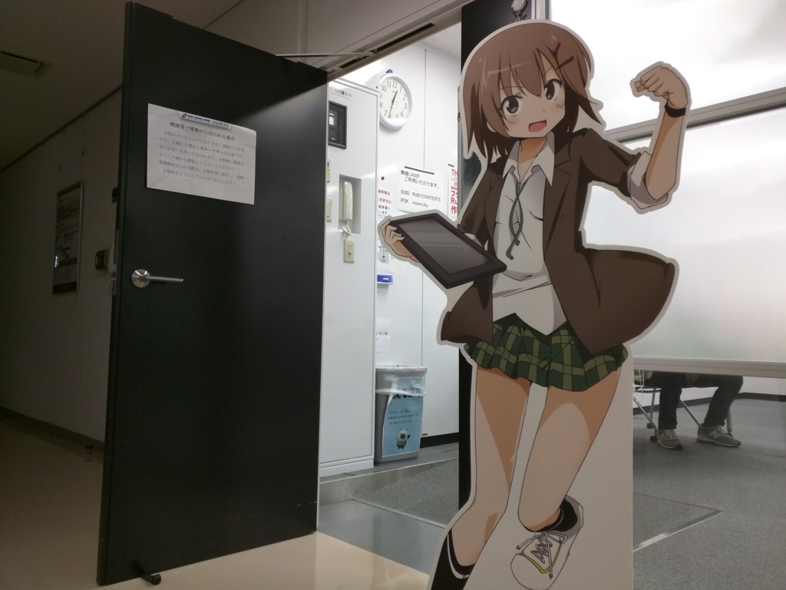
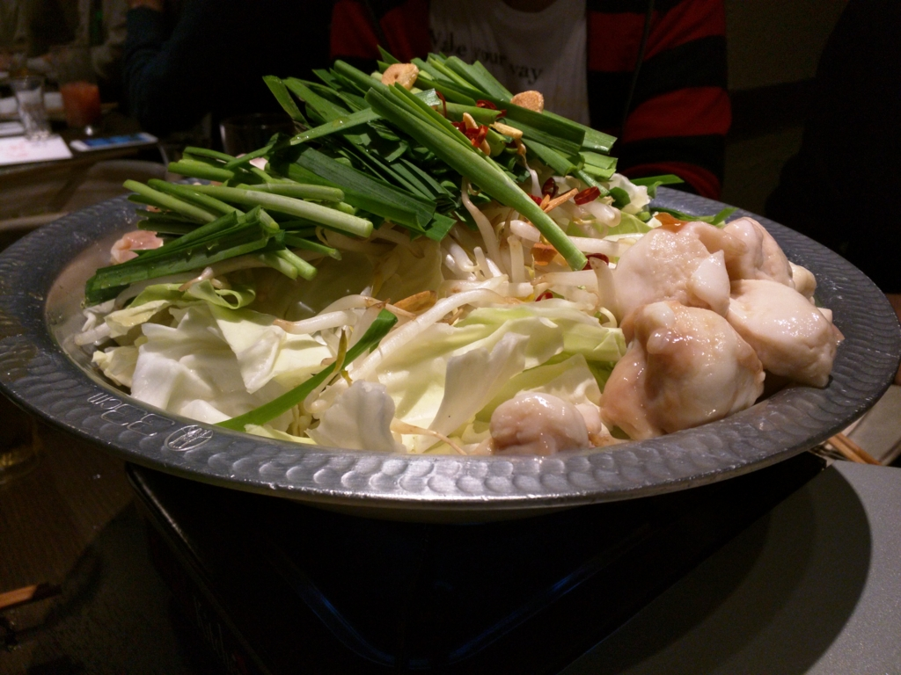
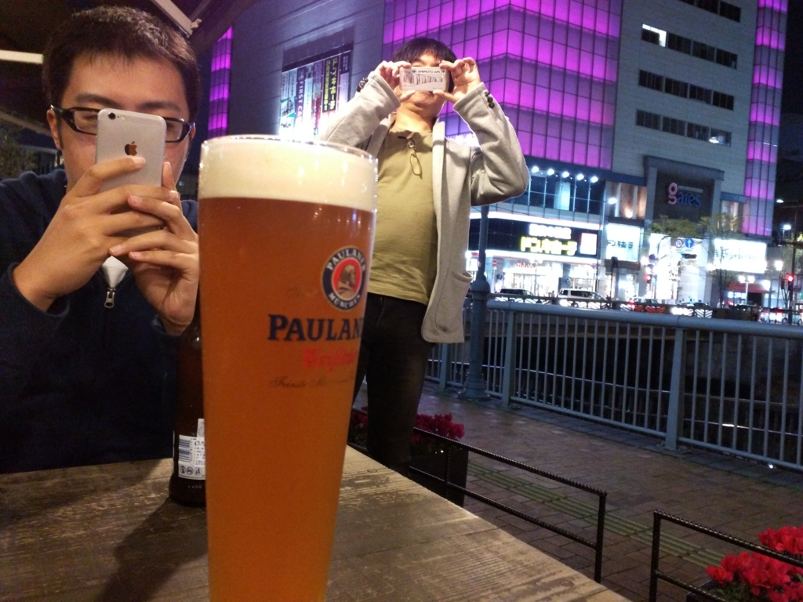

やっとのことで福岡・博多に到着。

<iframe src="https://hatenablog-parts.com/embed?url=https%3A%2F%2Fblog.daruyanagi.jp%2Fentry%2F2016%2F01%2F26%2F000000" title="福岡その三：（松山 →）臼杵 → 博多 - だるろぐ" class="embed-card embed-blogcard" scrolling="no" frameborder="0" style="display: block; width: 100%; height: 190px; max-width: 500px; margin: 10px 0px;"></iframe>

フェリーでもソニックでも寝られなかったので、めっちゃ眠い。もう若くないのだ、というのを痛いほど感じる。大分周りのルートは楽しかったが、次からは絶対飛行機にしようと誓った。

お昼からは、プログラミング生放送勉強会 第37回＠福岡に参加。

<iframe src="https://hatenablog-parts.com/embed?url=https%3A%2F%2Fatnd.org%2Fevents%2F72151" title="プログラミング生放送勉強会 第37回＠福岡 : ATND" class="embed-card embed-webcard" scrolling="no" frameborder="0" style="display: block; width: 100%; height: 155px; max-width: 500px; margin: 10px 0px;"></iframe>

もう2か月前のことになるので、内容は他のブログにお任せしたい（ぁ。ほんと、これだからブログネタをためるのはダメだ。

<ul>
<li><a href="http://blog.hamamotsu.jp/entry/pronama20151121">&#x30D7;&#x30ED;&#x30B0;&#x30E9;&#x30DF;&#x30F3;&#x30B0;&#x751F;&#x653E;&#x9001;&#x52C9;&#x5F37;&#x4F1A; &#x7B2C;37&#x56DE;&#xFF20;&#x798F;&#x5CA1; &#x3092;&#x958B;&#x50AC;&#xFF06;&#x53C2;&#x52A0;&#x3057;&#x307E;&#x3057;&#x305F; - &#x3068;&#x3042;&#x308B;&#x6280;&#x8853;&#x306E;&#x958B;&#x767A;&#x65E5;&#x8A18;</a></li>
<li><a href="http://tsubalog.hatenablog.com/entry/20151121pronama">&#x30D7;&#x30ED;&#x30B0;&#x30E9;&#x30DF;&#x30F3;&#x30B0;&#x751F;&#x653E;&#x9001;&#x52C9;&#x5F37;&#x4F1A; &#x7B2C;37&#x56DE;&#xFF20;&#x798F;&#x5CA1; &#x306B;&#x53C2;&#x52A0;&#xFF06;&#x767B;&#x58C7;&#x3057;&#x307E;&#x3057;&#x305F; - &#x3064;&#x3070;&#x308D;&#x3050;</a></li>
<li><a href="http://zuvuyalink.net/nrjlog/archives/2383">&#x30D7;&#x30ED;&#x751F; &#x7B2C;37&#x56DE;&#xFF20;&#x798F;&#x5CA1;&#x3067;&#x767B;&#x58C7;&#x3055;&#x305B;&#x3066;&#x3044;&#x305F;&#x3060;&#x304D;&#x307E;&#x3057;&#x305F;&#x3002; | nrjlog</a></li>
<li><a href="http://blog.cvc-lab.com/archives/841">[&#x52C9;&#x5F37;&#x4F1A;] &#x30D7;&#x30ED;&#x751F;&#x306B;&#x521D;&#x53C2;&#x52A0;&#x3057;&#x307E;&#x3057;&#x305F; &ndash; &#x9031;&#x520A;&#x30EA;&#x30E2;&#x30E9;&#x30A4;</a></li>
<li><a href="http://www.slideshare.net/9appat3ch/uwp-55361414">&#x3010;&#x30D7;&#x30ED;&#x751F;&#x52C9;&#x5F37;&#x4F1A;&#x798F;&#x5CA1;&#x3011;UWP&#x30A2;&#x30D7;&#x30EA;&#x958B;&#x767A;&#x306E;&#x7F60;&#xFF08;&#xFF1F;&#xFF09;</a></li>
<li><a href="http://www.slideshare.net/noriji822/webmicrosoft-azure">Web&#x30C7;&#x30B6;&#x30A4;&#x30CA;&#x30FC;&#x8996;&#x70B9;&#x3067;&#x4F7F;&#x3063;&#x3066;&#x307F;&#x305F; Microsoft Azure&#x306E;&#x8A71;</a></li>
<li><a href="http://togetter.com/li/904271">&#x30D7;&#x30ED;&#x30B0;&#x30E9;&#x30DF;&#x30F3;&#x30B0;&#x751F;&#x653E;&#x9001;&#x52C9;&#x5F37;&#x4F1A; &#x7B2C;37&#x56DE;&#xFF20;&#x798F;&#x5CA1; - Togetter</a></li>
</ul>
自分はライトニングトークを一本やったのだけど、<b><i>Surface 3 の音量を切っても HDMI からは艦これの BGM が流れる</i></b>という貴重な学びを得て帰ることになりました。若い子たちがスマートにライトニングトークをこなしているのに、このザマ。久しぶりに生まれて着て申し訳ない気持ちでいっぱいになった。

懇親会はもつ鍋。失敗のことはすっかり忘れて、肌がツヤツヤになれた。

二次会はなんかいい感じのところでビール飲んだ。@kis さんを捕まえていろいろディープな話を聞けたのは楽しかった。思い切って「セッション聞いてもさっぱりなんですけど！」とぶつけたら、「大丈夫、わかるように話してない！」って言ってもらえて、とても安心した（ぁ。なお、あれこれ聞きまくったにもかかわらず、機械学習については理解が深まらなかった模様。大変申し訳ない。

あと、@airish9 さんには本当に感謝したい。また呉か、福岡か、松山か、どこかで遊びましょう。

次回はカキ食べまくった話( *´艸｀)

