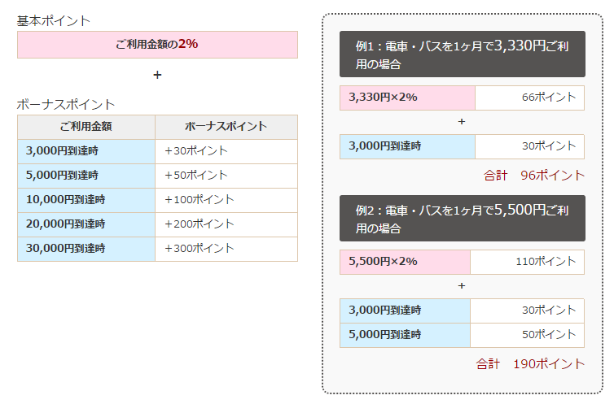
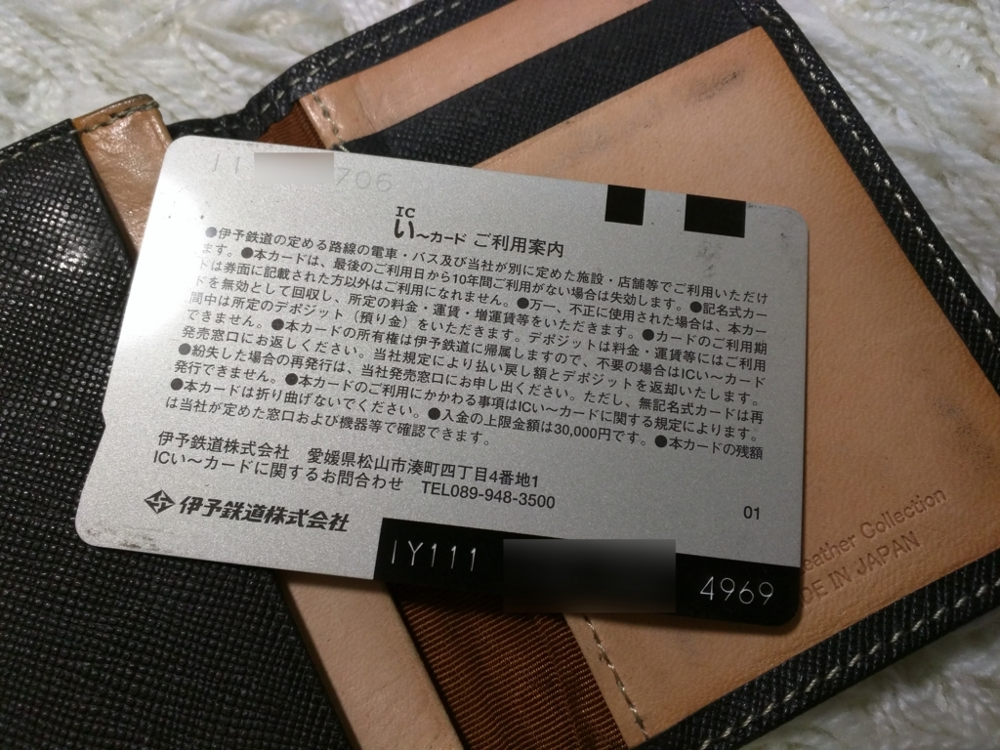

 

<blockquote cite="http://www.iyotetsu.co.jp/topics/16/e-card-new.html">

い〜カードポイント開始に伴い、運賃約10%割引・エコシステム（環境定期券）・オート1DAYチケットサービスは、平成28年3月31日(木)をもって終了します。

<cite><a href="http://www.iyotetsu.co.jp/topics/16/e-card-new.html">4&#x6708;&#x304B;&#x3089;&#x4F0A;&#x4E88;&#x9244;&#x30B0;&#x30EB;&#x30FC;&#x30D7;&#x306E;&#x30AB;&#x30FC;&#x30C9;&#x304C;&#x5909;&#x308F;&#x308A;&#x307E;&#x3059;&#xFF01; | &#x4F0A;&#x4E88;&#x9244;&#x9053;</a></cite>
</blockquote>

代わりにポイント制度が始まるんだそうな。

シンプルな1割引きに慣れてしまった身にとってはちょっとわかりにくいポイント制度だけど、要するに <i>2％の基本ポイント＋目標クリアで加算されるボーナスポイント</i> から成るようだ。「電車・バスを1ヶ月で5,500円ご利用の場合」で190ポイントとのことなので、割引率（還元率）は 3.4％ となる。30,000円までは使えば使うほど還元率が上がるが、実質的には大幅なサービスダウンだなぁ。

あと抑えておくべき要点は、

<ul>
<li>窓口で ICい～カード へのチャージ または いよてつカードギフト券 と交換できる</li>
<li>引き換え単位は 500 ポイントごと</li>
<li>ICい～カードポイント の有効期限は2年間</li>
<li>現在のカードはそのまま使い続けられる</li>
<li>ポイントはカード刻印番号（カード裏の IY から始まる番号）の入力で照会できる（5月に Web サービスができるみたい）</li>
</ul>
こんな感じかな。要するに、面倒かつ割引率が低くなる。

まぁ、経営面でしんどいところがあるのだろうし、仕方がないとは思うけど、<i>オート1DAYチケットサービスがなくなったのはだいぶ悲しい</i>。今までは市内電車へ1日に何度か乗ると、勝手に1日乗車券（500円）へ切り替わり、それ以上お金がかからなくなるので便利だったのだけど、これからはいちいち事前に 1Day チケット買わないといけなくなる。まぁ、面倒だから買わずに、そのままタッチ改札で毎回お金払って乗る気がするけど、そういうところからお金を集めたいんだろうなぁ。

<h3>追記</h3>

<blockquote cite="http://www3.nhk.or.jp/matsuyama-news/20160125/5061031.html">

<ul>
<li>ことし小学１年生になる県内およそ１万２，０００人の児童を対象に、４月から１年間、伊予鉄道のバスや電車を土曜、日曜と祝日だけ、無料で利用できるカードを配ります。</li>
<li>また、ことし４月から、伊予鉄道専用のＩＣカード乗車券で、残額が一定額を下回ると自動的に金額がチャージされる機能をスタートさせます。</li>
<li>さらに、松山観光港と高浜駅の間のバスの運賃を現在の１６０円から１００円に値下げし、松山観光港にバスと郊外電車の乗車券を通しで購入できる自動券売機を設置して、瀬戸内側から訪れる観光客の利便性を向上させます。</li>
<li>このほか、ことし８月ごろをメドに、現在は午後１０時半ごろとなっている郊外電車や路面電車の終電の時刻を金曜日だけおよそ３０分延長し、始発駅の発車時刻を午後１１時ごろとするとしています。</li>
</ul>
<cite><a href="http://www3.nhk.or.jp/matsuyama-news/20160125/5061031.html">&#x4F0A;&#x4E88;&#x9244;&#x304C;&#x5229;&#x7528;&#x5BA2;&#x5897;&#x52A0;&#x7B56;&#x3092;&#x767A;&#x8868; - NHK &#x56DB;&#x56FD; NEWS WEB</a></cite>
</blockquote>

こっちも取り上げないと片手落ちだった。

