
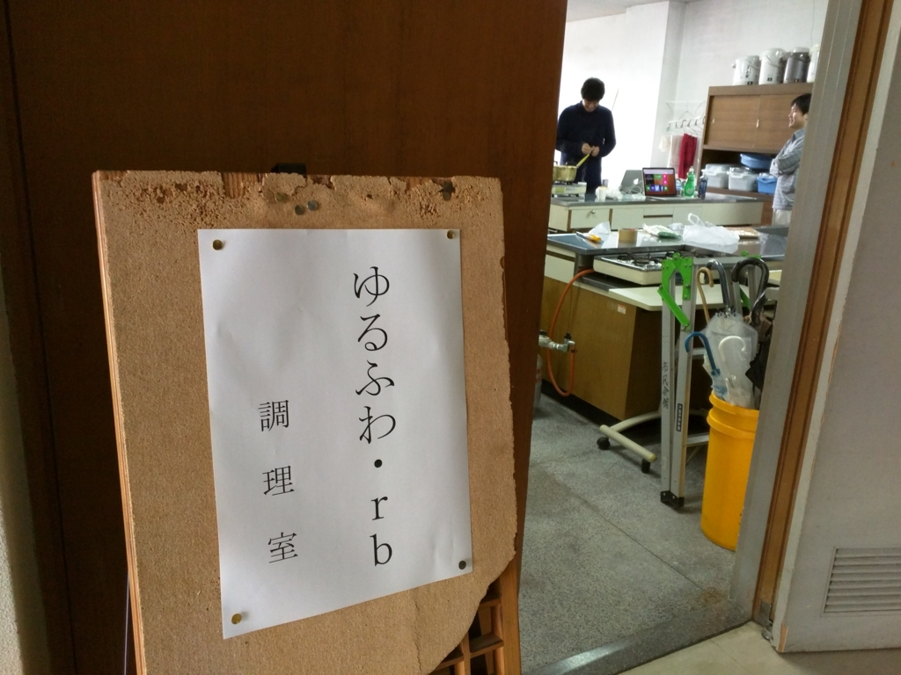

週末は「ゆるふわ.rb　in 大洲　〜作ってみよう Slack bot〜」に参加してきました。

<iframe src="//hatenablog-parts.com/embed?url=https%3A%2F%2Fyurufuwa.doorkeeper.jp%2Fevents%2F37504" title="ゆるふわ.rb　in 大洲　〜作ってみよう Slack bot〜" class="embed-card embed-webcard" scrolling="no" frameborder="0" style="display: block; width: 100%; height: 155px; max-width: 500px; margin: 10px 0px;"></iframe>

「ゆるふわ.rb」はプログラミング言語 Ruby の勉強会を装ったタダの飲み会です。愛媛県大洲市の公民館みたいなところ（大洲城の下にあります）の調理場で不定期開催されています。

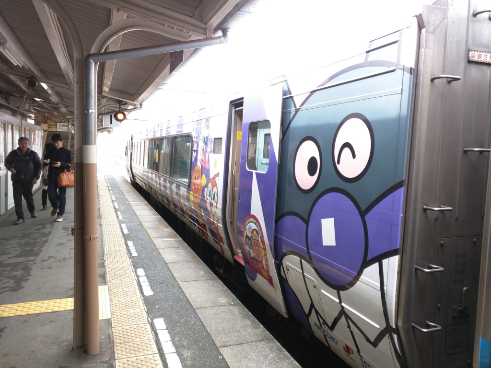

土曜日の朝、11:00ごろ（僕の感覚ではまだ朝です）。JR 松山駅すぐそばの「時計台」という喫茶店で朝ご飯をしたあと、@nakaji と二人でアンパンマン列車に乗るという羞恥プレイに耐えながら、内子線経由で伊予大洲駅を目指します。

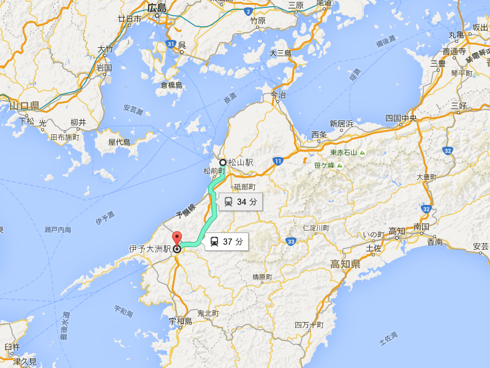

特急・宇和海に揺られること30分。伊予大洲駅に到着。大洲城を中心に発展した人口4.4万人ほどの城下町で、「伊予の小京都」と呼ばれることもあるとか。僕がくるのは今回でたぶん3回目。

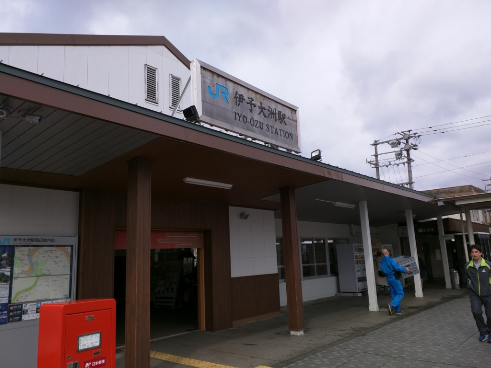

JR 松山駅もそうですが、伊予大洲駅は街の中心部（城や市役所）からはちょっと離れたところにあります。歩くのがちょっとめんどい。

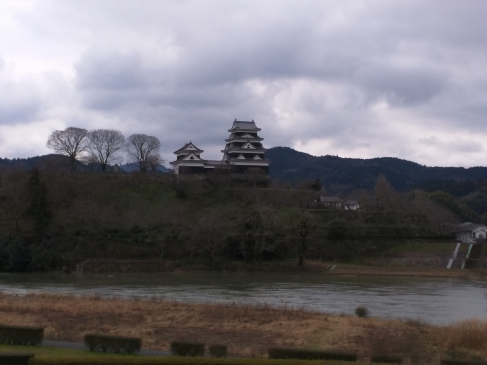

雨が心配だったのですが、どうやら大丈夫みたい。肱川沿いを歩いていると、大洲城がよく見えました。晴れていたらきれいだったんでしょうけどね！

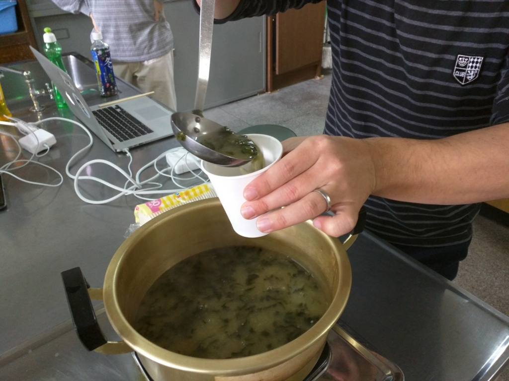

13:00 前に参加者が全員集合。「ゆるふわ.rb」ではおなじみのウェルカムドリンクがふるまわれます。今回は麦味噌だったかな？　アオサのお味噌汁です。いつも飲んでるお味噌汁よりも、ちょっと口当たりがやわらかい感じ？　美味しかったです。

ここでとりあえず、おぎのさんによる Slack BOT の作り方の実演。Slack というのは、簡単に言うと BOT を飼うためのチャットルームを提供するサービスです（？）。Ruby Gems と WebHook API で割とサクッと作れるみたい。自分も今度 <i>/homo</i> って入力したら <i>( ‘д‘⊂彡☆))Д´) ﾊﾟｰﾝ</i> って返ってくるコマンドでも作ってみたいです。

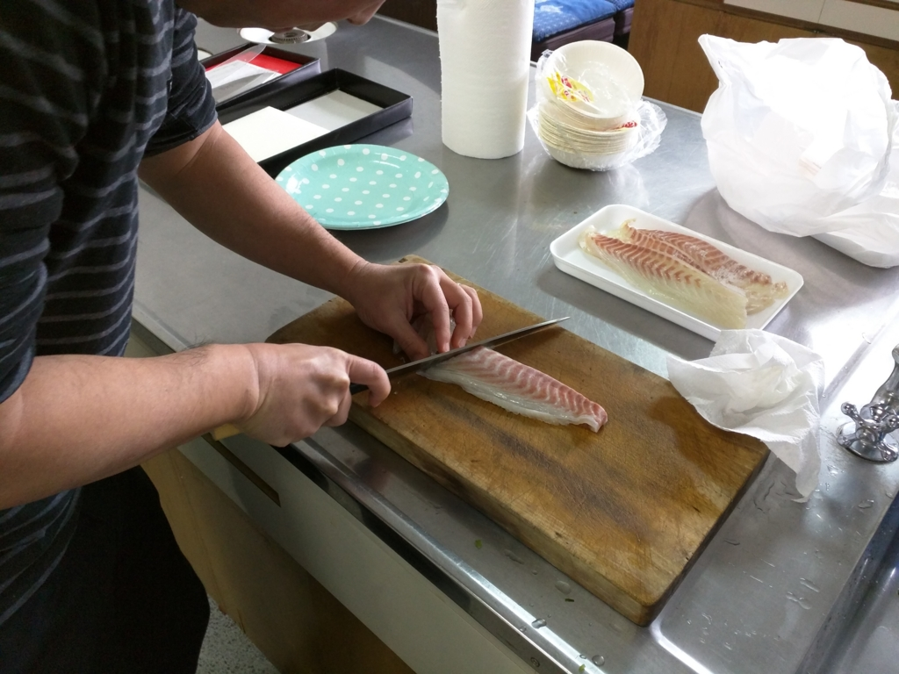

さて、真面目な話はここまで（お勉強は20分ぐらいで終わり！）。あとは各自持ち寄ったお酒とおつまみ、そしてメインの鯛と太刀魚でお刺身＆しゃぶしゃぶをやりました。

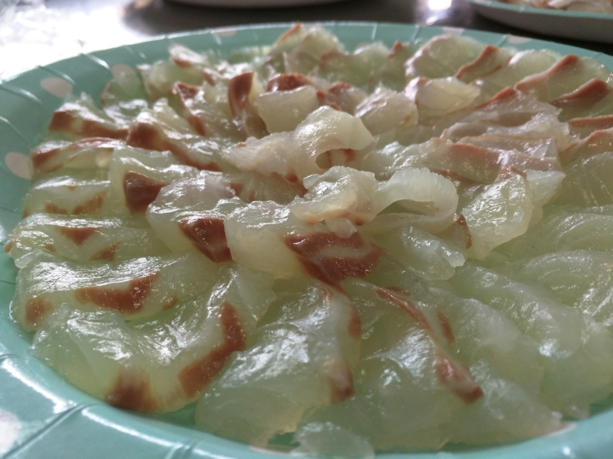

鯛はもちろん、久しぶりの太刀魚、めっちゃ美味しかったデス。

あと、川之江で売ってると言ってたかなぁ？　お刺身用に出してもらったお醤油が割とおいしい……自分もほしいかも。今度あっち方面に行ったら仕入れてきたいですね。

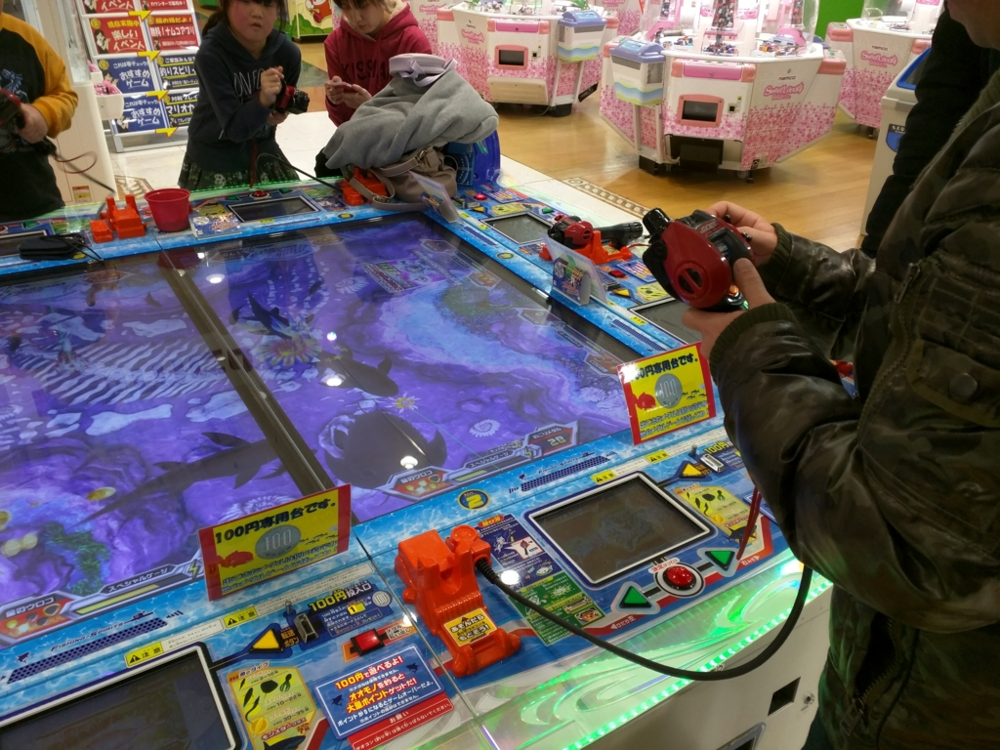

調理室を撤収した後は、居酒屋さんの開店までしばしお遊戯。魚釣りゲームでちびっ子たちに惨敗したり――（あいつらめちゃくちゃうめえんだ！！）

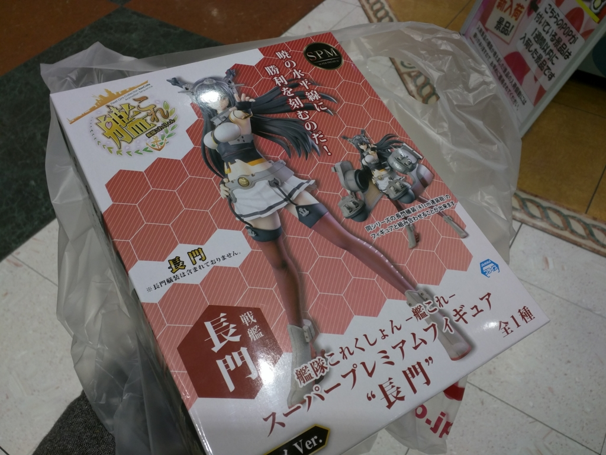

クレーンゲームで艦これの戦艦・長門のフィギュアをゲットしたりしました(n*´ω`*n)

大洲駅のそばの居酒屋さんで二次会をして、解散（お疲れ様でした！

松山・新居浜組は特急・宇和海で大洲駅を後にしました。あんまりいいとは言えない宇和海でしたが、みんないい感じに酔っぱらっていたみたいで、爆睡していました。

<blockquote class="twitter-tweet" lang="ja">
I&#39;m at 男組 釣天狗 in 松山市, 愛媛県 <a href="https://t.co/NA7PZuGvv7">https://t.co/NA7PZuGvv7</a> <a href="https://t.co/LwBo7wxlSf">pic.twitter.com/LwBo7wxlSf</a>
&mdash; だるやなぎ（アクシズ教信者） (@daruyanagi) <a href="https://twitter.com/daruyanagi/status/693417213299154945">2016, 1月 30</a></blockquote>

もちろん、3次会も。なかなかおいしい＆雰囲気が面白い店でした。久しぶりに @nakaji さんと @ramusara さんとで飲めてよかったデス。

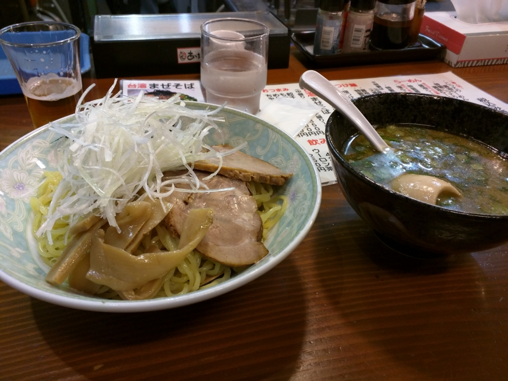

そのあとは、JR 松山駅から松山市駅～大街道まで歩き、しっかり〆のラーメンまで（4次会！）。この辺りで日を跨ぎ、日曜日に突入していた記憶がある。あんまり覚えてないけど。

ただ、せっかく歩いたのに、目当てのラーメン屋は終わってたみたい（残念！）。適当なところに入ったのですが、つけ麺はだしが薄めでイマイチだったかも。ふつうのラーメンにすればよかった。

おわり。

<ul>
<li><a href="http://d.hatena.ne.jp/ogin_s57/20160201/1454290509">&#x3086;&#x308B;&#x3075;&#x308F;.rb in &#x5927;&#x6D32; &#x301C;&#x4F5C;&#x3063;&#x3066;&#x307F;&#x3088;&#x3046; Slack bot&#x301C; &#x3092;&#x958B;&#x50AC;&#x3057;&#x307E;&#x3057;&#x305F; - IT&#x30A8;&#x30F3;&#x30B8;&#x30CB;&#x30A2;&#x3068;&#x3057;&#x3066;&#x751F;&#x304D;&#x308B;</a></li>
<li><a href="http://nakaji.hatenablog.com/entry/2016/01/31/110000">&#x300C;&#x3086;&#x308B;&#x3075;&#x308F;.rb in &#x5927;&#x6D32; &#x301C;&#x4F5C;&#x3063;&#x3066;&#x307F;&#x3088;&#x3046; Slack bot&#x301C;&#x300D;&#x306B;&#x53C2;&#x52A0;&#x3057;&#x3066;&#x304D;&#x305F; - &#x306A;&#x304B;&#x65E5;&#x8A18;</a></li>
</ul>