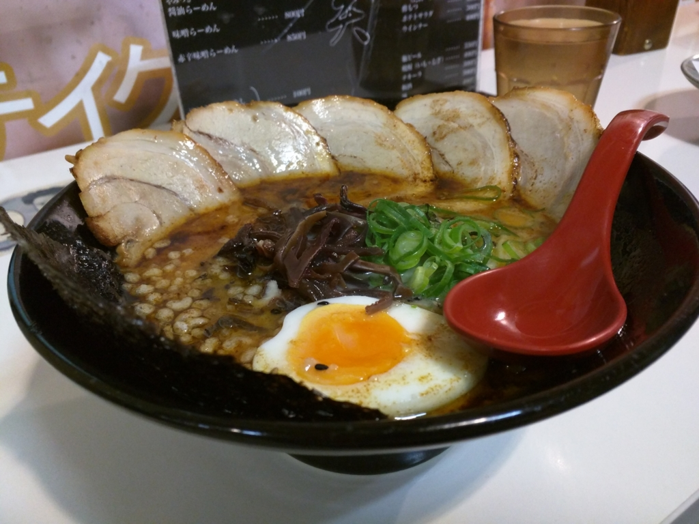
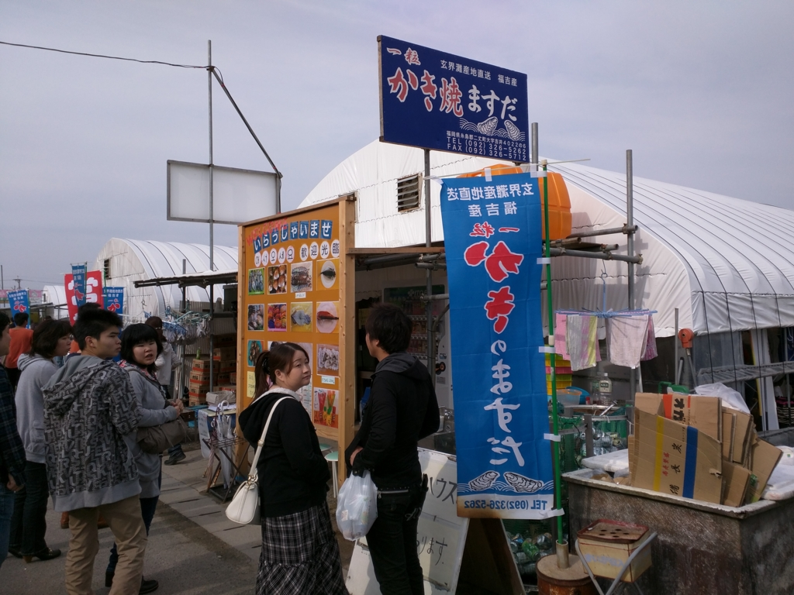
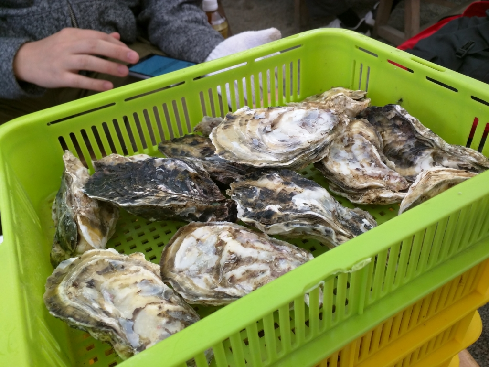
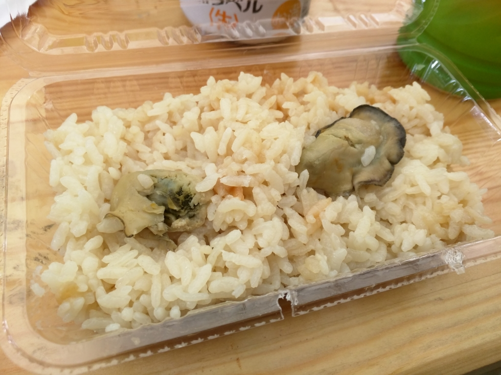
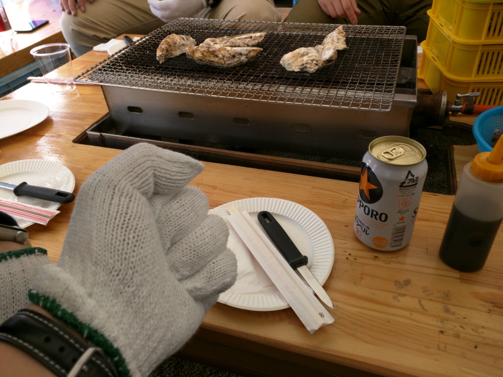
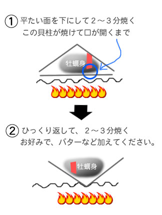
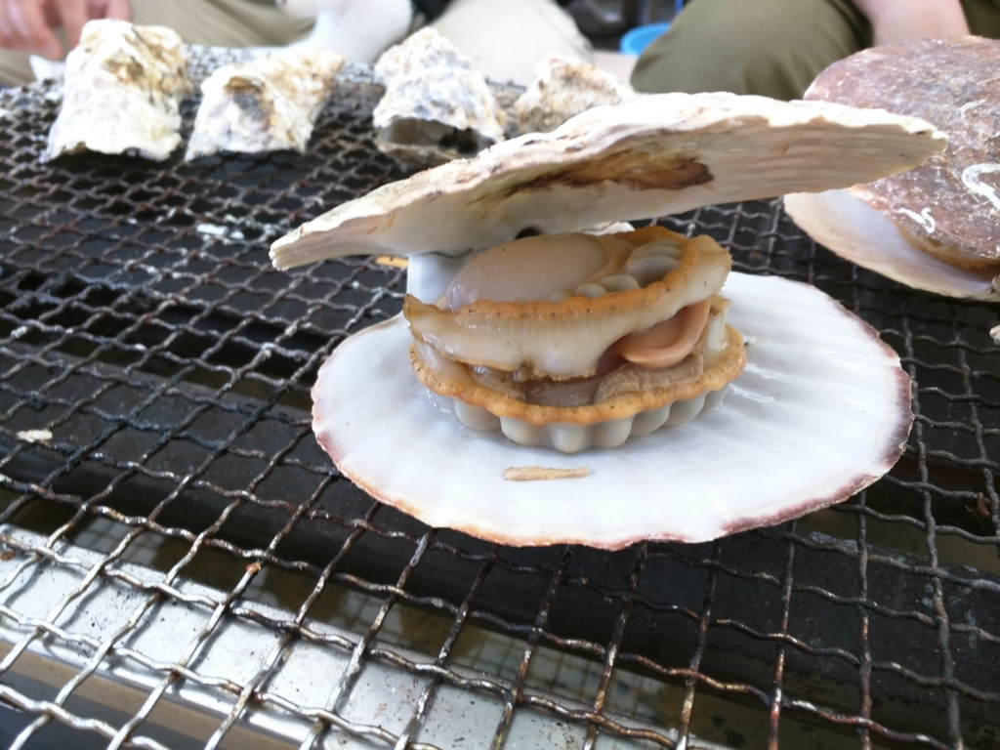
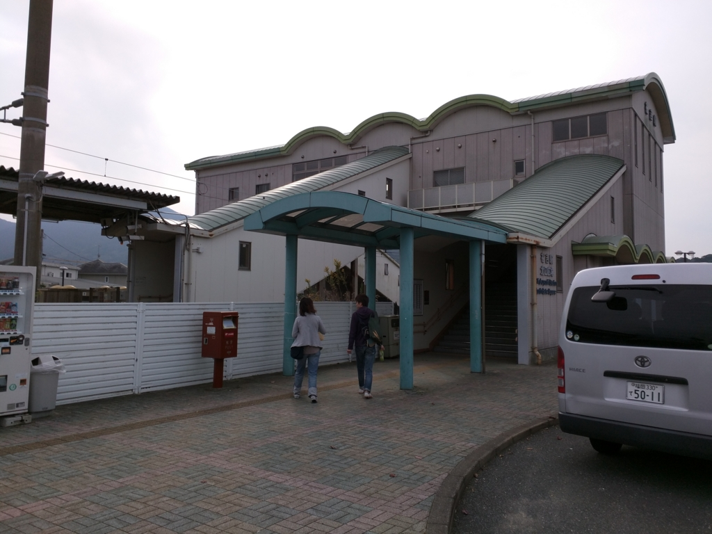

「プログラミング生放送勉強会 第37回＠福岡」で三次会のラーメンまで堪能した翌日。

<iframe src="https://hatenablog-parts.com/embed?url=https%3A%2F%2Fblog.daruyanagi.jp%2Fentry%2F2016%2F01%2F27%2F130946" title="福岡その四：プログラミング生放送勉強会 第37回＠福岡に参加してきた - だるろぐ" class="embed-card embed-blogcard" scrolling="no" frameborder="0" style="display: block; width: 100%; height: 190px; max-width: 500px; margin: 10px 0px;"></iframe>

地元組の方々がカキを食べに連れてってくれた＼(＾o＾)／

<blockquote class="twitter-tweet" data-lang="ja">
I&#39;m at かきのますだ in 糸島市, 福岡県 w/ <a href="https://twitter.com/shibayan?ref_src=twsrc%5Etfw">@shibayan</a> <a href="https://t.co/75JyANwgrH">https://t.co/75JyANwgrH</a> <a href="https://t.co/w8h7yXZEnD">pic.twitter.com/w8h7yXZEnD</a>
&mdash; だるやなぎ に天使が舞い降りた！ (@daruyanagi) <a href="https://twitter.com/daruyanagi/status/668265678642782208?ref_src=twsrc%5Etfw">2015年11月22日</a></blockquote>

糸島というところまでクルマで移動。途中、少し混んでたけど問題なし。昨日食べ過ぎたせいでちょっとおなかを下し気味で、糸島へ着くなりコンビニのトイレのお世話になった。そこでお酒なんかも調達。

最初はシステムをよく理解していなかったのだけど、漁港のそばのハウスで場所を借りてカキを焼くみたい。持ち込みなんかもオッケーなのな。

まずは牡蠣をカゴで買う。見た目は多いが、食うところは少ないので、どっさり買う。ひとり1カゴは余裕かも。

ついでにホタテとカキめしも。このカキめしには @shibayan がたいそう感激していた。

ようやく焼き台を囲んで戦闘開始。なんか店の人に軍手とヘラ、紙皿だけを渡されたのだが、なにをどうしていいかわからん。牡蠣にはちゃんとした焼き方というものがあるらしい（<a href="http://kakigoya.org/yakikata.html">&#x7261;&#x8823;&#x5C0F;&#x5C4B;&#x3067;&#x306E;&#x7261;&#x8823;&#x306E;&#x713C;&#x304D;&#x65B9;&#x3001;&#x5265;&#x304D;&#x65B9;</a>）が、不案内なので現地民の @airish9 さんと @evian さんにすべてを託した。

つまり、牡蠣の貝殻というのはウツワとフタから成っており、双方は密着している。まずはこのフタがあくまで焼かなければならないのだが、フタを下にして焼けば、中から汁が垂れることでウツワとフタに隙間ができたことが簡単にわかる。また、フタのほうが平たいので、内部全体に火が通りやすいというのもありそうだ。

フタがあいた牡蠣はすぐにでも食べられると思うが（知らんけど）、ひっくり返して“煮る”とさらによいようだ。うっすらと塩の効いた煮汁のなかでおよぐ牡蠣の身はなんとも言えない美味しさ。レモンや醤油をかけてもいいが、まずはそのまま食べてみるといいんじゃないだろうか。

気を付けなければならないのは、牡蠣の個体によっては焼いても口を開けないものがあること。なかの汁がカラカラになってコゲるので、うまく見極めて開けてしまうとよい。あと、<i><b>たまに爆発する。</b></i>ときどき店の中に爆音と悲鳴が上がるが、無事を祈ってひたすら食べ続けた。さながら、砲弾飛び交う塹壕の中で3日ぶりのレーションにありつく兵士のように。

ついでにホタテも焼いたった。まるごと口に突っ込むとボリュームたっぷり。うまうま。

帰りは電車（筑肥線）を見つけたので、これに乗ろうと思い立つ。わざわざ送ってもらったのに、ちょっとわがままで申し訳ないけれど、クルマ組とは別れた。

――次回は太宰府天満宮まで、列車の旅をお届けします。

