
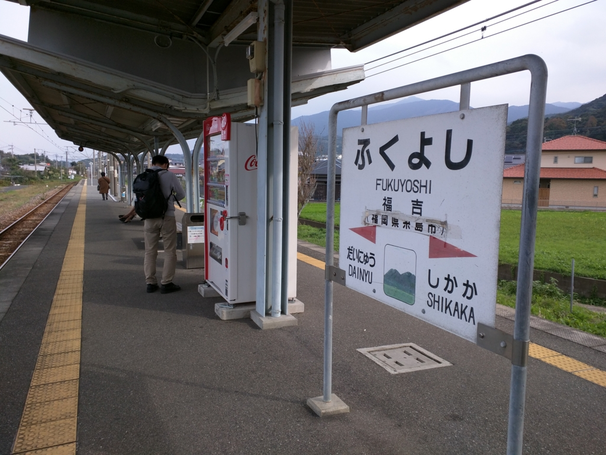

糸島でカキをたらふく食べたあと、@evian さんと @shibayan とはお別れ。

<iframe src="https://hatenablog-parts.com/embed?url=https%3A%2F%2Fblog.daruyanagi.jp%2Fentry%2F2016%2F02%2F04%2F070709" title="福岡その五：カキを食べまくった。 - だるろぐ" class="embed-card embed-blogcard" scrolling="no" frameborder="0" style="display: block; width: 100%; height: 190px; max-width: 500px; margin: 10px 0px;"></iframe>

@airish9 さんと @jz5、そして僕の三人は福吉駅から筑肥線に乗り、太宰府へと向かう。

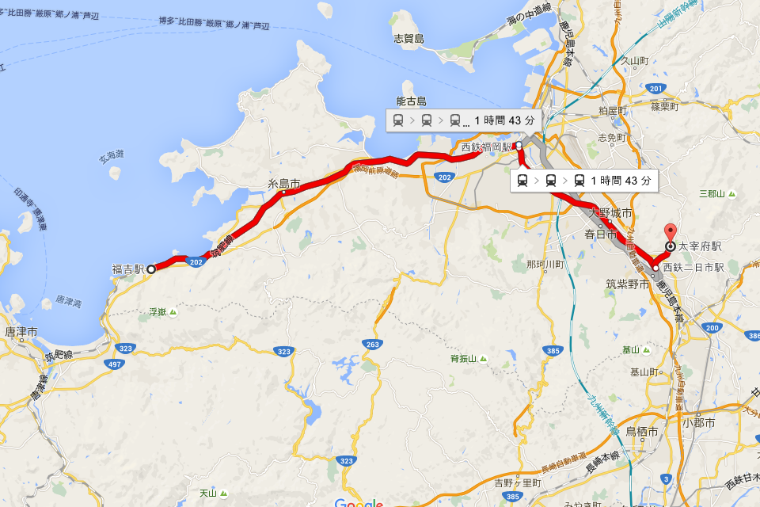

この路線は福岡市地下鉄空港線に乗り入れているようで、街にでるにも、空港へ行くにもよい。都会の喧騒からは身を置きたいが、イザというときは街にササっと繰り出せないとイヤという人は、この沿線に住むのもありじゃないか。

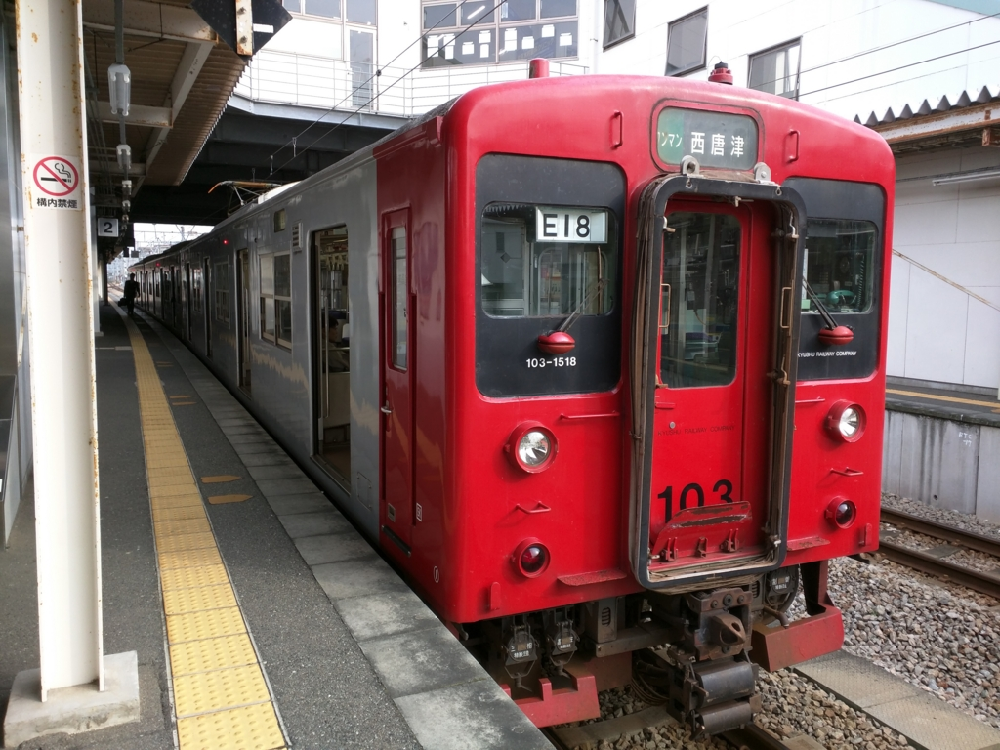

あいにくの曇り空だったが、車窓から海が見渡せるのもいい。もしかしたら昔はモンゴル軍がこの辺りをうろちょろしていたのかもな。知らんけど。

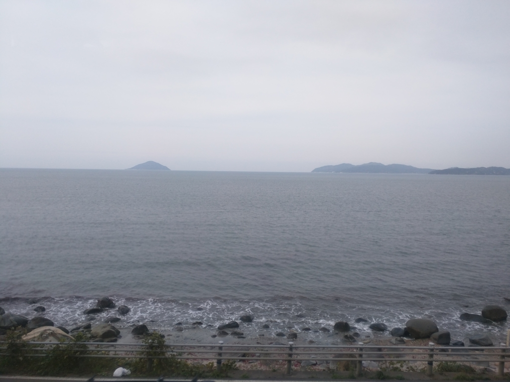

天神駅で降りて、西鉄福岡駅まで歩き、西鉄に乗り換え。カキを食べ過ぎたらしく、ここでしばしトイレを借りる。あと、コインロッカーが開いてなくて、難儀した。

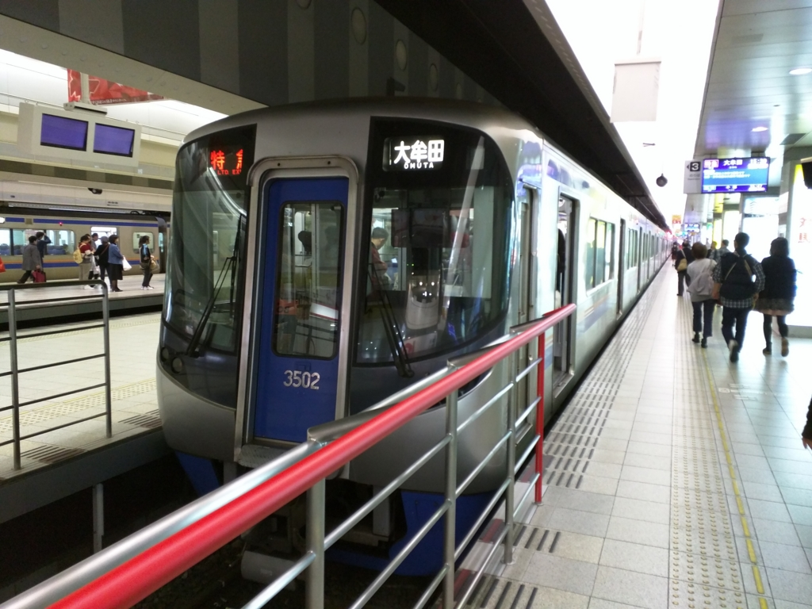

ちなみに、福岡と博多はどう違うのかというと……

<blockquote cite="https://ja.wikipedia.org/wiki/%E7%A6%8F%E5%B2%A1%E5%B8%82">

博多湾に面するこの地域は古来から博多（はかた）として認識されており、大陸方面への玄関口として利用されてきた。中世に商人による自治都市が形成され、戦乱で度々焼き払われながらも、豊かな町人文化を育んだ。豊臣秀吉の手で復興されたのち、黒田氏が福岡城とその城下町を築いたことで、那珂川を境に<b>西が城下町としての「福岡」</b>、<b>東が商人町としての「博多」</b>となった。その後、江戸時代から明治時代初めにかけて、福岡と博多は共存していたが、1876年に福岡と博多は統合され福博（ふくはく）となり、その後、福岡と改称された。

<cite><a href="https://ja.wikipedia.org/wiki/%E7%A6%8F%E5%B2%A1%E5%B8%82">&#x798F;&#x5CA1;&#x5E02; - Wikipedia</a></cite>
</blockquote>

ということなのだそうだ。明治初めの九州は、なにかと物騒でやたら人口の多い<b>鹿児島</b>、その抑えとして重視された政治・軍事の中心・<b>熊本</b>、異国への玄関口で商業の中心地・<b>長崎</b>という三極体制になっていて、博多・福岡の人口はそれほど多くなかった（明治中期になると、長崎が九州最大の都市になる）。

しかし、鉄道で本州といち早く繋がれたこと、九州大学の誘致に成功したこと、今の北九州市に産業集積が行われたこと、朝鮮・大陸への玄関口になったこと（当時は日本領だった）などから、次第に産業・商業都市として地力をつけるようになり、やがて長崎を凌駕。政府の出先機関も熊本ではなく福岡に置かれるようになり、福岡（＋博多）が九州の商業・政治の中心地として栄えていくようになったようだ。

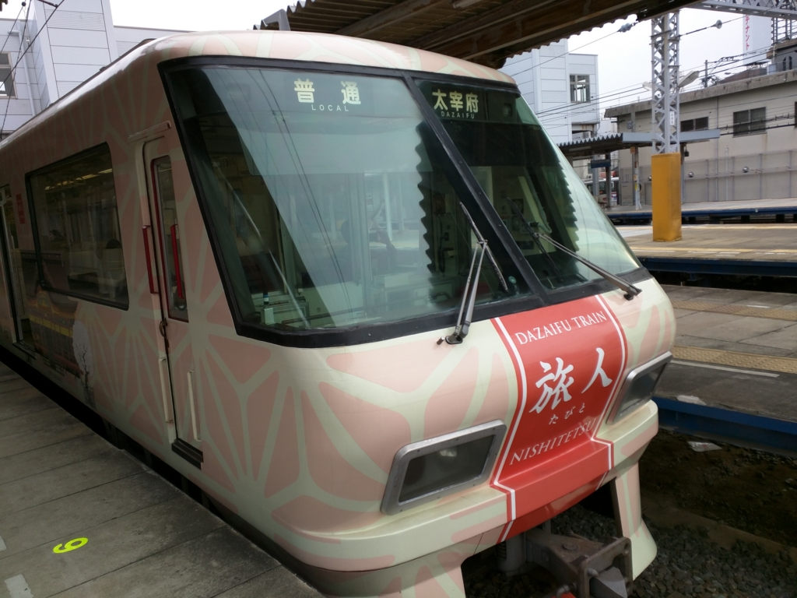

特急で二駅ぐらいだったか。二日市駅で大牟田行きとはお別れして、太宰府に。

特別列車（？）旅人を捕まえることができたので、ちょっと車内を探検したりした。車両ごとに内装のデザインが違っていて、それぞれに開運テーマがあるのが面白い。へんな神棚みたいなのもあった。

<iframe src="https://hatenablog-parts.com/embed?url=http%3A%2F%2Fwww.nishitetsu.jp%2Ftrain%2Ftabito%2F" title="太宰府観光列車「旅人 -たびと-」" class="embed-card embed-webcard" scrolling="no" frameborder="0" style="display: block; width: 100%; height: 155px; max-width: 500px; margin: 10px 0px;"></iframe>

それにしても、この路線。距離はたいしたことないくせに、車両の編成だけは異様に長い。それだけ太宰府へ参拝する人が多いということなのだろう。

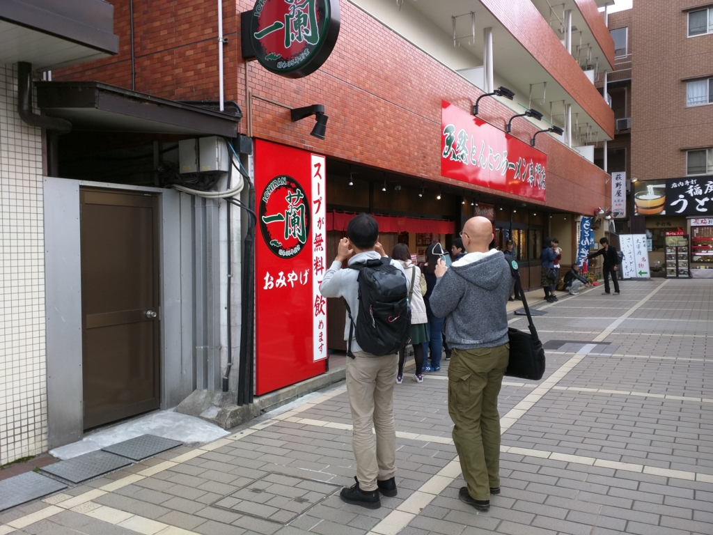

夕方四時ごろ、太宰府駅到着。有名なラーメン店「一蘭」のスープがタダで飲める店があるというので行ってみた。心なしか、@jz5 のテンションが高い。

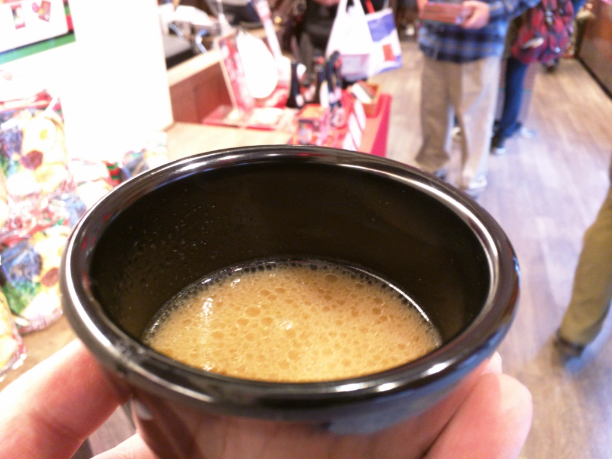

お姉さんによそってもらったスープはほっこり、美味しい。しかし、店もさるもの、タダでスープをふるまってハイ終わりというわけではない。器の返却口がお土産屋さんの中に設けられているので、返すためには店内に入らなければならぬ。実際、誘惑に負けて「一蘭」のグッズやラーメンセットを買っていく客は絶えないようで、なるほど、うまい儲け方だと思った。自分は何とか誘惑に耐え、店を脱出することができた。

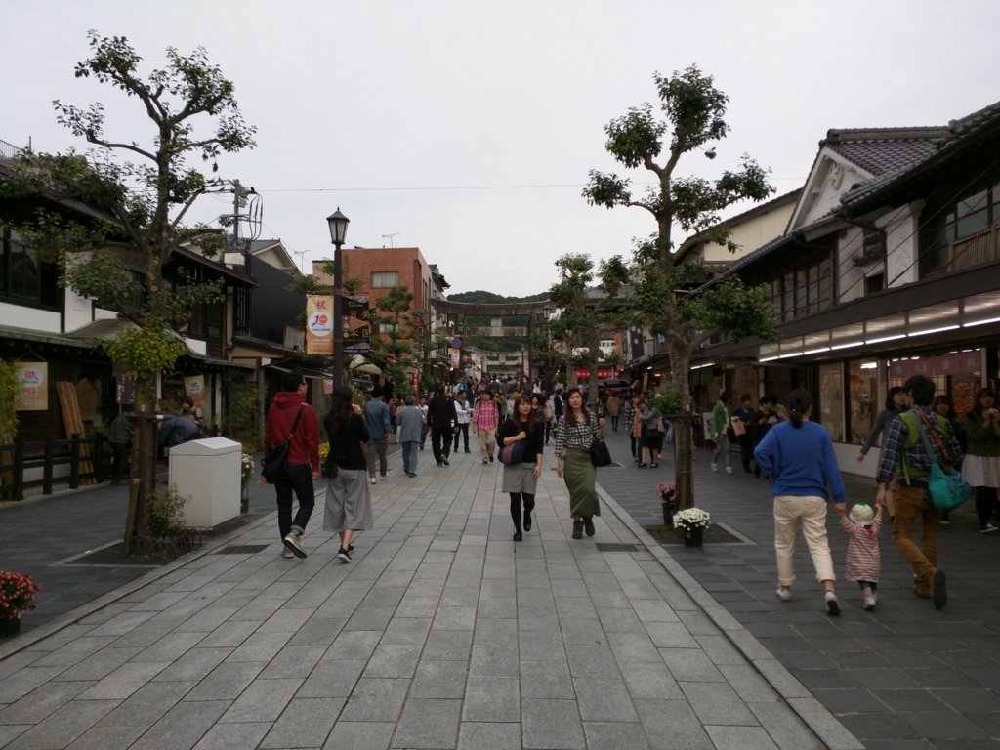

三人で参道を奥に進む。

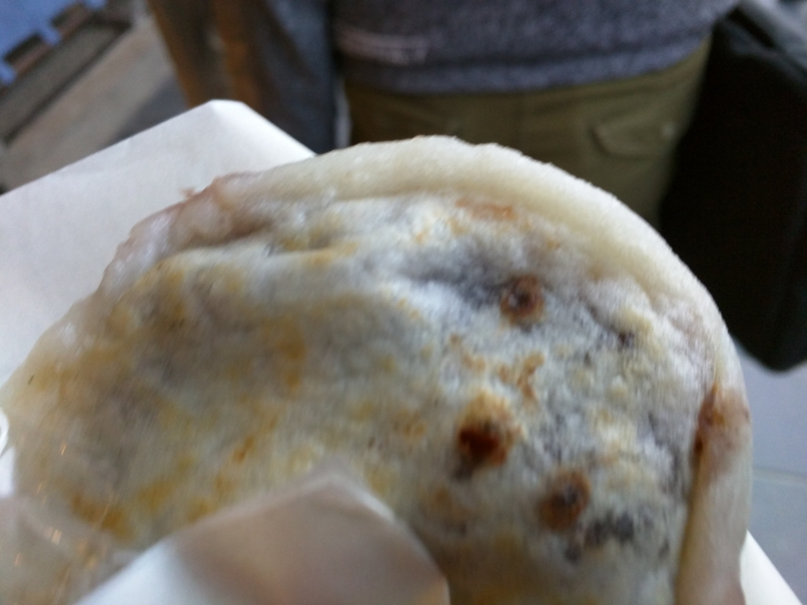

ここのおすすめは“梅ヶ枝餅”というお餅だそうで。かつて、菅原道真がこの地に左遷された折り、軟禁されていた道真に老婆が梅の枝の先にさして、この持ちを差し入れしたのだという。あまい小豆の餡を、パリッと焼いた薄皮餅で包んだもので、別に梅の香りがするわけではないが、割とおいしい。カキでおなかいっぱいでなければ、3個ぐらい食べたかったかも。店によって長蛇の列ができていたり、閑散としていたりでえらい違いがあったのだけど、そんなに違うものなのだろうか。

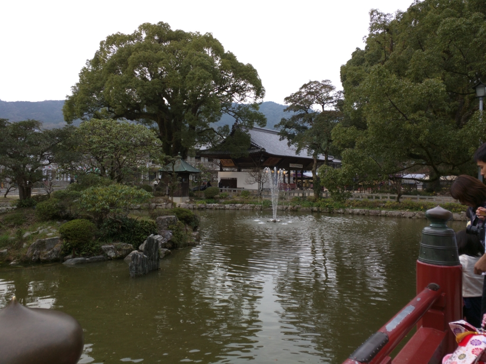

あとはテキトーにぐるぐる歩いて、

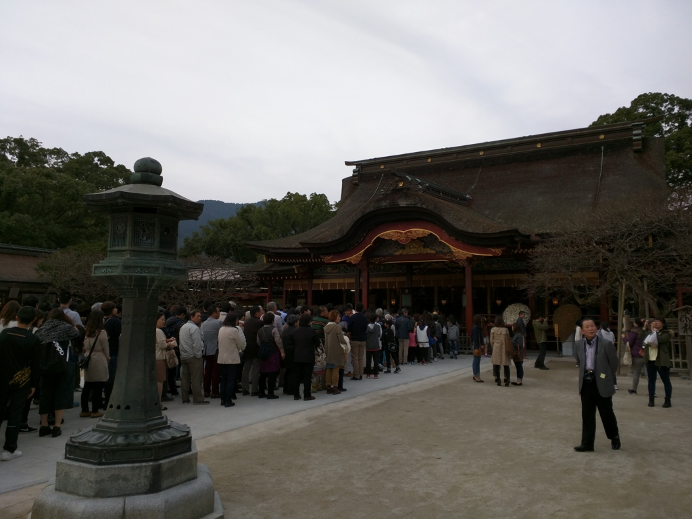

お賽銭あげて帰った。並びながら「なにをお願いしようか」などと話していたのだけど、@airish9 が「お願いをするんじゃない、決意を表明してそれを応援してもらうんだ」みたいな感じのことを言っていて、さすがイケメンは違うな、と思った。

そういえば、『ぎんぎつね』の続きはどうなったんだろう。あのマンガみたいに、牛の神使でもいればもっとたのしかったんだろうけど。

<a href="http://www.amazon.co.jp/exec/obidos/ASIN/B011T9XRKU/bestylesnet-22/">[まとめ買い] ぎんぎつね</a>
<ul><li>作者: 落合さより,落合さより</li><li>メディア: Kindle版</li><li><a href="http://d.hatena.ne.jp/asin/B011T9XRKU/bestylesnet-22" target="_blank">この商品を含むブログを見る</a></li></ul>

