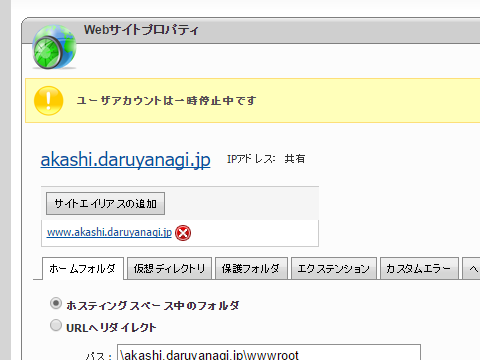

 

<blockquote cite="http://secure.windowshosting.jp/announcements.php?id=66">

平素は弊社ExpressWebレンタルサーバーをご利用いただき、誠にありがとうございます。 
2010年4月より提供してまいりましたExpressWebですが、 
この度、本サービスを終了させていただく事になりましたので、ご案内申し上げます。

サービス終了に伴い、お客様には大変ご迷惑をおかけすることを、深くお詫び申し上げます 
とともに、多くのお客様にサービスをご愛顧いただきましたこと、 
スタッフ一同心から感謝申し上げます。
 

1. 終了対象サービス  
ExpressWeb
 

2. サービス終了日  
各お客様の「現在のご利用期限」を以て終了

<cite><a href="http://secure.windowshosting.jp/announcements.php?id=66">&#x6700;&#x65B0;&#x60C5;&#x5831; - &#x30C7;&#x30FC;&#x30BF;&#x30FB;&#x30B8;&#x30E3;&#x30D1;&#x30F3;&#x682A;&#x5F0F;&#x4F1A;&#x793E;</a></cite>
</blockquote>

WebMatrix で便利にお安く使わせていただいていた ExpressWeb ですが、とうとうウチのアカウントも終了と相成りました。2011年2月から運用していたみたいなので、5年ほどのお付き合いになりましたか。ありがとうございます。ExpressWeb がなかったら、あれだけ WebMatrix で遊ぶことはなかったと思う（そして、WebMatrix はどうしよう問題が発生ｗ）。

なお、これにともない、オレオレサービスの一部が止まっています。

<blockquote class="twitter-tweet" data-lang="ja">
<a href="https://twitter.com/daruyanagi">@daruyanagi</a> す、すいません。明石の工廠サイトってもう閉じてしまわれたのでしょうか？
&mdash; 猫又にゃぉ助＠宿毛湾泊地所属提督 (@nekomata_nya) <a href="https://twitter.com/nekomata_nya/status/700107251177037824">2016, 2月 17</a></blockquote>

最近はイタリア装備の改修に集中していて、自分で作ったサービスを使っておらず、気が付くのが遅れました(;´･ω･) イタリアでダメならローマにすればいいだけなので、わざわざ改修表を見に行くまでもなかった。

<blockquote class="twitter-tweet" data-lang="ja">
<a href="https://twitter.com/nekomata_nya">@nekomata_nya</a> <a href="https://t.co/gXV4CQPHSi">https://t.co/gXV4CQPHSi</a> 一応復旧。 <a href="https://t.co/dkIWeFxmyL">https://t.co/dkIWeFxmyL</a> の DNS もそっちに向けるようにしたから、浸透（笑）したらアクセスできるようになる気がしますー
&mdash; だるやなぎ（アクシズ教信者） (@daruyanagi) <a href="https://twitter.com/daruyanagi/status/700111209702379520">2016, 2月 18</a></blockquote>

しかし、外部ドメインの利用にはお金がかかるっぽくて、<a href="http://akashi.daruyanagi.jp/">http://akashi.daruyanagi.jp/</a> での運用はちょっと考え中。申し訳ないけれど、もし使う方がいらっしゃるのなら、

<ul>
<li><a href="http://akashiarsenal.azurewebsites.net/">&#x660E;&#x77F3;&#x306E;&#x6539;&#x4FEE;&#x5DE5;&#x5EE0;&#x30CE;&#x30FC;&#x30C8; - Home</a></li>
</ul>
を代わりに使ってください。あと、<a href="http://about.daruyanagi.jp/">http://about.daruyanagi.jp/</a> も使えなくなっているが、こっちは誰も困らないと思うので放置。

Microsoft Azure 周りの情勢がひと段落したら、またいろいろ整備すると思うけれど、もうちょっと様子見やね。いろいろ作りたいのはあるんだけど、学習コスト考えると今はちょっとやる気でない感じ。

<h3>追伸</h3>

安くて低額なプランができたらうれしいんだけどなぁ。あまりにも使い過ぎた場合はシャットダウンしてくれてもいいので、その程度のしょうもないやつを動かせて独自ドメインぐらいは使えるプラン。今は最安値で月1,000円ぐらいなのかな？　でもうち、サブドメイン切りまくって使いたいマンだしなー。今度詳しい人に聞いてみるかな。

