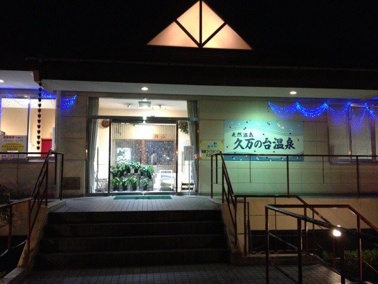
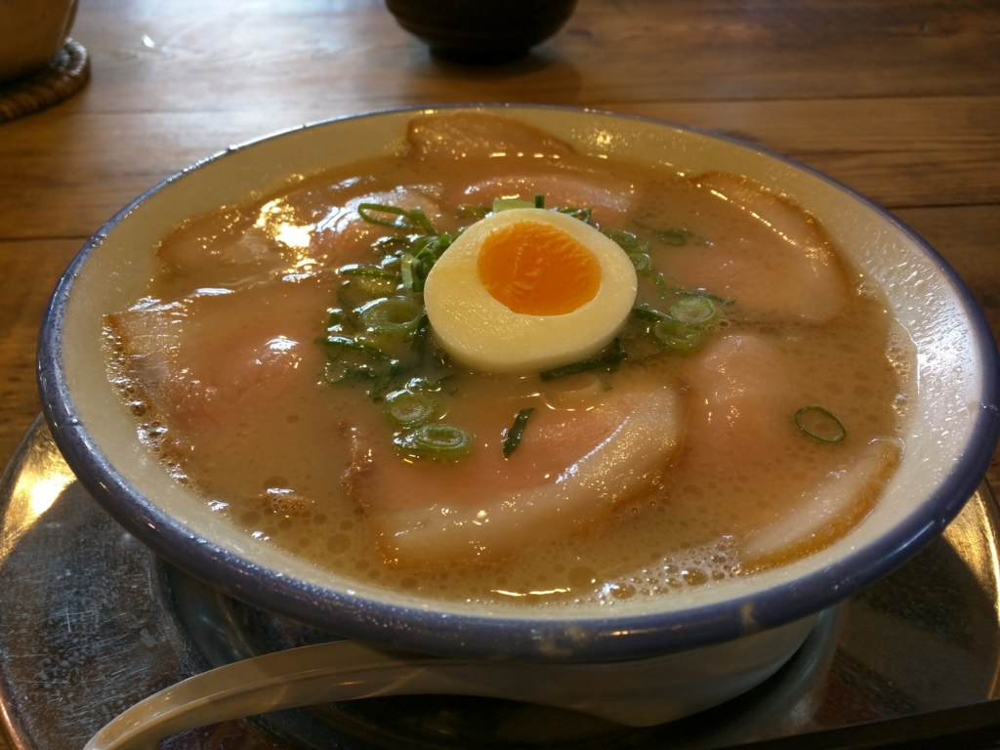

（画像は「<a href="http://minkara.carview.co.jp/userid/660215/blog/31213572/">&#x6E29;&#x6CC9;&#x5165;&#x3063;&#x3066;&#x304D;&#x307E;&#x3057;&#x305F;&#xFF5C;&#x3072;&#x306A;&#x305F;&#x304C;&#x884C;&#x304F;&#xFF5C;&#x30D6;&#x30ED;&#x30B0;&#xFF5C;&#x3072;&#x306A;&#x305F;2009&#xFF5C;&#x307F;&#x3093;&#x30AB;&#x30E9; - &#x8ECA;&#x30FB;&#x81EA;&#x52D5;&#x8ECA;SNS&#xFF08;&#x30D6;&#x30ED;&#x30B0;&#x30FB;&#x30D1;&#x30FC;&#x30C4;&#x30FB;&#x6574;&#x5099;&#x30FB;&#x71C3;&#x8CBB;&#xFF09;</a>」より拝借）

道後温泉もいいのですが、自宅（山越）からは電車に乗る必要があり、ちょっと面倒。なので、日頃は衣山（徒歩15分ぐらい）にある「<b>久万ノ台温泉</b>」を使っています。

<iframe src="//hatenablog-parts.com/embed?url=http%3A%2F%2Fe-hime.jp%2Fonsen%2F" title="天然温泉久万の台温泉　四国愛媛県松山市の健康温泉" class="embed-card embed-webcard" scrolling="no" frameborder="0" style="display: block; width: 100%; height: 155px; max-width: 500px; margin: 10px 0px;"></iframe>

往復ちょうど5,000歩ほどと、散歩にはちょうどいい距離。途中に<b>古本屋</b>と<b>明屋書店</b><a href="#f-3ec63ad3" name="fn-3ec63ad3" title="“はるや”って読むんだぜ！　引っ越した当初はわかんなかった／(^o^)＼">*1</a>があるのもポイントですね。

料金は 470円 だったかな？　小さな露天風呂とサウナがある以外は、銭湯に毛の生えたようなところですが、のんびりするには十分。あったまったあとは、よく露天風呂の腰掛けで寝ています。お昼にぶらっと行くと人が少なくてよいのですが、たまに伊予かすり会館（<a href="http://e-hime.jp/kasuri/">http://e-hime.jp/kasuri/</a>）の観光バスがやってきて、入浴客がやたら増えることもあるので注意ですねぇ。

ちなみに、ここは<b>シャンプーとボディーソープが備え付けられていない</b>ので注意。銭湯なら当たり前だけど、スーパー銭湯の気分で行くとハマるかも。あと、ロッカーのカギは<b>奇数番号がおすすめ</b>。上の段になるので、屈まなくていいぜ(｀･ω･´)b

さて、温泉に入るとおなかが空くものですが、この辺りは割と飲食店が多いですね。夕方なら回転ずしや、パルティ・フジ衣山にある飲食店（インドカレー？　あたりが好み）、ちょっと面白いたこ焼き屋さんなんかがあります。山越方面に足を延ばせば、カレーハウスCoCo壱番屋や中華屋、讃岐うどん家なども。

今回はラーメンを食べてみました。

<iframe src="//hatenablog-parts.com/embed?url=http%3A%2F%2Ftabelog.com%2Fehime%2FA3801%2FA380101%2F38000137%2F" title="久留米とんこつラーメン 松山分校 (衣山/ラーメン)" class="embed-card embed-webcard" scrolling="no" frameborder="0" style="display: block; width: 100%; height: 155px; max-width: 500px; margin: 10px 0px;"></iframe>

あんまりラーメンは食べないヒトなのですが、なんか今日は気が向いたので。

なんか福岡で食べたラーメンと似ている感じ（久留米ラーメンらしいし、そりゃそうか）。餃子は小粒で、ちょっとびっくりだった。でも、大変おいしゅうございました。辛子高菜が大好きなので（定期的に Amazon で購入してるぐらい）、ついついたくさんとって食べちゃいました。あと、バイトの女の子がかわいらしかったデス。店内が古い小学校のイメージ（？）になっているのも面白いと思いマス。

最近ちょっと開拓を怠っていたのですが、また近所でいいご飯屋さんを掘り起こしていきたいですね。

<h3>追伸</h3>

<blockquote class="twitter-tweet" data-lang="ja">
ここ、店の周りがすげえ豚骨臭い。隣のカフェが潰れてるのはそのせいだと思う（違
&mdash; だるやなぎ（アクシズ教信者） (@daruyanagi) <a href="https://twitter.com/daruyanagi/status/700173513311715328">2016, 2月 18</a></blockquote>

無論、冗談ですが(＾ω＾)

<a href="#fn-3ec63ad3" name="f-3ec63ad3" class="footnote-number">*1</a>:“はるや”って読むんだぜ！　引っ越した当初はわかんなかった／(^o^)＼

