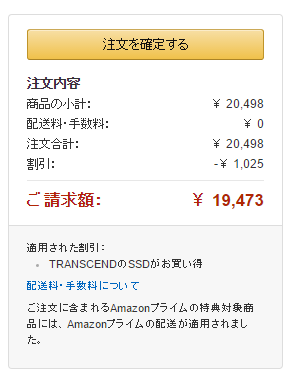

システムドライブの空き容量が心もとなくなっていたところ、512GB の SSD が2万円割れしていたので、思い切ってデスクトップ PC の SSD を換装した。

<iframe src="https://hatenablog-parts.com/embed?url=https%3A%2F%2Fblog.daruyanagi.jp%2Fentry%2F2012%2F05%2F02%2F083431" title="連休4日目。PCを自作した。 - だるろぐ" class="embed-card embed-blogcard" scrolling="no" frameborder="0" style="display: block; width: 100%; height: 190px; max-width: 500px; margin: 10px 0px;"></iframe>

3年9ヵ月ぶりのアップグレードになるみたい。SSD の増強は4年ぶり。

<iframe src="https://hatenablog-parts.com/embed?url=https%3A%2F%2Fblog.daruyanagi.jp%2Fentry%2F2012%2F03%2F24%2F230235" title="SSD 120GB → 240GB - だるろぐ" class="embed-card embed-blogcard" scrolling="no" frameborder="0" style="display: block; width: 100%; height: 190px; max-width: 500px; margin: 10px 0px;"></iframe>

OS の再インストールも2年か、3年ぶりだろうと思う。かつては最低でも1年に1回はやっていた気がするが、最近の OS は頑丈で壊れないし、かつてほどお行儀の悪いアプリも多くないおかげで、環境を再構築しなければならない場面は減った。あと、怪しそうなのは仮想環境で試しているっていうのもちょっとあるかも。

<a href="http://www.amazon.co.jp/exec/obidos/ASIN/B00VX82PA6/bestylesnet-22/">Transcend SSD 512GB 2.5インチ SATA3 6Gb/s MLC採用 TS512GSSD370S</a>
<ul><li>出版社/メーカー: トランセンド・ジャパン</li><li>発売日: 2015/04/30</li><li>メディア: Personal Computers</li><li><a href="http://d.hatena.ne.jp/asin/B00VX82PA6/bestylesnet-22" target="_blank">この商品を含むブログ (2件) を見る</a></li></ul>

SSD はトランセンドの SSD370 TS512GSSD370S をチョイス。Amazon だと2万を少し超えてしまうが――

よくわからない割引のおかげで、2万以内で購入できた。価格.com の最安値 ¥19,418 と遜色ない。

SSD の換装そのものは順調にいった。まぁ、古いのを抜いて、新しいのを挿すだけだしね。

……（＾ｖ＾）ﾏｧ､ｿｳｲｳｺﾄﾓｱﾙ

面倒くさがらず、インストールの際は不要なドライブを切断してからにした方がいいね。GPT うんぬんは、一度パーティションを削除して、再度インストールを試みれば大丈夫だった。

<h3>追記</h3>

困ったことに、Windows 10 をインストールしたら DVI-D から信号が来なくなった。従来は、

<ul>
<li>プライマリモニター：マザーボードの DVI-D ＋ 三菱 RDT233WLM</li>
<li>セカンダリモニター：マザーボードの VGA ＋ SHARP LL-T2015B</li>
</ul>
という構成だったのだが、DVI-D が死んだので、

<ul>
<li>プライマリモニター：マザーボードの HDMI ＋ 三菱 RDT233WLM</li>
<li>セカンダリモニター：マザーボードの VGA ＋ SHARP LL-T2015B</li>
</ul>
という構成で使ってる。まぁ、動くからいいや。

ちなみに SHARP のモニターは2003年製なので、HDMI 端子なんかない。13年も使っているので、そろそろ爆発してもおかしくないが、まぁ、それまでは頑張ってもらおうかと思う。それにしても、ディスプレイより会社の方が先に潰れるとは思ってもみなかった（まだ潰れてないけど）。長生きはするものだ。

