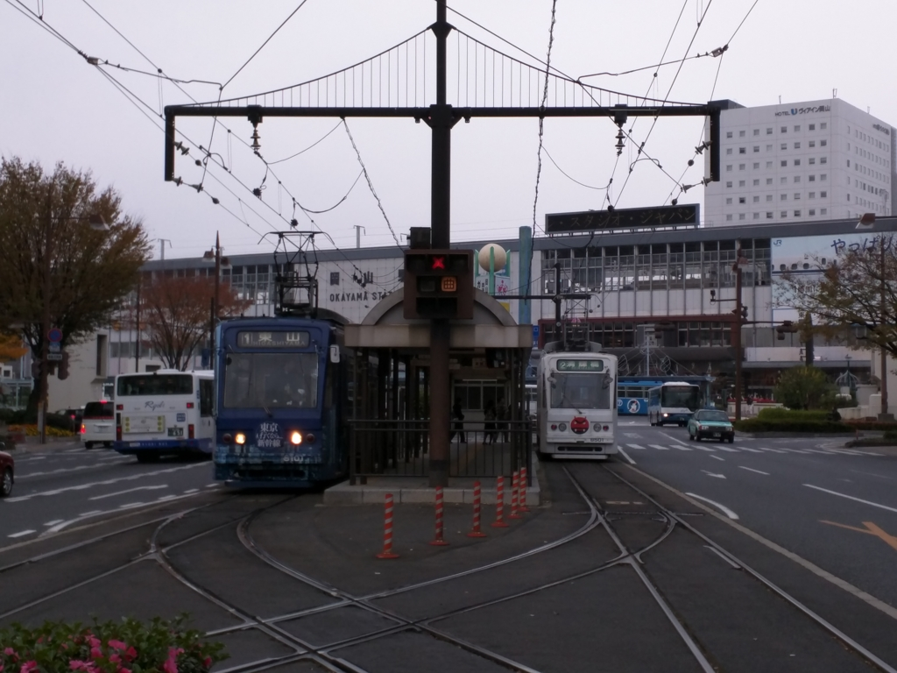

去年の12月初め、@ramusara 君と岡山に行ったのですが……

<iframe src="https://hatenablog-parts.com/embed?url=https%3A%2F%2Fblog.daruyanagi.jp%2Fentry%2F2016%2F01%2F13%2F184454" title="大都会岡山で開催された“忘年会議2015”に参加してきた。 - だるろぐ" class="embed-card embed-blogcard" scrolling="no" frameborder="0" style="display: block; width: 100%; height: 190px; max-width: 500px; margin: 10px 0px;"></iframe>

その帰り、少し足を延ばして姫路城に行ってみました。実は姫路城に行くのは生れてはじめてかも……。

ちなみに、僕らが要った頃、ちょうど入場者数の記録を突破したらしい。場内は一時入場制限がかかるほど込み合っていて、床が落ちないかなーと少し心配になりました。

<blockquote cite="http://www.kobe-np.co.jp/news/shakai/201512/0008634264.shtml">

　世界文化遺産・国宝姫路城（兵庫県姫路市）の２０１５年度の入城者数が９日、２２２万人を突破し、日本の城郭の年間入城者数で過去最多を記録した。これまでの最多は、熊本城（熊本市）が０８年度に記録した２２１万９５１７人だった。

　姫路城は約５年半にわたる「平成の大修理」を３月下旬に終え、かつての輝きを取り戻した。「白鷺（しらさぎ）城」をもじり“白すぎ城”などと話題になり、国内外から観光客が殺到。本年度は、市の想定より約１カ月早く７月に１００万人を達成し、１１月に２００万人を超えた。来年３月末までに２５０万人を見込む。

　市によると、姫路城のこれまでの最多は、「昭和の大修理」直後の１９６４年度の１７４万人。天守が国宝５城（姫路、松本、彦根、犬山、松江）では最も多かったが、熊本城や名古屋城、大阪城などに大きく離されていた。

<cite><a href="http://www.kobe-np.co.jp/news/shakai/201512/0008634264.shtml">http://www.kobe-np.co.jp/news/shakai/201512/0008634264.shtml</a></cite>
</blockquote>

<h3>姫路城のいいところその①：すぐ見える</h3>

JR 姫路駅を降りると、すぐ見える！　これはテンション上がりますな。伊予松山城もこうだったらいいのになー。JR 予讃線がちょっと辺鄙なところを走っているので、車窓から城が見えないのはちょっと残念。ぼくにお金がいっぱいあれば、三津へ寄るのは伊予鉄に任せて、高架でまっすぐ松山駅まで南進し、車窓から城が望めるようにしたい。だって、見えたらきっと行きたくなるでしょう？　見えないものを見に行こうと思うのは、事前の情報収集と行動に移す切っ掛けが要るけれども。

<h3>姫路城のいいところその②：きれいに残っている</h3>

姫路城で「中村大佐顕彰碑」というのを見かけました。中村大佐って誰なんだろうなぁ、と思いかえって調べてみましたが――

<blockquote cite="http://kojodan.jp/castle/1/memo/535.html">

　日本古来の城郭は兵器の発達にともなって、無用のものになり、明治6年（1873年）のはじめ、太政官は全国の城郭125の廃棄を布達し、姫路城など56の城が残されました。しかし、その後各城とも腐朽がはなはだしく、姫路城も取りこわしのため、市内の神戸某氏が23円50銭で落札したほどでした。 
陸軍省第四局長代理中村重遠大佐は、先人の築いた名城はぜひ後世に残さねばならぬと考え、陸軍卿山県有朋を説いて、名古屋城と姫路城は陸軍の費用で修理することになりました。 
中村大佐は、明治17年（1884年）45歳で亡くなりましたが、文武に達した古武士風の人だったといわれています。

<cite><a href="http://kojodan.jp/castle/1/memo/535.html">&#x4E2D;&#x6751;&#x5927;&#x4F50;&#x9855;&#x5F70;&#x7891;&#xFF08;&#x4E2D;&#x6751;&#x91CD;&#x9060;&#x5927;&#x4F50;&#x306E;&#x9855;&#x5F70;&#x7891;&#xFF09; | &#x59EB;&#x8DEF;&#x57CE;&#x306E;&#x30AC;&#x30A4;&#x30C9; | &#x653B;&#x57CE;&#x56E3;</a></cite>
</blockquote>

残念ながら名古屋城は空襲で焼けてしまいましたが、先人の努力のおかげで、こうして今、姫路城を見ることができるのですね。

ちなみに、松山城は明治初期に二の丸と三の丸を火災で失ったほか、廃城令で麓の建物は解体され売り払われました。しかし、本丸は公園として残され、大正12年、旧藩主家の久松家へ払い下げ。そのまま松山市に寄贈され、以降、松山市の所有となっているとのことです。山の上にあったので解体するのが面倒だったのかなぁ。あと、子規の歌などで有名になっていたのも保存の後押しになったかも。

<h3>姫路城のいいところその③：フォトジェニック</h3>

どこから見てもかっこいいんだよなぁ……これにはどこの城もかなわんね。

<h3>姫路城のいいところその④：ごはんもまぁまぁイケる</h3>

ランチには“姫路おでん”を食べました。生姜醤油で食べるのがちょっと変わってるかも？

<ul>
<li><a href="http://himejioden.jp/oden.html">&#x59EB;&#x8DEF;&#x304A;&#x3067;&#x3093;&#x516C;&#x5F0F;&#x30B5;&#x30A4;&#x30C8;</a></li>
</ul>

あとはアナゴ飯なんかが有名なのかな？　うまうまでした。

