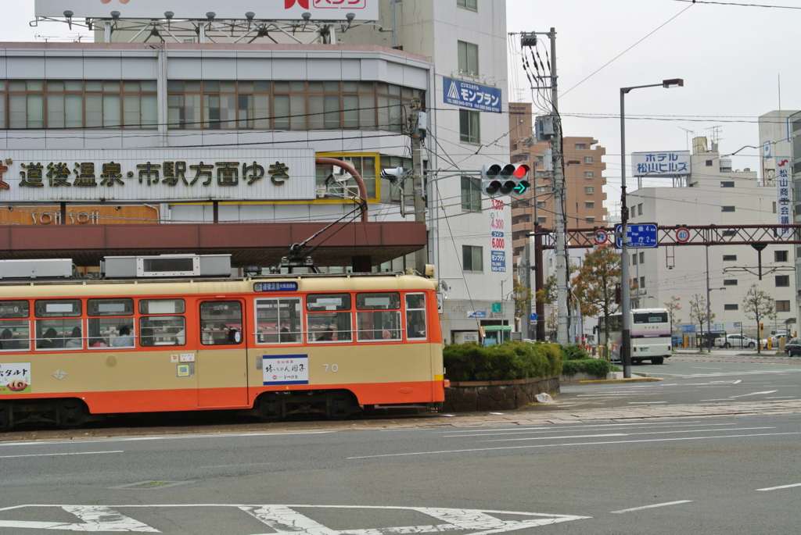
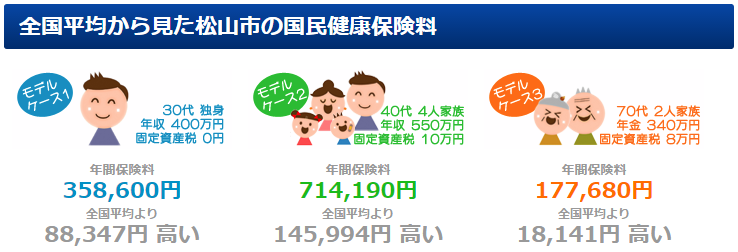
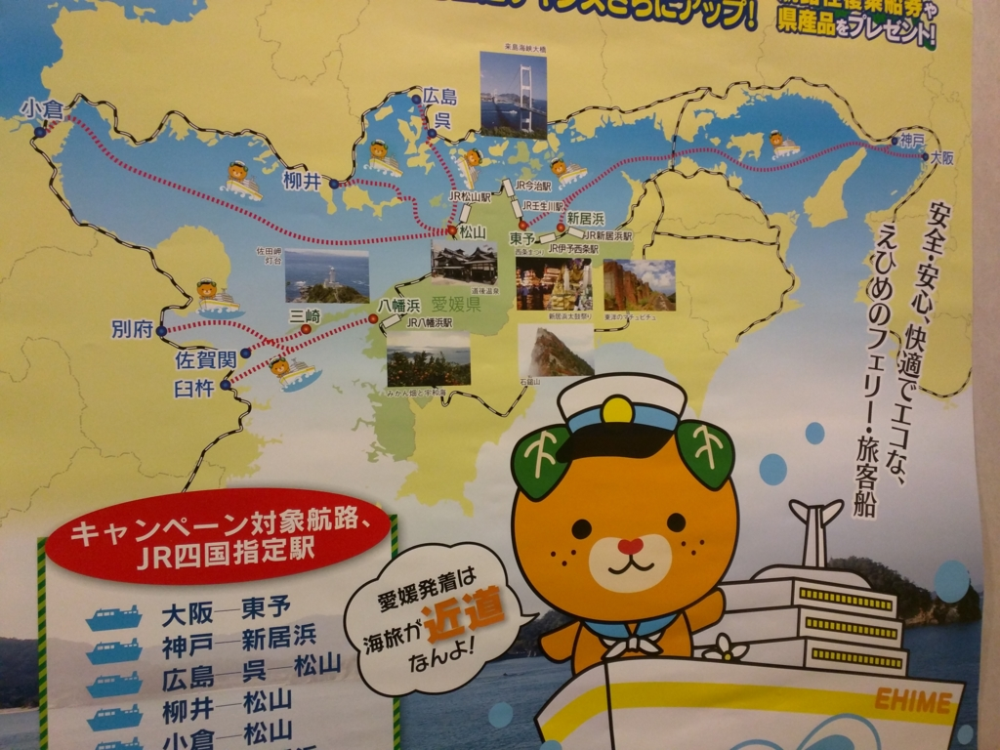

<blockquote class="twitter-tweet" data-lang="ja">
今日はだるやなぎ無職化2周年の記念日らしい .<a href="https://twitter.com/daruyanagi?ref_src=twsrc%5Etfw">@daruyanagi</a>
&mdash; Daisuke Nomura (@daisuke_nomura) <a href="https://twitter.com/daisuke_nomura/status/699597435593560065?ref_src=twsrc%5Etfw">2016年2月16日</a></blockquote>

のむらのツイートで気が付いた。愛媛・松山に移住して2年が経っていたのでした。

<iframe src="https://hatenablog-parts.com/embed?url=https%3A%2F%2Fblog.daruyanagi.jp%2Fentry%2F2015%2F02%2F15%2F090000" title="愛媛・松山に移住して1年経ちました。 - だるろぐ" class="embed-card embed-blogcard" scrolling="no" frameborder="0" style="display: block; width: 100%; height: 190px; max-width: 500px; margin: 10px 0px;"></iframe>

去年と大きく変わったことは、

<ul>
<li>行きつけの居酒屋さんができたこと。名前覚えてもらった。現在も少しずつ開拓中</li>
<li>近所の散髪屋で、いちいち髪形を指定しなくても、テキトーに切ってもらえるようになった（ちなみに LINE ともだち</li>
</ul>
ぐらいかな。少しずつ地域に根を張れているのかな？　って思わないでもないですけど、これ以上は嫁さんもらって子どもできないとダメかなーって感じ。こればっかりはね、独りではなんともならんね。

最近の楽しみは、月に一度、ちんちん電車で街まで出て、地元の友人と終電逃すまで飲むことでしょうか。

<iframe src="https://hatenablog-parts.com/embed?url=https%3A%2F%2Fblog.nakajix.jp%2Fentry%2F2016%2F02%2F29%2F090000" title="2年ぶりにだるやなぎ氏とデートしてきた - なか日記" class="embed-card embed-blogcard" scrolling="no" frameborder="0" style="display: block; width: 100%; height: 190px; max-width: 500px; margin: 10px 0px;"></iframe>

あと、遠くから友だちが遊びに来てくれるのも、とてもうれしい。<i>「朋有り、遠方より来たる。亦楽しからずや」</i>なんて言いますけど、これほど楽しいものだとは知りませんでした。こっちから東京や大阪へ遊びに行く方が多いけれど、またきてくれるとうれしいな。あ、そうそう――

<iframe src="https://hatenablog-parts.com/embed?url=https%3A%2F%2Fblog.daruyanagi.jp%2Fentry%2F2015%2F06%2F19%2F023709" title="プログラミング生放送勉強会 第34回＠サイボウズ株式会社 松山オフィス、無事終わりました！ #pronama - だるろぐ" class="embed-card embed-blogcard" scrolling="no" frameborder="0" style="display: block; width: 100%; height: 190px; max-width: 500px; margin: 10px 0px;"></iframe>

今年もプロ生＠愛媛をやろうと思っているので、暇な人＆おしゃべりしてくれる人はぜひ遊びに来てください。今年も6月ぐらいかなぁーって感じです。日程が固まったらまた告知させていただきますね。

<h3>松山のダメなところ</h3>

基本的に松山はコンパクトで住みやすい街です。気候は温暖で雪もあまり降らない（降るとこは降るから、割と近場にスキー場もあるんやで）。台風からは高知県氏と四国山地さんが身を挺して守ってくれるし、怖いのは地震ぐらいかなぁ？　あと、四国の中では都会度も高い（高松の方が見た目都会だけど）ので、地方移住の難易度は低めでしょう。

唯一厳しいのがこれ。

国民健康保険料の負担額です。まぁ、収入と世帯の人数によっても変わるのですが、だいたい全国で10位ぐらいらしいですね。正直、このせいで危うく死にかけたので（ちょっと盲点だった）、これから移住しようっていうフリーランスの方は気を付けた方がいいのかもしれません。

愛媛は全般的に高いんかなぁ。八幡浜はちょっと安いみたいだけど。

<h3>去年ひそかに立てていた目標と、その達成状況。あと、今年の目標</h3>

<h4>船に乗る（達成！）</h4>

愛媛から海外（海の外だし！）へ出る船に全部乗ろうと画策していたのですが、これはほぼコンプリート。

<ul>
<li><b>三津港～柳井港</b>：<a href="https://blog.daruyanagi.jp/entry/2014/08/30/221903">&#x6226;&#x8266;&#x9678;&#x5965;&#x306E;&#x304A;&#x5893;&#x53C2;&#x308A;&#x884C;&#x3063;&#x3066;&#x304D;&#x305F; - &#x3060;&#x308B;&#x308D;&#x3050;</a>（途中まで）</li>
<li><b>大阪南港～東予港</b>：<a href="https://blog.daruyanagi.jp/entry/2015/01/17/121022">&#x5927;&#x962A;&#x30FB;&#x5357;&#x6E2F;&#x304B;&#x3089;&#x611B;&#x5A9B;&#x30FB;&#x677E;&#x5C71;&#x307E;&#x3067;&#x8239;&#x3067;&#x5E30;&#x3063;&#x3066;&#x304D;&#x305F;&#x3002; - &#x3060;&#x308B;&#x308D;&#x3050;</a>、<a href="https://blog.daruyanagi.jp/entry/2015/05/01/163524">&#x30D0;&#x30A4;&#x30AF;&#xFF1A;&#x30D5;&#x30A7;&#x30EA;&#x30FC;&#x3067;&#x5357;&#x6E2F;&#x304B;&#x3089;&#x677E;&#x5C71;&#x307E;&#x3067;&#x5E30;&#x3063;&#x3066;&#x304D;&#x305F;&#x3063;&#x305F; - &#x3060;&#x308B;&#x308D;&#x3050;</a></li>
<li><b>松山観光港～呉・広島港</b>：<a href="https://blog.daruyanagi.jp/entry/2015/08/18/051707">&#x8239;&#x4E57;&#x3063;&#x3066;&#x677E;&#x5C71;&#x304B;&#x3089;&#x5E83;&#x5CF6;&#x30FB;&#x5449;&#x306B;&#x884C;&#x3063;&#x3066;&#x304D;&#x305F;&#x3063;&#x305F;&#x3002; - &#x3060;&#x308B;&#x308D;&#x3050;</a></li>
<li><b>八幡浜港～臼杵港</b>：<a href="https://blog.daruyanagi.jp/entry/2016/01/24/110131">&#x798F;&#x5CA1;&#x305D;&#x306E;&#x4E8C;&#xFF1A;&#x677E;&#x5C71; &rarr; &#x81FC;&#x6775;&#xFF08;&rarr; &#x535A;&#x591A;&#xFF09; - &#x3060;&#x308B;&#x308D;&#x3050;</a></li>
<li><b>小倉港～松山観光港</b>：<a href="https://blog.daruyanagi.jp/entry/2016/02/17/135637">&#x798F;&#x5CA1;&#x305D;&#x306E;&#x4E03;&#xFF1A;&#x30D5;&#x30A7;&#x30EA;&#x30FC;&#x3067;&#x677E;&#x5C71;&#x307E;&#x3067;&#x5E30;&#x3063;&#x3066;&#x304D;&#x305F;&#x3063;&#x305F;&#x3002; - &#x3060;&#x308B;&#x308D;&#x3050;</a></li>
</ul>
あと、ちょっと関係ないけど、船で猫島にも行ったっけ。

<ul>
<li><a href="https://blog.daruyanagi.jp/entry/2015/12/03/195937">@bonprosoft &#x541B;&#x3068;&lt;del&gt;&#x732B;&#x5CF6;&lt;/del&gt;&#x9752;&#x5CF6;&#x306B;&#x884C;&#x3063;&#x3066;&#x304D;&#x305F;&#x3063;&#x305F;&#x3002; - &#x3060;&#x308B;&#x308D;&#x3050;</a></li>
</ul>
ついでに、電車だけど、サンライズ瀬戸にも乗りました。

<ul>
<li><a href="https://blog.daruyanagi.jp/entry/2015/03/22/224107">&#x30B5;&#x30F3;&#x30E9;&#x30A4;&#x30BA;&#x702C;&#x6238;&#x3067;&#x6771;&#x4EAC;&#x304B;&#x3089;&#x677E;&#x5C71;&#x307E;&#x3067;&#x5E30;&#x3063;&#x3066;&#x304D;&#x305F;&#x3002; - &#x3060;&#x308B;&#x308D;&#x3050;</a></li>
</ul>
次は松山市の島々や、芸予諸島の方にも行ってみたいですね（実はこの前、塩飽の島には行ってきたんですよ！　それはまた今度）。

それにしても、港へのアクセスがすごい悪いのは気になる。伊予鉄の松山観光港への延伸は早めにやってほしいですね。松山への玄関口があれだけ不便なのに、おもてなし No.1 だなんて恥ずかしいぜ。

<h4>四国新幹線を見に行く</h4>

この前達成した！（この話は今度）

<h4>愛媛 FC の試合を見る</h4>

なんとなく行きそこなってしまいました。まぁ、だいたいこれのせいやろな。

<iframe src="https://hatenablog-parts.com/embed?url=http%3A%2F%2Fwww.jleague.jp%2Frelease%2Fpost-34111%2F" title="不適切な会計処理に対し 愛媛ＦＣに制裁を決定：Ｊリーグ.jp" class="embed-card embed-webcard" scrolling="no" frameborder="0" style="display: block; width: 100%; height: 155px; max-width: 500px; margin: 10px 0px;"></iframe>

今年は行きたいなー。誰か行こうず！

<h4>女の子ともだちを作る</h4>

なかったことにする。

<h3>さいごに</h3>

今年も一年、楽しく暮らせたらなーって思います。

<h3>追記</h3>

<iframe src="https://hatenablog-parts.com/embed?url=http%3A%2F%2Fwww.adventar.org%2Fcalendars%2F1176" title="愛媛・松山についての徒然 Advent Calendar 2015 - Adventar" class="embed-card embed-webcard" scrolling="no" frameborder="0" style="display: block; width: 100%; height: 155px; max-width: 500px; margin: 10px 0px;"></iframe>

松山に興味を持った方がいらっしゃれば、年末の Advent Calendar もぜひどうぞ！

