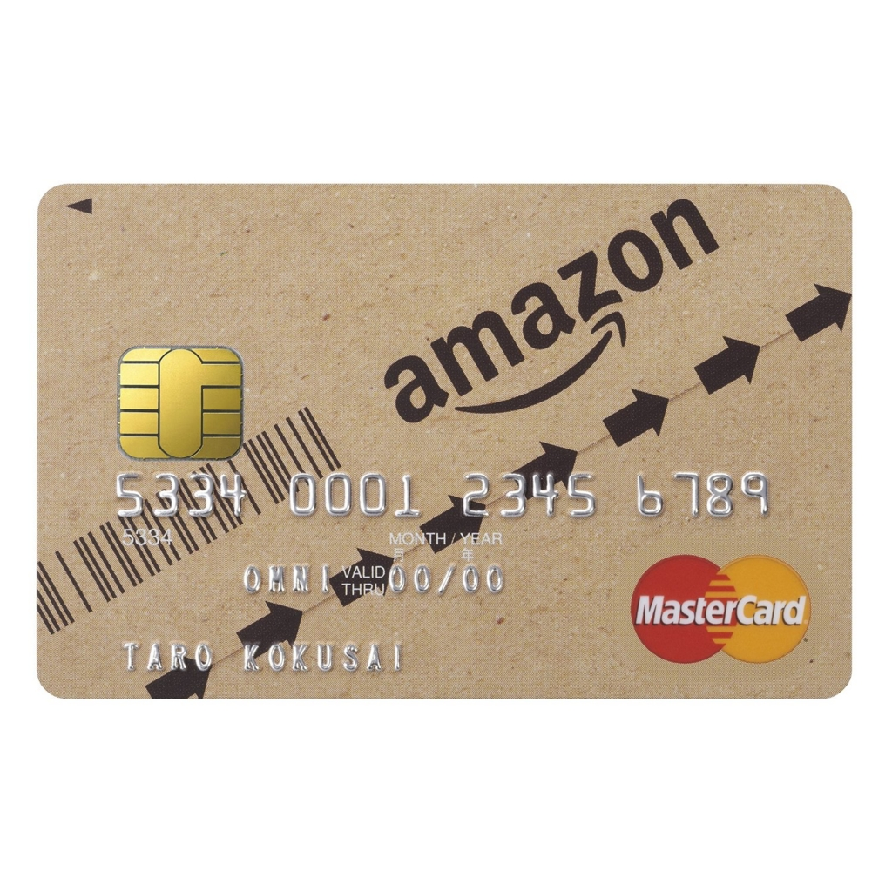
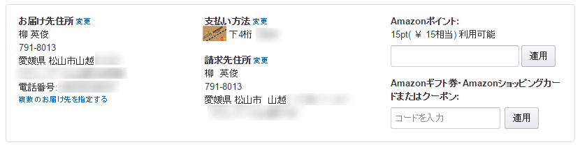

確定申告を済ませたついでに、支払いや記帳の合理化を進めているのだけど――

<iframe src="https://hatenablog-parts.com/embed?url=https%3A%2F%2Fblog.daruyanagi.jp%2Fentry%2F2016%2F02%2F23%2F200000" title="今年も無事（？）、確定申告が終わりました。 - だるろぐ" class="embed-card embed-blogcard" scrolling="no" frameborder="0" style="display: block; width: 100%; height: 190px; max-width: 500px; margin: 10px 0px;"></iframe>

一番のネックは<b>持ってるクレジットカードが freee の自動記帳に対応していない</b>こと。毎月 クレカの Web 明細を見ながら、手でプチプチ入力するのは嫌になったので、freee を相性のよさそうなクレジットカードに乗り換えることにした。調べてみると、三井住友カードの Vpass というヤツなら freee と連携できそうな雰囲気。

<iframe src="https://hatenablog-parts.com/embed?url=https%3A%2F%2Fwww.smbc-card.com%2Fmem%2Findex.jsp" title="三井住友カード会員向けサービス「Vpass」ログイン" class="embed-card embed-webcard" scrolling="no" frameborder="0" style="display: block; width: 100%; height: 155px; max-width: 500px; margin: 10px 0px;"></iframe>

というわけで、たまたま Amazon でキャンペーンをやっているのを見かけたのもあり、Amazon MasterCardクラシック に申し込んでみることにした。ポイント還元のお得さではほかに譲るみたいだけど、まぁ、使った分 Amazon のポイントになるのは、割りと重度なアマゾニストの自分にとってはシンプルで分かりやすい。

<a href="http://www.amazon.co.jp/%E4%B8%89%E4%BA%95%E4%BD%8F%E5%8F%8B%E3%82%AB%E3%83%BC%E3%83%89%E6%A0%AA%E5%BC%8F%E4%BC%9A%E7%A4%BE-Amazon-MasterCard%E3%82%AF%E3%83%A9%E3%82%B7%E3%83%83%E3%82%AF/dp/B0092VO0LI">http://www.amazon.co.jp/%E4%B8%89%E4%BA%95%E4%BD%8F%E5%8F%8B%E3%82%AB%E3%83%BC%E3%83%89%E6%A0%AA%E5%BC%8F%E4%BC%9A%E7%A4%BE-Amazon-MasterCard%E3%82%AF%E3%83%A9%E3%82%B7%E3%83%83%E3%82%AF/dp/B0092VO0LI</a>

すると、無職なのにあっさり審査通ったばかりか、その場で速攻使えるようになり、しかもカードが届いてないのに勝手に Amazon の決済手段として登録された。

正直なところ<i>「便利すぎてちょっと気持ち悪い」</i>と思った。でも、専用のアイコンなのはいいな。

明細サービス Vpass と freee の連携も無事うまくいった。あとはなるべく現金を使わなければ、記帳の手間は限りなくゼロになる。だいぶうれしい。

でも、よく考えたらマイルが溜まったり、SUICA のオートチャージができるヤツの方がよかったかもしれぬな。無職だからクレジットカードを新たに作るのは難しいだろうし、むかし会社の運転資金にキャッシュローンをぶちこんでビューカードなどを数枚焦げ付かせた前科があったので<a href="#f-eb801237" name="fn-eb801237" title="そんなわけで、むかし作って残っていたヤツを我慢して使い続けていたわけだが">*1</a>、ダメでもともとのつもりであまり考えずに試しちゃった。また新しく申し込んでもいいのだけど、あんまり新しいのをポコジャカつくるのも怪しまれそうなので、当面はこのままでいくことにしようかと思う。

これで手入力にしなきゃいけないのは、タクシー代ぐらいになったかもしれない( *´艸｀)ｳﾌﾌ

<h3>追記</h3>

カードのデザインが Amazon の段ボールに似ているので、間違って紙ごみの日に出してしまわないように気をつけねば。

<a href="#fn-eb801237" name="f-eb801237" class="footnote-number">*1</a>:そんなわけで、むかし作って残っていたヤツを我慢して使い続けていたわけだが

