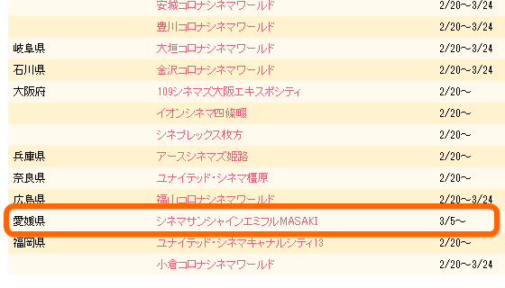
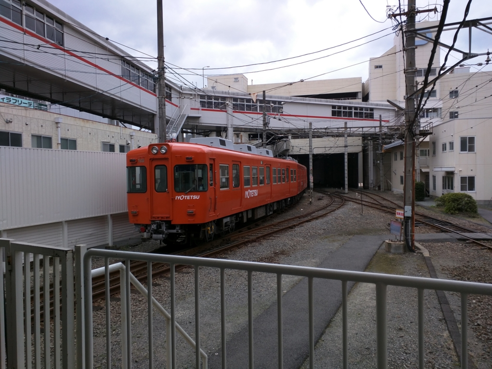
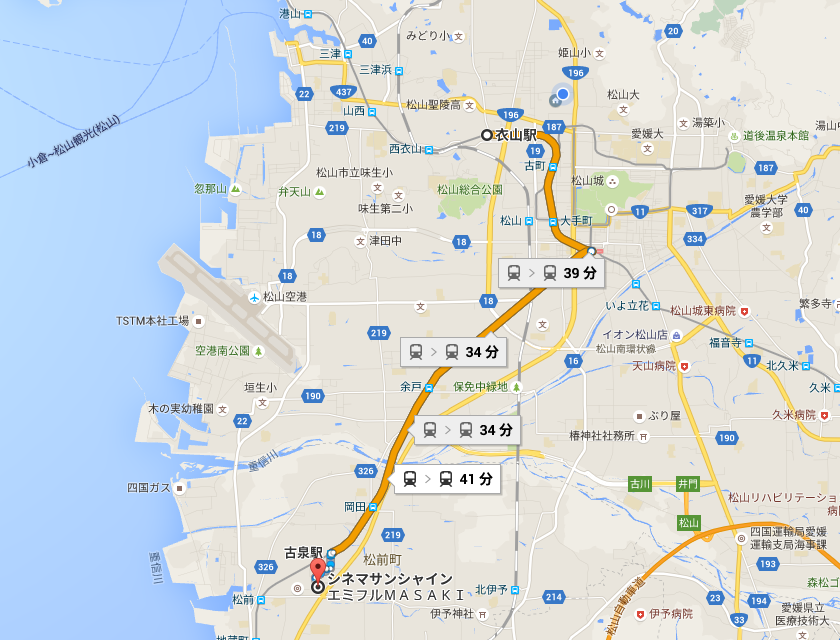
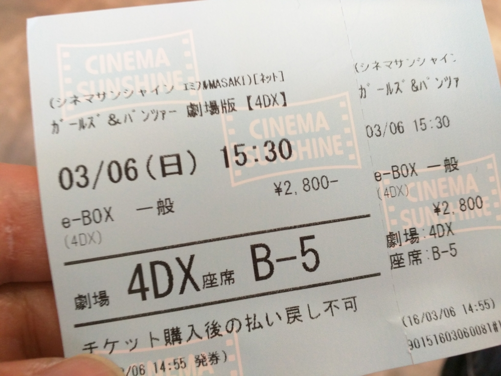

ガルパンの劇場版は前にも見たんだけど……

<iframe src="https://hatenablog-parts.com/embed?url=https%3A%2F%2Fblog.daruyanagi.jp%2Fentry%2F2016%2F01%2F17%2F133929" title="『ガールズ＆パンツァー 劇場版』 - だるろぐ" class="embed-card embed-blogcard" scrolling="no" frameborder="0" style="display: block; width: 100%; height: 190px; max-width: 500px; margin: 10px 0px;"></iframe>

愛媛でも 4DX 上映が始まったのでもう一回見に行った。

ほかの都道府県よりも遅いし、シネマサンシャイン エミフル MASAKI なのでウチの家からはちょっと遠いけれど、まったくやっていないよりは全然マシ。

ちなみに、本当は 3/5（土）の初日に行こうと思っていたんだけど……

シネマサンシャインのサーバーが落ちて予約できず。しょうがないので、1日ずらして 3/6（日）に観に行くことにした。

<h3>伊予鉄郡中線</h3>

お昼に久万ノ台の温泉で斎戒沐浴をし、伊予鉄の郊外列車で松前まで。

実は郡中線に乗るのは初めてだ。松山市から、隣の伊予市まで行けるらしい。単線のまっすぐな路線が印象的で、乗客の数もそこそこ。ボーっと車窓を眺めていたら、最寄りの古泉駅で降りるのを忘れてしまい、次の松前駅から歩く15分ぐらい羽目になった。

<h3>エミフル MASAKI</h3>

エミフル MASAKI はこのあたりで一番大きなショッピングモールらしい。<b>愛媛にもこんなに人がいたのか</b>と思うほどの盛況で、ぶっちゃけ大街道よりも人が多い感じ。独断と偏見による目算では、愛媛の人口の 1/3 ほどがここに集結している気がする。とくに小さな子どもが多い感じで、実際、何匹かに体当たりされた。まぁ、子どものすることだから気にはしないが、親はケータイをいじってないで、もう少し目を配るべきであろう。

さて、ガルパン 4DX の方だが……<i>「ガルパンはいいぞ！」</i>とにかくシートが<b>ちょっと上質</b>なのがいいな。むかしどこかの劇場で“プレミアムシート”みたいなのに座ったことがあるが、質はそれと同等で、足元の広さは 4DX の方が大きく上回る。手元には水を ON/OFF するボタンがついている。自分は知らなかったが、4DX というのは座席が動くだけではなく、煙を出したり、霧状の水を噴霧したり、フラッシュを焚いたり、あげくは<b>シャボン玉</b>が飛び出す演出まである（風呂シーンでシャボン玉が噴出したのには思わず笑ってしまった）。ぼくと同じく 4DX 初体験の客は少なくないようで、初めて席が振動したときは小さなどよめきが沸いていた。

ただ、かつてアメリカのユニバーサルスタジオで体験したアトラクションのような大掛かりなものでは所詮なくて、後付け感は否めない。とくに後方からの至近弾を表現するのに、シートの背もたれからプシュプシュと空気が吹き付けられるのだが、自分は座り方が悪かったので、後頭部にシュコシュコ刺さって変な気分だった。とはいえ、あんな設備を映画館に求めるのは酷だし、これはこれで十分楽しめる。最後の戦闘の迫力などは、通常版とは比較にならない。『プライベート・ライアン』や『フューリー』を 4DX 前提で作ったらスゴいことになりそうだなぁ。

4DX で気を付けなければならないのは、上映中の暖かい飲み物とアルコールは禁止であること。劇場でビール飲むつもりで、バイクではなく、電車できたのに……ちょっとガッカリだ。確かに熱い飲み物が顔にかかるとよくないし、酔った頭をこんなにブンブン揺らされては、気分の悪くなる人も出そうなので仕方ないけれどね。あと、荷物を濡らしたくないときは、入り口前のロッカーに預けるとよいようだ。自分はそれに気が付かなかったので、荷物を抱えながらグラングラン振り回される羽目になった。

まとめると、確かに面白かったけれど、振動や振れは要らないから、代わりに肩たたき機能がほしいという人も多いんじゃないかと思う。シートは快適だったが、居眠りができる感じではまったくなかった。あと、ガルパンはよかった。

