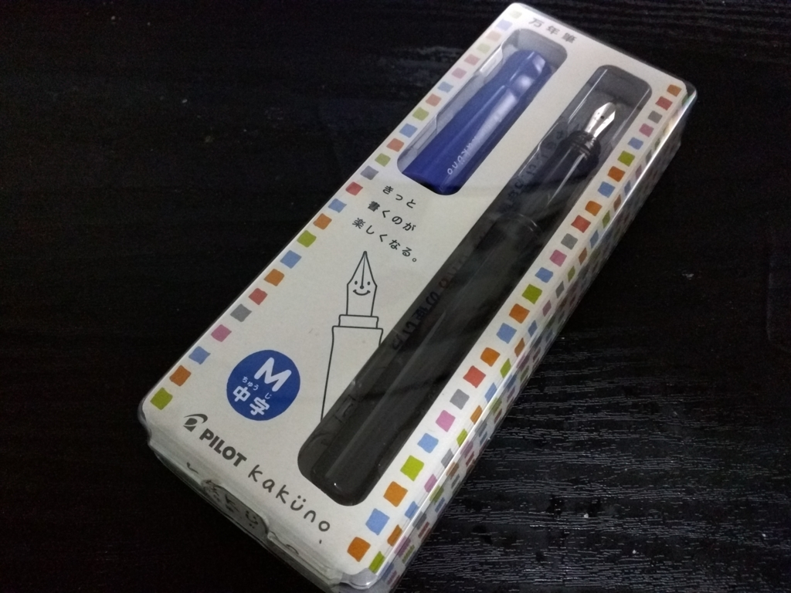
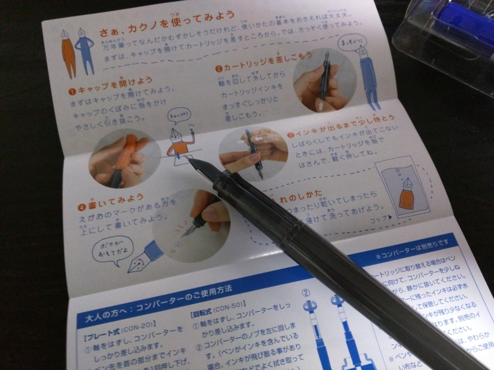
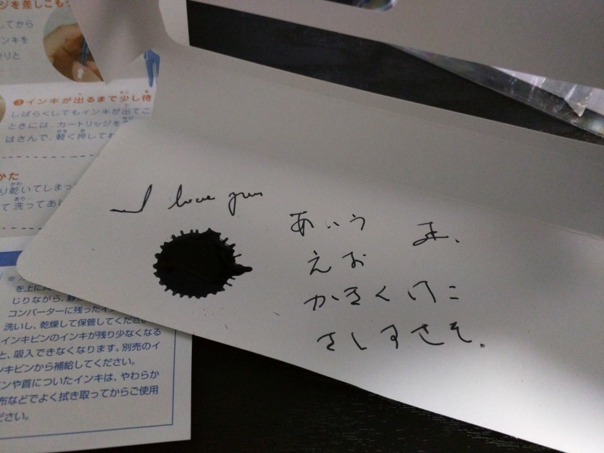

くまひよ先生の記事で見かけて、ちょっとほしくなったので一本買ってみた。

<iframe src="http://kmhiyohanco.hatenablog.com/embed/2016/03/11/212036" title="カクノ、買いました。 - くまひよ、わーきんぐでいず" class="embed-card embed-blogcard" scrolling="no" frameborder="0" style="display: block; width: 100%; height: 190px; max-width: 500px; margin: 10px 0px;"></iframe>

今回は青のキャップの中字タイプをチョイス。

<blockquote class="twitter-tweet" data-lang="ja">
<a href="https://twitter.com/daruyanagi">@daruyanagi</a> お、いいね！特に中字ってのがいいね！一般的な日本語の筆記には細字の方が向いてるかもだけど、中字は味があっていい。万年筆楽しんで！！
&mdash; やんきぬ (@yankinu) <a href="https://twitter.com/yankinu/status/708312033154830336">2016年3月11日</a></blockquote>

恥ずかしながら、万年筆というものにあまり触れる機会を持てないまま、ここまで年を重ねてしまったので、どの万年筆がよいのかさっぱりわかんないのだが、細字の方もいいらしい。ペン先に顔が書いてあるのがかわいいな。

簡単なマニュアルもついていて、万年筆童貞のおっさんでもちゃんと使えた。

インクのところをちょっとつまんでみたらチカラを入れすぎたみたいで、ダバーッてなったけどな！（でかいインクの染みがそれ）

ちょっとオモチャっぽい感じもするけれど、ちゃんと書ける。1,000円というお手軽な値段なので、違う色のキャップがついているヤツやら、インクの色を変えたヤツやら、何本も揃えたくなってしまう。あと、関連グッズも。とりあえず、革のペンケースはほしいかもって思う。

<a href="http://www.amazon.co.jp/exec/obidos/ASIN/B00G1VDV9E/bestylesnet-22/">パイロット 万年筆 カクノ FKA-1SR-LM 中字 ブルー</a>
<ul><li>出版社/メーカー: パイロット</li><li>メディア: オフィス用品</li><li><a href="http://d.hatena.ne.jp/asin/B00G1VDV9E/bestylesnet-22" target="_blank">この商品を含むブログを見る</a></li></ul>

フタを閉めるのだけは忘れないようにしないと……ボールペンのフタを忘れて、すぐインクが出せなくなってしまうおっさんなので、気を付けないと。

