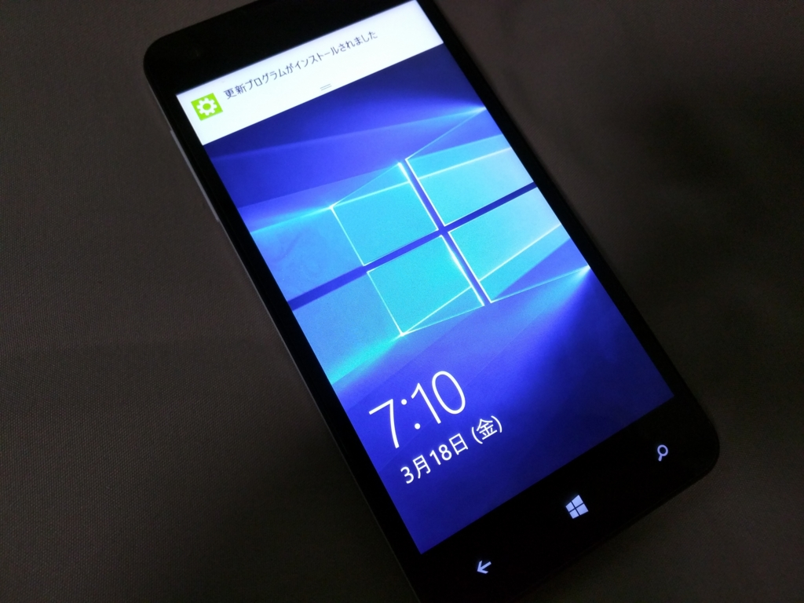
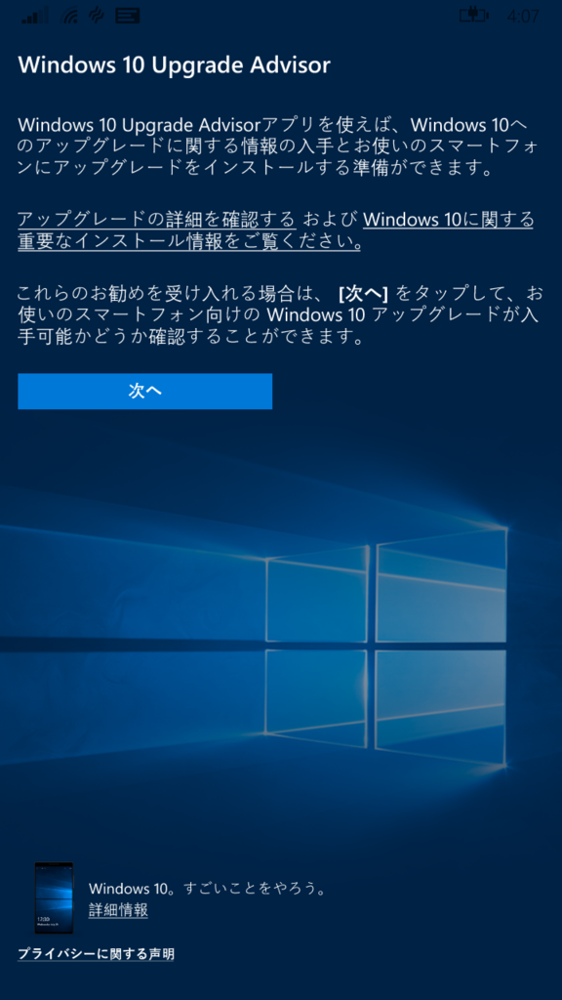
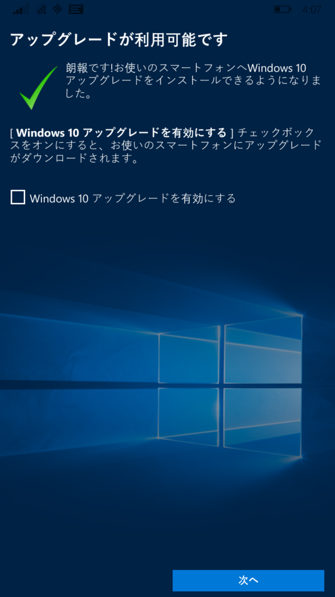
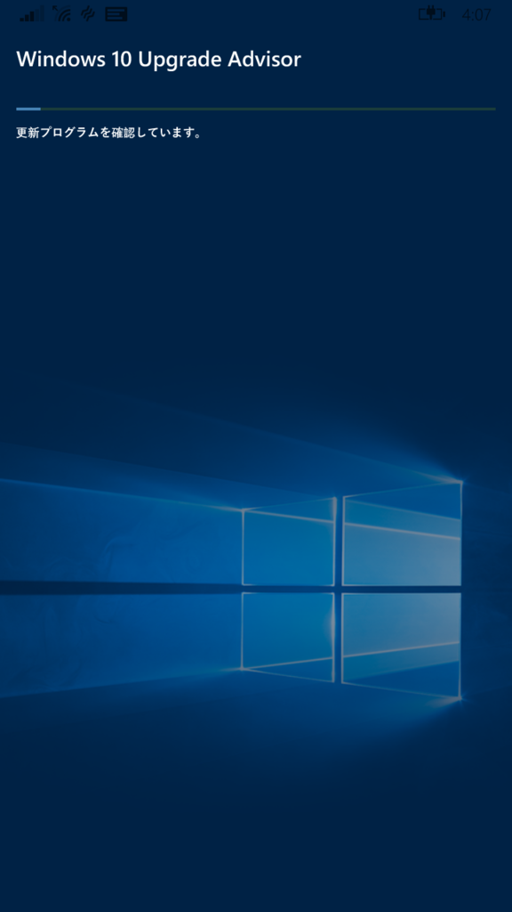
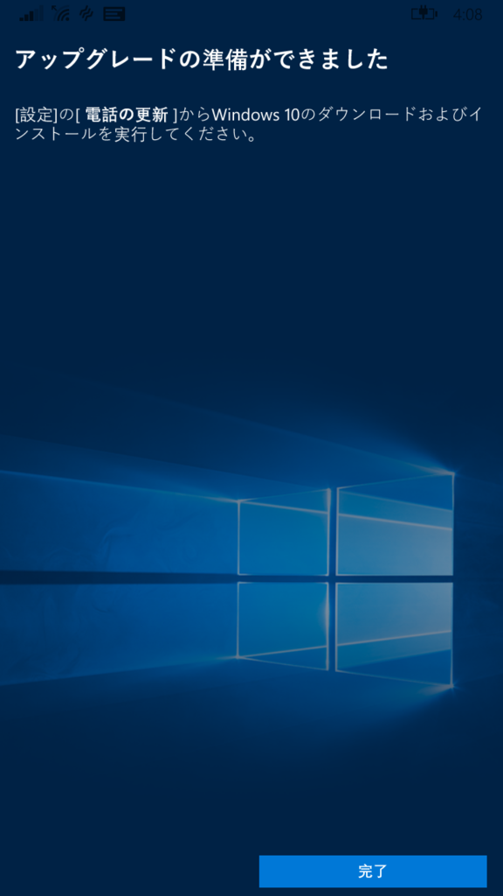
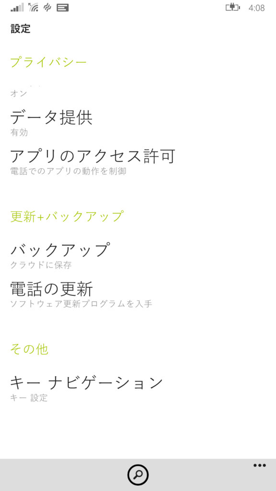
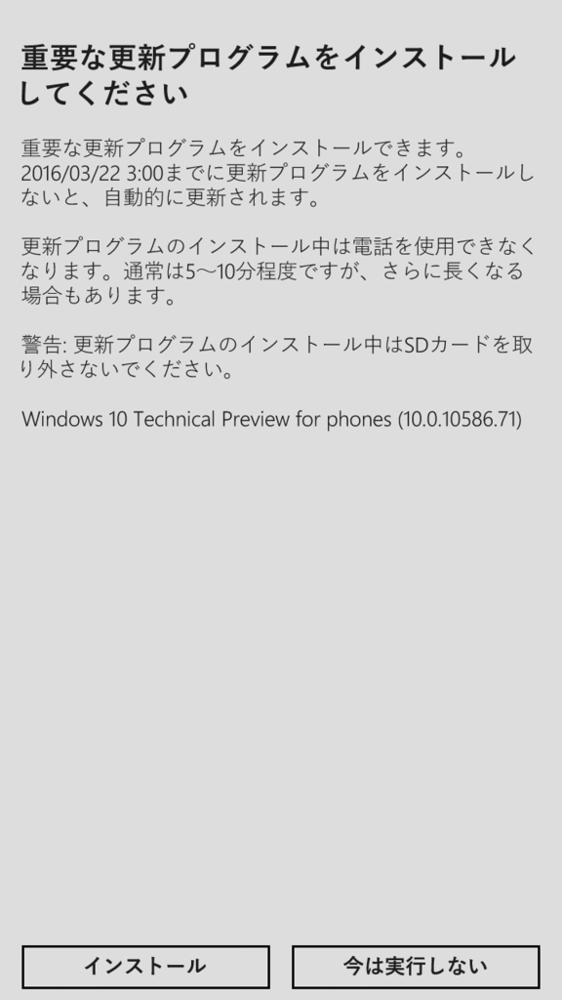
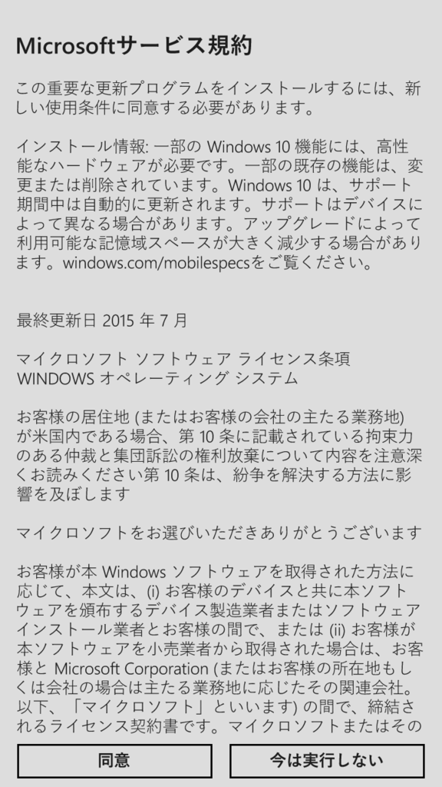
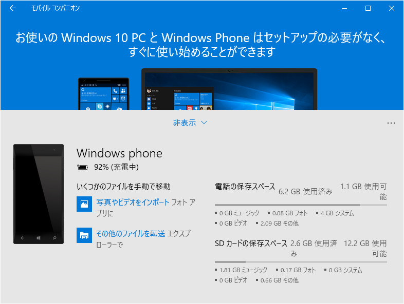
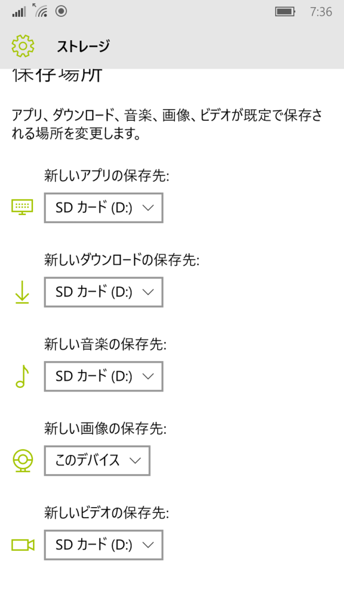

MCJ MADOSMA Q501 にも OTA による Windows 10 Mobile の配信が始まったようです！

<blockquote class="twitter-tweet" data-lang="ja">
For related changes to Windows 10 Mobile Insider Preview builds <a href="https://t.co/AdStNnW0qr">https://t.co/AdStNnW0qr</a>
&mdash; Gabriel Aul (@GabeAul) <a href="https://twitter.com/GabeAul/status/710503977188634624">2016年3月17日</a></blockquote>

<blockquote class="twitter-tweet" data-lang="ja">
遂に、遂に降ってきました。。
&mdash; Takehiro Hirai (@hirai_takehiro) <a href="https://twitter.com/hirai_takehiro/status/710505689714544640">2016年3月17日</a></blockquote>

ほんま、いつまで待たせたんや。もう来おへんのかと思ったで（歓喜

Windows 10 Mobile へアップデートするには、「Upgrade Advisor」というアプリを利用する。

<iframe src="//hatenablog-parts.com/embed?url=https%3A%2F%2Fwww.microsoft.com%2Fja-jp%2Fstore%2Fapps%2Fupdateadvisor%2F9nblggh0f5g4" title="Upgrade Advisor – Microsoft ストアの Windows アプリ" class="embed-card embed-webcard" scrolling="no" frameborder="0" style="display: block; width: 100%; height: 155px; max-width: 500px; margin: 10px 0px;"></iframe>

むかしとえらいユーザーインターフェイスが違う気がするが（<a href="http://www.forest.impress.co.jp/docs/review/20151211_734920.html">&#x3010;&#x30EC;&#x30D3;&#x30E5;&#x30FC;&#x3011;Windows Phone&#x306E;&#x30A2;&#x30C3;&#x30D7;&#x30C7;&#x30FC;&#x30C8;&#x3092;&#x652F;&#x63F4;&#x3059;&#x308B;Microsoft&#x516C;&#x5F0F;&#x30A2;&#x30D7;&#x30EA;&#x300C;UpdateAdvisor&#x300D; - &#x7A93;&#x306E;&#x675C;</a>）、気にしない。

   

「アップグレードの準備が完了しました」という画面になったら、「設定」アプリの［更新＋バックアップ］－［電話の更新］を開いてアップデート処理を行う（アプリからこの画面へ遷移してほしいもんだ）。

   

あとは我慢強く待つだけ。

<blockquote class="twitter-tweet" data-lang="ja">
頑張れ！ <a href="https://t.co/a6eGNdbB5E">pic.twitter.com/a6eGNdbB5E</a>
&mdash; だるやなぎ（エリス教に改宗） (@daruyanagi) <a href="https://twitter.com/daruyanagi/status/710579006903443456">2016年3月17日</a></blockquote>

ウチの環境では1時間ぐらいかかった。

<blockquote class="twitter-tweet" data-lang="ja">
あと少しです…… <a href="https://t.co/Wwm8vCCe80">pic.twitter.com/Wwm8vCCe80</a>
&mdash; だるやなぎ（エリス教に改宗） (@daruyanagi) <a href="https://twitter.com/daruyanagi/status/710585474662813696">2016年3月17日</a></blockquote>

えらく時間を食ったのは、SD カードにアップデートデータが保存されていたから？　後述するけど、SD カードがあんまり具合よくないのかもしれない。

<blockquote class="twitter-tweet" data-lang="ja">
やたー <a href="https://t.co/JEdx8fcj2I">pic.twitter.com/JEdx8fcj2I</a>
&mdash; だるやなぎ（エリス教に改宗） (@daruyanagi) <a href="https://twitter.com/daruyanagi/status/710589301659054080">2016年3月17日</a></blockquote>

とりあえず無事アップデートが完了。<i>ねんがんの うぃんどうずてんを　てにいれたぞ！　</i>ちなみに OS のビルドは <b>10.0.10586.71</b> との由（バージョン 1511）。

 

<h3>ちょっとした問題</h3>

スクリーンショットの撮影に失敗するようになった。

データの保存先を SD → このデバイス に変更して解決。念のため、ほかの項目も このデバイス へ変更しておいた。

メモリカードの具合がよくないのか、ドライバーの問題なのかはちょっとまだわかんない。SD カードに保存してあった音楽は再生できたので、読み込みは問題ない。アプリの保存先も SD カードだったのだけど、問題なくアップデートできている。

