
たまたまブックマークを付けておいた古いページで証明書エラーが出たので、比較のスクリーンショットをとってみた。環境は Windows 10  Pro x64（JPN）。

 

<h3>Microsoft Internet Explorer 11</h3>

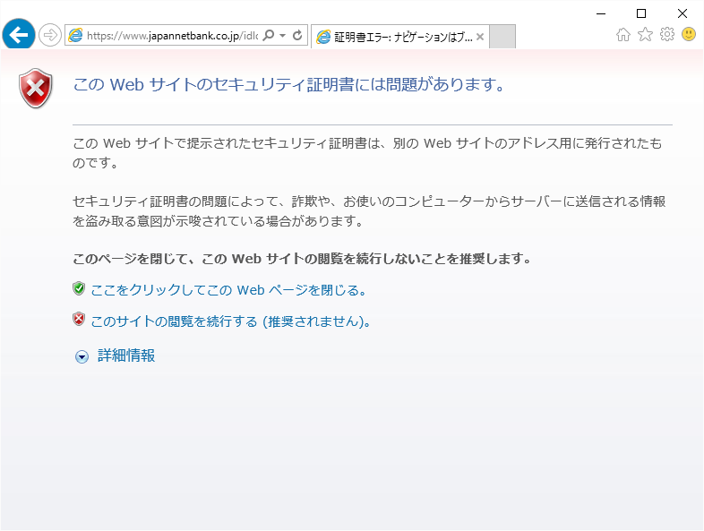

割りとお馴染な感じ。

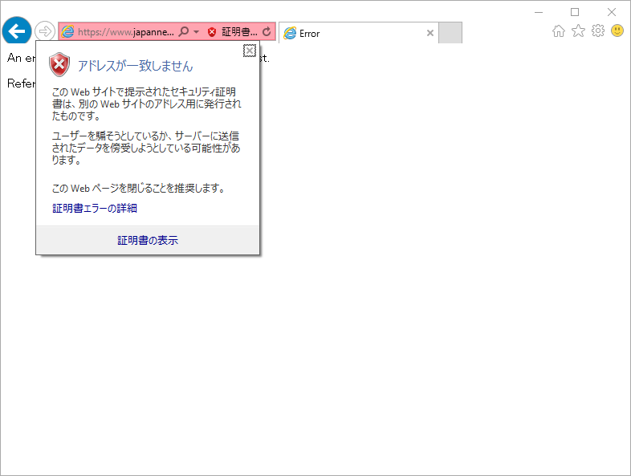 

<h3>Microsoft Edge</h3>

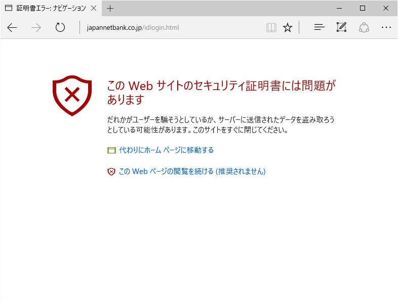

ちょっとドギツイ表示になってる気もする。

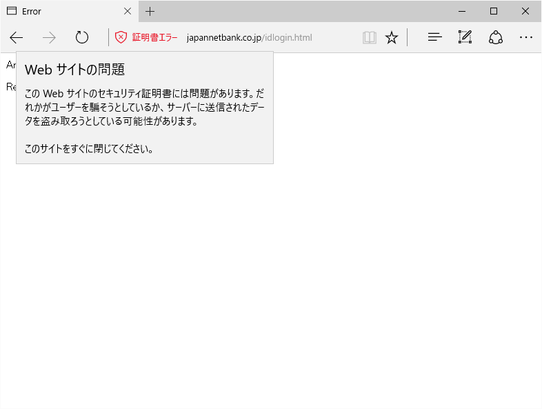

証明書を表示するユーザーインターフェイスがないような。

<h3>Google Chrome 49</h3>

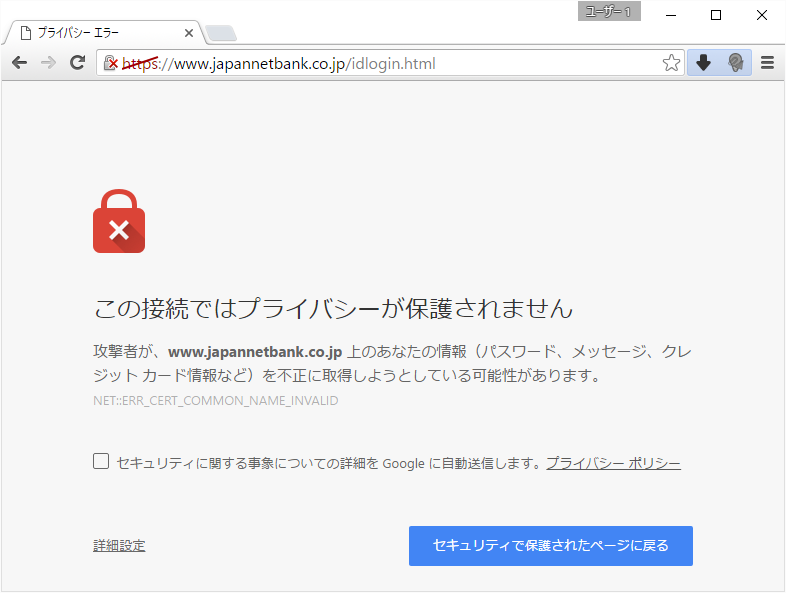

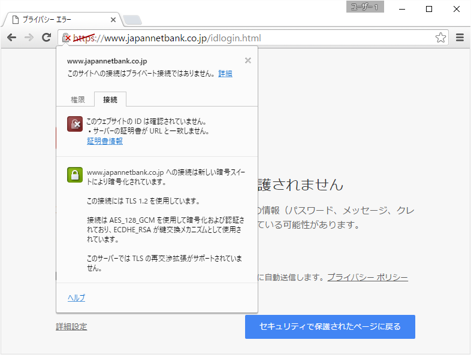

もっとも情報が詳細なのが Google Chrome かも。

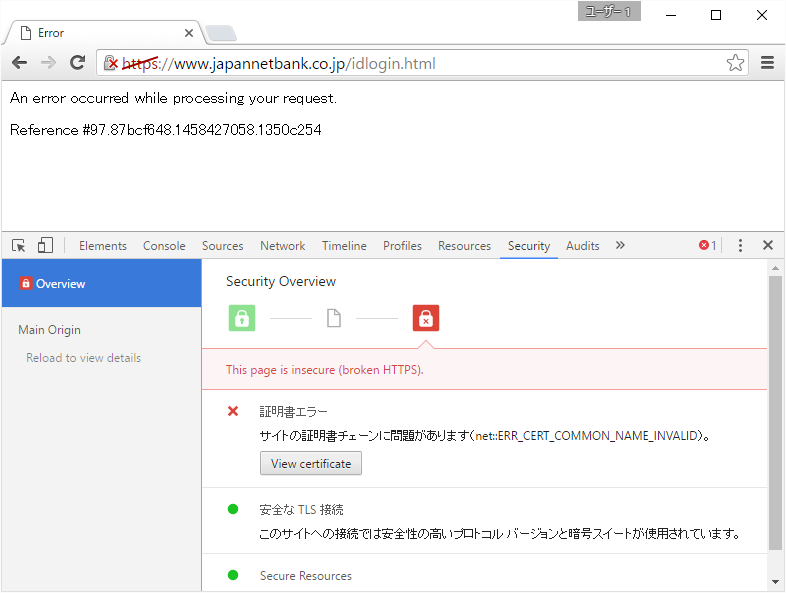

割と最近のバージョンでは開発者ツールでエラーの詳細をチェックできる。

<iframe src="//hatenablog-parts.com/embed?url=http%3A%2F%2Fgoogledevjp.blogspot.jp%2F2016%2F02%2Fdraft-devtools.html" title="DevTools へのセキュリティ パネル導入について" class="embed-card embed-webcard" scrolling="no" frameborder="0" style="display: block; width: 100%; height: 155px; max-width: 500px; margin: 10px 0px;"></iframe> 

<h3>Mozilla Firefox 45</h3>

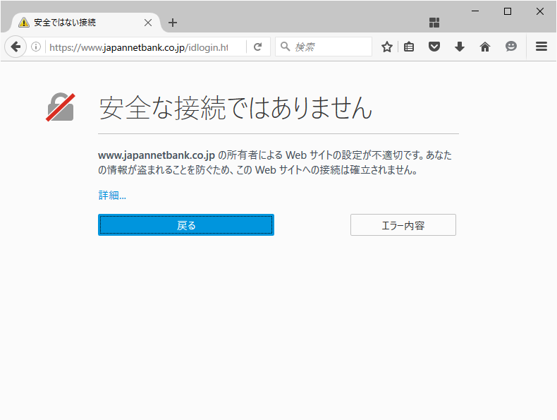

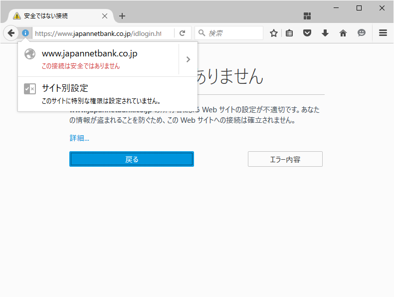

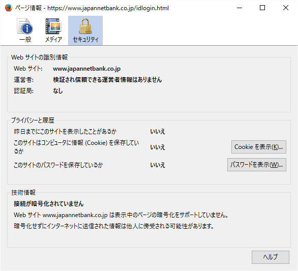

エラーの詳細はパネル＆ダイアログで。

<h3>Opera 36</h3>

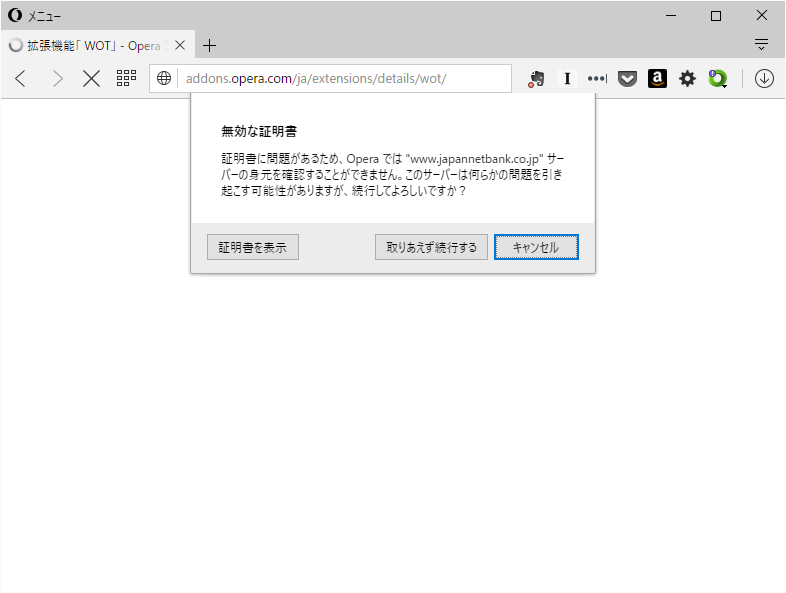

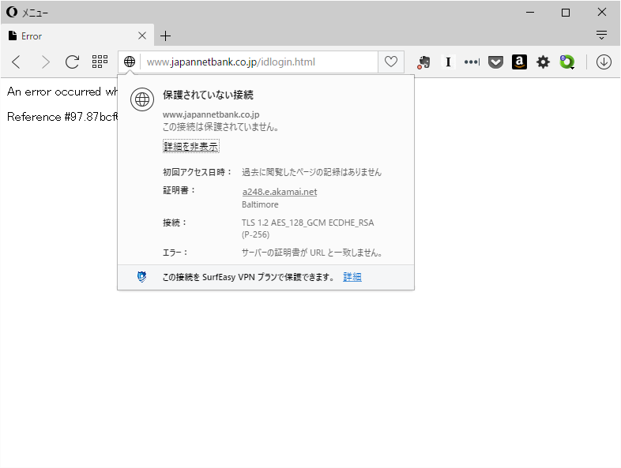

一番古臭い感じだけど不便は感じないかな。ちなみに Vivaldi は Google Chrome と似たような感じだったかも。

