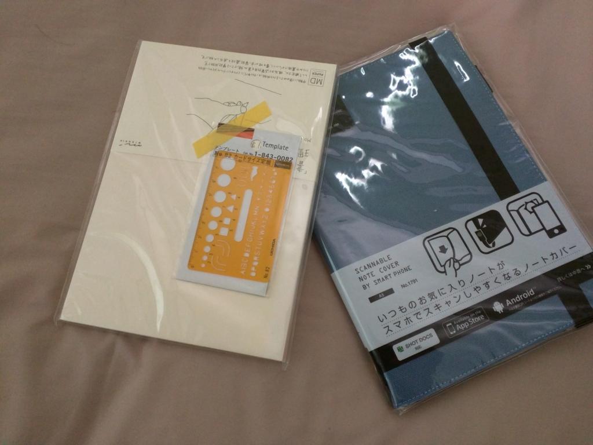
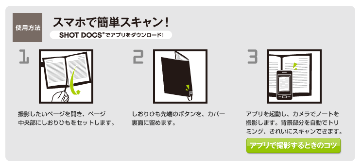

ちょっとノートが必要になったので、Amazon でこんなのを買ってみた。

<iframe src="//hatenablog-parts.com/embed?url=http%3A%2F%2Fwww.kingjim.co.jp%2Fproducts%2Ffile%2Fbrand%2Fcover.html" title="スマホでスキャンしやすいノートカバー | ブランドで探す | ファイルとテプラのキングジム" class="embed-card embed-webcard" scrolling="no" frameborder="0" style="display: block; width: 100%; height: 155px; max-width: 500px; margin: 10px 0px;"></iframe>

これまでもスマホで撮影できる系のノートはいくつか試したのだけど、専用の紙が必要になるのがなんとなくイヤだった。でも、これだと好きなノートが使えるらしい。

<a href="http://www.amazon.co.jp/exec/obidos/ASIN/B003CT47ZK/bestylesnet-22/"> 無罫" title="ミドリ MDノート<A5> 無罫"></a>

<a href="http://www.amazon.co.jp/exec/obidos/ASIN/B003CT47ZK/bestylesnet-22/">ミドリ MDノート<A5> 無罫</a>
<ul><li>出版社/メーカー: デザインフィル</li><li>メディア: オフィス用品</li><li> クリック: 1回</li><li><a href="http://d.hatena.ne.jp/asin/B003CT47ZK/bestylesnet-22" target="_blank">この商品を含むブログ (1件) を見る</a></li></ul>

今回組み合わせてみたのはコレ。初めて買ってみたけど、とことんベーシックな感じが気に入ったかも。余計なことしない、でも、やるべきことは十二分にやってくれる感じ。

で、さっそく撮影を試してみたのだが――

<blockquote class="twitter-tweet" data-lang="ja">
キングジムのスマホでスキャンできるノートカバー買ってみたけど、控えめに言ってウンコだった。自動認識成功しないし、補正の時にアプリ落ちる。 <a href="https://t.co/YPyc0HmcUi">pic.twitter.com/YPyc0HmcUi</a>
&mdash; だるやなぎ（エリス教に改宗） (@daruyanagi) <a href="https://twitter.com/daruyanagi/status/711686572198920192">2016年3月20日</a></blockquote>

残念ながらウチの環境ではうまくいかなかった。自動認識どころか、エラーでファイルを保存できない。スマートフォン（Nexus 6）との相性が悪いのか、紙との相性が悪いのか。

そもそも、こいつ、使い方の説明がよくわからん。撮影のときに、なんかノートカバーのヒモをセットしなきゃいけないらしいんだが。

もっと直接的に<i>「ノートのフチとヒモで黒く囲まれたところをいい感じに自動認識して撮影するぜ」</i>とでも書いておけば個人的にわかりやすかった。<i>「なぜしおりヒモをセットする必要があるのか？」</i>というのがわかれば、コツなんて勝手に習得できる。「なぜ」がわかんないとモノゴトを把握できない自分の脳みそに欠陥があるのかもしれないが。

それはさておき。スマホでスキャンできないのはコレを買った意味がないのだが、Microsoft のドキュメントスキャナーアプリ「Office Lens」で代用することはできないだろうか。

結論から言うと、ノートのフチとヒモまでがドキュメントとして認識されるようで、実用ではないと思った。自動認識の速度は速いし、正確なのだけど、たまたまこのケースには向いていない感じ。キングジムもクソアプリを自分で作るより、「Office Lens」に「SHOT DOCS」の撮影モードを積んでもらう方がいいのではないか。今の Microsoft なら、頼めば割りと簡単に引き受けてもらえそうな気がするのだが。根拠はないけど。

まぁ、そのうちアプリの不具合は修正されるだろうし、ノートカバーとしては割と気に入っているので、そのまま使うと思う。名刺・カードやちょっとした資料を挟むポケット、ペンホルダーがついているし、こういう色も割と好みだ。

<a href="http://www.amazon.co.jp/exec/obidos/ASIN/B00BB3MMPG/bestylesnet-22/">キングジム スキャンしやすいノートカバー  A5 1791 青</a>
<ul><li>出版社/メーカー: キングジム</li><li>発売日: 2013/02/15</li><li>メディア: オフィス用品</li><li><a href="http://d.hatena.ne.jp/asin/B00BB3MMPG/bestylesnet-22" target="_blank">この商品を含むブログ (1件) を見る</a></li></ul>

<h4>おまけ</h4>

<a href="http://www.amazon.co.jp/exec/obidos/ASIN/B001VB8EFA/bestylesnet-22/">ウチダ テンプレート No.82 カードサイズ定規 1-843-0082</a>
<ul><li>出版社/メーカー: ウチダ製図器</li><li>メディア: おもちゃ＆ホビー</li><li><a href="http://d.hatena.ne.jp/asin/B001VB8EFA/bestylesnet-22" target="_blank">この商品を含むブログを見る</a></li></ul>

あると便利なカードサイズの定規。ノートカバーのポッケに入れておくとええんやで。

小学校の頃、これの日本地図が書けるやつを愛用していたのだけど（地理の時間にちょっとキレイめにノートとりたい場合に使えるんだ！）、そっちはもうディスコンだったみたい。惜しいことだ。世界地図バージョンと一緒に復活してくれないかなぁ。

<h4>追記</h4>

<blockquote class="twitter-tweet" data-lang="ja">
<a href="https://twitter.com/daruyanagi">@daruyanagi</a> Office Lens、ホワイトボードのモードは試されました？
&mdash; Ichiro Ota (@ichiohta) <a href="https://twitter.com/ichiohta/status/711697879744708609">2016年3月20日</a></blockquote>

カンペキではないけれど、割とうまく撮れたかも？　枠の認識がやっぱり少し甘いけれど、それ専用にチューニングされているわけじゃないからなぁ。でも、字がくっきり写るのはいい感じかも。

