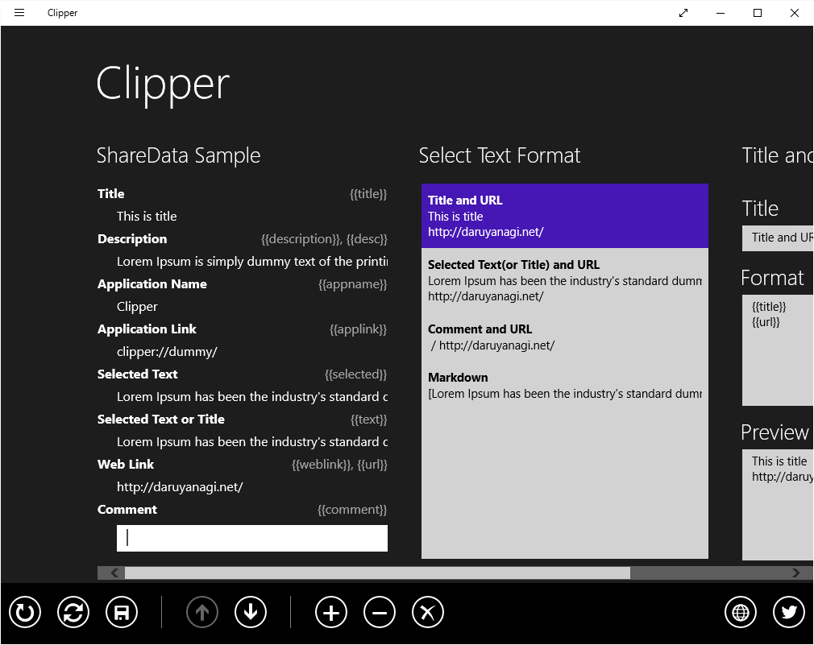

かつてこんなアプリを Windows 8.x 向けに作った。

<iframe src="https://hatenablog-parts.com/embed?url=https%3A%2F%2Fblog.daruyanagi.jp%2Fentry%2F2014%2F08%2F19%2F224807" title="Windows ストア アプリを作りました。 - だるろぐ" class="embed-card embed-blogcard" scrolling="no" frameborder="0" style="display: block; width: 100%; height: 190px; max-width: 500px; margin: 10px 0px;"></iframe>

<iframe src="https://hatenablog-parts.com/embed?url=https%3A%2F%2Fblog.daruyanagi.jp%2Fentry%2F2014%2F08%2F26%2F094110" title="Clipper 2.0.0.0 - だるろぐ" class="embed-card embed-blogcard" scrolling="no" frameborder="0" style="display: block; width: 100%; height: 190px; max-width: 500px; margin: 10px 0px;"></iframe>

閲覧ページのタイトルや URL を指定した書式でクリップボードへコピーするというもので、

<blockquote>

簡単に言うと、［共有］チャームから

<ul>
<li><a href="https://chrome.google.com/webstore/detail/create-link/gcmghdmnkfdbncmnmlkkglmnnhagajbm">Create Link - Chrome Web Store</a></li>
<li>Make Link :: Add-ons for Firefox<a href="https://addons.mozilla.org/ja/firefox/addon/make-link/">https://addons.mozilla.org/ja/firefox/addon/make-link/</a></li>
</ul>
をするアプリです。

</blockquote>

これを Windows 10（UWP）に移植しようかと思う。MADOSMA が W10M になったので、ちょっとやる気が出ているのだ！

<h3>とりあえず古いアプリをそのまま Windows 10 で実行してみた</h3>

Windows 8.x のフルスクリーンを前提に作ってあるので、Windows 10 の Windowed モードには収まりきらず、横スクロールが発生している。

そもそも、このアプリを作った時は画面遷移のやり方がよく分かっていなかったので、すべての操作が一枚のページで行えるように設計されている。そのため、要素が若干詰め込み過ぎ。開発者の能力不足のせいで、ユーザーに不便を強いている部分だ。

あと、アプリケーションバーを使ってみたかったという理由でアプリケーションバーを採用したのだけど、初期状態で必要なコマンドが表示されていないのは不親切だと思った。右クリックすれば出てくるんだけど……わかんないよな、普通。というか、初めからこのアプリには、このユーザーインターフェイスは適してなかった。開発者のエゴが、ユーザーに不便を強いている部分だ。

左上には謎のハンバーガーボタンが追加されていて、共有チャームなどのコマンドはここに押し込められている。共有チャームはオワコン。

<h3>そのまま UWP に移植してみた</h3>

新規に UWP プロジェクトを作成し、ほとんどコピペで移植してみた。アプリケーションバーが謎なことになっている以外は、Windows 8.x 時代とほぼ同様に動いているように見える。若干一部の機能がちゃんと動いていないらしいが、それは要調査。

それにしても、似ているようで細かい挙動が変わっているのは、本当に面倒くさい。とくに Windows 8.x 向けのサンプルが手元ではそのまま動かなくて、StackOverFlow を歩き回っても解決策が見つからないのにはイライラさせられた。質問はあっても、回答はなかったり。まだまだみんな UWP のノウハウは蓄積できていないみたいなので、自分で頑張るしかない（一部のブログ書いてくれてる開発者には感謝、感謝だなぁ）。

ただ、Windows 10 Mobile でも普通に動くのはいいと思った。

ユーザーインターフェイスがデスクトップ向けなのですこぶる使いにくいけれど、MADOSMA にデプロイすれば普通に動く。最初はデスクトップとモバイル両対応のユーザーインターフェイスを作り直す苦労を思って気が重くなったが、モバイルファーストで作り直せば、あとはデスクトップはそれをそのまま使えばいいと気づいてからはちょっと気が楽になった。UWP が許す機能の範囲でならば、新しいアプリケーションは UWP で作った方が得だな。

今度休みが取れたときに、いろいろ調査を進めようと思う。

<h3>個人的なまとめ</h3>

<ul>
<li>ページの遷移を勉強して、ユーザー視点でデザインしなおそう</li>
<li>アプリケーションバーはオワコン</li>
<li>共有チャームもデスクトップではオワコンだけど、モバイルではまだまだ出番があると思うので頑張る</li>
<li>モバイルでもデスクトップでも動くのはいい。将来的には Xbox でも動くのか。宗篤</li>
<li>ユーザーインターフェイスはモバイルファーストで。デスクトップはあとで考えればいいや</li>
<li>UWP のノウハウを貯めるまでは、失敗し続けるしかない（白目</li>
</ul>

