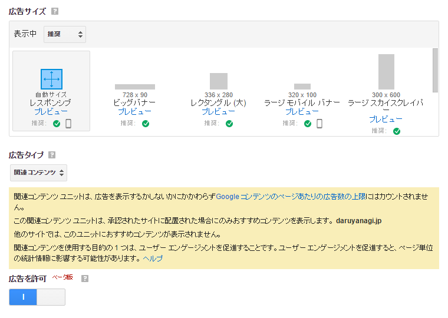

 

<blockquote>

お客様のサイト「daruyanagi.jp」は、無料でサイト訪問者におすすめコンテンツを宣伝できる関連コンテンツ機能のご利用要件を満たしています。 
関連コンテンツ機能では、自サイト内のコンテンツを宣伝することにより、ページビュー数や広告の表示回数を伸ばし、ユーザー エンゲージメントを促進することができます。また、関連コンテンツ ユニットにネイティブ スタイル広告を表示して収益化するベータ版機能もお試しいただけます。

</blockquote>

よくわかんないけれど、AdSense で関連記事を表示してくれる機能がベータ版としてリリースされたらしい。ウチのブログでは Zenback を利用しているが、代わりとして使えるならうれしいな。

AdSense の広告は1ページにつき3つまでしか掲載できないが、こいつはその制限の対象外だそうなので、試しに貼ってみようと思う。

<ins class="adsbygoogle"
style="display:block"
data-ad-client="ca-pub-0944887782985208"
data-ad-slot="4957713683"
data-ad-format="autorelaxed"></ins> 

もしかしたら時間が経てばもう少しマシになるのかもしれないが、今のところあんまり関連記事っぽくないし、先頭に2つ広告が入るのか。ちょっと考えどころかも。

