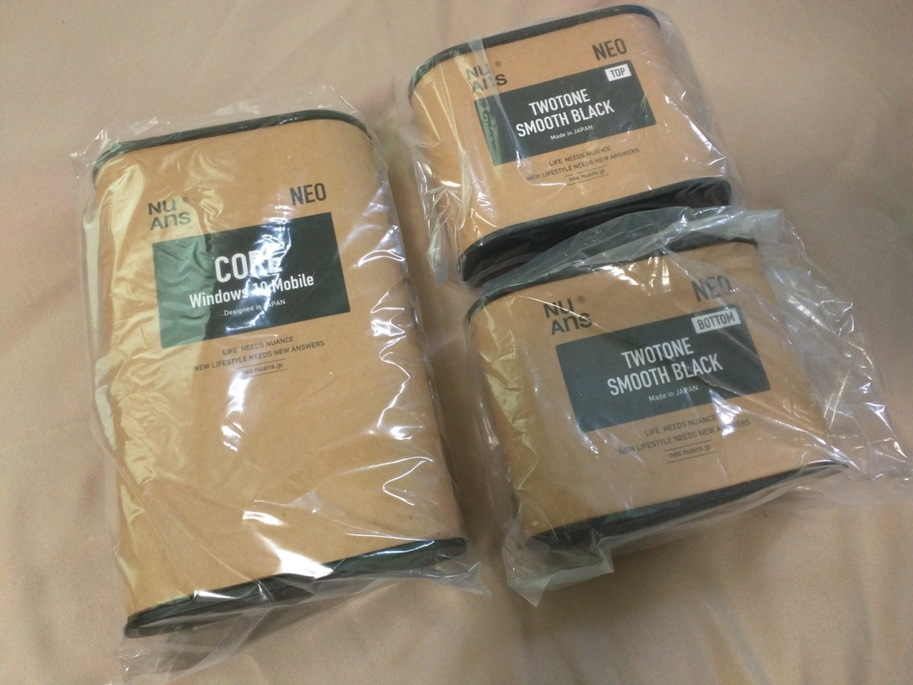
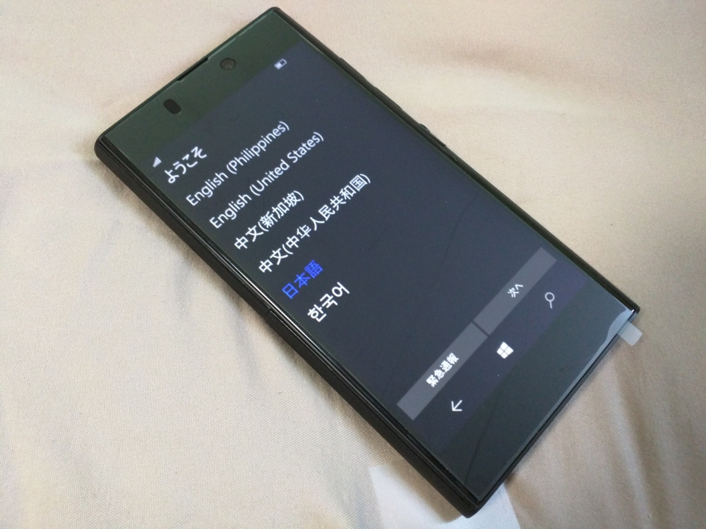
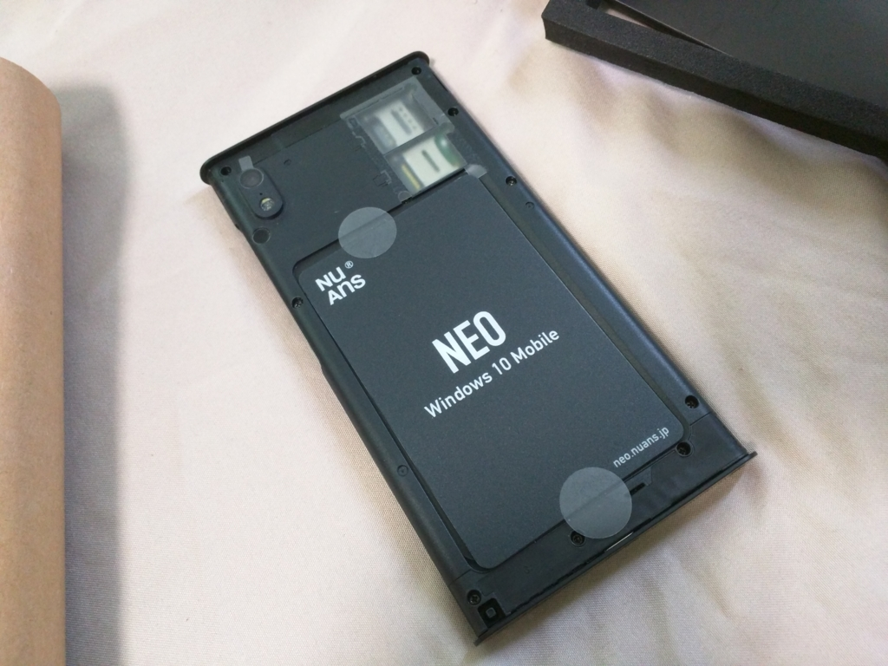

遅ればせながら、NuAns NEO を買った。とくにほしくはなかったのだけど、NFC のある端末が必要になったので。この端末は着せ替えできるのが推しだけど、そういうのには特に興味がないので、今回はフツーの黒い外装だけを買った。初期ロットが売り切れていたせいか、割と待たされた。

MADOSMA Q501WH に比べるとちょっと重いかな？　ずっしりとくるけど、そんなにイヤな重さじゃない。

画面はなんかボヤけてクソ汚いな……と思ったのだけど、これは単に保護シートのせいだった（ちなみに Nexus 6 は購入時の保護シートをとらずに、そのまま使っている。問題ない）。めくってしまうと割と綺麗。一瞬 Dis って申し訳なかった。

あとあれだ、外装の内側に NFC を仕込めるのはちょっといい。ストラップも付けられるし、この辺りはちゃんと「日本発」って感じがする。SIM のゲタがついているのもナイスだと思った。

今のところ、なんとなくミスタイプが多くなるのが気になるだけで（なんでだ？）、問題なく使えている。正直、あんまり興味がなかったのだけど、割といいかも。SIM を MADOSMA からこいつに差し替えてみたので、ちょっとメインの端末として使うつもり。外装をお試しできるところが近くにあればいいんだけどなぁ。

<a href="http://www.amazon.co.jp/exec/obidos/ASIN/B018LQA0HM/bestylesnet-22/">NuAns NEO TWOTONE CORE(ネオ ツートーン コア)本体セット スムースブラック(Windows 10 Mobile/Continuum for Phone)</a>
<ul><li>出版社/メーカー: NuAns</li><li>発売日: 2016/01/31</li><li>メディア: エレクトロニクス</li><li><a href="http://d.hatena.ne.jp/asin/B018LQA0HM/bestylesnet-22" target="_blank">この商品を含むブログ (2件) を見る</a></li></ul>

