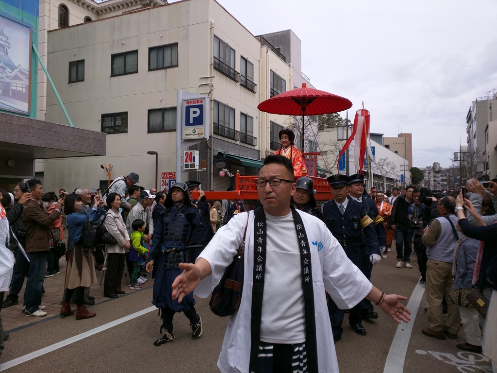
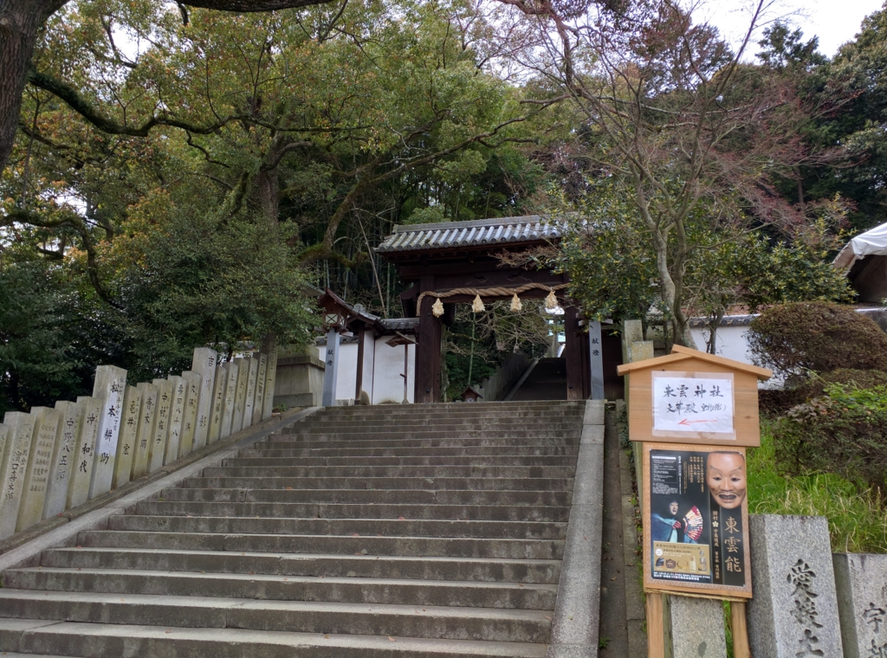
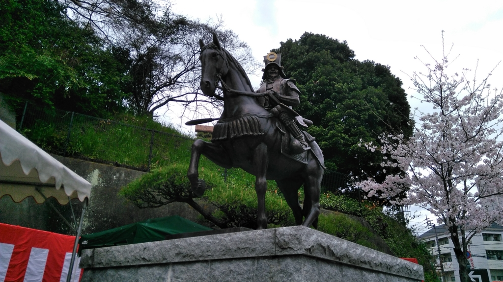
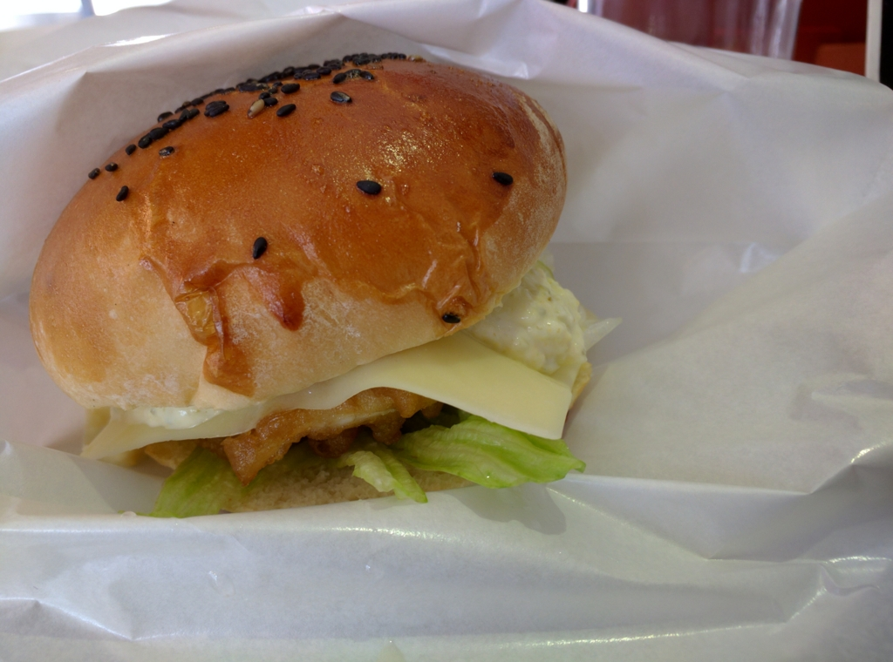

日曜日、UWP アプリを作っていたら Visual Studio のエラーでソリューションを廃棄する羽目になってブチ切れ。頭を冷やすために、散歩へ出かける。目的はこれ。

<iframe src="//hatenablog-parts.com/embed?url=http%3A%2F%2Fwww.ehime-np.co.jp%2Fnews%2Flocal%2F20160402%2Fnews20160402071.html" title="久松家ゆかり４０点公開　松山・東雲神社 | 愛媛新聞ONLINE" class="embed-card embed-webcard" scrolling="no" frameborder="0" style="display: block; width: 100%; height: 155px; max-width: 500px; margin: 10px 0px;"></iframe>

なんか東雲神社で鎧の展示やってるらしいのだよね。ほんとは東雲神社まで歩いていくつもりだったのだけれど、本町六丁目まで来たら、ちょうど本町線の電車がきていたので飛び乗った。30分に一本しかないのに、運がいい。

<h3>大名行列</h3>

大街道で降りたら、人がやたら多い。最近は TV も見ない、外にも出ないという仙人のような暮らしをしていたので知らなかったのだけど、ちょうど春祭りの日だったらしい。

<ul>
<li><a href="http://www.m-festa.jp/:embedhttps://www.city.matsuyama.ehime.jp/kanko/kankoguide/matsurievent/oshiroharu.html">&#x7B2C;51&#x56DE;&#xFF08;2016&#x5E74;&#xFF09;&#x677E;&#x5C71;&#x307E;&#x3064;&#x308A;&#x516C;&#x5F0F;&#x30B5;&#x30A4;&#x30C8;</a></li>
</ul>
おかげで大名行列を楽しむことができた。小さな子どもから外人さんまで参加してて、なんだか楽しそう。電車に乗れなかったら、これも見られなかったわけで、運がいい。雨も結局降らなかったしね。

お姫様はどこかの芸能人っぽくて（だれだかはわからん）、なんかガードがやたらおった。まぁ、しょうがないけど、正直邪魔だと思った。

<h3>東雲神社</h3>

東雲神社は松山藩の藩祖・松平定勝などを祀った神社で、ロープウェイ口のそばにある。実は自分も訪ねるのは初めて。

加藤嘉明公の像の隣やね。階段が長くて、次の日、太ももが筋肉痛になったのは秘密。

 

<blockquote>

武具では、久松松平家の家紋「星梅鉢」と「異風な造形」をテーマに、初公開２４点を含む計２８点を展示。西洋甲冑の意匠を強く残した「<b>金彩獅子枝菊和製南蛮胴具足</b>（きんさいししえだきくわせいなんばんどうぐそく）」は、全国で類例のない珍品。緻密な螺鈿（らでん）細工が美しい馬具「<b>青貝螺鈿銀金貝星梅鉢紋鞍</b>（あおがいらでんぎんかながいほしうめばちもんくら）」や、左右に布ひだのある頭巾を模した変わりかぶと「<b>鉄黒漆塗割頭巾形兜</b>（てつくろうるしぬりわりずきんなりかぶと）」などもそろう。

</blockquote>

馬具にはあんまり興味なかったみたいで覚えていないのだけど、具足はたいそう立派で、素晴らしかった。なんか黒熊の毛を植えてある兜もかぶってみたい感じ。あとは鞭とか、陣羽織とか。能の道具は「十五万石には過ぎたるもの」という評価を得ていたものらしく、確かになかなかの逸品だったんじゃないかな。東雲神社では能の奉納もあるみたいだけど、そっちは平日かつ事前抽選を勝ち抜かなければならないみたいで、ちょっと見る機会はなさそう。残念。

この文華殿（宝物子みたいなもんやな）での展示は毎年やっているらしい。受付で「去年、お目にかかりましたか？」みたいなことを聞かれたけど、よく似た人が去年なんぞやらかしたらしいな。まぁ、昔からいろんな人に似てるとよく言われたので、よくある顔なのだろうと思う。「いえ、初めてです。来年、またきます(＾ω＾)」と挨拶して去る。

<h3>揚げ鯛バーガー</h3>

お昼ご飯はロープウェイ通りの揚げ鯛バーガー屋さんで。自分も行くのは初めてだ。できあがるまでに時間がかかるのが玉に瑕だけど、そこは地ビールとじゃこカツがあれば問題ない。

で、これが揚げ鯛チーズバーガー。フィレオフィッシュの上品な感じで、カリカリながらアッサリしていておいしい。でも、正直チーズは要らないかも。次はフツーの揚げ鯛バーガーを食べてみたいかなーって思った。

おわり。

