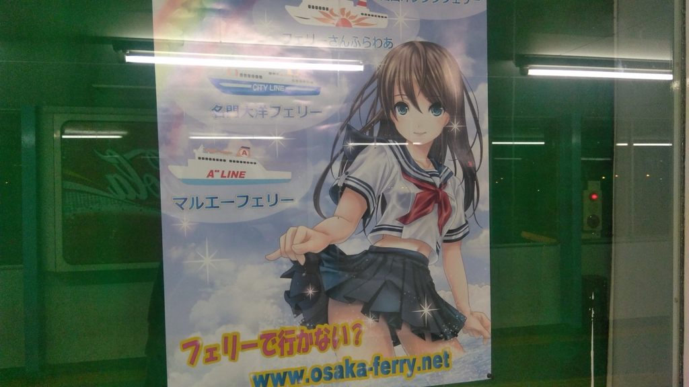
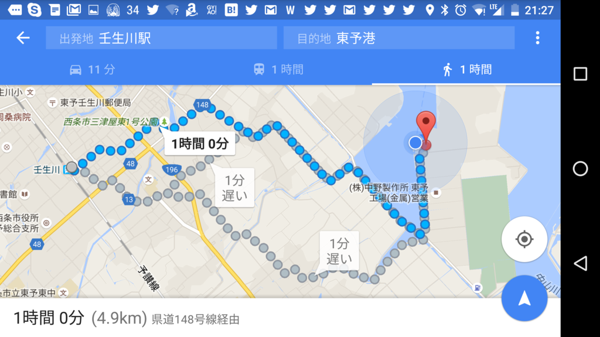
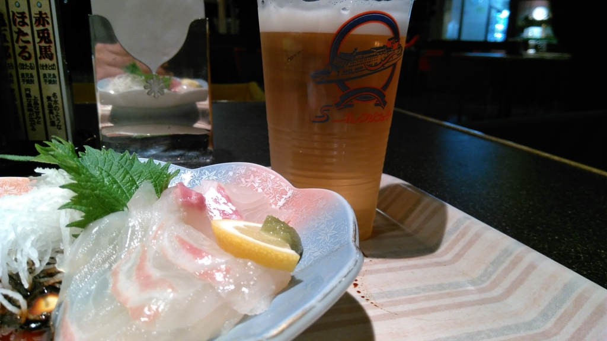
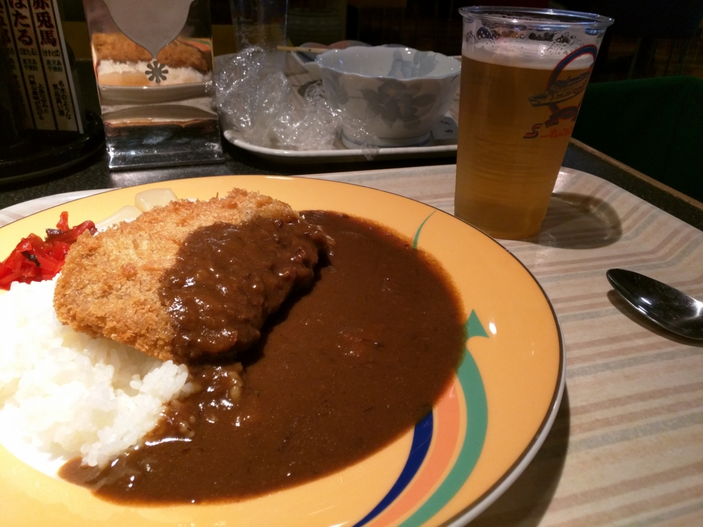
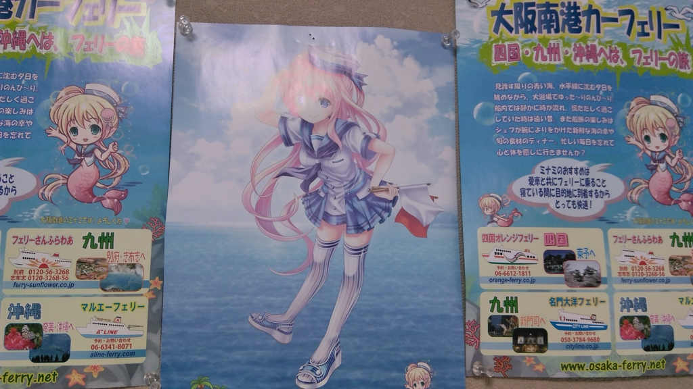

週末は墓参りと Windows Insider Meetup 参加のため、船で大阪へ行った。南港 → 東予港 は何回か経験があるのだけど、その逆は実は初めてだったりする。なぜならば<b>不便だから</b>だ。

<h3>連絡バス</h3>

東予港の最寄り駅は壬生川駅（関西人だと“みぶかわ”と読んでしまいがちだが、“にゅうがわ”と読む）だが、駅～港間に路線バスはないようで、タクシーを使うか、連絡バスを利用する必要がある。

中予～東予港間の場合、連絡バスは3つ用意されているようだ。

<ul>
<li>伊予鉄バス（JR 松山駅～東予港）：22:10着（要予約。有料、松山から 1,230円）</li>
<li>せとうちバス
<ul>
<li>小松総合支所前～東予港：20:21着（無料）</li>
<li>今治営業所～今治駅前～壬生川駅前～東予港：21:53着（無料）</li>
<li>新居浜駅前～西条駅前～氷見～小松総合支所～東予港：21:14着（無料）</li>
</ul></li>
</ul>
ジモティー（※説明しよう、地元の人の意である）にはわかりやすいのかもしれんが、俺には仕組みがさっぱりわからん。そもそも小松総合支所前ってどこや……今治駅前からの路線バス（有料）でたどり着けるらしいが、JR の駅には接続していないのか？　営業所そのものは玉之江駅と伊予氷見駅の間にあるらしいが……。

一番わかりやすいのは JR 松山駅～東予港の伊予鉄バスだが、船内でメシが食いたい自分にとっては、到着時間がかなり遅くなるのがネック。実際、その日はバスが遅れたようで、それを待つために出港（22:30 予定）が少し遅れた。道路状況次第では、あわただしい乗船になるだろう。予約が必要なのもちょっと面倒な感じ。

一方、今治発の便は予約もいらず、料金も取られない。ただ、高縄半島をぐるっと回るのでちょっと遠回りだけど。バスはあまり好きじゃないので、最寄りの壬生川駅から港に行ければいいのだが、それは 21:53着 のバスだけらしい？　新居浜駅・西条駅から 21:14着 のバスに乗るという手もあるが……。

<h3>歩いた。</h3>

考えるのめんどくさくなってきたので、結局、特急しおかぜ（＋いしづち）にのって壬生川駅まで行き、そこからタクシーに乗ることにした。特急が新車で幸せ―！

<iframe src="//hatenablog-parts.com/embed?url=http%3A%2F%2Fwww.sankei.com%2Fwest%2Fnews%2F151019%2Fwst1510190073-n1.html" title="グリーン席は新幹線並み！！ＪＲ四国新型特急８６００系の新車両を公開" class="embed-card embed-webcard" scrolling="no" frameborder="0" style="display: block; width: 100%; height: 155px; max-width: 500px; margin: 10px 0px;"></iframe>

壬生川駅からは、港のほうへ歩きながら店を物色。けれど、一人でのめそうなところがあまりない。正確に言うと、あるにはあるのだが、金曜日だったせいか人が多く、入るには気が引けた。そうこうするうちに、だんだん店が減っていき……あたり一面が真っ暗になった。

クルマが通らないと、自分の足元さえ見えない。もちろん、タクシーなんか通らない。

こんな暗闇の中を歩くのは、いつぶりだろう。星と遠くに見える工場の明かりがきれいなのはいいのだが、油断すると歩道から足を踏み外しそう。フェリーの灯りが遠目に見えたときは、正直、ちょっと安心した。

結局、そのまま1時間ほど歩いて港に到着。乗船手続きを済ませて、鯛のお刺身で無事の到着を祝った。あと、追加でカツカレーも食べたった。ビールも二杯か三杯のんだので、途中の居酒屋でメシ食ってもよかったな！

まぁ、楽しくなくもなかったけど、次に利用するときはおとなしくバスかタクシーに乗ろうと思う。

<h3>おまけ</h3>

なんか最近フェリーへ乗るたびに萌えキャラのポスターが増えている気がする。収益、厳しいのかなぁ……。少し心配だ。

