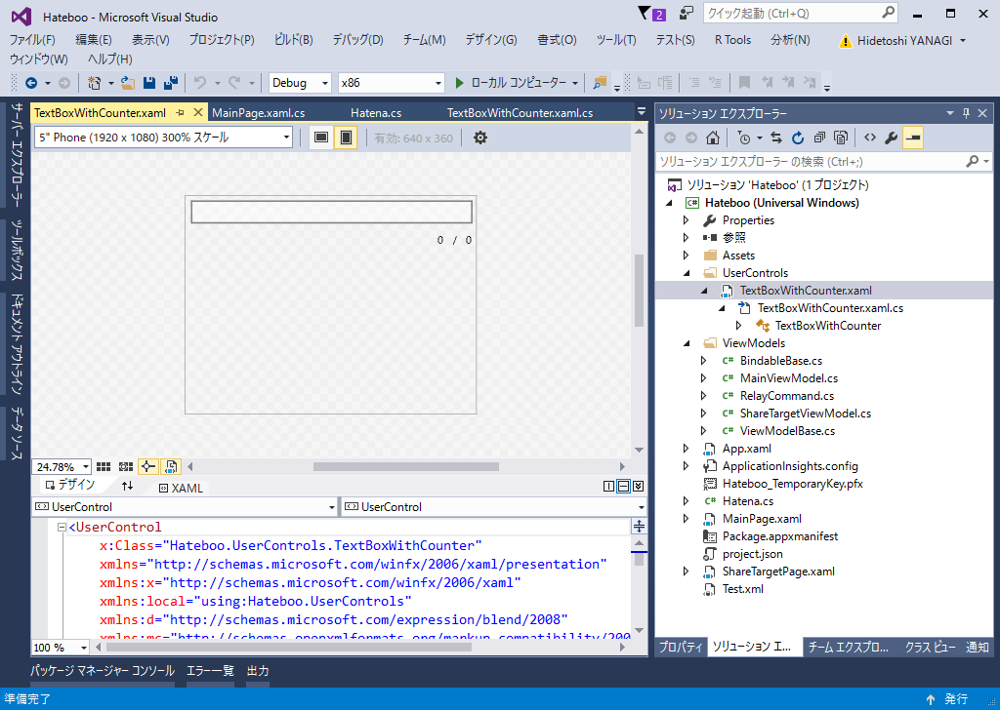

今回作るのは、文字数カウンター付きのテキストボックス。まずはユーザーインターフェイス。

<pre class="code lang-xml" data-lang="xml" data-unlink>&lt;UserControl
    x:Class=&quot;Hateboo.UserControls.TextBoxWithCounter&quot;
    xmlns=&quot;http://schemas.microsoft.com/winfx/2006/xaml/presentation&quot;
    xmlns:x=&quot;http://schemas.microsoft.com/winfx/2006/xaml&quot;
    xmlns:local=&quot;using:Hateboo.UserControls&quot;
    xmlns:d=&quot;http://schemas.microsoft.com/expression/blend/2008&quot;
    xmlns:mc=&quot;http://schemas.openxmlformats.org/markup-compatibility/2006&quot;
    mc:Ignorable=&quot;d&quot;
    d:DesignHeight=&quot;300&quot;
    d:DesignWidth=&quot;400&quot;&gt;

&lt;StackPanel&gt;
&lt;TextBox x:Name=&quot;textBox&quot; TextChanged=&quot;textBox_TextChanged&quot; /&gt;

&lt;StackPanel Orientation=&quot;Horizontal&quot; HorizontalAlignment=&quot;Right&quot;&gt;
&lt;TextBlock x:Name=&quot;textBlockCurrent&quot;&gt;0&lt;/TextBlock&gt;
&lt;TextBlock&gt;/&lt;/TextBlock&gt;
&lt;TextBlock x:Name=&quot;textBlockMax&quot;&gt;0&lt;/TextBlock&gt;
&lt;/StackPanel&gt;
&lt;/StackPanel&gt;
&lt;/UserControl&gt;
</pre>
単にテキストボックスとカウンターラベル（0/100 みたいな表示）を配置しただけ。

（コードを張り付けてから気づいたが、0/100 の / を表示するためだけに TextBlock 使ってるのはアレだな。Run とか使えばよかった）

このコントロールにほしいプロパティは、

<ul>
<li>Text：TextBox の内容</li>
<li>Current：現在の TextBox 文字数</li>
<li>Max：TextBox に入力できる最大の文字数。これをオーバーすると、ラベルが赤くなる</li>
</ul>
ぐらいかな。名前がいまいちなのは気にしないでくれ（Max は Limit とかのほうがよさげやな。英語わからんから知らんけど）。

というわけで、こいつらを<b>依存関係プロパティ</b>として実装する。依存関係プロパティというのはいまだによくわからんが、バインディングがいい感じに動くように <b>CLR プロパティ</b>（フツーの C# のプロパティ）をクラスに登録しておく仕組みって感じだろうか。

基本的にはこんな感じ。

<pre class="code lang-cs" data-lang="cs" data-unlink>// 依存関係プロパティ
public static readonly DependencyProperty MaxProperty = DependencyProperty.Register(
&quot;Max&quot;,　// Max という名前の……
typeof(int),　// int 型の CLR プロパティを……
typeof(TextBoxWithCounter), // クラスに登録するやで―
new PropertyMetadata(0));

// CLR プロパティ
public int Max
{
get { return (int)GetValue(MaxProperty); }
set
{
SetValue(MaxProperty, value);
textBlockMax.Text = value.ToString();
}
}
</pre>
だいたいはこれでいいのだけど、今回の Text プロパティだけは値が変わったときにいろいろごちゃごちゃしなきゃいけないので、コールバックを設定する。

<pre class="code lang-cs" data-lang="cs" data-unlink>public static readonly DependencyProperty TextProperty = DependencyProperty.Register(
&quot;Text&quot;,
typeof(string),
typeof(TextBoxWithCounter),
// コールバックの追加
new PropertyMetadata(string.Empty, new PropertyChangedCallback(TextPropertyChanged))
);

private static void TextPropertyChanged(DependencyObject d, DependencyPropertyChangedEventArgs e)
{
var self = d as TextBoxWithCounter;
var value = e.NewValue as string;

// テキストボックスとラベルの値を更新しとく
self.textBox.Text = value;
self.Current = value.Length;

// アカんときはアカくする
if (self.Current &gt; self.Max)
{
self.IsOverflow = true;
self.textBlockCurrent.Foreground = new SolidColorBrush(Colors.Red);
}
else
{
self.IsOverflow = false;
self.textBlockCurrent.Foreground = （デフォのブラシ）;
}
}
</pre>
かずきさんのおかげで、案外簡単に実装できた……WPF と UWP の違いでちょっとハマったけど。

<iframe src="http://blog.okazuki.jp/embed/2014/09/08/203943" title="WPF4.5入門 その53 「ユーザーコントロール」 - かずきのBlog@hatena" class="embed-card embed-blogcard" scrolling="no" frameborder="0" style="display: block; width: 100%; height: 190px; max-width: 500px; margin: 10px 0px;"></iframe>

