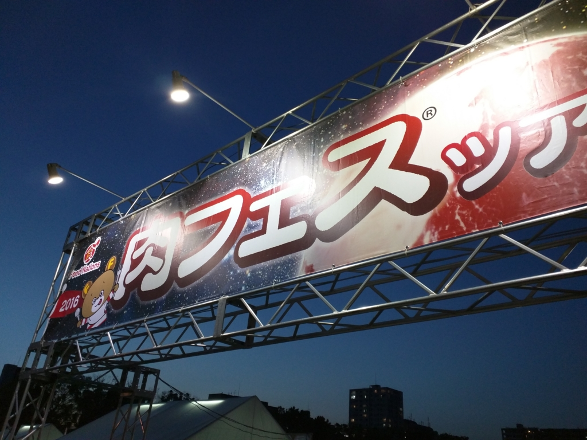
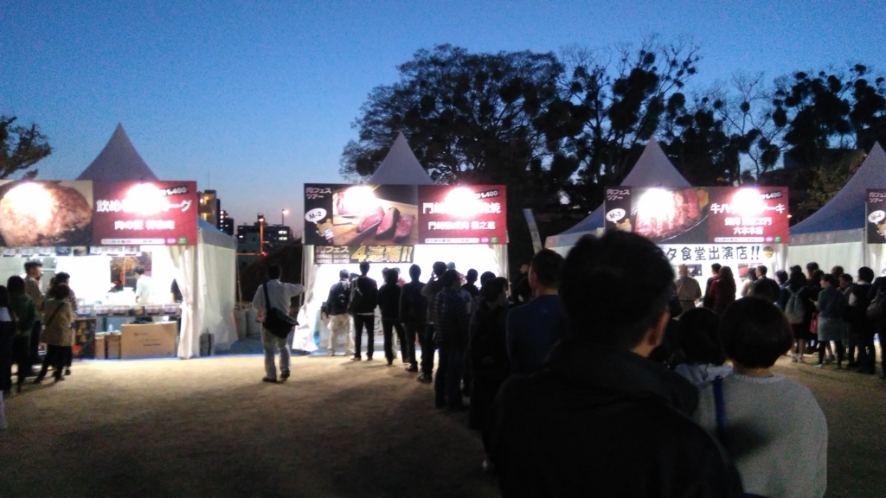
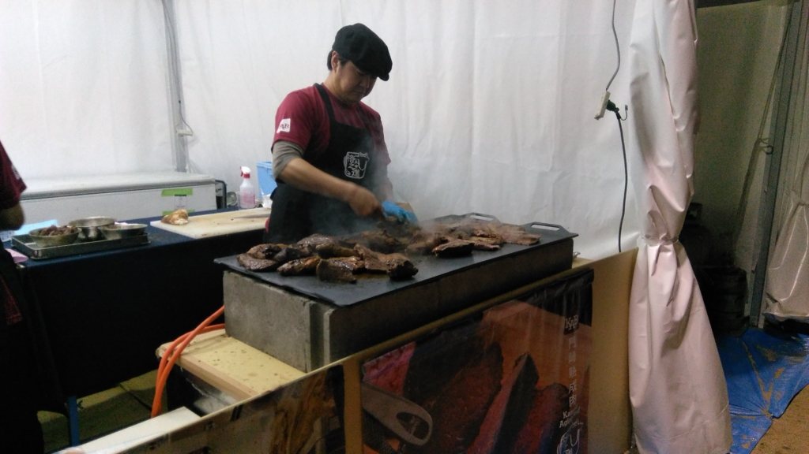
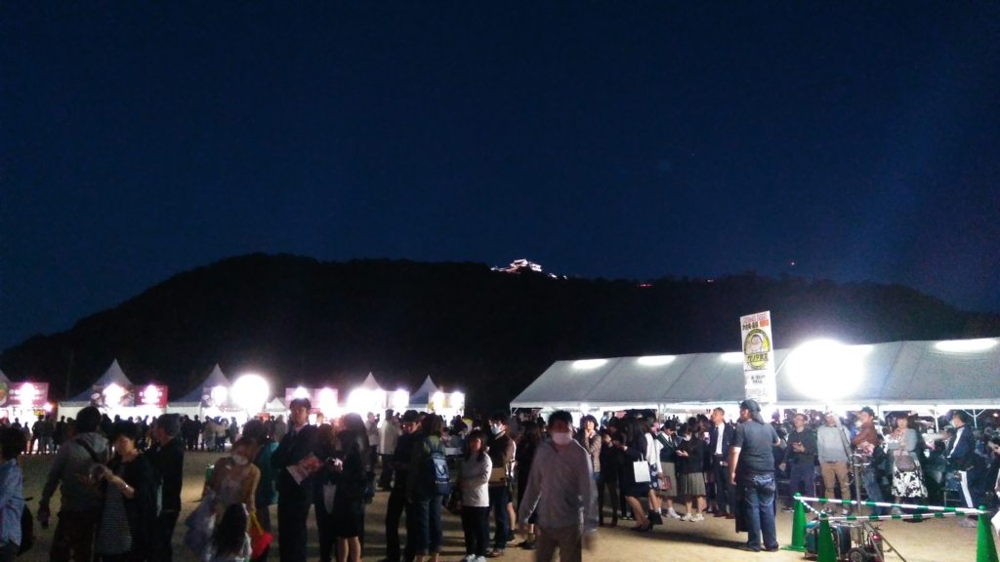

<i>「肉、足りてる？」</i><i>「足りてませーん！」</i>ってことで、「肉フェスツアー2016松山」に行ってきた。松山城の下、堀之内の公園で開催されてマス。

<ul>
<li><a href="http://www.rnb.co.jp/node/95401">&#x8089;&#x30D5;&#x30A7;&#x30B9;&#x30C4;&#x30A2;&#x30FC;2016&#x677E;&#x5C71; | &#x5357;&#x6D77;&#x653E;&#x9001;</a></li>
</ul>
貧乏一人暮らしの自炊だと、豚肉やら鶏肉やらが精いっぱいでな……。

自分でも知らないうちにテンションが上がっていたせいか、Nexus 6 を落っことして液晶を割ってしまった（修理代は3万円らしい）。なんてこったい／(^o^)＼ﾅﾝﾃｺｯﾀｲ

<h3>電子マネー必須……ただし。</h3>

全国から選りすぐりのお肉有名店が屋台を出しているっぽい。屋台では現金は使えず、あらかじめ食券を買っておくか（めっちゃ並ばなきゃいけない！）、電子マネーにお金をチャージしておく必要がある。そんなわけで、自分は“いよてつ IC い～カード”に5,000円ぐらい入れて参戦したのだが……<i>「伊予鉄のカードは使えません(;^ω^)」</i>松山なのにひどい話だ。しょうがないので、手持ちの PASMO を「Kumalica」でチェックしてみた。

<iframe src="//hatenablog-parts.com/embed?url=http%3A%2F%2Fwww.forest.impress.co.jp%2Fdocs%2Freview%2F20160412_752603.html" title="【レビュー】Windows 10 Mobileで電子マネーカードの残高・利用履歴をチェック「Kumalica」 - 窓の杜" class="embed-card embed-webcard" scrolling="no" frameborder="0" style="display: block; width: 100%; height: 155px; max-width: 500px; margin: 10px 0px;"></iframe>

<i>「よかった、2,200円入ってる……」</i><i>おばちゃん「心もとないですねｗｗｗ」</i>やかましいわ( ‘д‘⊂彡☆))Д´) ﾊﾟｰﾝ

同行の @ramusara 氏のカードもチェックしてあげると、なかなかの金額がチャージされていたので、二人合わせればビール＋二店舗ぐらいは回れる。

まずは熟成肉のお店に並んで、1人前をゲット。1パック1,400円、一切れ200円の高級肉だけあって、なかなかおいしかった。しっかし、しょうがないとはいえ、クソたけーな！

熟成肉の次はビールを補給して、キジ肉のお店へ突撃。キジのお肉ってあんまり食べたことがないんだが、どんな味なんだろう？

しかし、ここで悲劇が僕たちを襲う。

辛抱強く順番が回るのを待ち、やっとこさ僕たちが買う番になったのに、@ramusara 氏の電子マネーカードが読み取りエラーになる。自分のカードは、熟成肉＋ビールですでにすっからかん。<i>「なぜだ！」</i><i>「坊やだからさ……」</i>泣く泣く、1皿食っただけで退散する羽目になった。

まぁ、仕方ないね。雰囲気が味わえただけでもいいか。

<h3>飲み直した</h3>

そのあとは、二人で松山駅周辺の居酒屋を開拓。

<blockquote class="twitter-tweet" data-lang="ja">
割かしいい店 (@ 大黒屋) <a href="https://t.co/uFUUr2WYjt">https://t.co/uFUUr2WYjt</a>
&mdash; だるやなぎ（エリス教に改宗） (@daruyanagi) <a href="https://twitter.com/daruyanagi/status/720944447555575808">2016年4月15日</a></blockquote>

なんか内装がワイルドで素敵な感じの店だった。常連さんが多い店なのかな？　入って少しの間はギコチナイ雰囲気を感じたけど、そのうち打ち解けて、カウンターで隣になったおじさん・おばさんとも少ししゃべった。またおいでといわれたので、ぜひ遊びに行きたいと思う。

イノシシのお鍋、おいしかった！（写真撮るの忘れた

<h3>おまけ</h3>

<blockquote class="twitter-tweet" data-lang="ja">
めっちゃゆれてるー
&mdash; だるやなぎ（エリス教に改宗） (@daruyanagi) <a href="https://twitter.com/daruyanagi/status/721011932820406272">2016年4月15日</a></blockquote>

家に帰って、布団に転がり、このつぶやきを残してそのまま眠りに落ちましたとさ。あんなにデカい地震になってるとは……((((；ﾟДﾟ)))ｻﾞｸｸﾞﾌｹﾞﾙｸﾞｸﾞ

