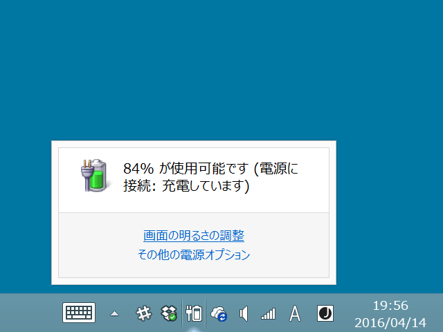
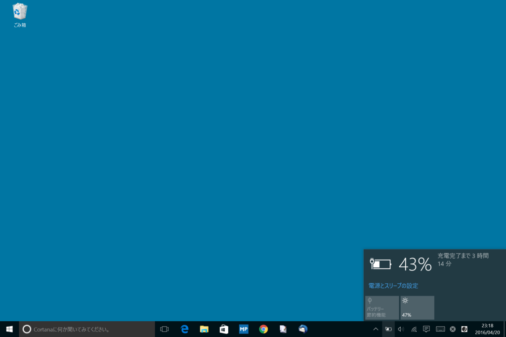
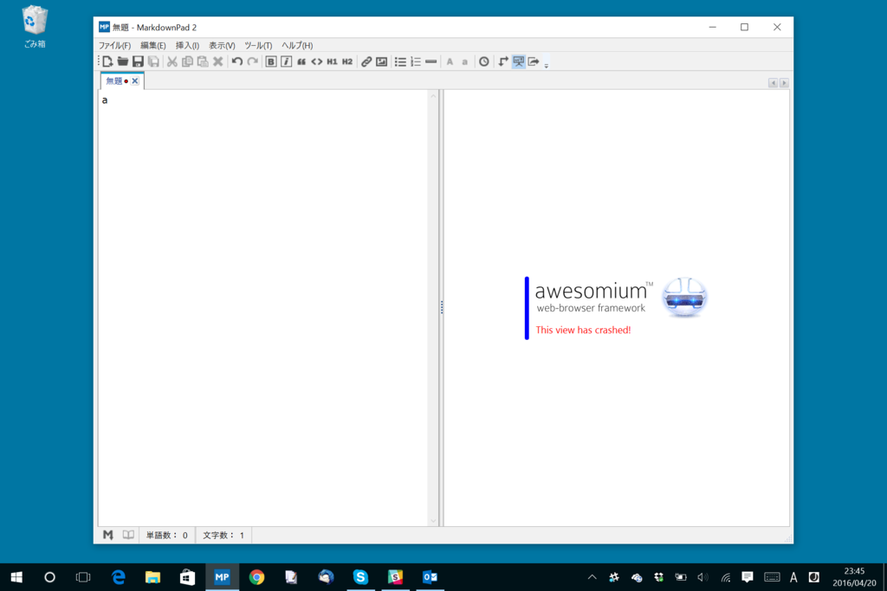
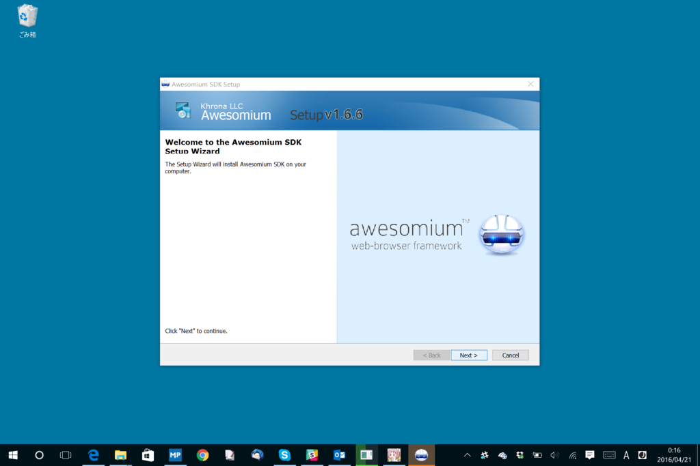
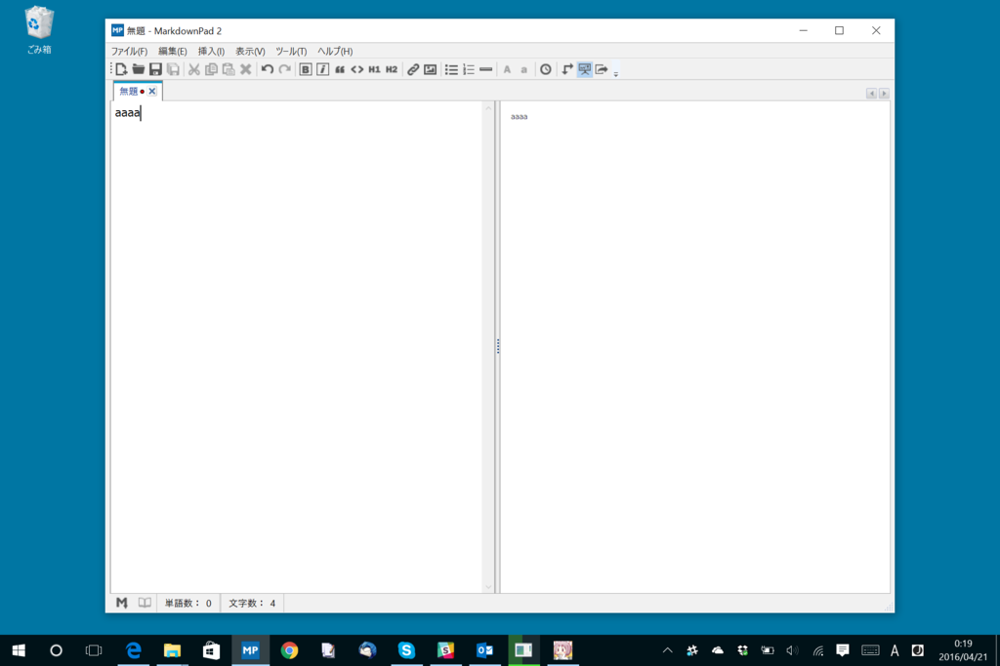
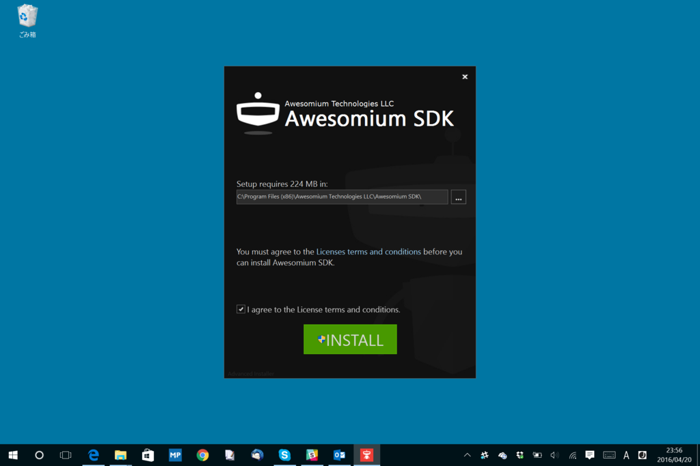

最近 Surface 3（Windows 8.1）の調子が悪く、純正のアダプターとケーブルを使っているにもかかわらず、ときどき充電されなくなる。とはいえ、いつも充電されないわけではない。調子よく充電されているときもあるし、安心してそのまま放置しているとバッテリーレベルが下がって勝手にスリープしていたりする。しょうがないので、使わないときはなるべくスリープさせておくなどの回避策でしのいでいた。

しかし、それでも充電されなくなった。このままだと永遠に目覚めなくなるかもしれないので、本格的な対策をとってみた。

<iframe src="//hatenablog-parts.com/embed?url=https%3A%2F%2Fwww.microsoft.com%2Fsurface%2Fja-jp%2Fsupport%2Fwarranty-service-and-recovery%2Fsurface-wont-turn-on-battery-wont-charge%3Fos%3Dwindows-8.1-update-1" title="Surface のバッテリーが充電されない | バッテリーが検出されない | バッテリーのトラブルシューティング" class="embed-card embed-webcard" scrolling="no" frameborder="0" style="display: block; width: 100%; height: 155px; max-width: 500px; margin: 10px 0px;"></iframe>

それでも全然ダメ。手順通り全部試したが、状況は改善されない。最後にはバッテリー関係のデバイスドライバーを抜いて再インストールするところまでやってみたのだけど、これもダメ。というか、やってるうちにバッテリーが尽きそうになった。

しょうがないので、残りバッテリー 18％ の状態から Windows 10 へのアップデートを試みた。

そのまま少し放置していたのだけど、起動させてみるとバッテリーが 40％ ちょっとにまで回復していた。稼働中の充電も正常で、そのまま 100％まで充電できた。うまくいったみたい？　ハードウェアのトラブルではなさそうで、ちょっと安心した。

さて、Windows 10 はそんなに嫌いじゃないのだが、個人的に一つ困っていたことがある。Markdown Pad 2 のプレビューがクラッシュするのだ。

お気に入りの Markdown エディターだったので、これはちょっと困る。そんなわけで Surface 3 だけは Windows 8.1 のままにしていたのだが、アップグレードしちゃったので本腰を入れて回避策を考えなくちゃいけない。

<blockquote cite="http://markdownpad.com/faq.html">

LivePreview is not working - it displays an error message stating This view has crashed!

This issue has been specifically observed in Windows 8. You may see an error message as shown here, and no HTML will be rendered when you type in the Markdown Editor pane.

To fix this issue, please try installing the <a href="http://markdownpad.com/download/awesomium_v1.6.6_sdk_win.exe">Awesomium 1.6.6 SDK</a>.

If you continue to experience issues, please install Microsoft's DirectX End-User Runtimes (June 2010).

<cite><a href="http://markdownpad.com/faq.html">MarkdownPad - Frequently Asked Questions</a></cite>
</blockquote>

公式サイトにちゃんと修正方法が載ってた／(^o^)＼

というわけで、Awesomium 1.6.6 SDK を適当に

<ul>
<li>古いバージョンを削除</li>
<li>Typical インストール</li>
</ul>
でセットアップしたところ、ちゃんと Markdown Pad 2 が Windows 10 でも動くようになった＼(＾o＾)／

Markdown Pad 2 は要再起動。

ちなみに Awesomium SDK の最新版は 1.6.6 ではないらしいのだけど、新しいバージョンではちゃんと動かなかった。インストーラーがこんな感じのおしゃれな奴になっていたら、それは違うバージョンなので入れないほうがいいと思う。

<iframe src="//hatenablog-parts.com/embed?url=http%3A%2F%2Fwww.forest.impress.co.jp%2Fdocs%2Fnews%2F20130307_590701.html" title="ゼロから再設計された「MarkdownPad 2」が公開、タブ・構文強調などの新機能を搭載 - 窓の杜" class="embed-card embed-webcard" scrolling="no" frameborder="0" style="display: block; width: 100%; height: 155px; max-width: 500px; margin: 10px 0px;"></iframe>

終わり。

<h3>おまけ</h3>

<blockquote class="twitter-tweet" data-lang="ja">
Good news: Finished the initial prototype for a completely new HTML renderer. Much better support for Win10. More to come soon.
&mdash; MarkdownPad (@MarkdownPad) <a href="https://twitter.com/MarkdownPad/status/701632189574688769">2016年2月22日</a></blockquote>

はよ！

