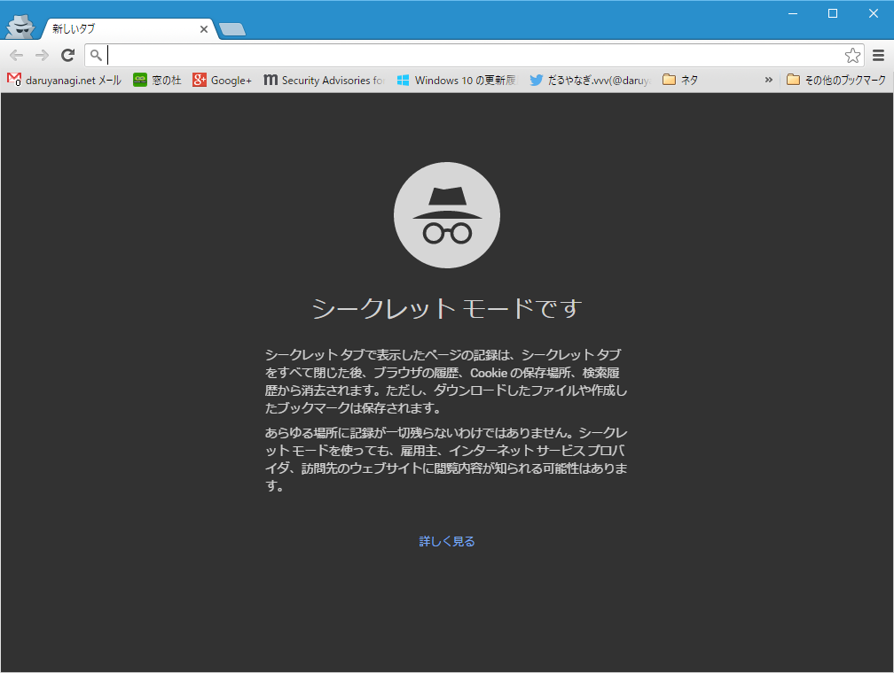

あんまり利用しない機能なので気が付かなかったけど、ちょっとデザインが変わってた。

<blockquote>

シークレット タブで表示したページの記録は、シークレット タブをすべて閉じた後、ブラウザの履歴、Cookie の保存場所、検索履歴から消去されます。ただし、ダウンロードしたファイルや作成したブックマークは保存されます。

あらゆる場所に記録が一切残らないわけではありません。シークレット モードを使っても、雇用主、インターネット サービス プロバイダ、訪問先のウェブサイトに閲覧内容が知られる可能性はあります。

</blockquote>

説明も少し丁寧で、わかりやすいものになっているのかな。いかんせん、以前のものを覚えていないのデ。

あと、中身もいろいろ変わってるみたい。

<blockquote cite="http://googledevjp.blogspot.jp/2016/06/chrome-51credential-management-api.html">

画面外レンダリングのオーバーヘッド削減

最近の一般的なウェブサイトには、ビデオ、ソーシャル ウィジェット、広告などのオリジンを跨いだコンテンツが埋め込まれています。こういったリソースを埋め込むことによって魅力的なコンテンツを提供できる一方、これによって大きなオーバーヘッドが発生し、ページ側からは制御できない不自然な動作が起きることがあります。最新バージョンの Chrome では、画面外のレンダリング パイプラインは実行されず、画面外にあるオリジンを跨いだフレームに対する requestAnimationFrame() コールバックは呼び出されません。これによって、不要な動作が削減されます。いくつかの人気モバイルサイトでは、ユーザーの使い勝手に影響を与えることなく、最大 30% の消費電力を節約できるようになります。

<cite><a href="http://googledevjp.blogspot.jp/2016/06/chrome-51credential-management-api.html">Google Developers Japan: Chrome 51&#xFF1A;Credential Management API &#x3068;&#x753B;&#x9762;&#x5916;&#x30EC;&#x30F3;&#x30C0;&#x30EA;&#x30F3;&#x30B0;&#x306E;&#x30AA;&#x30FC;&#x30D0;&#x30FC;&#x30D8;&#x30C3;&#x30C9;&#x524A;&#x6E1B;</a></cite>
</blockquote>

アップデートしてから妙に重いのは、拡張機能のせいかな？　調べるのめんどくさいので放置しているけれど、そろそろ我慢できないので暇を見つけて取り組まねば。

