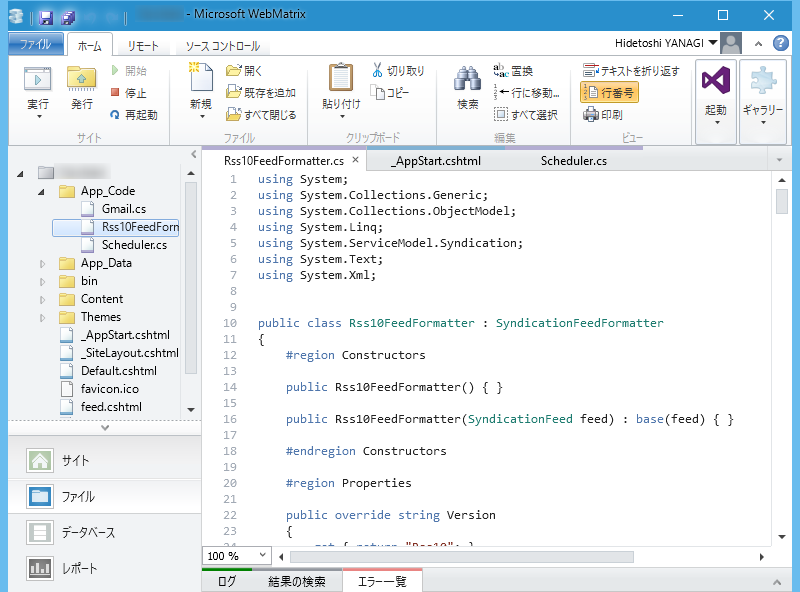

ASP.NET Web Pages 製の BOT が、ある日を境に突然、System.Xml.XmlException エラーを吐くようになった。

<blockquote>

The element with name 'RDF' and namespace '<a href="http://www.w3.org/1999/02/22-rdf-syntax-ns#'">http://www.w3.org/1999/02/22-rdf-syntax-ns#'</a> is not an allowed feed format. 

</blockquote>

某サイトのリニューアルで、RSS 2.0 が RSS 1.0 になったせいでフィードが読めなくなったらしい／(^o^)＼

<blockquote cite="http://www.4guysfromrolla.com/articles/031809-1.aspx">

Classes That Model Syndication Feeds and Items

<ul>
<li><b>SyndicationFeed</b> - represents a syndication feed. Has properties like Title, Description, Links, and Items. The Items property represents the collection of content items expressed in the feed.</li>
<li><b>SyndicationItem</b> - represents a specific syndication feed item and includes properties like Title, Summary, PublishDate, Authors, and so on.</li>
</ul>
Classes That Transform Syndication Feeds To/From XML

<ul>
<li><b>Rss20FeedFormatter</b> - can take a SyndicationFeed object and turn it into XML that conforms to the RSS 2.0 specification. Also, can be used to consume a properly-formatted RSS 2.0 feed, turning the XML into a SyndicationFeed object with its properties set based on the data in the consumed XML.</li>
<li><b>Atom10FeedFormatter</b> - same as the Rss20FeedFormatter, but uses the Atom 1.0 standard.</li>
</ul>
<cite><a href="http://www.4guysfromrolla.com/articles/031809-1.aspx">Syndicating and Consuming RSS 1.0 (RDF) Feeds in ASP.NET 3.5 - 4GuysFromRolla.com</a></cite>
</blockquote>

<b>Rss10FeedFormatter</b> は標準で用意されていないみたいなので、自分で実装する必要がある。

<iframe src="//hatenablog-parts.com/embed?url=https%3A%2F%2Fgithub.com%2Fmono0926%2FReactivePinboard%2Fblob%2Fmaster%2FReactivePinboard.PCL%2FRss10FeedFormatter.cs" title="mono0926/ReactivePinboard" class="embed-card embed-webcard" scrolling="no" frameborder="0" style="display: block; width: 100%; height: 155px; max-width: 500px; margin: 10px 0px;"></iframe>

幸い、コードが GitHub に転がっていたので拝借（見覚えのあるアイコンの人だなぁ……）。おおきにさんきゅーやで！

これを以下のように呼び出してやれば、解決。めでたしめでたし。

<pre class="code lang-cs" data-lang="cs" data-unlink>try
{
feed = SyndicationFeed.Load(reader);
}
catch
{
// エラーがでたら RSS 1.0 ってことにしておく
var formatter = new Rss10FeedFormatter();
formatter.ReadFrom(reader);
feed = formatter.Feed;
}
</pre>