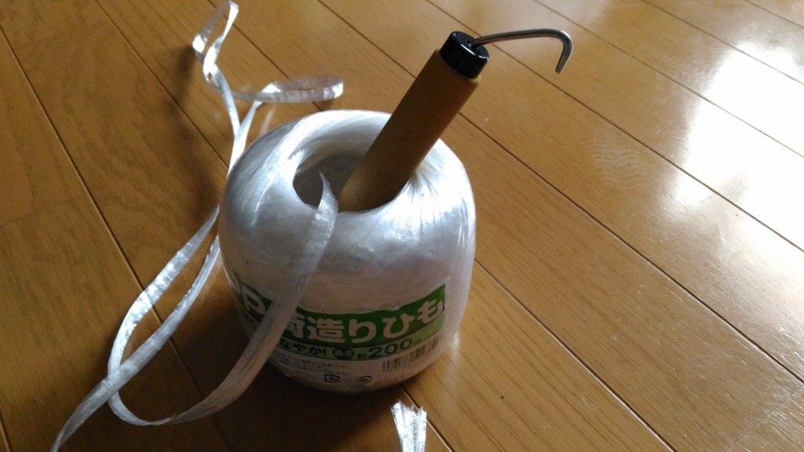

どうも。所得の2割は Amazon に貢いでいるアマゾニストです。部屋が段ボールであふれて死にそうです。市のゴミ出しマニュアル見たら、「段ボールはヒモでくくれ」って書いてあるんだけど、自分はこれが超苦手。ゆるゆるにしか縛れなくて、ゴミ捨て場へもっていく途中に段ボールが空中分解したりする。えらいことやで。

そんなわけで、こんなのを買ってみた。

<a href="http://www.amazon.co.jp/exec/obidos/ASIN/B006Q54U86/bestylesnet-22/">イーリス ひも結束グッズ 巻えもん</a>
<ul><li>出版社/メーカー: イーリス</li><li>メディア: ホーム&キッチン</li><li>購入: 1人 クリック: 1回</li><li><a href="http://d.hatena.ne.jp/asin/B006Q54U86/bestylesnet-22" target="_blank">この商品を含むブログを見る</a></li></ul>

なんかヒモをクルクルするだけでいわえるらしいんやわ。

<a href="http://www.amazon.co.jp/exec/obidos/ASIN/B003EJGUE4/bestylesnet-22/">イーリス ひも結束グッズ ひもくるりん</a>
<ul><li>出版社/メーカー: イーリス</li><li>メディア: ホーム&キッチン</li><li>購入: 16人 クリック: 31回</li><li><a href="http://d.hatena.ne.jp/asin/B003EJGUE4/bestylesnet-22" target="_blank">この商品を含むブログを見る</a></li></ul>

こっちが元祖な気がするけど（サカナの形をしたヤツ）、すぐに壊しそうな気がしたので、少し丈夫そうな不をチョイスした。太めの針金、握りの部分は木でできていて、少しぐらいなら力をかけても壊れなさそう。尾っぽにはヒモを切るカッターがついていて、ハサミを用意する必要がない。

マキマキ結束は最初、なかなかうまくいかなかったけれど（激おこ）、心を無にして何回か挑戦したところ、だんだんいい感じに結束できるように。

言葉では伝えにくいのだけど、このマニュアルイメージで言うと③をしっかりやるのがコツかな？　ぶっちゃけ、① はそんなに大事じゃないと思う。

おかげで段ボールを結束するのが苦痛ではなくなり、紙類ゴミの日が少し楽しみになった。

