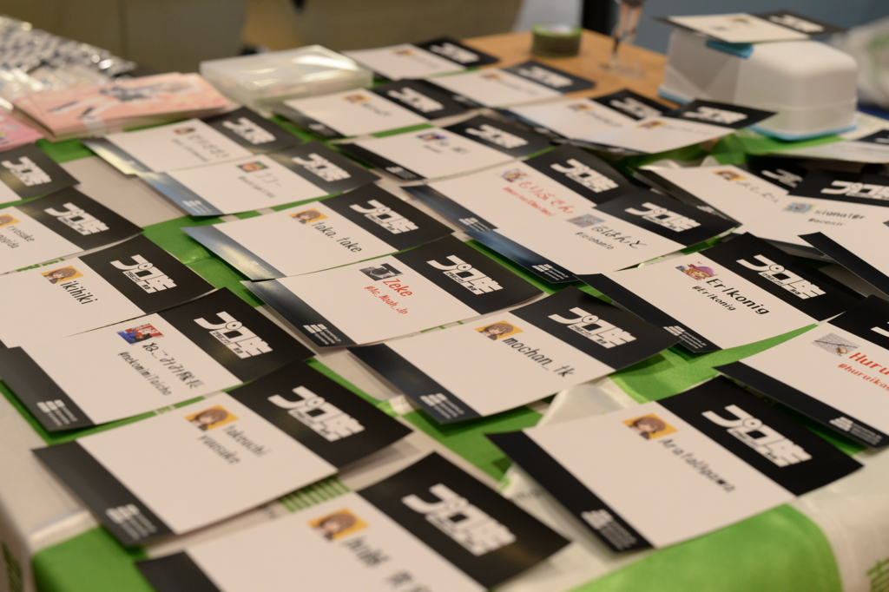
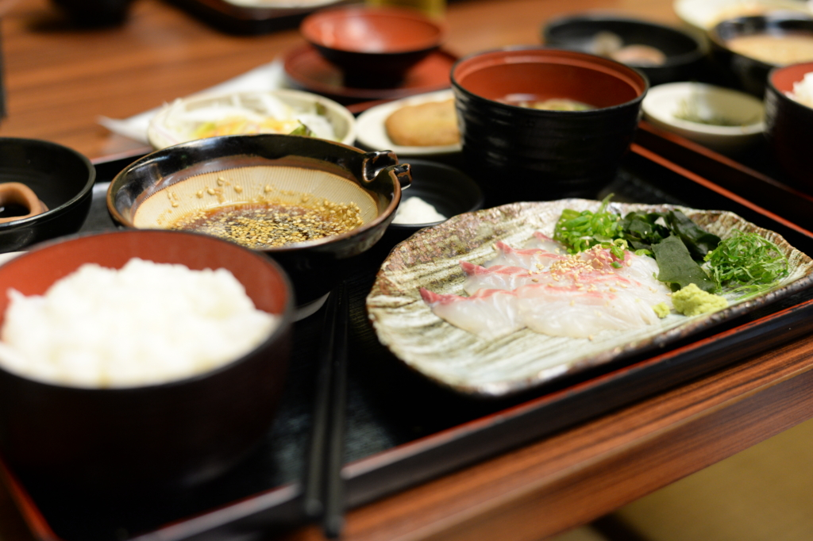
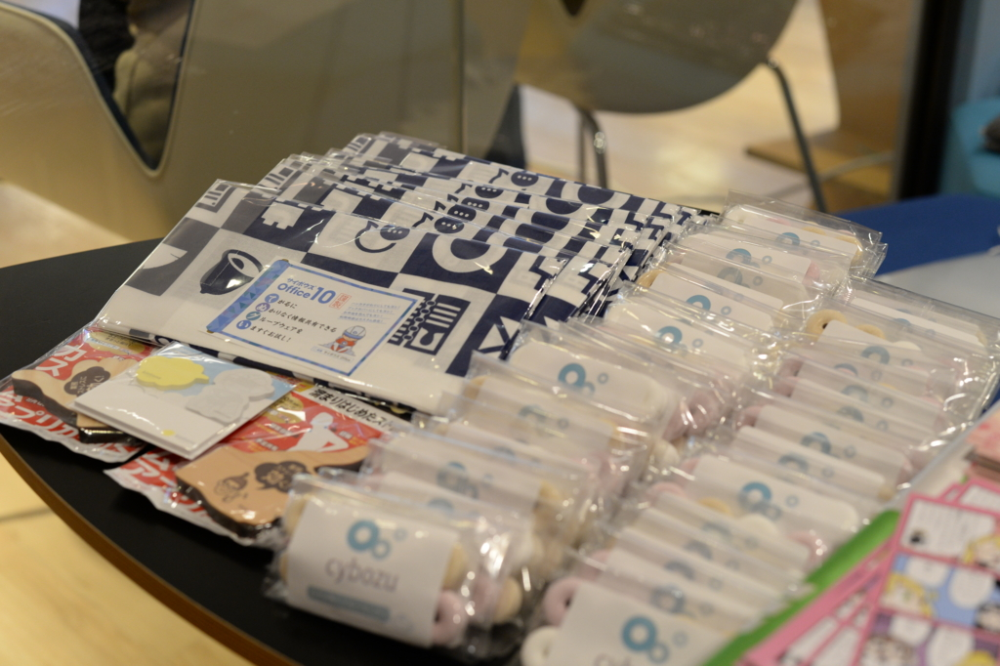
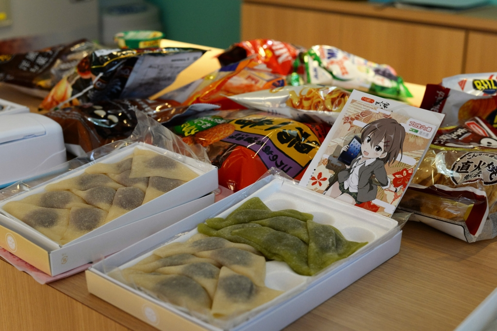
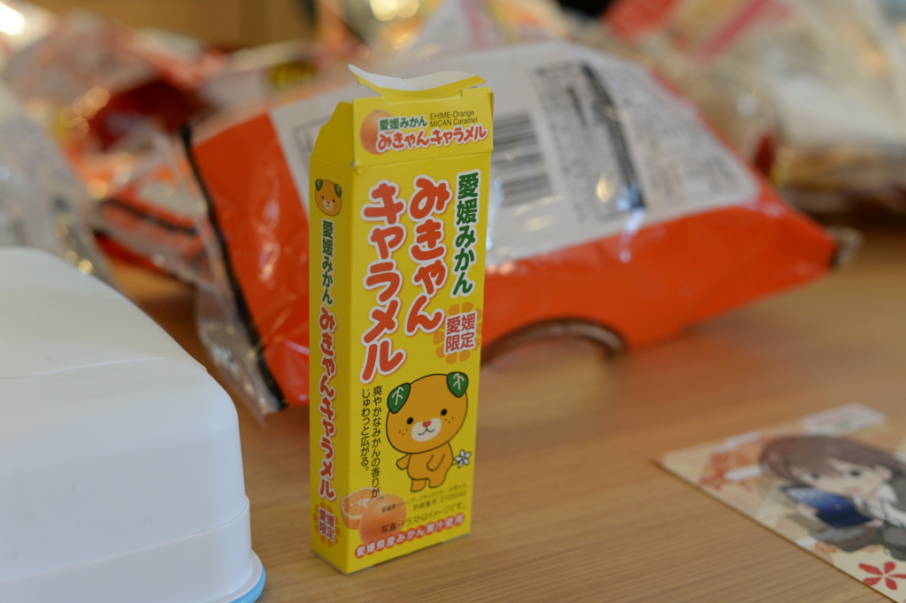

今年も愛媛・松山で無事“プロ生”ができました。

<iframe src="//hatenablog-parts.com/embed?url=https%3A%2F%2Fatnd.org%2Fevents%2F75725" title="プログラミング生放送勉強会 第41回＠サイボウズ株式会社 松山オフィス（6/18開催） : ATND" class="embed-card embed-webcard" scrolling="no" frameborder="0" style="display: block; width: 100%; height: 155px; max-width: 500px; margin: 10px 0px;"></iframe>

今年は参加希望者 33名、ちょこっとだけ無断欠席が出たので、30名には少し届かなかった気がしますが、これでも東京換算で80名以上の参加者が得られました。存続の危機に陥っていた時期のことを思うと、万感の思いというか、まぁ、そんな感じです。

詳しい内容は、なかじ先生のブログにお任せ。

<iframe src="http://blog.nakajix.jp/embed/2016/06/23/090000" title="プログラミング生放送勉強会 第41回＠サイボウズ株式会社 松山オフィス を開催 #pronama - なか日記" class="embed-card embed-blogcard" scrolling="no" frameborder="0" style="display: block; width: 100%; height: 190px; max-width: 500px; margin: 10px 0px;"></iframe>

ちなみに、

<blockquote>

準備含めて殆どだるやなぎ氏がやってくれたんだけどね！ありがとう。だるさん！

</blockquote>

って書いてくれてるけど、僕がやったのは つもりん（@tmyt）の召喚と懇親会の予約ぐらいだった気がします。ATND たてたり、サイボウズさんに場所をお借りする折衝なんかは全部なかじ先生がやってくれました。ので、去年よりはなんもやってない感じです（ちょっとリアルで忙しかったこともあり、気力が足りなかったのもある）。今年は地元の方が積極的に参加してくれたのがうれしく、海外（四国より外のことです）からスピーカーを何人も呼ばないと成り立たなかった頃を思うと、ちゃんと根付いてきたかなぁ、って思います。だんだん若い人が運営にかんでくれて、僕みたいなおじさんが観衆に徹することができるようになるとうれしいな。

<h3>開場前</h3>

わざわざ飛行機で来てくれた つもりん を五志喜（サイボウズ松山オフィスの真ん前にある郷土料理屋さん）さんで接待。宇和島鯛飯を食べました。毎朝食べたいです。

あと、つもりんに Robin を見せてもらいました。

<iframe src="http://blog.tmyt.jp/embed/2016/03/24/020919" title="Nextbit Robinがやってきたよ！ - tmytのらくがき" class="embed-card embed-blogcard" scrolling="no" frameborder="0" style="display: block; width: 100%; height: 190px; max-width: 500px; margin: 10px 0px;"></iframe>

薄くて、カッコいいというかポップでそことなくおしゃれな感じ？ ASUS Zenfone MAX を買った直後でなければ、ほしかったかも……。これ、キャリアから売ればバカ売れなんじゃないかな？

ご飯を食べてサイボウズさんに行くと、なかじ先生が待ってました。お昼ご飯誘えばよかったなーとちょっと後悔。

そのあとは受付の設営。サイボウズさんの中のヒトから、ノベルティをたくさんいただきました。ちゃんと聞いていなかったのですが、サイボウズさんって会社のロゴが変わったのかな？　なんかそのロゴっぽいラムネをいただいたのですが、笛になるので気に入りました。美味しかったです。

美味しかったといえば、おやつコーナーも忘れてはいけませんね。皆さんが持ち寄ってくれたので、今年も豪華でした。ぼくも「みかんクッキー」を用意していたのですが、家に忘れました。ほんまごめんなさい。

<h3>セッション</h3>

詳しい内容はなかじ先生のブログにお任せしてしまいますが、今回は Twilio が熱かったみたいです。特にセッションを担当してくださった沖さんは TwilioJP-UG 愛媛 でも活躍されているみたいで、また今度個人的に参加したいなーって思いました（サイボウズの Web データベースみたいな感じのサービス kintone もちょっと前々から聞いてみたかったのでいい機会になりました）。

あと、@jz5 の「Text-To-だるやなぎスピーチ」はほんま最低でした。

<iframe src="//hatenablog-parts.com/embed?url=http%3A%2F%2Fpronama.azurewebsites.net%2F2016%2F06%2F20%2Ftext-to-daruyanagi-speech%2F" title="テキストを柳 英俊の声で再生する「Text-To-だるやなぎスピーチ」を作った" class="embed-card embed-webcard" scrolling="no" frameborder="0" style="display: block; width: 100%; height: 155px; max-width: 500px; margin: 10px 0px;"></iframe>

前の日にニヤニヤしながら「協力してくれ」というので、快く引き受けたらこれだよ。

<iframe width="560" height="315" src="https://www.youtube.com/embed/N-rwxTlQPZg" frameborder="0" allowfullscreen></iframe>

まぁ、でも、みんなが楽しんでくれたならそれはそれでよかったかも。

つもりんには「UWP アプリ関係でなんかいい感じのお話をお願い」みたいな感じで無茶ぶりをしたのですが、なんかいい感じにまとめてくれてすごいと思いました。UWP アプリのタイトルバーとかってあんな感じでカスタマイズできたのか。そういえば、そういうアプリ最近多いけど、中身がどんな感じになってるかまでは調べようと思わなかった。知的退化やね。

セッションで紹介してくれた UWP カスタマイズは NuGet パッケージにまとめられ、GitHub で公開されています。

<iframe src="//hatenablog-parts.com/embed?url=https%3A%2F%2Fgithub.com%2Ftmyt%2FPrettyBars" title="tmyt/PrettyBars" class="embed-card embed-webcard" scrolling="no" frameborder="0" style="display: block; width: 100%; height: 155px; max-width: 500px; margin: 10px 0px;"></iframe>

<iframe src="//hatenablog-parts.com/embed?url=https%3A%2F%2Fgithub.com%2Ftmyt%2FPrettyAppTemplate" title="tmyt/PrettyAppTemplate" class="embed-card embed-webcard" scrolling="no" frameborder="0" style="display: block; width: 100%; height: 155px; max-width: 500px; margin: 10px 0px;"></iframe>

これでキミの UWP アプリもプリティーだぜ！

takeuchi yuusuke さんの関数型プログラミングの話は、「あー、C# で言うところの LINQ やなー」みたいな感じで聞いていました。これに関しては懇親会でも少しお話をしたのだけど、モナド的な話は少しおいておいて、こういう関数型の手法は言語を超えて“当たり前”になりつつあるなーと感じました。

構造化プログラミングは“そのコードはデータをどう加工をしているのか”、オブジェクト指向プログラミングは“そのオブジェクト（データ＋コード）どんな役割をもっているのか”を記述するのに特化しているとすれば、関数型プログラミングというのは“データとデータがどんな関係なのか”を記述しているのかなって、個人的には感じます。だから、データを扱うのは得意な感じですね。でも、ほかのパラダイムが不要といえばそういうわけではなく、ミクロな処理なら構造化プログラミングを知らなきゃ話にならないし、途方もなく巨大な仕様をコードに写し取るにはオブジェクト指向でないと無理。関数型プログラミングはその間を埋めるちょうどいい道具だし、僕らが扱う程度の粒度にはピッタリな感じなんじゃないかな。知らんけど。

そのほか、ライトニングトークに参加された方もお疲れ様でした。僕も付け焼刃で考えてきた「Windowsフォントはふぉんとに汚いのか？」をやらせていただいたのですが、まだまだ修行が足りない感じですね。若い子の方がプレゼンがうまくて、おじさんは死にたいです。

<h3>懇親会</h3>

あとは街に繰り出して懇親会へ。ちょうど大街道では土曜夜市の開催中でした。割と長い間やって要るっぽいので、また顔を出したいなー。懇親会のお料理はまぁまぁでした。去年の方がコスパがよかったけど、やっぱりお座敷の方が交流があっていいかも。

では、また来年！

<h3>追伸</h3>

明日は Hololense お触り会です！　参加者の方はよろしくお願いしますー。

<iframe src="//hatenablog-parts.com/embed?url=http%3A%2F%2Fhololens.connpass.com%2Fevent%2F31786%2F" title="HoloLens おさわり会 in 愛媛・松山 マツヤマンスペース (2016/06/25 14:00〜)" class="embed-card embed-webcard" scrolling="no" frameborder="0" style="display: block; width: 100%; height: 155px; max-width: 500px; margin: 10px 0px;"></iframe>

