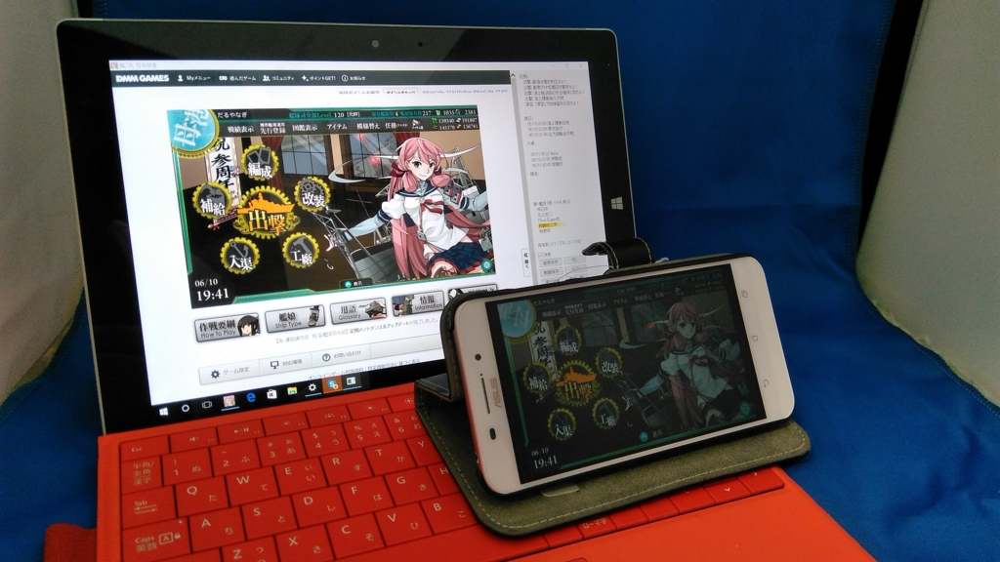

（おもに艦これ端末として）愛用していた Surface 3 が突如、充電できなくなった。記録によると 4月13日 のことらしい。

<blockquote class="twitter-tweet" data-lang="ja">
純正アダプタ―＆ケーブルなのに Surface 3 が充電できなくなる → いろいろヘルプ見て直す → 18％まで回復 → 艦これできるー(＾ω＾) → 知らん間に減ってて、出撃中にシャットダウン → ( ;∀;)
&mdash; だるやなぎ に天使が舞い降りた！ (@daruyanagi) <a href="https://twitter.com/daruyanagi/status/720141577654435840?ref_src=twsrc%5Etfw">2016年4月13日</a></blockquote>

サポートサイト（）などを参照してあらゆる手を尽くしたが、いかんせん、充電ができないので対処の時間が限られている。純正の充電アダプターのほかに、サードパーティ製のUSB充電器も試してみたが、結果は芳しくない。

同時に別の PC でチャットによるサポートを受けようと思ったが、そっちはエラーで動かなかったり、動いてもクローズしてたりで役に立たん。

<blockquote class="twitter-tweet" data-lang="ja">
さっきまでオープンしてたのに……ふぁー <a href="https://t.co/l6BcLZBHzp">pic.twitter.com/l6BcLZBHzp</a>
&mdash; だるやなぎ に天使が舞い降りた！ (@daruyanagi) <a href="https://twitter.com/daruyanagi/status/720065952553930752?ref_src=twsrc%5Etfw">2016年4月13日</a></blockquote>

<blockquote class="twitter-tweet" data-lang="ja">
Surface のサポートページ、APS .NET とか開発してる会社のプロダクトとは思えん出来だ
&mdash; だるやなぎ に天使が舞い降りた！ (@daruyanagi) <a href="https://twitter.com/daruyanagi/status/720073495623827457?ref_src=twsrc%5Etfw">2016年4月13日</a></blockquote>

結局、電源を落とした状態だと少しずつ充電されるところまでは行ったものの、OS を起動してトラブルシューティングしていると減っていくという状況は変わらず、ついにうんともすんとも動かなくなった／(^o^)＼

そんなわけで、ゴールデンウイーク前に急遽、Macbook を買う羽目になった。

<h3>サポートに電話</h3>

<iframe src="https://hatenablog-parts.com/embed?url=https%3A%2F%2Fblog.daruyanagi.jp%2Fentry%2F2016%2F06%2F12%2F231047" title="Surface 3 が充電できなくなったので、急遽古い“新しい Macbook”を買った - だるろぐ" class="embed-card embed-blogcard" scrolling="no" frameborder="0" style="display: block; width: 100%; height: 190px; max-width: 500px; margin: 10px 0px;"></iframe>

で、そのときに松山のエディオンでおっちゃん相手に愚痴ったところ、「ここに電話すればいいですよ！」と連絡先の紙をいただいたので、週が明けてから電話をかけてみた。

するとこっちは案外すんなり通って、無償で交換してもらえることになった。

ゴールデンウイークを挟むため、到着が遅くなってしまうかもしれないと言われたが、そっちはもう Macbook を確保してしのげるので問題ない。むしろ東京の実家に帰るため荷物を受け取れないので、ゆっくり発送してくれとお願いした。あと、OS が初期状態で Windows 10 になってしまうとも案内されたが、それも問題ない（買ったときは Windows 8.1 だった）。すべての付属品を外し、適当に梱包して、着払いでサポートセンターへ送り届けた。

このとき注意したいのが、<b>メモリーカードや SIM カードも抜いておくこと</b>。とくに SIM カードはサポートのお姉さんに<i>「SIM カードも抜いてくださいね」</i>って言われなかったらそのままにして発送するところだった。あぶないあぶない。

それにしてもサポートのお姉さんってみんな声がきれいな感じがする。応対も丁寧だったので、一連のトラブルで頂点に達していた Microsoft への怒りも霧散してしまった。

<h3>到着</h3>

<i>「発送は休み明けでいいですよー」</i>といったにもかかわらず、モノ自体はその週のうちに届けられたみたい。月曜か火曜の夕方に発送したのに、対応早いな。まぁ、2週間ほど不在だったので受け取れなかったけれど……。

後日 Microsoft から電話があり、ちゃんと届いたかどうか、機材に問題はないかどうか、サポートの応対はどうだったかという問い合わせがあったが、もちろん全部<i>「サイコー」</i>と伝えておいた。サポートサイトがクソだから直しておいてほしいというのは言い忘れた。

<h3>懺悔</h3>

あと、ここで一つ懺悔しておかなければならないことがある。

Surface 3 の交換は本体のみで、USB充電アダプターとケーブルは対象外だったのだが、後日の検証でこちらの方に問題があったことが明らかになった。ちょっとめんどくさいけど正確に言うと、

<ul>
<li>Surface 3＋純正 USB ケーブル＋純正 USB 充電器 → 充電できない</li>
<li>Surface 3＋純正 USB ケーブル＋サードパーティー製 USB 充電器 → 充電できない</li>
</ul>
ここまでは検証していたのだけど、

<ul>
<li>Surface 3＋サードパーティー製 USB ケーブル＋純正 USB 充電器 → 充電できない </li>
</ul>
これを検証していなかったのだ。つまり、<b>ケーブル（とUSB 充電器）が死んでいただけ</b>で、本体は問題なかったかもしれない（あったかもしれないけど）。てっきりケーブルは大丈夫だろうと思っていたのと、市販ケーブルでは充電できないケースがあるとわかっていたため、純正ケーブルを使った検証に固執してしまったのが敗因だが、Microsoft には無駄な出費を強いてしまったかもしれない。<b>ごめんなさい</b>。

さすがに充電器＋ケーブルの交換までリクエストする気にはなれないので、現在はサードパーティー製のケーブル＋充電器で使っているのだけど、2カ月経過時点で全く問題ないことを最後に申し添えておきたい。先代で悩まされたフリープからの復帰に失敗する問題も、この個体では発生していない。

<h3>追記</h3>

<iframe src="https://hatenablog-parts.com/embed?url=http%3A%2F%2Fggsoku.com%2F2016%2F06%2Fsurface-3-2016-12%2F" title="「Surface 3」、2016年12月に生産終了へ ―マイクロソフトが公式に告知" class="embed-card embed-webcard" scrolling="no" frameborder="0" style="display: block; width: 100%; height: 155px; max-width: 500px; margin: 10px 0px;"></iframe>

買ったばっかりの Macbook を差し置いてお布団でもトイレでも大活躍なのに、生産終了か！　ちょっとパワーは足りないけれど、ちょうどいいバランスだったのになぁ。壊さないように使わないとな……。

