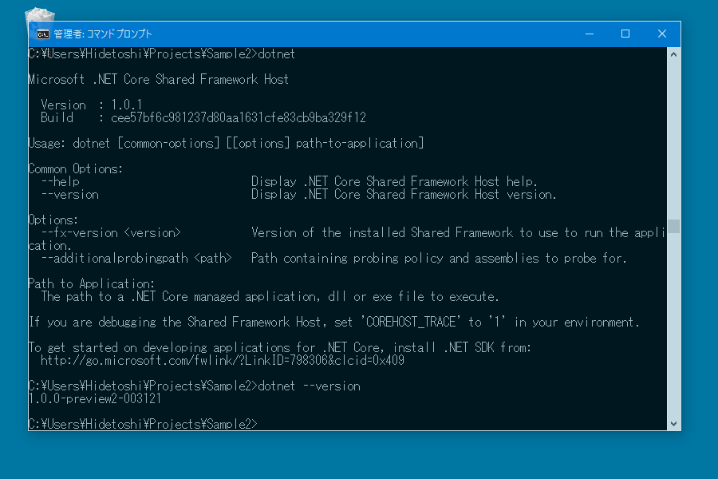

<h3>.NET Core SDK for Windows のインストール</h3>

.NET Core SDK Installer をダウンロードしてインストールする。

<ul>
<li><a href="https://github.com/dotnet/cli">GitHub - dotnet/cli: This repo contains the .NET Core command-line (CLI) tools, used for building .NET Core apps and libraries through your development flow (compiling, NuGet package management, running, testing, ...).</a></li>
</ul>
これで dotnet コマンドが利用できるようになる。

 

<h3>プロジェクトの作成と実行</h3>

今回は %USERPROFILE%\Projects にサンプルというプロジェクトを作成する。

<h4>プロジェクトフォルダーの作成と移動</h4>
<pre class="code" data-lang="" data-unlink>C:\Users\Hidetoshi\Projects&gt;mkdir Sample

C:\Users\Hidetoshi\Projects&gt;cd Sample</pre>

<h4>プロジェクトの作成　dotnet new -t web</h4>
<pre class="code" data-lang="" data-unlink>C:\Users\Hidetoshi\Projects\Sample&gt;dotnet new -t web
Created new C# project in C:\Users\Hidetoshi\Projects\Sample.</pre>
これで generator-aspnet で言うところの Web Application -> Bootstrap に相当するものが作成されるみたい。

ちなみに dotnet new のオプションを指定しないと、コンソールアプリのひな型が作成されるのかな？　ほかのオプションはこんな感じ。

<blockquote cite="https://docs.microsoft.com/ja-jp/dotnet/articles/core/tools/dotnet-new">

<h4>Options</h4>

<h5>-l, --lang [C#|F#]</h5>

Language of the project. Defaults to C#. csharp (fsharp) or cs (fs) are also valid options.

<h5>-t, --type</h5>

Type of the project. Valid values are console, web, lib and xunittest.

<cite><a href="https://docs.microsoft.com/ja-jp/dotnet/articles/core/tools/dotnet-new">dotnet new &#x30B3;&#x30DE;&#x30F3;&#x30C9; | Microsoft Docs</a></cite>
</blockquote>

言語とかも指定できるんだなぁ。

<h4>プロジェクトの復元　dotnet restore</h4>

足りないパッケージを取得する。

<pre class="code" data-lang="" data-unlink>C:\Users\Hidetoshi\Projects\Sample&gt;dotnet restore
log  : Restoring packages for C:\Users\Hidetoshi\Projects\Sample\project.json...
log  : Restoring packages for tool &#39;Microsoft.AspNetCore.Razor.Tools&#39; in C:\Users\Hidetoshi\Projects\Sample\project.json...
log  : Restoring packages for tool &#39;Microsoft.AspNetCore.Server.IISIntegration.Tools&#39; in C:\Users\Hidetoshi\Projects\Sample\project.json...
log  : Restoring packages for tool &#39;Microsoft.EntityFrameworkCore.Tools&#39; in C:\Users\Hidetoshi\Projects\Sample\project.json...
log  : Restoring packages for tool &#39;Microsoft.Extensions.SecretManager.Tools&#39; in C:\Users\Hidetoshi\Projects\Sample\project.json...
log  : Restoring packages for tool &#39;Microsoft.VisualStudio.Web.CodeGeneration.Tools&#39; in C:\Users\Hidetoshi\Projects\Sample\project.json...
log  : Writing lock file to disk. Path: C:\Users\Hidetoshi\Projects\Sample\project.lock.json
log  : C:\Users\Hidetoshi\Projects\Sample\project.json
log  : Restore completed in 25830ms.</pre>

<h4>プロジェクトの実行　dotnet run</h4>
<pre class="code" data-lang="" data-unlink>C:\Users\Hidetoshi\Projects\Sample&gt;dotnet run
Project Sample (.NETCoreApp,Version=v1.0) will be compiled because expected outputs are missing
Compiling Sample for .NETCoreApp,Version=v1.0

Compilation succeeded.
0 Warning(s)
0 Error(s)

Time elapsed 00:00:02.6031974</pre>
<a href="http://localhost:5000">http://localhost:5000</a> へアクセスするとアプリケーションが表示される。

［Ctrl］＋［C］キーで中断できる。

Visual Studio Code だとプロジェクトフォルダーを開いてターミナル画面を開き、dotnet コマンドをポポンと打てば実行できる。Git もそのまま使える。ぃぇーい！

<iframe src="https://hatenablog-parts.com/embed?url=https%3A%2F%2Fblog.daruyanagi.jp%2Fentry%2F2016%2F07%2F02%2F142117" title="ASP.NET Core なるものを Visual Studio Code でしてみむとするなり - だるろぐ" class="embed-card embed-blogcard" scrolling="no" frameborder="0" style="display: block; width: 100%; height: 190px; max-width: 500px; margin: 10px 0px;"></iframe>

前回より簡単な感じなので、こっち使おうかな？

