
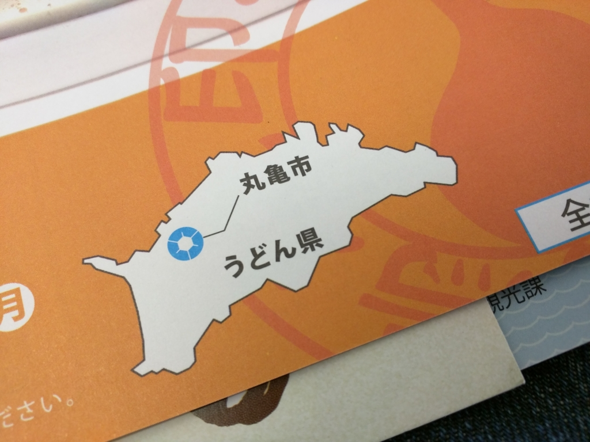

2015年12月20日のことらしい。天気がよかった＆たまたま早起きしたので、特急しおかぜに乗って丸亀まで行ってきた。用事はとくにない。強いて言えば、Withings のスマートウォッチ Activite Pop を買ったので散歩したかった、みたいな。

<iframe src="https://hatenablog-parts.com/embed?url=https%3A%2F%2Fblog.daruyanagi.jp%2Fentry%2F2015%2F12%2F20%2F045240" title="ランニング三日坊主を脱するため、ヘルスウォッチ Withings Activite Pop を買った。 - だるろぐ" class="embed-card embed-blogcard" scrolling="no" frameborder="0" style="display: block; width: 100%; height: 190px; max-width: 500px; margin: 10px 0px;"></iframe>

ちなみに、この子は今でも愛用してる。この前コンビニで電池買って入れ替えたよ！（バッテリーは8カ月もつって公称してるけど、半年ぐらいで時刻が遅れだす感じなので、早めの交換でいい気がする）

<h3>うどん</h3>

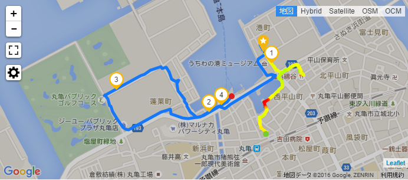

まず、地図も見ずに海の方へ向かってテキトーにあるいた。きっといい感じのうどん屋がひしめき合ってるに違いないから、テキトーなところで朝食がてらうどんを食べようという目論見。

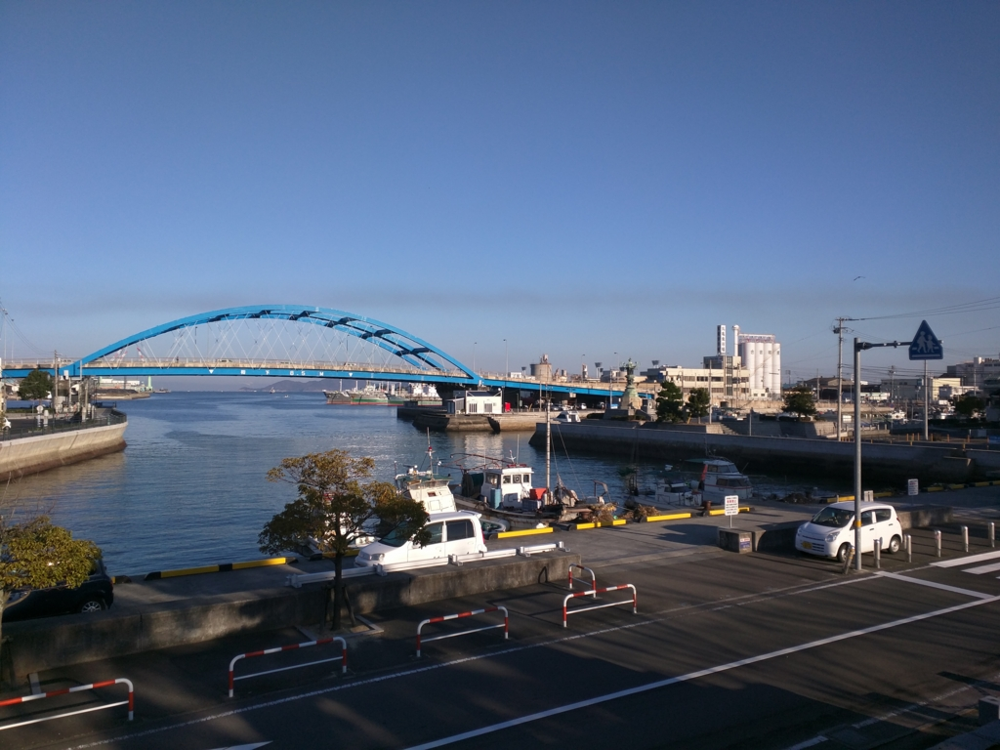

とにかく天気がよくて、気持ちのいい日だった。冬だけど、長く歩くと汗ばむ感じ。

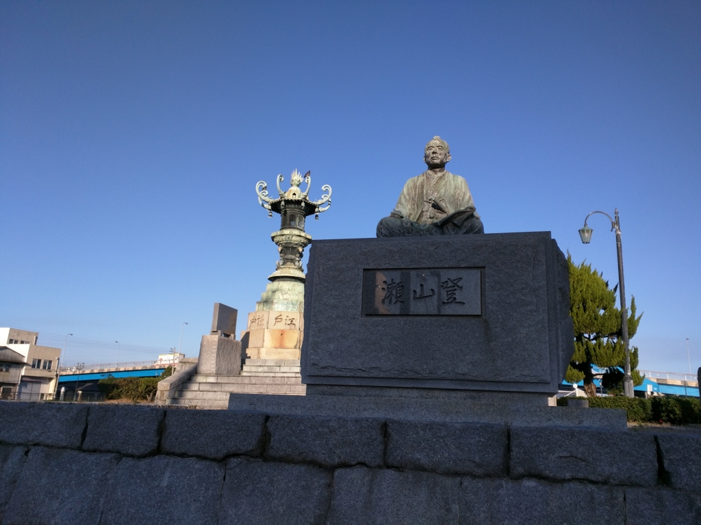

途中で変なおっさんの像を発見。

<blockquote>

瀬山登、名は重嘉、通称四郎兵衛、棠川（とうせん）と号し、江戸時代の天明四年（一七八四）京極藩士の家に生まれる。

小姓から大目付、勘定奉行、物頭となり江戸屋敷の留守居役となる。

和漢の学に通じ、写生画を能くし、江戸在府中に金毘羅千人講を作って参詣客の誘致をはかり、その受け入れのため、港拡張の必要から<b>新堀湛甫</b>を築造し、また<b>金毘羅銅灯籠（現太助灯籠）</b>を　建てたが、その多額にのぼる費用調達にあたり千人講のほか、江戸老中や豪商を動かし、藩の財政に影響を与えることなく大いに政治的手腕を発揮して完成させた。

更に、江戸の隣り屋敷九州中津藩から<b>団扇</b>作りの技術を家中の者に習得させて国元に拡げ、金毘羅詣りの土産ものとして販売させ、今日の全国一を誇る団扇産業を創始するなどして丸亀繁栄の基礎を築いた。

</blockquote>

要は、「金毘羅参り＋港＋団扇」で町おこしをした人なんやな。写真を撮ったときは「灯篭」がそんないわれをもつものだとは知らなかったので、構図がテキトーだけどごめん。

サラリと書いてある「千人講」というのは、今でいうクラウドファンディングみたいなものだろうか。飯田藩みたいに悪用されて騒動にまで発展することもあったけど、ちゃんと使えば街がひとつ興るというわけやな。

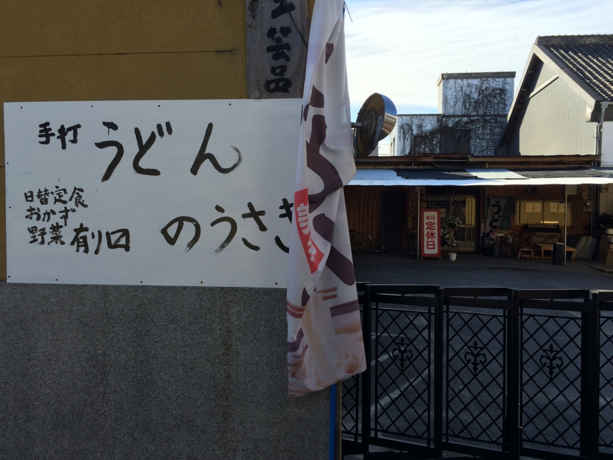

それにしても、うどん屋がない。

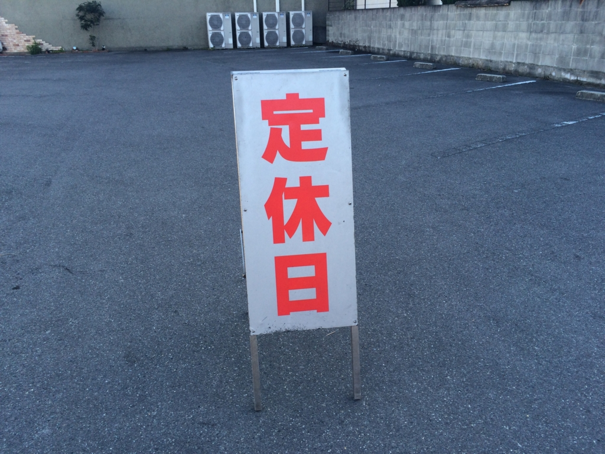

いや、あるにはあるのだが、ことごとく開いてない。さすがに無計画すぎたかもしれない……と少し後悔し始め、Google Map 先生に開いているうどん屋さんをお尋ねしたところ……

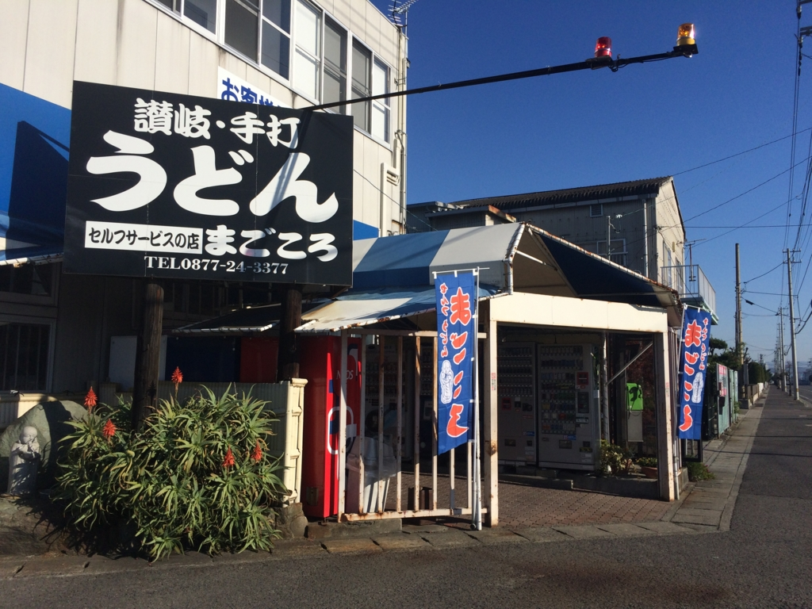

あった━━━━(ﾟ∀ﾟ)━━━━!!

ゴルフコースの隣（お散歩地図で言うところの（3）のあたり）に、セルフのうどん屋さんを発見。しかも、なんか製麺所の隣にある。これは期待が高まりますなー……。

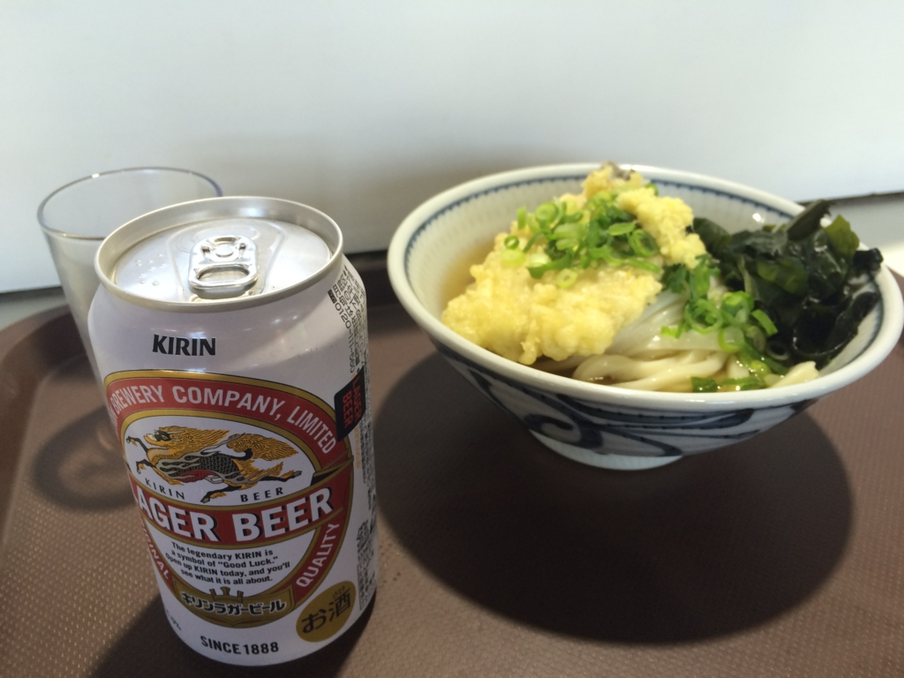

さっそく一杯ゲット。ひとりでセルフのおうどんを食べるのは初めてだったので（大学の頃、友人とうどん旅行をしたことはある）、イマイチ作法がよくわからなかったのだけど、店の人にダシをぶっかけられたりしなかったのでたぶん間違ったことはしなかったと思う。トッピングはよくわかんないので、そこら辺に出されていたイワシだかなんだかの天ぷらに、ワカメ。蛇口からダシを注いで……いただきます！

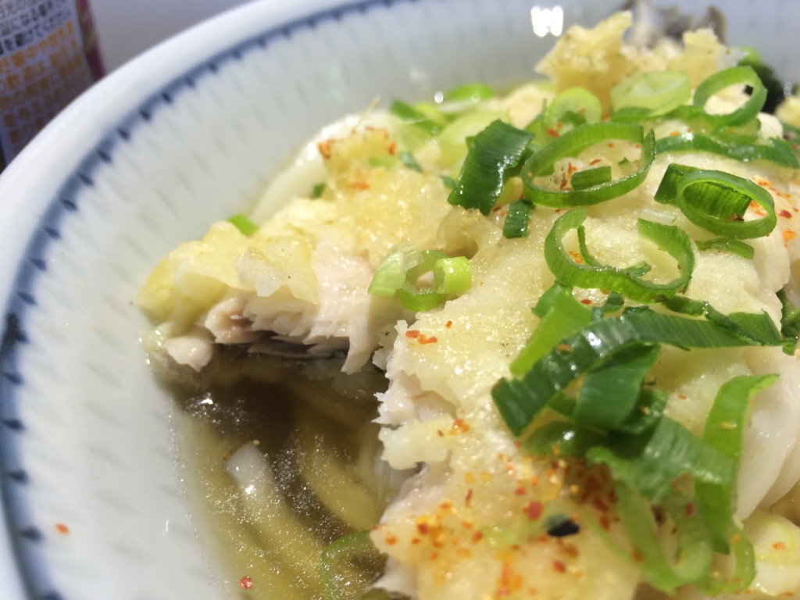

うどんはもちろんおいしかったのだけど、なんか天ぷらがめっちゃうまかった。ほっくほくで、身が分厚い。ダシまでみんな飲んだ。家の近所にこの店ほしいと思う。

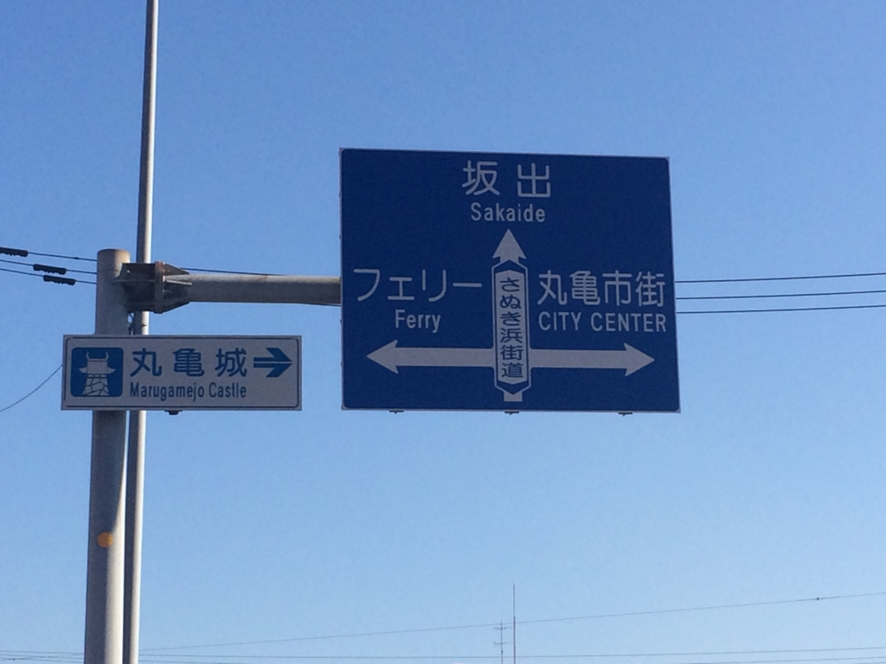

たいへん満足したので、予讃線の向こうにある丸亀城をちらっと覗いて帰るか～と思い、港の方へてくてくと歩を進める。まぁ、もうちょっと港っぽい風景も見て帰りたいもんな。

すると、フェリー乗り場に出た。急ぐ旅ではなし、ここで缶コーヒーをあけて休憩しつつ、ぼんやり観光案内図を眺めていたのだが……

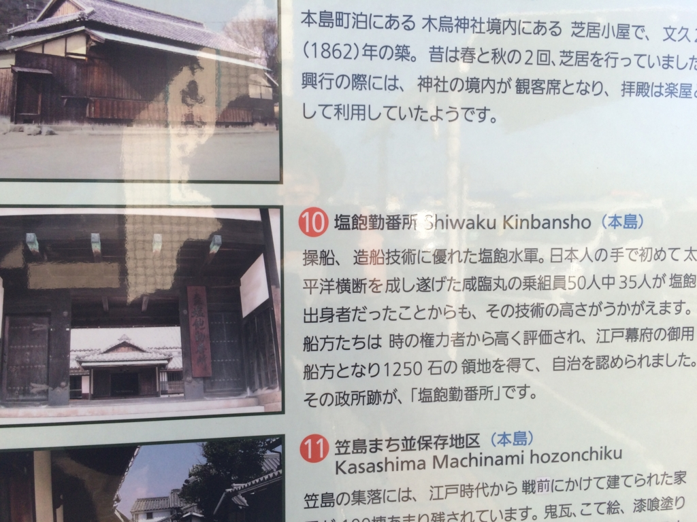

塩飽……瀬戸内の海賊で有名なアレか(-。-)y-゜゜゜

――1時間後、なぜか船上のヒトになっていたのでした。続く。

<h4>追記</h4>

<blockquote class="twitter-tweet" data-lang="ja">
だるサン、その付近、朝からやっとるうどん屋少ないトコや…＿|￣|○
&mdash; どんぐま【仮面ライダーの天使】 (@donguma) <a href="https://twitter.com/donguma/status/755011104883941376?ref_src=twsrc%5Etfw">2016年7月18日</a></blockquote>

らしいで(´；ω；`)ｳｯ…

