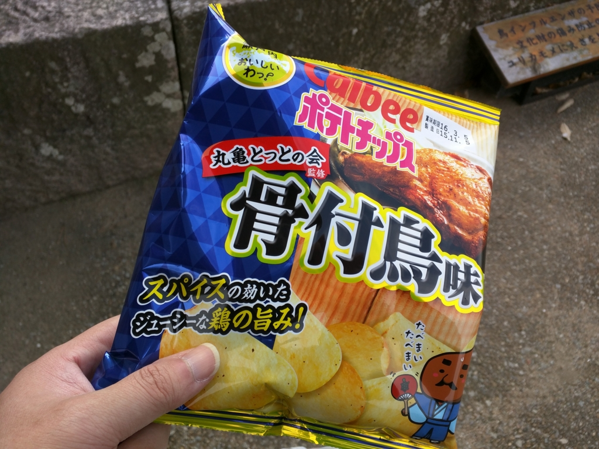

さて、塩飽の島へ船で渡り、チャリンコで小一時間ブラブラし、ふたたび丸亀港に戻ってまいりました。ちょうどお昼過ぎ、いい感じに運動もしたしおなかが空いた。

というわけで、本日二食目のうどんですが……その名も“<b>バサラ天ぶっかけ</b>”。二尾の大きな海老天を大胆に配することで、<b>京極家</b>のカブトを再現したという逸品でございます。

<blockquote class="twitter-tweet" data-lang="ja">
気になってしゃあない (@ 手打ちうどん つづみ in 丸亀市, 香川県) <a href="https://t.co/NaSyvhoutF">https://t.co/NaSyvhoutF</a> <a href="https://t.co/UyezmExtOr">pic.twitter.com/UyezmExtOr</a>
&mdash; だるやなぎ に天使が舞い降りた！ (@daruyanagi) <a href="https://twitter.com/daruyanagi/status/678432530517872640?ref_src=twsrc%5Etfw">2015年12月20日</a></blockquote>

今から城に上ろうというボクにはピッタリのボリュームで、味の方もなかなか。丸亀って本当にいいところやな……。

さて、おなかも満足したところで、今度は港とは逆の方、予讃線を越えて南へ向かいます。丸亀城は予讃線の車窓からも小さく見えるので、地図を見なくてもたどり着けるかと。

で、ふもとまで来たのだけど――。

石垣が高杉晋作、じゃなくて高過ぎ。下から上まで、石垣だけでこんなに高い城って初めて見たかもしれない。これは伊賀上野城よりも高いですわ、たぶん（<a href="https://blog.daruyanagi.jp/entry/2015/04/10/031139">&#x30D0;&#x30A4;&#x30AF;&#xFF1A;&#x9234;&#x9E7F;&#x304B;&#x3089;&#x4F0A;&#x8CC0;&#x4E0A;&#x91CE;&#x30FB;&#x540D;&#x5F35; - &#x3060;&#x308B;&#x308D;&#x3050;</a>）。

頂上にポツンと建っている現存天守閣は少し寂しげだけれども、かつては石垣の上に塀と櫓が巡らせてあったはずで、かなり立派なお城だったのではないでしょうか。天守のほかにも、大手一の門・大手二の門などが現存しており、それぞれ国の重要文化財に指定されているとの由。

お濠を渡って小さな門（大手二の門）をくぐり、右に折れると――

大手一の門。枡形虎口っていうのになるのかな？　ここでまず敵の勢いを止めて三方から集中攻撃するのですな。アブない。もともとはこちらが搦手（裏口）だったのですが、のちに改められて海側のこの門が大手門（正門）になったのだとか。

そして一ノ門を突破して左に折れると（敵の進路を屈曲させて防御するのはお城の基本だよね！）、ながーい坂が。

あとで知ったのですが、この坂は“見返り坂”と呼ばれているのだそう。登り切ったら、つい振り返ってしまうんですな。かくいうボクも見返して写真を撮ってしまいました。まんまと乗せられてしまった感がある。

それにしてもこの城は石垣がきれいですね。反り返らんばかりに、キッチリ積んである。屋島のあたりを歩いた時も感じたのですが、四国は石材が豊富なようで、割とぜいたくに使ってますな。墓石やら地蔵までパクッて築いたという大和郡山城（こっちも行ったので今度紹介しますね！）とはエラい違いだ……。

そして、三の丸、二の丸を過ぎると、天守のある本丸。江戸時代にこの地を治めていた京極氏によって築かれました。

もともとは慶長2年（1597年）に<b>生駒親正</b>（秀吉の三中老の一人）が豊臣秀吉から讃岐17万石を与えられ高松城を本城とし、この亀山に支城を築いたのが始まり。江戸時代になって一国一城令により破却されそうになりますが、時の藩主・生駒正俊が立ち入り禁止＆カモフラージュ作戦でこれを回避。生駒氏がお家騒動で出羽国に転封され、代わりに肥後国から<b>山崎氏</b><a href="#f-758acae0" name="fn-758acae0" title="始祖・山崎片家は六角氏からでて信長についた近江衆の一人。明智光秀の娘を正室に迎えており、本能寺の変でも明智側についたが、光秀の敗死で秀吉に投降し、所領を安堵される">*1</a>が<b>丸亀藩</b>をたてるとその政庁となります。その後、山崎氏が三代で断絶。そこへ播磨国龍野からやってきたのが<b>京極氏</b>でした。近江源氏・佐々木氏から分かれた名族ですね（山崎氏も佐々木氏の支族）。

我が町・松山の城に比べるとこじんまりとはしていますが、それでも風格のある三層の立派なもので、日本にある十二の現存天守のうちの一つでもあります。

なかには“刀らぶ”のキャラクターがいました。あんまり知らないのでよくわからんのですが、京極家にゆかりのあるカタナさんだったりするんでしょうか。

天守からの眺めは絶景。丸亀の街と瀬戸大橋、そして塩飽の島々が一望できます。

下に降りると、地元のゆるキャラ・とり奉行<b>骨付きじゅうじゅう</b>が踊っていました。

骨付きじゅうじゅうは丸亀のご当地グルメ“骨付き鶏”の化身だそう。汗をかいているのは炙られているからか。あと、カメを抱いています。丸亀だけに。

実はこの骨付き鶏、まだ食べたことがないんですよね！　知り合いによるとかなり旨いのだそうな。そのうち食べたい。丸亀はうどん以外にもおいしいものがたくさんあるっぽいので、また開拓しに行きたいものです。

とりあえず、今回は福引（骨付きじゅうじゅうストラップを買ったらチケットがもらえた）でゲットした骨付き鶏味のポテチで我慢。帰りの特急しおかぜで食べましたが、関西だし醤油味と同じぐらいおいしかったです。

<a href="#fn-758acae0" name="f-758acae0" class="footnote-number">*1</a>:始祖・山崎片家は六角氏からでて信長についた近江衆の一人。明智光秀の娘を正室に迎えており、本能寺の変でも明智側についたが、光秀の敗死で秀吉に投降し、所領を安堵される

