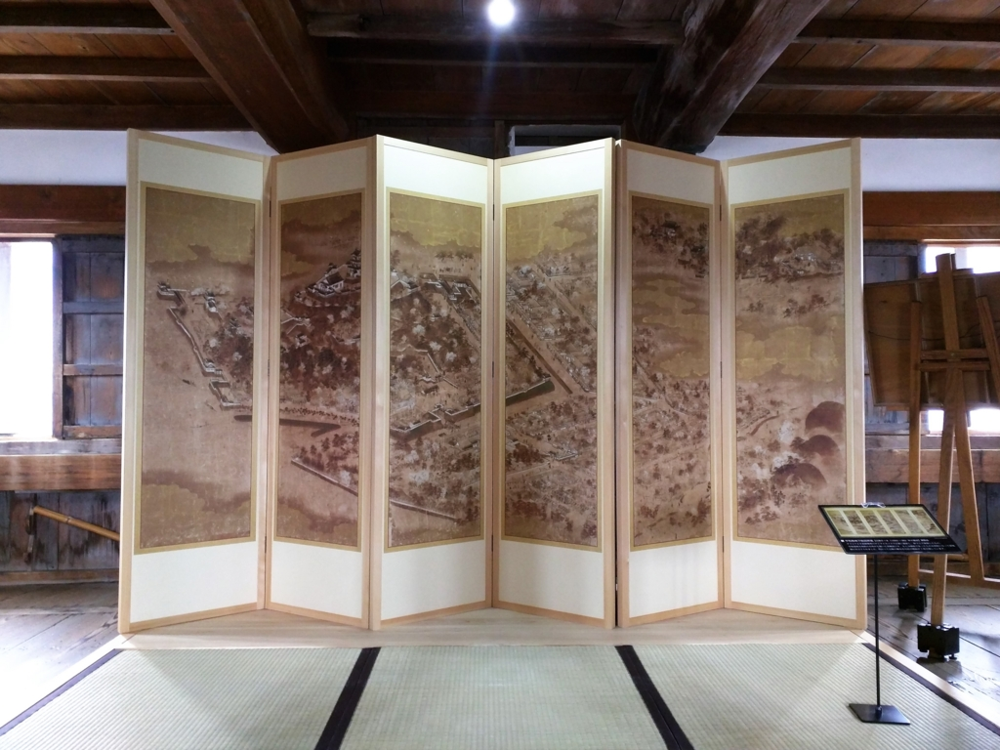
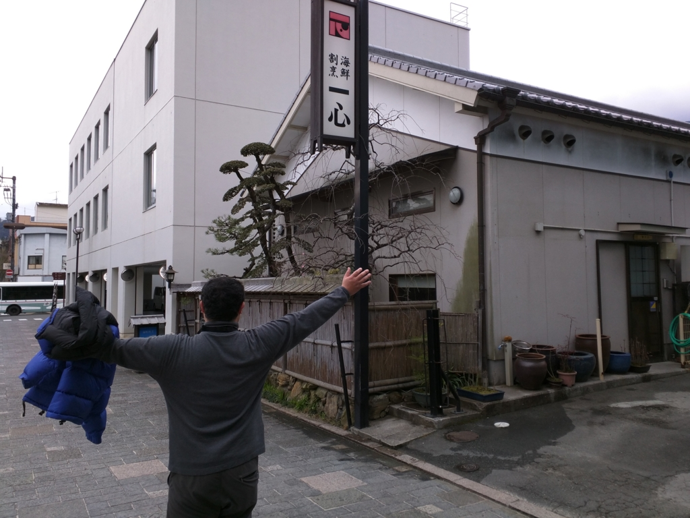

週末、宇和島のお祭りに行く予定なので、その前に2月、東京からわざわざ愛媛に来てくれた旧友と宇和島城へ行った時の話を思い出しながらメモ。（→ これも一緒に行った<a href="https://blog.daruyanagi.jp/entry/2016/02/16/093533">&#x5BBF;&#x3068;&#x30C6;&#x30EC;&#x30D3;&#x3001;&#x3042;&#x308B;&#x3044;&#x306F;&#x65B0;&#x805E;&#x3092;&#x8CFC;&#x8AAD;&#x3059;&#x308B;&#x6C17;&#x306B;&#x306A;&#x308C;&#x306A;&#x3044;&#x7406;&#x7531; - &#x3060;&#x308B;&#x308D;&#x3050;</a>、<a href="https://blog.daruyanagi.jp/entry/2016/03/04/171834">&#x611B;&#x5A9B;&#x770C;&#x7F8E;&#x8853;&#x9928;&#xFF1A;&#x300C;&#x9EC4;&#x91D1;&#x306E;&#x30D5;&#x30A1;&#x30E9;&#x30AA;&#x3068;&#x5927;&#x30D4;&#x30E9;&#x30DF;&#x30C3;&#x30C9;&#x5C55;&#x300D;&#x3068;&#x300C;&#x7279;&#x5225;&#x5C55; &#x751F;&#x547D;&#x5927;&#x8E8D;&#x9032;&#x300D; - &#x3060;&#x308B;&#x308D;&#x3050;</a>）。

とはいえ、2年前も行ったのであんまり書くことはなくて、今回は前回との差分みたいな感じ。

<iframe src="https://hatenablog-parts.com/embed?url=https%3A%2F%2Fblog.daruyanagi.jp%2Fentry%2F2014%2F05%2F11%2F211639" title="GW: 宇和島城に登ったった。 - だるろぐ" class="embed-card embed-blogcard" scrolling="no" frameborder="0" style="display: block; width: 100%; height: 190px; max-width: 500px; margin: 10px 0px;"></iframe> 

<h3>展示が少し充実した気がする</h3>

前回きたときは殺風景な天守だなーという印象を受けたのだけど、今回は展示が充実してた。（誰にも知られずひっそりと開催されている）南予博のためにちょっと頑張ったのかな？

これは「宇和島城下絵図屏風」。オリジナルは元禄年間のもので、展示物はデジカメでとって原寸大で複製したものだそう。当時の宇和島城下の様子がうかがえる。左側は縄張りが海に面していて、さすがは海城だなーって感じ。

あと、この「宇和島城下絵図屏風」はもともとは襖絵だったが、昭和になって屏風絵に仕立てられたのだとか。美術的価値の話はよくわかんないけど、屏風の方が見る分には便利だ。ただ、一部だけ欠けているのが残念。

そのほかにも黒門櫓や追手門など、現在では失われてしまった宇和島城の風景がパネル展示されていた。これは資料館にあったヤツかな？

また2階には 茂本ヒデキチ という方の描いたカッコいい墨絵も展示されていた。松山生まれで、現在は東京で活躍されているアーティストだそう。こういう方面には疎いのだけど、フツーにカッコいい。totoBIG あたったらキノコタケノコ戦争の墨絵を書いてもらって襖にしたい。

<h3>宇和島アジ飯</h3>

お昼ご飯は、また宇和島城の登城口にある「一心」さんに。

<iframe src="https://hatenablog-parts.com/embed?url=https%3A%2F%2Fblog.daruyanagi.jp%2Fentry%2F2014%2F05%2F13%2F001326" title="GW: 天赦園でごろごろして、宇和島の鯛めし食ったった。 - だるろぐ" class="embed-card embed-blogcard" scrolling="no" frameborder="0" style="display: block; width: 100%; height: 190px; max-width: 500px; margin: 10px 0px;"></iframe>

前きたときは宇和島鯛めしをごちそうになった。今回も同じのを食べようと思っていたのだが――

“伊達あじ”というメニューができていたのでそれに手を出してみる。伊達っていうのは、宇和島・伊達家に由来するのかな（正宗の子孫が移封されてきて、幕末には四賢侯・伊達宗城を輩出した）。まぁ、ここら（豊予海峡、速吸の瀬戸）のアジは運よく大分で水揚げされれば“関アジ”になったはずのアジなので、味には問題ないはず。アジだけに。

1,250円でボリューム満点。

メインのアジめしの具。鯛めしと同じく、醤油だし・生卵と合わせてよくかき混ぜ……

ごはんにぶっかける。マズいわけがねぇ……。totoBIG 当たったら毎朝これを食べたい。

<h3>四国新幹線</h3>

ついでに四国新幹線もみてきた。このためだけに宇和島駅で2時間ぐらい粘ったような……。

その貴重なお姿がこれ。ゼロ系新幹線を彷彿とさせる愛嬌のあるスタイル。無駄を徹底的に排したシンプル極まる一両編成。駆動系は架線が不要なディーゼル発電式（汽車ともいう）。

前面は衝突時のクラッシュクリアランスを十分に確保。乗員の安全を最優先した設計になっているが、同時に大胆な肉抜きが行われており、軽量化にも余念がない。安全性と速度を高度に両立させた、機能美溢れるデザインだ。

そして驚くべきはこの背面。なんとこちらはノーズすら省略されている。高知 → 宇和島は旅客が少ない（というのも高知県には人が住んでいないので、愛媛からの流出のみを考慮すればよい）ので、無理に速度を稼ぐ必要がない。ゆえにノーズを省略して、軽量化したほうが賢いということだろう。省かれたノーズは立体視を巧みに活かした精緻な塗装によって再現されているので、デザイン上の違和感もない。

また、人的コストも極限まで削減されており、なんとワンマンで運行できるのも四国新幹線の特徴。ちなみに伊予鉄（市内線）と同じ後乗り前降りに統一されているので、松山市民なら違和感なく乗りこなせるはず。ただし、電子マネーでの運賃決済機能は大胆にも省略されているようだ。おそらく高知県に電子マネー技術が伝わっていないからであろう。

関係ないけど、宇和島駅は電話ボックスで携帯電話の充電ができて大変便利だった。ありがたやありがたや。

終わり。

