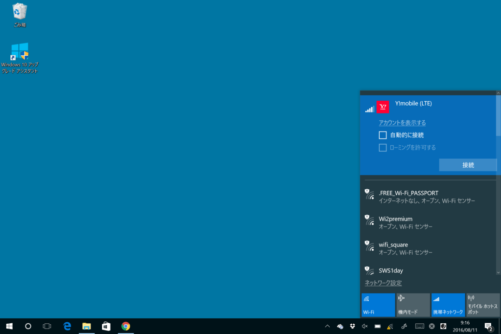

バージョン 1607 では、モバイル回線への接続が簡単になった。前まではわざわざネットワーク接続のページに行かなきゃいけなかったんだよね。Windows Insider は SIM スロットのない Surface Pro 3 でテストしていたので、こういう機能改善があったのは知らなかった。

あとはやっぱ Windows Ink とアクション センターの改善かな。とくにウチは Twitter の通知が多いので、それでアクション センターが埋まってしまうことがなくなったのはうれしい

