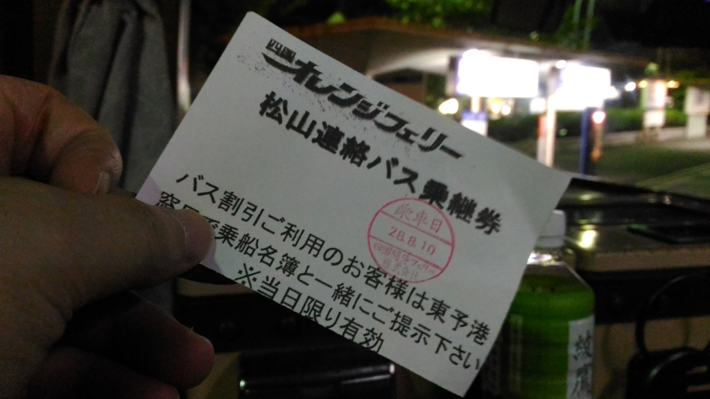
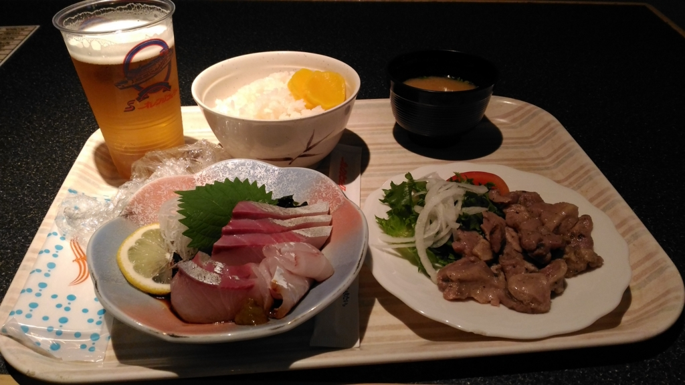

お盆休みはフェリーで関西へ。墓参りとばあちゃんのお見舞いをしてきた。

前回は壬生川から東予港まで歩いてえらい目に遭ったので、その経験を活かして JR 松山駅から連絡バスを使った。

<iframe src="https://hatenablog-parts.com/embed?url=https%3A%2F%2Fblog.daruyanagi.jp%2Fentry%2F2016%2F04%2F11%2F181901" title="壬生川駅から東予港まで歩くのは正直お勧めしない - だるろぐ" class="embed-card embed-blogcard" scrolling="no" frameborder="0" style="display: block; width: 100%; height: 190px; max-width: 500px; margin: 10px 0px;"></iframe>

連絡バスには

<ul>
<li>松山方面直通連絡バス（伊予鉄バス、有料）：出港ギリギリにつく</li>
<li>早乗り用連絡バス：9時前に到着。せとうちバスの路線バス（有料）で小松総合支所前へ向かい、今治方面の連絡バス（無料）で東予港まで</li>
</ul>
の2種類がある（[乗り場案内／アクセス | 連絡バス（関空⇔大阪南港・松山⇔東予港） | オレンジフェリー｜四国開発フェリー株式会社](<a href="http://www.orange-ferry.co.jp/access/renraku.html">http://www.orange-ferry.co.jp/access/renraku.html</a>)）。

どっちも予約制なのかな。Web フォームから予約する場合は、備考欄だか連絡欄だかに「（好みのバス停）から連絡バス希望」とでも書いておけばいいらしい。とはいえ乗車の際に名前の申告などは不要のようで、割と適当。事前に乗車人数を把握したいだけみたいだ。

料金を前払いして乗車すると、白い「乗り継ぎ券」がもらえる。これを乗船手続きの際に提示すると、船賃が少し割引きになる。なくさないようにしましょう。

それにしても、東予港で乗船手続きに時間がかかるのは面倒くさいなー。バスできた人がいっぺんに窓口に殺到するので、のんびりしてると手続きが終わるまでだいぶ待たされる。オレンジフェリーはクレジットカードも使えないし、ここら辺は改善してほしいな。Web で先に情報を入力しておけばサクッと乗船できるとか。なんか手続き的に難しいところでもあるんだろうか。

あ、でもよくなってたところも。船内レストランにビールサーバーが追加されてて、注文で並ばずともそっちでビールを注いで飲めるようになったっぽい。これでガビガビ、思う存分ビールが飲めるね！

