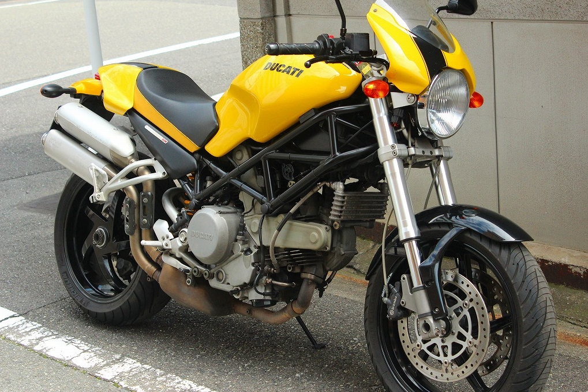
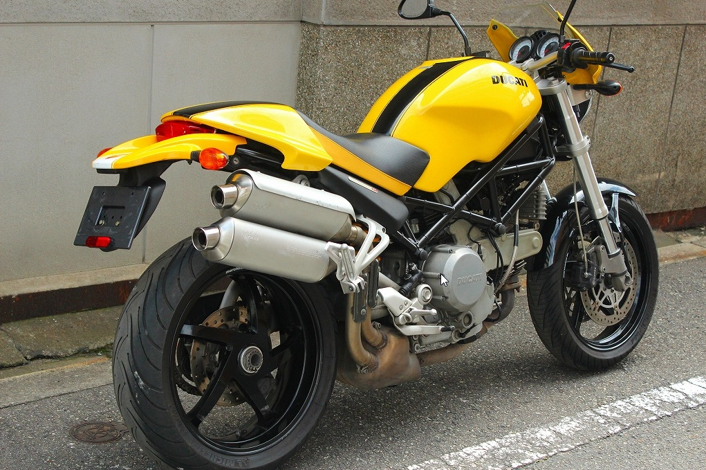
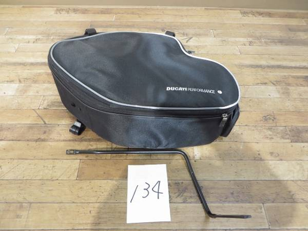

千葉から愛媛に出てくるときに Ducati SS750 を手放して、Honda GB250 を乗っていたのだけど、やっぱり遠出するには 250cc は少ししんどいなーと思い、ヤフオクで中古バイクを眺めていたところ――<i>間違って落札してしもた／(^o^)＼</i>いやぁ、30万弱なら婚活貯金をちょっと削るだけで買えるなーと思って入札しておいたら、そのままオークションが終わっちゃったんですよ。

今回チョイスしたのは、Ducati Monster S2R800 さん。初めて買ったバイクが Ducati Monster 400 だったので、ちょっと懐かしい。

S2 は空冷（S4 が水冷）で、800cc のタイプはクラッチが湿式になっている。もともと Ducati にするつもりはなくて、Monster は選択肢の一つに過ぎなかったのだけど、水冷・乾式のタイプはちょっと街中での扱いに神経を使いそうなので、買うならこのモデル以外要らないやと思っていた。あんまり見かけるタイプではないので、運がよかったかも。

初期の S2 と違って、エキゾーストが片側二本出し、スイングアームが片持ちになっているのもカッコいい。マフラーのない側にサイドバッグをつるしたかったので、純正のものを探してこれまたヤフオクで落札しておいた。価格は 1.5万ぐらい。これは競り相手がいたので、ちょっと高めな印象だが、シカタナイ。

あと、ほんとは黄色ではなく赤色がよかったのだけど、さすがにそれを言い出したらモノに出会えない。変なカスタムもなくて（シートとリアが少し弄ってある）、いい感じだ。フレームが黒なので、お金ができたらパールホワイト＋黒帯にしたいかも。

先月、BAS の松山デポ（がんばれば徒歩でいける範囲にある）まで取りに行って、そのまま乗って帰ってきたが、右のミラーがゆるゆるなところを除けば、ほぼ問題なし。走行距離はちょうど 40,000km で少し長いけれど、エンジンはぶんぶん周り、クラッチはすこすこ入る。

最初は思った以上にパワーが出るのと（250cc に慣れちゃった！）、ブレーキがすごく効くのに戸惑い、ガックンガックン、ギクギクシャクシャクと走っていたが、ブレーキレバーを押すように少し力を入れると“ジーッ”と音が鳴るのを聞いて、昔の感覚を取り戻した。少し開いたハンドルにはちょっとオフ車の風味があるが、実際、町中で走るときは少し前の方に座り、股の下でバイクを傾ける感覚で走らせると角をスムーズに曲がれる。

ちょっとうれしくて、ちょっと寄り道しながら帰る途中、ナンバープレートを脱落・紛失してしまったのだけど、その話はまた今度。

